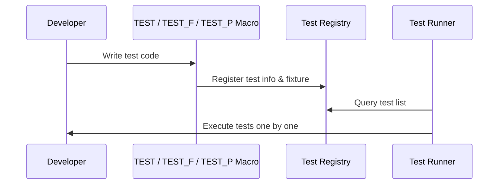

# Test Case and Suite Definition

GoogleTest provides a structured way to create, organize, and register your unit tests to ensure clarity, maintainability, and effective test discovery. This documentation focuses on how you define test cases and test suites, using the primary macros and APIs provided. You'll learn how to structure tests using the core GoogleTest macros, best practices for naming, and how to control test discovery and execution.

---

## Overview of Test Cases and Test Suites

In GoogleTest, **test cases** (or test suites) group related test functions together. A **test** is an individual unit of testing, implemented as a function containing assertions that validate specific behaviors.

Each test belongs to a test suite. Tests within the same suite share naming conventions and optionally share test fixtures (common setup/teardown).

---

## Core Macros for Defining Tests

### TEST

Use the `TEST` macro to define a basic, independent test function without any shared fixture:

```cpp
TEST(TestSuiteName, TestName) {
  // Your test statements here
}
```

- Defines a test named `TestName` within the suite `TestSuiteName`.
- **Naming restrictions:** Use valid C++ identifiers without underscores (`_`) in `TestSuiteName` and `TestName`.
- Tests can share the same `TestName` across different test suites.

### TEST_F

Defines a test that uses a **test fixture**, a class providing common data and setup:

```cpp
TEST_F(TestFixtureName, TestName) {
  // Your test statements here
}
```

- Here, `TestFixtureName` is the name of a class derived from `testing::Test`.
- This test will be part of the test suite named after the fixture.
- Naming rules for `TestFixtureName` and `TestName` are the same as `TEST`:
  - Valid C++ identifiers.
  - No underscores.

---

## Test Fixtures

A *test fixture* is a class that you derive from `testing::Test` to share common setup and teardown logic across multiple tests.

Example:

```cpp
class MyFixture : public testing::Test {
 protected:
  void SetUp() override {
    // Shared setup code
  }

  void TearDown() override {
    // Shared cleanup code
  }

  // Shared variables
  int resource_;
};

TEST_F(MyFixture, Test1) {
  // Test logic with access to resource_
}

TEST_F(MyFixture, Test2) {
  // Another test with shared setup
}
```

---

## Parameterized Tests

Beyond static fixtures, GoogleTest supports running the same test logic over multiple input values or types.

### Value-Parameterized Tests (`TEST_P`)

Define tests that run with different values:

```cpp
class MyParamTest : public testing::TestWithParam<int> {};

TEST_P(MyParamTest, WorksForVariousInts) {
  int param = GetParam();
  EXPECT_TRUE(param > 0);
}

INSTANTIATE_TEST_SUITE_P(
    InstantiationName, MyParamTest,
    testing::Values(1, 2, 3));
```

- Use `TEST_P` to define individual tests using parameters.
- `INSTANTIATE_TEST_SUITE_P` creates instances with concrete values.
- Both `MyParamTest` and `WorksForVariousInts` must follow naming rules (no underscores).

### Typed Tests (`TYPED_TEST`)

Run the same test logic for multiple types:

```cpp
template <typename T>
class TypedTest : public testing::Test {
 public:
  T value_;
};

typedef ::testing::Types<int, double, char> Types;
TYPED_TEST_SUITE(TypedTest, Types);

TYPED_TEST(TypedTest, DoesSomething) {
  TypeParam val = this->value_;
  // Test logic here
}
```

- Use `TYPED_TEST_SUITE` to specify which types to test.
- Use `TYPED_TEST` macro to define tests parameterized by type.

### Type-Parameterized Tests (`TYPED_TEST_P`)

Provide flexible type parameterization where type lists are defined and instantiated separately, enabling reusable test patterns.

Refer to [Typed Tests](../advanced.md#typed-tests) and [Type-Parameterized Tests](../advanced.md#type-parameterized-tests) for in-depth usage.

---

## Test Registration and Execution Control

### RegisterTest

For advanced use cases, tests can be registered dynamically at runtime:

```cpp
TestInfo* RegisterTest(
    const char* test_suite_name, const char* test_name,
    const char* type_param, const char* value_param,
    const char* file, int line, std::function<Test*()> factory);
```

- Useful for dynamic test generation.
- You must guarantee all tests sharing the same suite name use the same fixture class.
- Registration must occur before calling `RUN_ALL_TESTS()`.

### RUN_ALL_TESTS

Call this function to execute all registered tests:

```cpp
int main(int argc, char** argv) {
  testing::InitGoogleTest(&argc, argv);
  return RUN_ALL_TESTS();
}
```

- Returns `0` if all tests pass and `1` otherwise.
- Must be called after `InitGoogleTest()`.

---

## Naming Best Practices

GoogleTest imposes conventions and limitations on names to ensure generator internal consistency and avoid conflicts.

- Avoid underscores (`_`) in `TestSuiteName` and `TestName` because underscores have special usage internally and in C++ identifiers.
- This restriction simplifies test class naming and prevents ambiguous or illegal names.
- Test fixture classes should also follow these naming rules for compatibility.

### Why avoid underscores?

The special usage of underscores (`_`) for macros like `DISABLED_` and the fact that GoogleTest generates internal test class names using underscore separators mean that underscores can cause naming conflicts and obscure test discovery.

### Summary of naming rules

| Identifier              | Allowed Characters        |
|------------------------|---------------------------|
| TestSuiteName          | Valid C++ identifiers; no underscores (`_`) |
| TestName               | Valid C++ identifiers; no underscores (`_`) |
| TestFixtureName        | Valid C++ identifiers; no underscores (`_`) |

---

## Example Workflows

### Defining simple tests

```cpp
TEST(MathTests, Addition) {
  EXPECT_EQ(4, 2 + 2);
}

TEST(StringTests, Uppercase) {
  EXPECT_EQ("HELLO", ToUpper("hello"));
}
```

### Using test fixtures

```cpp
class DatabaseTest : public testing::Test {
 protected:
  void SetUp() override {
    db_.Connect();
  }

  void TearDown() override {
    db_.Disconnect();
  }

  Database db_;
};

TEST_F(DatabaseTest, Insert) {
  EXPECT_TRUE(db_.InsertRecord(...));
}

TEST_F(DatabaseTest, Delete) {
  EXPECT_TRUE(db_.DeleteRecord(...));
}
```

### Parameterized tests

```cpp
class FactorialTest : public testing::TestWithParam<int> {};

TEST_P(FactorialTest, ReturnsCorrectResult) {
  int n = GetParam();
  EXPECT_EQ(Factorial(n), ExpectedFactorial(n));
}

INSTANTIATE_TEST_SUITE_P(PositiveNumbers, FactorialTest,
                         testing::Values(1, 2, 3, 4, 5));
```

### Typed tests

```cpp
template <typename T>
class StackTest : public testing::Test {
 public:
  Stack<T> stack_;
};

typedef testing::Types<int, float, double> MyTypes;
TYPED_TEST_SUITE(StackTest, MyTypes);

TYPED_TEST(StackTest, PushPop) {
  this->stack_.Push(TypeParam{});
  EXPECT_FALSE(this->stack_.Empty());
  this->stack_.Pop();
  EXPECT_TRUE(this->stack_.Empty());
}
```

---

## Troubleshooting Common Issues

### Mixing TEST and TEST_F in the same test suite

GoogleTest requires that all tests within the same test suite use the same fixture class.

**Symptom:** Runtime error about mixing `TEST` and `TEST_F` in the same suite.

**Solution:** Change all tests in a suite to consistently use either `TEST` or `TEST_F` depending on whether a fixture is necessary.

### Naming conflicts due to underscores

Using underscores in test suite or test names can cause ambiguous or invalid internal test class names.

**Symptom:** Strange compilation or runtime errors about duplicate test class names.

**Solution:** Avoid underscores in `TestSuiteName` and `TestName`. Use camelCase or PascalCase instead.

### Default constructor missing in test fixture

If your test fixture class lacks a default constructor, `TEST_F` macro instantiation will fail.

**Solution:** Provide a default constructor (explicit or implicit) for your fixture class.

### Death Test Fixture Naming

When using death tests (`ASSERT_DEATH` or `EXPECT_DEATH`), it is strongly recommended to name your entire test suite with a `*DeathTest` suffix to ensure correct ordering and isolation.

```cpp
class FooDeathTest : public testing::Test {};

TEST_F(FooDeathTest, DiesCorrectly) {
  ASSERT_DEATH(DoSomethingBad(), "error");
}
```

---

## Additional Developer Tips

- GoogleTest creates a fresh test fixture object for each `TEST_F` execution ensuring test isolation.
- Use `SetUpTestSuite()` and `TearDownTestSuite()` for expensive, shared setup/teardown at the suite level.
- Use `SCOPED_TRACE` to add context information to failure messages within nested functions.
- Use `GTEST_SKIP()` macro to prematurely skip tests during runtime with an explanatory message.
- Use `FRIEND_TEST()` to access private members for white-box testing when necessary.

---

## Related Documentation

Explore other parts of the GoogleTest documentation for a deeper understanding:

- [Testing Reference](reference/testing.md) – Comprehensive API details for test macros, fixtures, and test lifecycle.
- [Advanced GoogleTest Topics](docs/advanced.md) – In-depth coverage on parameterized, typed, and type-parameterized tests.
- [FAQ](docs/faq.md) – Common pitfalls and detailed explanations.
- [GoogleTest Primer](overview/product-intro-core-concepts/core-concepts-terminology) – Foundational concepts.

---

## Visualization: Test Registration Flow



---

## Summary

This page guides you through defining tests and suites in GoogleTest, focusing on macros such as `TEST`, `TEST_F`, and parameterized tests. It clarifies naming conventions and the test registration process, and offers practical guidance on structuring your tests for clarity and maintainability.

---

## Example Summary

```cpp
// Simple test
TEST(MathTests, Addition) {
  EXPECT_EQ(4, 2 + 2);
}

// Test with fixture
class DatabaseTest : public testing::Test {
 protected:
  void SetUp() override { db_.Connect(); }
  void TearDown() override { db_.Disconnect(); }
  Database db_;
};

TEST_F(DatabaseTest, Insert) {
  EXPECT_TRUE(db_.InsertRecord(...));
}

// Parameterized test
class FactorialTest : public testing::TestWithParam<int> {};

TEST_P(FactorialTest, Correct) {
  int n = GetParam();
  EXPECT_EQ(Factorial(n), ExpectedFactorial(n));
}

INSTANTIATE_TEST_SUITE_P(PositiveNumbers, FactorialTest,
                         testing::Values(1, 2, 3));
```

---

For more examples and guidance, see the [Testing Reference](reference/testing.md) and the [Advanced Topics](docs/advanced.md).

---

# End of Document
