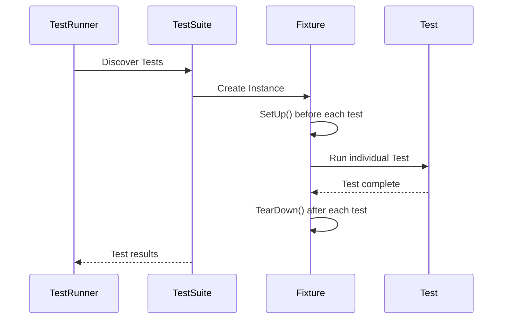

# Test Cases & Fixtures

GoogleTest provides a robust framework for defining, organizing, and executing test cases and fixtures in C++. This document serves as a comprehensive reference for working with test cases, test suites, and test fixtures, offering insight into their lifecycle, registration mechanisms, and conventions for parameterized testing. Mastering these concepts empowers you to build structured, scalable, and maintainable test suites.

---

## 1. Test Cases and Test Suites Overview

- In GoogleTest terminology, a **TestCase** groups tests with related functionality. In newer versions, the term **TestSuite** is preferred, but `TestCase` is still supported.
- A test case or suite contains multiple **Test**s, each representing a single test function.
- Tests within a test suite can share common **test fixture** classes, allowing setup and teardown for shared context.

### Benefits of Organizing Tests in Suites

- Logical grouping facilitates clear organization.
- Shared fixtures avoid duplication of setup/teardown code.
- Enables selective test execution and reporting.

## 2. Defining Tests

### Basic Test Syntax

A test case is defined using the `TEST(TestSuiteName, TestName)` macro:

```cpp
TEST(MathTests, AdditionWorks) {
  EXPECT_EQ(2 + 2, 4);
}
```

This creates a simple, standalone test that runs the provided assertions.

### Using Test Fixtures

When tests share common setup or data, define a fixture:

```cpp
class FooTest : public ::testing::Test {
 protected:
  void SetUp() override {
    // Code here runs before each test.
  }

  void TearDown() override {
    // Code here runs after each test.
  }

  int shared_value;
};

TEST_F(FooTest, DoesX) {
  shared_value = 42;
  EXPECT_EQ(shared_value, 42);
}

TEST_F(FooTest, DoesY) {
  EXPECT_EQ(shared_value, 0); // Because shared_value is reset for each test
}
```

`TEST_F` requires a fixture class that inherits from `::testing::Test`.

### Fixture Lifecycle Methods

- `SetUp()`: Called before each test.
- `TearDown()`: Called after each test.
- Avoid throwing exceptions from setup or teardown.

## 3. Parameterized Tests

Enables running the same test logic with different parameters to avoid duplicating code.

### Value-Parameterized Tests

```cpp
class MyParamTest : public ::testing::TestWithParam<int> {
  // Test code can use GetParam()
};

TEST_P(MyParamTest, IsEven) {
  int n = GetParam();
  EXPECT_EQ(n % 2, 0);
}

INSTANTIATE_TEST_SUITE_P(
    EvenNumbers,  // Instantiation name
    MyParamTest,
    ::testing::Values(2, 4, 6, 8));
```

- Use `::testing::TestWithParam<T>` where `T` is the parameter type.
- `TEST_P` defines parameterized test instances.
- `INSTANTIATE_TEST_SUITE_P` provides parameter values.

### Type-Parameterized Tests

Tests generic code over multiple types.

```cpp
template <typename T>
class MyTypeParamTest : public ::testing::Test {};

using MyTypes = ::testing::Types<int, double, std::string>;

TYPED_TEST_SUITE(MyTypeParamTest, MyTypes);

TYPED_TEST(MyTypeParamTest, CanDefaultConstruct) {
  TypeParam val{};
  (void) val;  // Silence unused warning
}
```

- Use `TYPED_TEST_SUITE` to register types.
- Define tests using `TYPED_TEST` instead of `TEST`.

## 4. Test Registration

- Tests are registered with the GoogleTest framework via macros during static initialization.
- Test runners discover and execute all registered tests automatically.
- This mechanism supports filtering tests by test suite or name at runtime.

## 5. Best Practices and Conventions

- Test names and suite names should be descriptive and concise.
- Avoid complex logic or side effects in test constructors or fixtures.
- Use fixtures to avoid code duplication for setup and teardown.
- Prefer parameterized tests for running the same logic on multiple inputs.
- Maintain independence of tests; no shared global state.

## 6. Advanced Topics

### Combining Parameterized and Typed Tests

GoogleTest supports combining value- and type-parameterized tests for complex scenarios.

### Using `SetUpTestCase`/`TearDownTestCase`

- Deprecated in favor of `SetUpTestSuite`/`TearDownTestSuite`.
- Run code once before/after all tests in a suite.

### Custom Test Environments

Use `::testing::Environment` subclasses to run global setup/teardown code.

## 7. Troubleshooting Common Issues

- **Tests not running:** Check that your test functions are properly registered using `TEST` or `TEST_F` macros.
- **Fixtures not resetting state:** Ensure state is initialized in `SetUp()` not constructors.
- **Parameterized tests failing to instantiate:** Verify that parameter values and types match.
- **Test ordering unexpected:** Tests run in the order of registration; avoid dependencies.

## 8. Example: Full Test Fixture with Parameterized Test

```cpp
#include <gtest/gtest.h>

class NumberTest : public ::testing::TestWithParam<int> {
 protected:
  void SetUp() override {
    number_ = GetParam();
  }

  int number_;
};

TEST_P(NumberTest, IsPositive) {
  EXPECT_GT(number_, 0);
}

INSTANTIATE_TEST_SUITE_P(PositiveNumbers, NumberTest, ::testing::Values(1, 2, 3, 10));
```

This test runs `IsPositive` four times with different positive integers.

---

## See Also

- [gMock Mocking Reference](/api-reference/core-testing-api/mock-objects-api)
- [gMock Expectations & Invocations](/api-reference/core-testing-api/expectations-invocations)
- [gMock Cheat Sheet](https://google.github.io/googletest/gmock_cheat_sheet.html)
- [gMock Cookbook](https://google.github.io/googletest/gmock_cook_book.html)
- [GoogleTest Primer](https://google.github.io/googletest/primer.html)


---

## Diagram: Test Case and Fixture Flow


