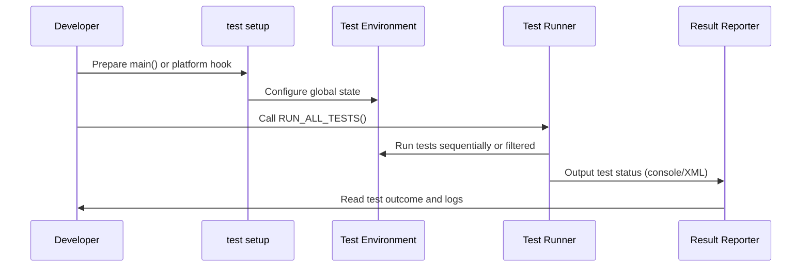

# Test Configuration and Environment

This document provides a comprehensive reference for configuring test execution, managing environment variables, platform portability tools, and customizing test runners within the GoogleTest and GoogleMock ecosystems. It is designed to help you adapt your GoogleTest setup to diverse environments and continuous integration (CI) pipelines effectively.

---

## 1. Overview of Test Configuration

GoogleTest offers flexible mechanisms that allow you to tailor test execution behaviors through configuration parameters and environment settings. Understanding these options ensures your tests run reliably and consistently across different platforms and environments.

Key capabilities include:

- Controlling test discovery, filtering, and execution.
- Managing environment variables to inject configuration.
- Customizing test runners for platform-specific needs.
- Ensuring portability of your tests to accommodate CI systems and embedded targets.

## 2. Test Execution Configuration

### 2.1 Command Line Flags

GoogleTest supports a variety of command line flags that govern test behavior:

- `--gtest_filter`: Specifies which tests to run by test suite and test name patterns.
- `--gtest_repeat`: Defines how many times to repeat tests.
- `--gtest_break_on_failure`: Enables debugger breaks on failed assertions.
- `--gtest_shuffle`: Runs tests in a random order.
- `--gtest_random_seed`: Seeds the random number generator for shuffling.

You must initialize GoogleTest with these flags by calling:

```cpp
int main(int argc, char** argv) {
  testing::InitGoogleTest(&argc, argv);
  return RUN_ALL_TESTS();
}
```

This setup enables parsing and applying all flags before test execution.

### 2.2 Environment Variables

GoogleTest can read environment variables for configuration if needed in your test infrastructure. While there are no mandatory environment variable dependencies, tests can access environment variables programmatically to conditionally configure themselves or adapt behavior.

## 3. Platform Portability and CI Integration

GoogleTest is designed to be highly portable, with support for major desktop platforms (Linux, Windows, macOS) as well as embedded targets such as ESP8266, ESP32, and Arduino-based NRF52 boards.

### 3.1 Native Main Function vs Embedded Setup

- On traditional operating systems, GoogleTest's standard `main()` function drives test execution. Linking against the `gtest_main` or `gmock_main` library provides this for you.

- On embedded platforms, a different approach is needed. For example, on ESP8266 or ESP32, the test executable hooks into Arduino's lifecycle:

```cpp
extern "C" {
  void setup() {
    testing::InitGoogleMock();  // Initializes GoogleTest and GoogleMock
  }

  void loop() {
    RUN_ALL_TESTS();  // Run tests continuously
  }
}
```

This integration allows embedded tests to run within the target platform's event loop.

### 3.2 Custom Test Runners

GoogleTest permits customization of test runners to fit CI workflows or specialized environments. Overriding the default `main()` can help integrate before and after test setup or produce custom output formats.

Given the complexity of CI systems, it is recommended to use XML output options (`--gtest_output=xml`) with your CI to communicate test results effectively.

## 4. Test Environment Variables and Configuration API

GoogleTest supports programmatic interactions to fine-tune test environments:

- You can set up global environment variables or parameters via **`Environment`** classes that run code before and after the entire test program.

- Use `AddGlobalTestEnvironment()` to register an environment setup:

```cpp
class MyEnv : public testing::Environment {
 public:
  void SetUp() override {
    // Initialization code
  }
  void TearDown() override {
    // Cleanup code
  }
};

int main(int argc, char **argv) {
  testing::InitGoogleTest(&argc, argv);
  testing::AddGlobalTestEnvironment(new MyEnv);
  return RUN_ALL_TESTS();
}
```

This is useful for setting up shared test resources or environment states.

## 5. Rate Limits and Resource Constraints

GoogleTest currently does not enforce built-in rate limiting on test execution. Such policies should be managed outside, for example, via CI orchestration tools or test execution frameworks.

## 6. Content Types and Output Formats

GoogleTest supports various output formats to communicate test results:

- Console text output with varying verbosity.
- XML output (compatible with many CI systems).
- `--gtest_print_time` flag for timing details per test.

To enable XML output:

```bash
./your_test_executable --gtest_output=xml:report.xml
```

This helps in post-processing test results.

## 7. Debugging and Troubleshooting

- Ensure `InitGoogleTest()` or `InitGoogleMock()` is called before test execution to process all configured flags properly.
- Use `--gtest_break_on_failure` to trigger debuggers on assertion failures.
- For embedded environments, verify your platform lifecycle hooks (`setup` and `loop`) correctly initialize and execute the test suite.
- When linking issues arise, confirm that `gmock_main` or `gtest_main` libraries are linked correctly to provide an entry `main`.

## 8. Practical Tips and Best Practices

- Prefer linking with `gmock_main` if using GoogleMock, which performs necessary initialization automatically.
- Use environment setup classes to manage global state shared among tests safely.
- Keep test configuration code minimal and placed near the program entry point.
- For large or complex suites, combine test filters and repeat options to selectively and repeatedly run subsets.
- In CI, prefer XML output for automated reporting and integrate with native CI test report viewers.

## 9. Example: Custom Test Main for ESP32

```cpp
#include <gmock/gmock.h>

extern "C" void setup() {
  testing::InitGoogleMock();
}

extern "C" void loop() {
  RUN_ALL_TESTS();
}
```

This simple override lets you run tests on ESP32 platforms inside the Arduino event framework.

## 10. Related Components

This page fits into the larger GoogleTest and GoogleMock documentation ecosystem by providing vital configuration and environment usage details. For mocking facilities, refer to the [Mocking Reference](reference/mocking.md). For writing tests and fixtures, see the [GoogleTest Primer](docs/primer.md). To learn about structuring expectations and actions, consult the [gMock Cookbook](docs/gmock_cook_book.md).

---

### Additional Resources

- [GoogleTest Primer](docs/primer.md)
- [Mocking Reference](docs/reference/mocking.md)
- [gMock Cookbook](docs/gmock_cook_book.md)
- [gMock Cheat Sheet](docs/gmock_cheat_sheet.md)
- [GoogleMock Main Function Implementation](googlemock/src/gmock_main.cc)

---

For more details on platform-specific test execution and environment management, please check the platform integration and continuous integration sections in [Integration and Ecosystem](overview/architecture-core/integration-ecosystem.mdx).

---

If you encounter issues during setup, refer to Prerequisites & Supported Platforms page for system requirements and troubleshooting: /getting_started/essentials_setup/prerequisites

---

## Summary Diagram of Test Execution Flow



---

This flow charts the core user interaction from test configuration to final reporting.


<Note>
Remember: Always initialize GoogleMock and GoogleTest before running tests to ensure configurations and flags are loaded properly.
</Note>

---

This concludes the reference on configuring test execution and environment management for GoogleTest and GoogleMock.

