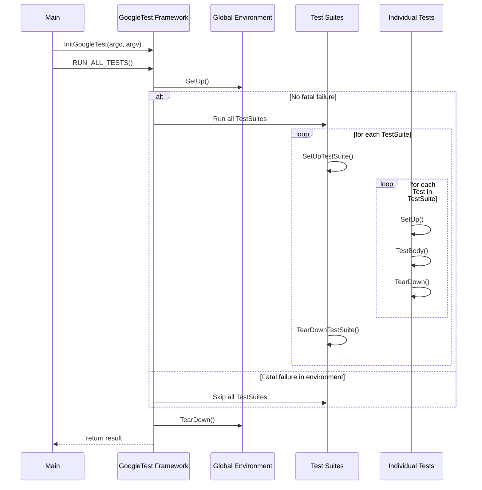

# Test Definition and Execution

This page details the fundamental constructs and mechanisms in GoogleTest for defining test cases and suites, managing their registration and execution, and controlling the test lifecycle. Key macros like `TEST` and `TEST_F`, main entry function `RUN_ALL_TESTS()`, and lifecycle hooks are covered to help you organize and run tests effectively.

---

## Overview of Test Declaration

GoogleTest organizes tests primarily through **test suites** containing **test cases** defined by macros. Each test case can be simple or use shared setup **fixtures**.

- **`TEST(TestSuiteName, TestName)`**: Defines a basic, standalone test. Both names must be valid C++ identifiers without underscores.
- **`TEST_F(TestFixtureName, TestName)`**: Uses a test fixture class (`TestFixtureName`) to provide common setup/teardown and shared data for multiple tests. The test suite name here matches the fixture name.

Each test’s behavior is authored within the body of these macros, making assertions that determine success or failure. Tests are independent; GoogleTest creates a fresh fixture instance (if used) for every test.

### Example: Creating Basic and Fixture-Based Tests

```cpp
TEST(MathTest, Addition) {
  EXPECT_EQ(2 + 2, 4);
}

class QueueTest : public testing::Test {
 protected:
  void SetUp() override {
    queue_.Enqueue(1);
  }
  Queue<int> queue_;
};

TEST_F(QueueTest, IsNotEmptyInitially) {
  EXPECT_FALSE(queue_.IsEmpty());
}
```

This structure encourages clear test grouping and reuse.

---

## Lifecycle Hooks and Fixture Management

Test fixtures derived from `testing::Test` can override the following lifecycle methods:

- `SetUpTestSuite()`: Static method run once before any tests in the suite.
- `TearDownTestSuite()`: Static method run once after all tests in the suite.
- `SetUp()`: Called before each individual test.
- `TearDown()`: Called after each individual test.

This enables shared resource management at both the suite and test levels.

---

## Parameterized and Typed Tests (Brief Mention)

While this page focuses on primary test definition and execution, value-parameterized (`TEST_P`) and typed tests extend this model by allowing test logic to execute across a range of parameters or types. These use macros such as `TEST_P`, `INSTANTIATE_TEST_SUITE_P`, `TYPED_TEST_SUITE`, and `TYPED_TEST`, covered in-depth in the Test Parameterization API documentation.

---

## Dynamic and Programmatic Test Registration

For advanced scenarios, tests may be registered dynamically at runtime using:

```cpp
  testing::RegisterTest(test_suite_name, test_name, type_param, value_param, 
                        file, line, factory);
```

Here, `factory` is a callable returning a new `Test` derived object. This flexibility allows test creation based on runtime conditions, configuration files, or data.

---

## Running Tests

Your test program’s main entry point should:

1. Call `testing::InitGoogleTest(&argc, argv);` to initialize the framework and parse command-line flags.
2. Invoke `RUN_ALL_TESTS();` to run all registered tests.

Example:

```cpp
int main(int argc, char** argv) {
  testing::InitGoogleTest(&argc, argv);
  return RUN_ALL_TESTS();
}
```

`RUN_ALL_TESTS()` executes all tests respecting filters, sharding, repeats, and other flags.

---

## Controlling Test Execution Flow

- **Skipping tests** at runtime can be done with `GTEST_SKIP();` inside a test or fixture `SetUp()`. It aborts further execution of that test.

- **Handling Failures**:
  - `ASSERT_*` macros abort the current function on failure (fatal).
  - `EXPECT_*` macros report failures but continue execution (non-fatal).
  - Use `HasFatalFailure()`, `HasNonfatalFailure()`, or `HasFailure()` to check failure state within tests.

- **Logging Test Properties**: 
  You can log arbitrary key-value properties inside tests using `RecordProperty()`, which attaches data to test results (visible in XML/JSON reports).

---

## Event Listeners and Test Events

GoogleTest exposes a listener API for monitoring test progress and results:

- Subclass `testing::TestEventListener` or `testing::EmptyTestEventListener` to handle events like test start/end, assertion results, suite start/end.

- Attach custom listeners to `UnitTest::GetInstance()->listeners()`.

This enables custom reporting, tooling integration, or specialized behavior during the test lifecycle.

---

## Common Pitfalls and Best Practices

- Always call `testing::InitGoogleTest()` before `RUN_ALL_TESTS()`.
- Do **not** mix `TEST()` and `TEST_F()` in the same test suite.
- Name test suites and tests without underscores to avoid internal issues.
- Use fixtures to share expensive setup logic and state safely.
- Use `GTEST_SKIP()` thoughtfully to skip tests on unmet preconditions.
- Use `ASSERT_*` when a failure should abort the test immediately, otherwise `EXPECT_*` to gather multiple errors.
- For parameterized or typed tests, define and instantiate them carefully to avoid uninstantiated test warnings.

---

## Summary Diagram of Test Execution Flow



---

## Additional Resources

For deeper understanding and advanced usage patterns, see:

- [Testing Reference](https://github.com/google/googletest/blob/main/docs/reference/testing.md): Full details on all macros, classes, and functions.
- [Advanced GoogleTest Topics](https://github.com/google/googletest/blob/main/docs/advanced.md): Covers parameterized, typed, and death tests.
- [GoogleTest Primer](https://github.com/google/googletest/blob/main/docs/primer.md): Introduction and fundamentals.
- [Parameterized and Typed Tests Guide](https://github.com/google/googletest/blob/main/guides/advanced-testing-patterns/parameterized-and-typed-tests.mdx): Practical examples of parameterized test patterns.
- [Writing and Running Unit Tests Guide](https://github.com/google/googletest/blob/main/guides/core-workflows/writing-unit-tests.mdx): Workflow and best practices.


<Tip>
Remember to wrap each test's logic inside the macros `TEST` or `TEST_F` and call `RUN_ALL_TESTS()` at the end of your test program to execute all registered tests.
</Tip>

<Warning>
Do not mix test declaration macros `TEST()` and `TEST_F()` within the same test suite, and avoid underscores in test names as per GoogleTest conventions.
</Warning>

<Note>
Use of `GTEST_SKIP()` in test or fixture setup methods allows tests to skip execution cleanly when preconditions are unmet.
</Note>
