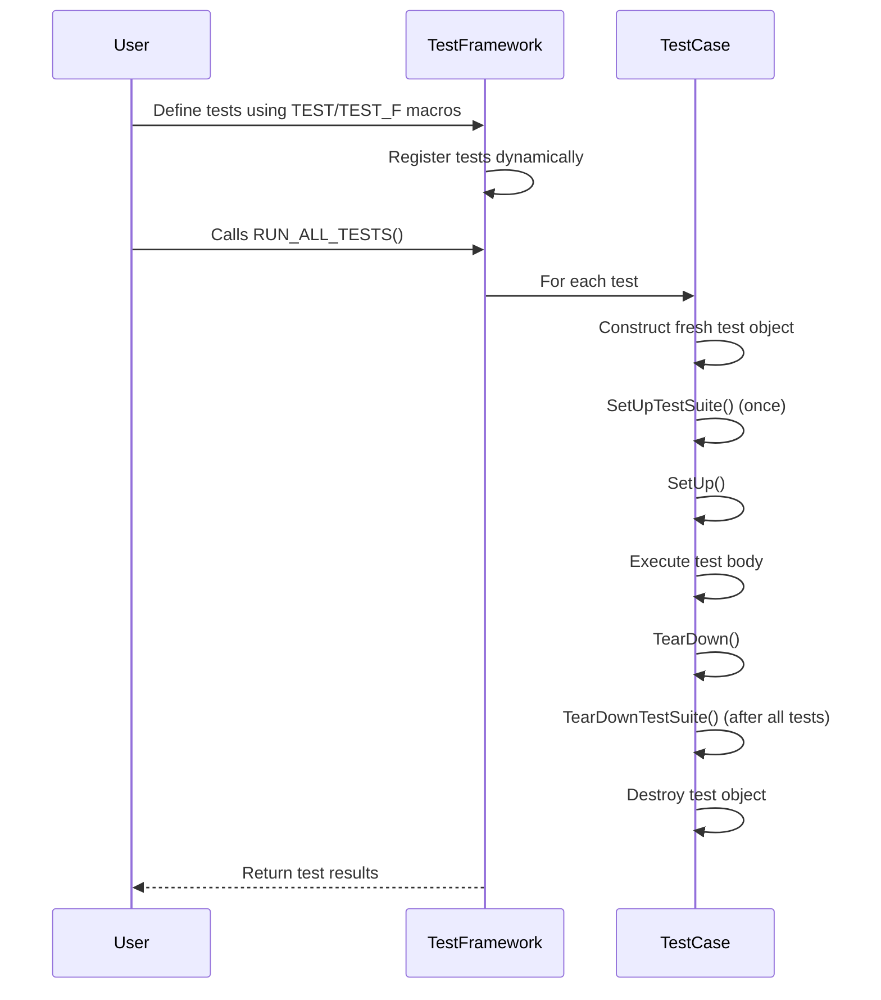

# Test Definition and Execution

Mastering test definition and execution is foundational to leveraging GoogleTest’s powerful C++ testing framework. This guide walks you through defining and registering test cases, setting up main functions to run your test binaries, and understanding how test discovery and lifecycle management operate behind the scenes. You will gain clarity on the key entry points, macros, and functions essential for starting and controlling test runs effectively.

---

## 1. Understanding Test Registration and Discovery

GoogleTest automatically discovers and registers tests at runtime, relieving you from manually enumerating each test to execute. This seamless discovery is enabled through macros that internally register tests with the framework.

### Key Macros for Defining Tests

- **`TEST(TestSuiteName, TestName)`**: Creates an individual test. These tests do not use fixtures and are standalone functions.

  ```cpp
  TEST(MathFunctions, HandlesZeroInput) {
    EXPECT_EQ(Factorial(0), 1);
  }
  ```

- **`TEST_F(TestFixtureName, TestName)`**: Defines a test using a fixture. This grants access to shared setup and teardown logic, useful for grouping related tests with common context.

  ```cpp
  class QueueTest : public ::testing::Test {
   protected:
    Queue<int> q;
  };

  TEST_F(QueueTest, IsEmptyInitially) {
    EXPECT_TRUE(q.empty());
  }
  ```

- **`TEST_P(TestFixtureName, TestName)`**: Defines a value-parameterized test, enabling the same test logic to execute with different parameters.

- **`INSTANTIATE_TEST_SUITE_P()`**: Instantiates parameterized tests with specific value sets.

### Dynamic Test Registration Internals

Behind the scenes, the `TEST` and `TEST_F` macros invoke `testing::RegisterTest()`, which registers test suites and tests with GoogleTest's framework. This approach supports dynamic test discovery before `RUN_ALL_TESTS()` is executed.


## 2. Writing main() - Running Your Tests

While linking with `gtest_main` or `gmock_main` provides a prebuilt `main()` function to run all tests automatically, sometimes customization before running tests is necessary.

### Basic main() Example

```cpp
#include <gtest/gtest.h>

int main(int argc, char **argv) {
  ::testing::InitGoogleTest(&argc, argv);
  return RUN_ALL_TESTS();
}
```

- `InitGoogleTest` parses GoogleTest-specific command line flags and prepares the framework.
- `RUN_ALL_TESTS()` runs all registered tests and returns zero on success.

### Using gMock

If you use GoogleMock, call `InitGoogleMock` instead, which initializes both GoogleTest and GoogleMock:

```cpp
#include <gmock/gmock.h>

int main(int argc, char **argv) {
  ::testing::InitGoogleMock(&argc, argv);
  return RUN_ALL_TESTS();
}
```

### Platform-specific Considerations

Embedded platforms like ESP8266, ESP32, and NRF52 have special entry point patterns using `setup()` and `loop()`. In these environments, `InitGoogleMock` is called in `setup()`, and `loop()` runs `RUN_ALL_TESTS()` repeatedly.

## 3. Test Lifecycle and Execution Flow

When tests run, GoogleTest follows a highly predictable lifecycle that ensures test isolation, setup, and cleanup.

### Flow of Execution for Each Test

1. **Test Construction**: A fresh test object is created for each test to guarantee independence.
2. **Setup Phase**
   - If a test suite has a `SetUpTestSuite()` method, it runs once before any tests in the suite.
   - The test object's `SetUp()` method runs before each test.
3. **Test Body**: The actual code inside the test function executes.
4. **Teardown Phase**
   - The test object's `TearDown()` method runs after each test.
   - If a test suite has a `TearDownTestSuite()` method, it runs once after all tests in the suite.
5. **Test Destruction**: The test object is deleted preserving test isolation.

This lifecycle is carefully designed to ensure no test affects another and that resource acquisition and release are well managed.

## 4. Core Macros and Functions

### RegisterTest Function

```cpp
template <typename Factory>
TestInfo* RegisterTest(
  const char* test_suite_name,
  const char* test_name,
  const char* type_param, const char* value_param,
  const char* file, int line,
  Factory factory);
```

- Registers a test dynamically with GoogleTest.
- `factory` creates instances of the test fixture.
- Must be called before `RUN_ALL_TESTS()`.

### Run All Tests

- `int RUN_ALL_TESTS()` executes all registered tests and returns `0` if all pass.

### Initialization

- `void InitGoogleTest(int* argc, char** argv)` parses test flags and initializes the framework.
- For mocks: Use `InitGoogleMock()` instead.

## 5. Understanding Test Suites and Fixtures

GoogleTest uses *test suites* (previously called test cases) to group related tests.

- Tests in a suite can share a fixture class for common setup.
- Fixtures inherit from `testing::Test`.
- Each test in the suite gets a fresh fixture instance.

Example:

```cpp
class DatabaseTest : public testing::Test {
 protected:
  void SetUp() override {
    db.Connect();
  }
  void TearDown() override {
    db.Disconnect();
  }
  Database db;
};

TEST_F(DatabaseTest, InsertWorks) {
  EXPECT_TRUE(db.Insert("key", "value"));
}

TEST_F(DatabaseTest, QueryWorks) {
  db.Insert("key", "value");
  EXPECT_EQ(db.Query("key"), "value");
}
```

## 6. Best Practices and Tips

- **Prefer pre-built `main()`**: Unless you have pre-test logic, use `gtest_main` or `gmock_main` libraries to avoid boilerplate.

- **Group Related Tests**: Use fixtures to share common setup and enhance readability.

- **Call Initialization First**: Always call `InitGoogleTest` or `InitGoogleMock` before `RUN_ALL_TESTS()`.

- **Observe Return Codes**: Use the return value of `RUN_ALL_TESTS()` in your custom `main()` to report test success properly.

- **Avoid Multiple RUN_ALL_TESTS Calls**: Calling it multiple times is unsupported and leads to undefined behavior.

## 7. Troubleshooting Common Issues

- **Tests Not Running?**
  - Ensure tests are registered before `RUN_ALL_TESTS()` is called.
  - Confirm `InitGoogleTest` or `InitGoogleMock` is called, as tests won't run otherwise.

- **Custom main() Not Invoked?**
  - If linked with `gtest_main` or `gmock_main`, the library’s `main()` may take precedence.

- **Incorrect Test Filtering?**
  - Check command line arguments passed to `InitGoogleTest`.
  - Use `--gtest_filter` and other flags to target specific tests.

- **Test Fixture Misconfiguration?**
  - Verify that fixtures derive from `testing::Test`.
  - Confirm proper use of `TEST_F()` with the fixture class name.

## 8. Summary Diagram of Test Execution Flow



---

This page is essential for anyone seeking a foundational understanding of how to define, register, and run tests using GoogleTest. It bridges your test code with the framework’s lifecycle and execution engine, enabling you to build maintainable and robust C++ test suites.

---

## See Also

- [GoogleTest Primer](https://github.com/google/googletest/blob/main/docs/primer.md)
- [GoogleMock for Dummies](https://github.com/google/googletest/blob/main/docs/gmock_for_dummies.md)
- [GoogleTest Mocking Reference](https://github.com/google/googletest/blob/main/docs/reference/mocking.md)
- [GoogleMock Main Function](https://github.com/google/googletest/blob/main/googlemock/src/gmock_main.cc)
- [RegisterTest() Documentation](https://github.com/google/googletest/blob/main/docs/reference/testing.md#RegisterTest)


<Check>
Make sure to register your custom tests before calling `RUN_ALL_TESTS()`. Always initialize the framework using `InitGoogleTest()` or `InitGoogleMock()` to ensure proper flag processing. Avoid defining multiple `main()` functions to prevent linker issues.
</Check>

