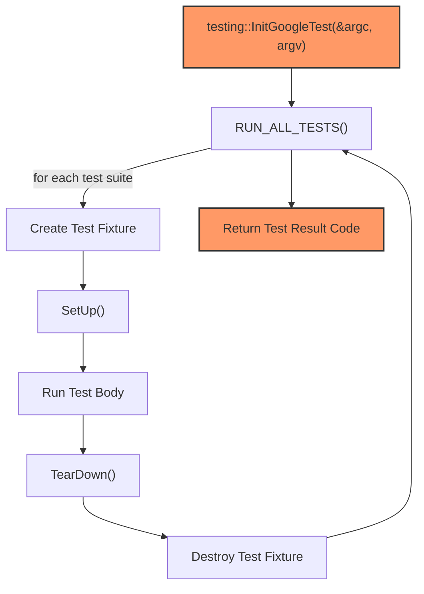

# Test Execution and Control

GoogleTest offers a robust and flexible system for executing your tests, controlling which tests run, and managing how test results are reported. This documentation guides you through running test binaries, using command line flags to filter and order tests, and configuring the test environment for seamless integration into your development and CI workflows.

---

## 1. Running Test Binaries

At the core of GoogleTest's execution model is the `RUN_ALL_TESTS()` macro, which triggers automatic discovery and execution of all registered tests in your test program. Here's how you typically run tests:

- **Standard Main Function:**

  ```cpp
  int main(int argc, char** argv) {
    testing::InitGoogleTest(&argc, argv);  // Parses test flags
    return RUN_ALL_TESTS();                // Runs all tests and returns status
  }
  ```

- **Using Pre-Built Main:**

  For most users, there's no need to write your own `main`. Linking your test binary against `gtest_main` or `gmock_main` (for GoogleMock) supplies a default entry point that handles initialization and running all tests.

- **Execution Flow:**

  When invoked, `RUN_ALL_TESTS()`:

  1. Initializes the test framework and parses flags.
  2. Creates and sets up fixtures for each test.
  3. Runs tests sequentially, handling both fatal and non-fatal assertion failures.
  4. Cleans up fixtures and proceeds to the next test.

- **Exit Code:**

  Returns `0` if all tests pass; non-zero otherwise. This facilitates automated validation in CI systems.

<Check>
Always handle the return value from `RUN_ALL_TESTS()`. Ignoring it hampers automated test verification.
</Check>

---

## 2. Configuring Test Filtering and Selection

To run a subset of tests, GoogleTest supports powerful filtering and selection mechanisms through command line flags. This is essential when working with large test suites.

### 2.1 Test Filtering with `--gtest_filter`

- **Syntax:**

  ```bash
  --gtest_filter=<positive_patterns>[-<negative_patterns>]
  ```

- **Positive Patterns:** Comma-separated list of test patterns to include.
- **Negative Patterns:** (Optional) Comma-separated list to exclude tests.

- **Example:**

  ```bash
  ./my_tests --gtest_filter=FactorialTest.*-*.HandlesZeroInput
  ```

  Runs all tests in `FactorialTest` except the one named `HandlesZeroInput`.

- **Pattern Matching:**

  Supports wildcard `*` matching any substring.

### 2.2 Test Sharding and Repetition

- **Sharding** enables splitting tests across multiple processes for parallel execution:

  ```bash
  --gtest_shard_count=<num_shards> --gtest_shard_index=<shard_id>
  ```

- **Repetition:**

  Run tests multiple times to catch flaky tests:

  ```bash
  --gtest_repeat=<num_runs>
  ```

### 2.3 Controlling Test Output

- **Output Formats:**

  ```bash
  --gtest_output=[xml[:file_name]|json[:file_name]|none]
  ```


- Useful for CI systems that consume test reports.

### 2.4 Other Useful Flags

- `--gtest_list_tests`: Lists all tests without running them.
- `--gtest_break_on_failure`: Breaks into the debugger on failure.
- `--gtest_throw_on_failure`: Throws exceptions on failures (rare and use carefully).

<Note>
For detailed coverage of flags, see the GoogleTest Advanced guide and the `--help` output from your test binary.
</Note>

---

## 3. Managing Test Execution Order

GoogleTest runs tests in the order they are registered, which is usually the order they appear in the code or linked object files.

- Tests within the same test suite execute sequentially but independently.
- Test fixtures ensure isolation — each test gets a new fixture instance.
- **Custom ordering:** GoogleTest currently does not support explicit test ordering; tests should be written to be independent.

<Warning>
Tests must be independent and not rely on execution order. Designing dependencies leads to brittle tests and hampers parallelization.
</Warning>

---

## 4. Customizing Test Execution Programmatically

You can gain finer control over test execution by leveraging the GoogleTest API:

- **Filtering tests programmatically:**

  Modify `::testing::GTEST_FLAG(filter)` before `RUN_ALL_TESTS()`.

- **Test event listeners:**

  Attach customized listeners to observe and act on test lifecycle events.

- **Controlling test environment:**

  Use global environment classes (`::testing::Environment`) to setup and teardown states shared across tests.

---

## 5. Integrating with Build Systems and CI Pipelines

### 5.1 Building Tests

- Link with `gtest_main` or `gmock_main` to use provided main functions.
- If you need customization, link with `gtest`/`gmock` directly and supply your own main.
- Use recommended CMake or Bazel integration to manage dependencies, as detailed in the [Building and Configuring Your Project guide](https://github.com/google/googletest/blob/main/docs/building-configuring-project.md).

### 5.2 Running Tests in CI

- Use test filtering to run relevant tests.
- Collect output as XML or JSON using `--gtest_output` for CI parsing.
- Employ test sharding and repetition features to maximize reliability and efficiency.

### 5.3 Troubleshooting CI Failures

- Verify that environment variables and command line flags are propagated correctly.
- Check that tests do not depend on order or shared state.

<Check>
Regularly validate exit codes in your CI scripts to catch failures early.
</Check>

---

## 6. Troubleshooting Common Test Execution Issues

<AccordionGroup title="Test Execution Troubleshooting">
<Accordion title="Tests not running or being discovered">
Ensure `testing::InitGoogleTest(&argc, argv);` is called before `RUN_ALL_TESTS()`. Missing this call or incorrect argument passing can prevent test discovery.
</Accordion>

<Accordion title="Inability to filter tests as expected">
Check for correct usage of `--gtest_filter` syntax and ensure no whitespace or improper escaping in shell commands.
</Accordion>

<Accordion title="Tests failing unexpectedly in CI environments">
Confirm environment similarities to local dev and avoid test dependencies on execution order or external state.
</Accordion>

<Accordion title="Unexpected exit codes or test failures after custom main()">
Always return the result of `RUN_ALL_TESTS()` from your `main` function to signal the test outcomes accurately.
</Accordion>
</AccordionGroup>

---

## 7. Example: Running Selected Tests with Custom Output

```bash
./my_test_binary --gtest_filter=MySuite.* --gtest_output=xml:results.xml
```

This runs all tests with test suite prefix `MySuite` and saves the test results in XML format to `results.xml`, enabling integration with CI dashboards.

---

## 8. Summary Diagram of Test Execution Flow



---

## 9. Additional Resources

Refer to the following for deeper insights and related functionalities:

- [Running and Validating Tests](getting-started/first-steps-with-tests/running-tests.md)
- [Test Discovery and Execution Guide](guides/core_testing_workflows/test_discovery_execution.md)
- [Building and Configuring Your Project](getting-started/prerequisites-installation/building-configuring-project.md)
- [Continuous Integration Best Practices](guides/integration_real_world_use/ci_cd_best_practices.md)

---

This page completes your understanding of how to execute, control, and manage your GoogleTest test runs efficiently, ensuring smooth development workflows and robust test automation.
