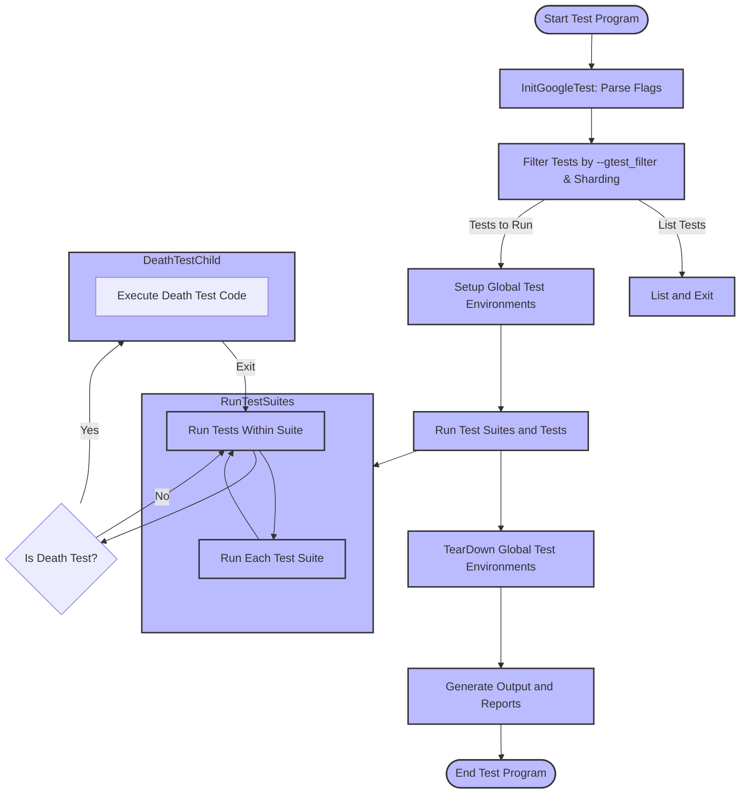

# Test Execution and Event Control

This page details how to run, configure, and manage test execution within GoogleTest, focusing on the main entry points, environment setup, event listeners, and command-line options. It describes the infrastructure used to run test suites, report results, and integrate GoogleTest with build and continuous integration (CI) systems.

---

## Overview of Test Execution

GoogleTest runs test programs as conventional executables that contain multiple test suites and test cases. The key function to start test execution is `RUN_ALL_TESTS()`, which automatically discovers and executes all registered tests based on filtering and environment conditions.

### Execution Flow

The common user flow for running tests is:

1. **Initialization:**
   - Call `testing::InitGoogleTest(&argc, argv);` to parse GoogleTest-specific command-line flags.
2. **Test Run:**
   - Invoke `RUN_ALL_TESTS();` to run all selected tests.
3. **Result Reporting:**
   - Observe output in the console or in configured XML/JSON files.

### Main Entry Points

#### `InitGoogleTest()`

This function parses and processes the command-line flags recognized by GoogleTest. It must be called before `RUN_ALL_TESTS()`. After this call, GoogleTest's internal state is configured, including which tests will run, output modes, and other behaviors.

Example:

```cpp
int main(int argc, char** argv) {
  ::testing::InitGoogleTest(&argc, argv);
  return RUN_ALL_TESTS();
}
```

#### `RUN_ALL_TESTS()`

This function runs all tests that match the current filter and other conditions. It returns `0` if all tests succeed or `1` if any test fails. Calling this function triggers a controlled sequence of test runs, including global environment setup and teardown.

<Info>
Ensure you call `RUN_ALL_TESTS()` only once per test program. Calling it more than once can disrupt some advanced features like thread-safe death tests.
</Info>


## Environment Setup and Tear-Down

GoogleTest supports global setup and teardown via subclasses of `testing::Environment`. Environments allow you to define routines that run once before any test and once after all tests.

- Use `SetUp()` to implement setup logic.
- Use `TearDown()` to implement cleanup logic.

You register an environment globally by:

```cpp
testing::AddGlobalTestEnvironment(new MyEnvironment());
```

When running tests with `RUN_ALL_TESTS()`, GoogleTest calls all `SetUp()` methods before any tests run and all `TearDown()` methods after all tests complete, in reverse order.

<Note>
Environments are run only if there is at least one test to execute and even if all tests are skipped or no tests fail.
</Note>


## Test Listeners and Event Control

GoogleTest offers an extensible event listener API through the `TestEventListener` interface and the `TestEventListeners` container. Listeners receive notifications about various events in the test lifecycle, enabling customized reporting, logging, or triggering additional actions.

### Built-in Listeners

- **Default Result Printer:** Outputs test progress and results to the console.
- **XML/JSON Generator:** Produces test reports in XML or JSON formats if requested via `--gtest_output`.

### Adding Custom Listeners

You can define your own event listener subclassing `TestEventListener` or deriving from `EmptyTestEventListener` if you wish to override only selected methods.

Example of defining a minimalist listener:

```cpp
class MinimalistPrinter : public testing::EmptyTestEventListener {
 public:
  void OnTestStart(const testing::TestInfo& test_info) override {
    std::cout << "Starting: " << test_info.test_suite_name() << "." << test_info.name() << std::endl;
  }
  void OnTestEnd(const testing::TestInfo& test_info) override {
    std::cout << "Finished: " << test_info.test_suite_name() << "." << test_info.name() << std::endl;
  }
};
```

Register the listener before running tests:

```cpp
int main(int argc, char** argv) {
  testing::InitGoogleTest(&argc, argv);
  testing::UnitTest::GetInstance()->listeners().Append(new MinimalistPrinter);
  return RUN_ALL_TESTS();
}
```

To suppress the default result printer, remove and delete it:

```cpp
auto& listeners = testing::UnitTest::GetInstance()->listeners();
delete listeners.Release(listeners.default_result_printer());
```

### Event Listener Methods

GoogleTest fires events for:

- Test program start and end
- Start and end of test iterations (for repeated tests)
- Environment setup and teardown
- Test suite start and end
- Test start and end
- Assertion results

You can hook into these for fine-grained control and monitoring.

<Warning>
Listeners that observe `OnTestPartResult` should not generate failures themselves, to avoid recursive failure reporting.
</Warning>


## Command Line Flags and Environment Variables

GoogleTest offers a rich set of command-line flags and corresponding environment variables that control test execution, filtering, repetition, test ordering, output formatting, and more.

Run your test executable with `--help` or `--gtest_help` to print available flags.

### Key Flags Impacting Test Execution

| Flag                          | Description                                                |
|-------------------------------|------------------------------------------------------------|
| `--gtest_filter`               | Filter which tests are run by pattern matching the full test names (suite.test). Supports positive and negative patterns separated by `-`. |
| `--gtest_list_tests`           | List all tests instead of running them.                   |
| `--gtest_repeat=N`             | Run tests N times; negative runs forever.                  |
| `--gtest_shuffle`              | Randomize the order of tests for each iteration.          |
| `--gtest_random_seed=N`        | Seed to use for randomizing test order.                   |
| `--gtest_fail_fast`            | Stops execution after the first test failure.             |
| `--gtest_also_run_disabled_tests` | Runs tests marked as disabled (those with `DISABLED_` prefix). |
| `--gtest_output=[xml|json][:file or dir]` | Generates XML or JSON test report.                          |

### Environment Variables

Each flag has a corresponding environment variable in all caps, with the `GTEST_` prefix, e.g., `GTEST_FILTER` for `--gtest_filter`.

### Specialized Flags

- `--gtest_break_on_failure`: Makes failed assertions trigger a debugger break-point.
- `--gtest_throw_on_failure`: Turns failed assertions into exceptions (if enabled) or immediate exit.
- `--gtest_catch_exceptions`: Enables or disables catching exceptions raised from test code.


## Running Death Tests

Death tests verify that particular code executions cause process termination under provisions such as assertions failing or fatal errors raised.

### Writing and Running Death Tests

Use macros like `ASSERT_DEATH()`, `EXPECT_DEATH()`, `ASSERT_EXIT()`, and `EXPECT_EXIT()` to declare death tests.

```cpp
TEST(MyDeathTest, Example) {
  ASSERT_DEATH({ MyFunction(); }, "expected error message regex");
  EXPECT_EXIT(MyExitFunction(), testing::ExitedWithCode(0), "exit message regex");
}
```

### Death Test Styles

GoogleTest supports two death test styles controlled by the `--gtest_death_test_style` flag:

- `fast`: Forks and immediately runs death test code in the child process.
- `threadsafe`: Forks and re-executes the test binary with filtered flags for safer execution in multi-threaded programs.

The default style is `threadsafe` and recommended for robust testing, sacrificing some speed.

### Important Notes

- Name your test suites including `DeathTest` suffix to enforce running death tests first.
- Avoid multiple death tests on the same line to prevent compilation errors.
- Death test subprocesses isolate memory and side effects.


## Test Filtering and Sharding

GoogleTest supports filtering tests to selectively run them based on name patterns and supports running tests in parallel shards on multiple machines or processes.

### Filtering

Use `--gtest_filter` to specify positive (patterns to run) and negative (patterns to exclude) filters separated by `-`. For example:

```
--gtest_filter=FooTest.*-FooTest.Bar
```

runs all tests in `FooTest` except `FooTest.Bar`.

### Sharding

Set environment variables `GTEST_TOTAL_SHARDS` and `GTEST_SHARD_INDEX` to split test execution across multiple shards. Each shard will run a unique subset of tests to accelerate test cycles.


## Reporting and Output Options

GoogleTest provides various output configurations to meet diverse user needs.

### Console Output

- Colored output (`--gtest_color`): `yes`, `no`, or `auto` (auto detects capability).
- Brief output (`--gtest_brief`): Show only failed tests.
- Disabling test times (`--gtest_print_time=0`).

### File Reports

Producing XML or JSON reports with `--gtest_output=xml:file` or `--gtest_output=json:file`.

### Streaming

On supported platforms, stream test results to a TCP server using `--gtest_stream_result_to=host:port`.


## Integration with Build and CI Systems

GoogleTest's command-line flags and environment variables provide hooks for build and CI systems to integrate and control test runs effectively. Features such as test sharding, repeat, filtering, and output formats are essential for automation.

Google's internal continuous integration system uses these mechanisms to parallelize testing and collect structured reports.


## Troubleshooting and Best Practices

- Always initialize GoogleTest with `InitGoogleTest()` before `RUN_ALL_TESTS()`.
- Name death test suites with `DeathTest` suffix to ensure proper ordering.
- Use `SCOPED_TRACE` to add contextual information to failures.
- When using death tests, avoid freeing memory in child processes to prevent false leak detection.
- Emit test properties using `RecordProperty` for additional metadata in reports.


## Summary Diagram of Test Execution Flow




## References for Further Reading

- [GoogleTest Primer](https://google.github.io/googletest/primer.html): Learn how to write basic tests and use fixtures.
- [Advanced Topics](../advanced.md): Deep dive on parameterized and typed tests, event listener API, and test filtering.
- [Testing Reference](../reference/testing.md): API documentation for tests, suites, and environment classes.
- [Assertions Reference](reference/assertions.md): Detailed assertion macros and predicate usage.

---

This documentation focuses specifically on the execution and event control aspects of GoogleTest, complementing other pages that cover test definition, assertions, mocking, and build integration.

---

## Practical Tips

- **Always call `InitGoogleTest()` before `RUN_ALL_TESTS()`** to ensure proper flag parsing.
- **Use event listeners to customize test reporting or integrate with tooling.**
- **Filter tests and leverage sharding for efficient test runs in CI environments.**
- **Handle death tests carefully, naming suites to run first and understanding their isolation semantics.**
- **Leverage environment setup and teardown to initialize expensive or shared test resources.**

## Troubleshooting Common Issues

- **Tests not running as expected?** Check your `--gtest_filter` patterns and sharding environment variables.
- **Death tests hanging or timing out?** Verify the death test style, thread count warnings, and avoid complex multithreaded setups.
- **Output reports missing?** Ensure proper output flags and file/directory permissions.
- **Test event outputs interleaved or cluttered?** Suppress default listeners or write custom listeners for cleaner logs.

For more troubleshooting, see [Troubleshooting Common Setup Issues](../getting-started/first-test-and-validation/troubleshooting-common-setup-issues.mdx).

---

## Summary

GoogleTest's test execution and event control framework enables users to reliably run tests with flexible filtering, repeat and shuffle options, environment management, event-based output customization, and robust death test support. Understanding these components helps structure and integrate tests effectively in any C++ project.
