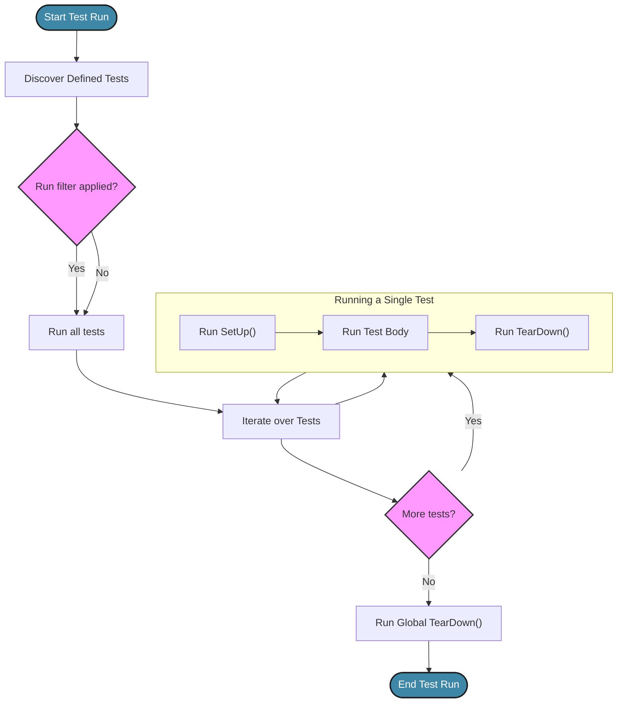

# Test Lifecycle & Execution

Understanding the lifecycle and execution flow of tests is essential for writing maintainable and scalable test suites with GoogleTest. This section guides users through defining test cases, managing setup and teardown processes, and running tests effectively, ensuring your testing workflow is robust and predictable.

---

## 1. Test Lifecycle Overview

Every test in GoogleTest follows a well-defined lifecycle that organizes how resources are allocated, initialized, executed, and cleaned up. By mastering this lifecycle, you can create tests that are reliable, isolated, and easy to maintain.

### Key Stages

- **Test Case Definition**: Declare test suites (test cases) and individual tests.
- **Test Setup**: Prepare common resources needed for tests.
- **Test Execution**: Run tests with assertions and validations.
- **Test Teardown**: Clean up resources to prevent side effects.
- **Environment Configuration**: Control global setup and teardown.

### How GoogleTest Manages Execution

GoogleTest runs tests discovered in the code in the order they are defined by default, but provides mechanisms to selectively run tests and control execution flow with command-line flags.


## 2. Defining Tests

GoogleTest organizes tests into two hierarchical levels:

- **Test Case (Test Suite)**: A grouping of related tests.
- **Test**: An individual assessment with its own assertions.

You define a test using the `TEST` macro:

```cpp
TEST(TestCaseName, TestName) {
  // Test code goes here
  EXPECT_EQ(1, 1);
}
```

This macro creates a subclass of `::testing::Test` and defines the test body.

### Using Test Fixtures for Shared Setup

If multiple tests require common setup and teardown, define a fixture class deriving from `::testing::Test`:

```cpp
class MyTestFixture : public ::testing::Test {
 protected:
  void SetUp() override {
    // Common initialization
  }
  void TearDown() override {
    // Common cleanup
  }
  // Shared resources
  int shared_value;
};

TEST_F(MyTestFixture, Test1) {
  EXPECT_EQ(shared_value, 0);
}
```

Use `TEST_F` to associate tests with the fixture.


## 3. Setup and Teardown

Test fixtures offer two core virtual methods:

| Method    | Purpose                                               |
| --------- | ----------------------------------------------------- |
| `SetUp()` | Runs before each test to initialize test state       |
| `TearDown()` | Runs after each test to dispose of resources         |

This setup ensures all state mutations are local to each test, preserving test isolation and preventing flaky results.

**Tip:** Use RAII and smart pointers in fixtures to manage resources automatically.


## 4. Global Environment Management

GoogleTest allows global setup and teardown routines for operations needed once per test run, such as database initialization or configuring global logging.

Implement a class deriving from `::testing::Environment`:

```cpp
class MyEnvironment : public ::testing::Environment {
 public:
  void SetUp() override {
    // Global initialization
  }
  void TearDown() override {
    // Global cleanup
  }
};

// Add environment before running tests
::testing::AddGlobalTestEnvironment(new MyEnvironment);
```

These methods run exactly once, before and after all tests respectively.


## 5. Test Execution and Discovery

When you build and run your test executable, GoogleTest automatically discovers and runs all tests defined using `TEST` and `TEST_F` macros.

### Controlling Test Execution

Use command-line flags to manage which tests to run:

- Run *all* tests:

  ```bash
  ./my_tests
  ```

- Run tests that match a filter:

  ```bash
  ./my_tests --gtest_filter=TestCaseName.*
  ```

- Run a single test:

  ```bash
  ./my_tests --gtest_filter=TestCaseName.TestName
  ```

- Disable tests by prepending `DISABLED_` to the test name.

### Output Formats

GoogleTest supports outputting test results in various formats (e.g., XML) for integration with CI systems:

```bash
./my_tests --gtest_output=xml:report.xml
```


## 6. Writing Maintainable Tests

- **Isolate tests**: Use setup and teardown to ensure tests don't interfere.
- **Name tests meaningfully**: Reflect what the test asserts.
- **Avoid reliance on execution order**: Tests should pass regardless of run order.
- **Use fixtures for shared state** but keep tests independent.
- **Use assertions clearly**: Prefer rich assertions for better diagnostics.


## 7. Common Testing Patterns

- **Parameterized Tests**: Run the same test logic on multiple inputs.
- **Death Tests**: Verify program crashes or termination in certain conditions.
- **Typed Tests**: Test the same logic on different types.

More on these is covered in specialized guides.


## 8. Debugging Test Failures

GoogleTest provides detailed error messages, including the source file location and line number. Enable verbose logging or use debugger integration in your IDE to trace errors quickly.

<Info>
Remember: Writing tests that always satisfy teardown invariants helps avoid side effects in subsequent tests.
</Info>


## 9. Example Workflow

```cpp
class DatabaseTest : public ::testing::Test {
 protected:
  void SetUp() override {
    db_.Connect();
    db_.Clear();
  }
  void TearDown() override {
    db_.Disconnect();
  }

  DatabaseClient db_;
};

TEST_F(DatabaseTest, Insertion) {
  EXPECT_TRUE(db_.InsertRecord("record1"));
  EXPECT_EQ(db_.RecordCount(), 1);
}

TEST_F(DatabaseTest, EmptyOnInit) {
  EXPECT_EQ(db_.RecordCount(), 0);
}
```

Here, each test runs with a clean database, ensuring isolation and clarity.


## 10. Mermaid Diagram: Testing Lifecycle Flow




---

## Troubleshooting

### Tests Not Running
- Verify tests are linked and compiled correctly.
- Ensure that `TEST` or `TEST_F` macros are used properly.

### Setup or Teardown Not Called
- Confirm that `SetUp()` and `TearDown()` are declared `override`.
- Validate test fixture inheritance from `::testing::Test`.

### Tests Failing Unpredictably
- Check for shared mutable state outside fixture setup.
- Use RAII and smart pointers to avoid resource leaks.

### Selective Execution Issues
- Confirm the use of correct `--gtest_filter` syntax.
- Use `DISABLED_` prefix carefully to exclude tests.


---

## Additional Resources

- [GoogleTest Primer](primer.md) for foundational testing principles.
- [Rich Assertions Guide](guides/core-workflows/rich-assertions.mdx) for writing expressive assertions.
- [GoogleMock Basics](getting_started/first_test_and_validation/using_googlemock_basics.mdx) to extend tests with mocks.


---

# Related Pages

- [Test Execution Lifecycle](concepts/core-architecture/test-lifecycle.md)
- [Writing and Running Your First Test](getting_started/first_test_and_validation/writing_first_test.md)
- [Common Installation Issues](getting_started/troubleshooting/common_install_issues.md)
- [Getting Started with GoogleMock](getting_started/first_test_and_validation/using_googlemock_basics.md)


---

<CardGroup cols={2}>
<Card title="GoogleTest User's Guide">
Includes comprehensive tutorials and references to start and master writing tests.
</Card>
<Card title="GoogleMock Framework">
Learn how mocking enhances test scope and manage dependencies.
</Card>
</CardGroup>