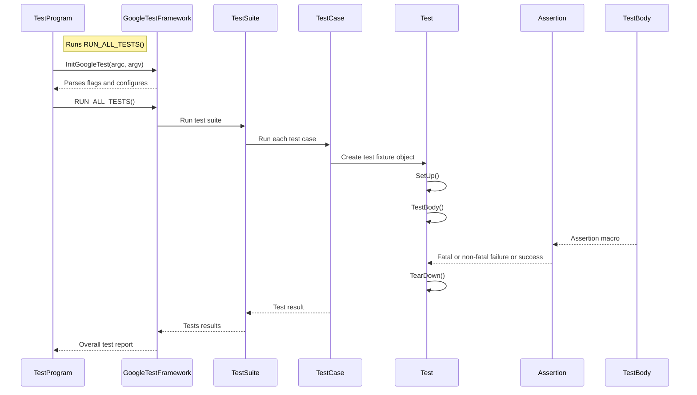

# Test Macros & Assertions Reference

This page serves as a comprehensive reference for the primary macros and interfaces used in GoogleTest to define tests and make assertions. It focuses on macros for test case definitions, a wide range of assertions including value comparisons, exception checks, fatal versus non-fatal failures, and user-defined custom assertions. Included are illustrative code examples and pointers to key API entry points for deeper exploration.

---

## 1. Defining Tests: The Core Macros

GoogleTest organizes tests primarily with the following macros. Each macro helps you declare tests and associate them with the necessary fixtures or parameters.

### TEST

- **Purpose**: Defines a simple, standalone test case.
- **Syntax**:
  ```cpp
  TEST(TestSuiteName, TestName) {
    // Test code
  }
  ```
- **Notes**:
  - `TestSuiteName` groups logically related tests.
  - `TestName` identifies a particular test within the suite.
  - Both must be valid C++ identifiers with no underscores.
  - Each test case runs independently.

### TEST_F

- **Purpose**: Defines a test that uses a test fixture.
- **Syntax**:
  ```cpp
  TEST_F(TestFixtureName, TestName) {
    // Test code
  }
  ```
- **Notes**:
  - Requires a test fixture class derived from `testing::Test`.
  - Provides shared setup/teardown and member access.
  - Enables reuse of common objects to reduce duplication.

### TEST_P & INSTANTIATE_TEST_SUITE_P

- **Purpose**: Support writing value-parameterized tests.
- **Syntax**:
  ```cpp
  TEST_P(TestFixtureName, TestName) {
    // Test body where GetParam() accesses test parameter
  }

  INSTANTIATE_TEST_SUITE_P(InstantiationName, TestFixtureName, param_generator);
  ```
- **Notes**:
  - `TEST_P` defines the parameterized test logic.
  - `INSTANTIATE_TEST_SUITE_P` defines concrete parameter values.
  - Enables running the same test logic over multiple data sets.

### TYPED_TEST_SUITE & TYPED_TEST

- **Purpose**: Easily run the same test logic over multiple types.
- **Syntax**:
  ```cpp
  template <typename T>
  class MyFixture : public testing::Test { ... };

  using MyTypes = ::testing::Types<int, double>;
  TYPED_TEST_SUITE(MyFixture, MyTypes);

  TYPED_TEST(MyFixture, DoesStuff) {
    TypeParam value = this->value_;
    // test code
  }
  ```
- **Notes**:
  - Useful for verifying concept conformance or multiple implementations.

### FRIEND_TEST

- **Purpose**: Allows a test to access private class members.
- **Syntax**:
  ```cpp
  class Foo {
    FRIEND_TEST(FooTest, TestName);
    ...
  };
  ```

---

## 2. Assertion Macros Overview

Assertions verify conditions inside tests. The two main categories are:

- **EXPECT_*** assertions generate non-fatal failures, allowing tests to continue.
- **ASSERT_*** assertions generate fatal failures that abort the current function.

Supporting streaming of custom failure messages using the `<<` operator, assertions improve readability and help diagnose failures effectively.

### 2.1 Explicit Success & Failure

- `SUCCEED()` — Records a successful assertion.
- `FAIL()` — Immediately generates a fatal failure and aborts the current function.
- `ADD_FAILURE()` — Adds a nonfatal failure but continues.

Example Usage:

```cpp
if (unreachable_code) {
  FAIL() << "Unexpected branch reached";
}
```

### 2.2 Boolean Conditions

- `EXPECT_TRUE(condition)` / `ASSERT_TRUE(condition)` — Verifies `condition` is true.
- `EXPECT_FALSE(condition)` / `ASSERT_FALSE(condition)` — Verifies `condition` is false.

### 2.3 Binary Comparisons

These macros compare two values and provide detailed messages on failure.

| Macro        | Meaning                          |
|--------------|---------------------------------|
| `EXPECT_EQ`/`ASSERT_EQ` | Asserts equality (`==`)          |
| `EXPECT_NE`/`ASSERT_NE` | Asserts inequality (`!=`)         |
| `EXPECT_LT`/`ASSERT_LT` | Asserts less than (`<`)            |
| `EXPECT_LE`/`ASSERT_LE` | Asserts less or equal (`<=`)      |
| `EXPECT_GT`/`ASSERT_GT` | Asserts greater than (`>`)         |
| `EXPECT_GE`/`ASSERT_GE` | Asserts greater or equal (`>=`)    |

Pointers are compared by address; to compare C strings by content, use string comparison assertions (below).

### 2.4 String Comparison

These macros compare C strings (narrow or wide).

- `EXPECT_STREQ` / `ASSERT_STREQ` — Verifies strings have identical content.
- `EXPECT_STRNE` / `ASSERT_STRNE` — Verifies strings differ.
- `EXPECT_STRCASEEQ` / `ASSERT_STRCASEEQ` — Same content ignoring case.
- `EXPECT_STRCASENE` / `ASSERT_STRCASENE` — Different content ignoring case.

Example:

```cpp
EXPECT_STREQ("hello", my_c_string);
``` 

### 2.5 Floating-Point Comparison

To mitigate rounding error issues, use:

- `EXPECT_FLOAT_EQ` / `ASSERT_FLOAT_EQ` for `float` (approximate equality, 4 ULPs).
- `EXPECT_DOUBLE_EQ` / `ASSERT_DOUBLE_EQ` for `double`.
- `EXPECT_NEAR` / `ASSERT_NEAR` for custom absolute tolerance.

Example:

```cpp
EXPECT_NEAR(computed_value, expected_value, 0.01);
```

### 2.6 Exception Assertions

Enabled if C++ exceptions are supported.

- `EXPECT_THROW(statement, exception_type)` / `ASSERT_THROW` — Verifies `statement` throws specified exception.
- `EXPECT_ANY_THROW(statement)` / `ASSERT_ANY_THROW` — Verifies any exception thrown.
- `EXPECT_NO_THROW(statement)` / `ASSERT_NO_THROW` — Verifies no exceptions thrown.

Example:

```cpp
EXPECT_THROW(FunctionThatThrows(), std::runtime_error);
```

### 2.7 Predicate Assertions

These macros enable writing expressive custom predicates for improved failure diagnostics.

- `EXPECT_PREDn` / `ASSERT_PREDn` — Use predicates returning `bool` with n arguments.
- `EXPECT_PRED_FORMATn` / `ASSERT_PRED_FORMATn` — Use predicates returning `AssertionResult` to customize failure messages.

Example:

```cpp
bool IsEven(int n) { return n % 2 == 0; }
EXPECT_PRED1(IsEven, val);
```

For richer failure reporting, define:

```cpp
testing::AssertionResult IsEven(int n) {
  if (n % 2 == 0) return testing::AssertionSuccess();
  return testing::AssertionFailure() << n << " is odd";
}
EXPECT_PRED_FORMAT1(IsEven, val);
```

### 2.8 Windows HRESULT Assertions (Windows only)

- `EXPECT_HRESULT_SUCCEEDED(expr)` / `ASSERT_HRESULT_SUCCEEDED(expr)` — Verifies `expr` represents a successful HRESULT.
- `EXPECT_HRESULT_FAILED(expr)` / `ASSERT_HRESULT_FAILED(expr)` — Verifies `expr` is a failure HRESULT.

---

## 3. Advanced Assertion Usage & Patterns

### 3.1 Using Custom Messages

You can stream a failure message to any assertion macro for context:

```cpp
EXPECT_TRUE(condition) << "Condition failed due to X";
```

### 3.2 Skipping Tests at Runtime

Use `GTEST_SKIP()` inside tests or setup to skip test execution with a message:

```cpp
TEST(MyTest, SkipExample) {
  GTEST_SKIP() << "Not applicable under this condition";
}
```

### 3.3 Ensuring Single Evaluation of Arguments

All assertion macros evaluate arguments exactly once, preventing side effects from happening multiple times during test evaluation.

### 3.4 Adding Trace Information

Use the `SCOPED_TRACE` macro to annotate failures with additional context, making failures easier to diagnose in complex code or recursive loops.

```cpp
SCOPED_TRACE("Iteration " << i);
EXPECT_EQ(foo(i), expected[i]);
```

### 3.5 Checking Assertion Failures within Tests

GoogleTest provides macros such as:

- `EXPECT_FATAL_FAILURE(statement, substring)`
- `EXPECT_NONFATAL_FAILURE(statement, substring)`

These allow testing that certain statements generate the expected kind of failures.

### 3.6 Working With Uncopyable or Complex Types

Assertions operate correctly with uncopyable types as long as the relevant operators (`==`, `!=`, etc.) are implemented.

### 3.7 Using Assertions Outside TEST/TEST_F

You can place assertions in any void-returning functions. Fatal assertions abort the function early. For non-void functions, use non-fatal assertions or refactor to void-returning helpers.


---

## 4. Logging Extra Information Using Test Properties

Tests can log arbitrary key/value properties during their execution using:

```cpp
::testing::Test::RecordProperty("key", "value");

// or

::testing::Test::RecordProperty("key", int_value);
```

Properties are stored and output in XML reports under the relevant test case or suite. Keys must not be reserved attribute names such as `name`, `status`, `time`, etc.

---

## 5. Example Usage

### Simple Test with Assertions

```cpp
TEST(FactorialTest, HandlesPositive) {
  EXPECT_EQ(Factorial(1), 1);
  EXPECT_EQ(Factorial(3), 6) << "Factorial computed incorrectly";
}
```

### Test Fixture with Shared Setup

```cpp
class MyTestFixture : public testing::Test {
 protected:
  void SetUp() override {
    shared_data_ = ComputeSharedData();
  }

  void TearDown() override {
    Cleanup(shared_data_);
  }

  SharedDataType* shared_data_;
};

TEST_F(MyTestFixture, Test1) {
  ASSERT_NE(shared_data_, nullptr);
  EXPECT_TRUE(shared_data_->IsValid());
}
```

### Using Predicate Assertion for Better Diagnostics

```cpp
// Predicate returning AssertionResult.
testing::AssertionResult IsEven(int n) {
  if (n % 2 == 0) return testing::AssertionSuccess();
  return testing::AssertionFailure() << n << " is not even";
}

TEST(PredicateTest, CheckEvenness) {
  EXPECT_PRED_FORMAT1(IsEven, 3);  // This will print "3 is not even" on failure.
}
```

### Using Death Test with Assertions

```cpp
TEST(FooDeathTest, DiesOnInvalidInput) {
  EXPECT_DEATH({ Foo(-1); }, "Invalid argument");
}
```

---

## 6. Related Links & Further Reading

- [Getting Started Guides](https://github.com/google/googletest/blob/main/docs/primer.md): Learn how to write your first tests.
- [Advanced Testing Patterns](https://github.com/google/googletest/blob/main/docs/advanced.md): Custom matchers, death tests, and test parameterization.
- [Assertions Reference](https://github.com/google/googletest/blob/main/docs/reference/assertions.md): In-depth explanations of assertion macros.
- [Testing Reference](https://github.com/google/googletest/blob/main/docs/reference/testing.md): Details on test macros, classes, and API.

---

This reference provides the core foundational knowledge for writing effective tests using GoogleTest macros and assertions. Through clear examples, it empowers developers to verify correct behavior comprehensively, handle failures elegantly, and log meaningful diagnostic information.

---

<AccordionGroup title="Assertion Syntax and Best Practices">
<Accordion title="Choosing Between EXPECT and ASSERT">
Use `EXPECT_*` macros when test execution can sensibly continue after failure; use `ASSERT_*` when subsequent steps depend on success, to avoid crashes or undefined behavior.
</Accordion>
<Accordion title="Custom Failure Messages">
Leverage streaming with `<<` to supply meaningful failure descriptions to aid debugging.
</Accordion>
<Accordion title="Avoid Multiple Fatal Failures in One Statement">
Place only one fatal assertion per statement as some macros rely on aborting after failure.
</Accordion>
</AccordionGroup>

<AccordionGroup title="Troubleshooting Common Issues">
<Accordion title="Assertions Not Aborting as Expected">
Remember that `ASSERT_*` macros abort the **current function**, not the entire test. Use `HasFatalFailure()` or rewrite control flow accordingly.
</Accordion>
<Accordion title="Failure Messages Too Vague">
Use predicate-formatter assertions or write custom predicates returning `AssertionResult` for improved failure explanations.
</Accordion>
<Accordion title="Tests Not Running">
Check naming conventions: disabled tests start with `DISABLED_`. Use appropriate flags like `--gtest_also_run_disabled_tests` to include them.
</Accordion>
</AccordionGroup>

<AccordionGroup title="Common Assertion Error Examples">
<Accordion title="Pointer and NULL comparison">
Use `nullptr` in assertions for clarity, e.g., `EXPECT_EQ(ptr, nullptr);` rather than `EXPECT_EQ(ptr, NULL);`.
</Accordion>
<Accordion title="String comparison pitfalls">
Use `EXPECT_STREQ` / `EXPECT_STRNE` for C strings instead of `EXPECT_EQ` / `EXPECT_NE`.
</Accordion>
<Accordion title="Floating-point comparisons">
Avoid `EXPECT_EQ` for floats/doubles; use `EXPECT_FLOAT_EQ`, `EXPECT_DOUBLE_EQ`, or `EXPECT_NEAR` with proper thresholds.
</Accordion>
</AccordionGroup>

---

## 7. Diagram: GoogleTest Test & Assertion Flow



---