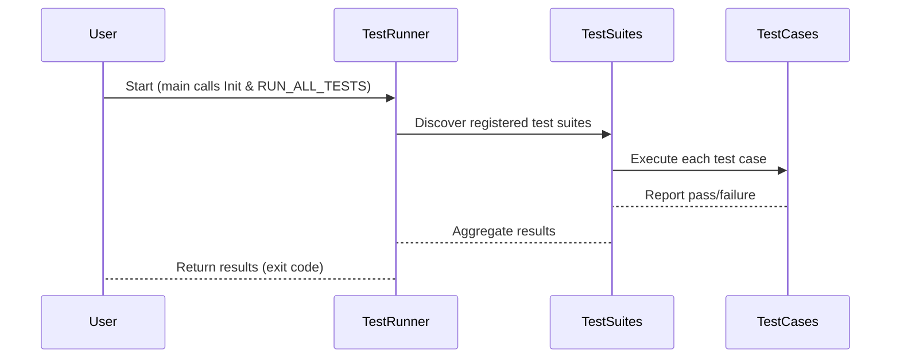

# Test Runner Configuration and Execution

GoogleTest provides a versatile and powerful set of APIs and configuration options to initialize, configure, and execute tests according to your development and CI workflows. This documentation covers the core test runner APIs, command-line flags, environment integration, and advanced patterns such as parallel execution and selective test filtering.

---

## 1. Initialization and Entry Point

### 1.1 InitGoogleTest

Before running any tests, you must initialize the framework by calling:

```cpp
int argc = ...;
char** argv = ...;
testing::InitGoogleTest(&argc, argv);
```

- This parsing removes recognized GoogleTest flags from `argv`, ensuring your test binary can process other flags separately.
- It must be called before `RUN_ALL_TESTS()`.
- On Windows, `InitGoogleTest` overloads support wide string arguments.

### 1.2 RUN_ALL_TESTS

Once the framework is initialized, `RUN_ALL_TESTS()` runs all registered tests.

```cpp
int result = RUN_ALL_TESTS();
return result;
```

- Returns `0` if all tests pass, or an error code if any test fails or crashes.
- It internally handles the lifecycle of each test fixture, including setup and teardown.
- Calling `RUN_ALL_TESTS()` multiple times in the same process is not supported and leads to undefined behavior.

<Tip>
Always ensure your `main()` function returns the result of `RUN_ALL_TESTS()` to propagate the correct exit code to automated test systems.
</Tip>

### Example Main Function

```cpp
#include <gtest/gtest.h>

int main(int argc, char** argv) {
  testing::InitGoogleTest(&argc, argv);
  return RUN_ALL_TESTS();
}
```

This minimal boilerplate suits most test programs.

---

## 2. Command-Line Flags and Configuration

GoogleTest supports numerous flags to customize test execution behavior. Most are passed on the command line or embedded via environment variables.

### Common Flags

| Flag                          | Description                                                 |
|-------------------------------|-------------------------------------------------------------|
| `--gtest_filter`              | Specify tests to run by pattern (e.g., `SuiteName.*`).       |
| `--gtest_repeat=N`            | Repeats the test run N times; useful for catching flakes.    |
| `--gtest_break_on_failure`   | Break into the debugger on failure (if supported).           |
| `--gtest_shuffle`            | Shuffle test execution order to detect inter-dependencies.   |
| `--gtest_list_tests`         | List all tests without running them.                         |
| `--gtest_output`             | Output results in XML or JSON formats for CI integration.     |
| `--gtest_color`              | Controls colored output: `yes`, `no`, or `auto`.             |

### GoogleMock Specific Flags

| Flag                                 | Description                                         |
|-------------------------------------|-----------------------------------------------------|
| `--gmock_catch_leaked_mocks` = 0/1  | Detect and report leaked mock objects.              |
| `--gmock_verbose`=info/warning/error | Controls verbosity level for mock call messages.    |
| `--gmock_default_mock_behavior`      | Sets default strictness: 0=Naggy, 1=Nice, 2=Strict. |

### Example

To run only test suites matching `MySuite.*` with colored output:

```bash
test_binary --gtest_filter=MySuite.* --gtest_color=yes
```

---

## 3. Selective Test Execution and Filtering

### Filtering Tests

GoogleTest lets you select which tests to execute using the `--gtest_filter` flag:

```bash
--gtest_filter=<positive_patterns>[-<negative_patterns>]
```

- Patterns are colon-separated\* wildcard matches for test suite and test names.
- Example: `--gtest_filter=FactorialTest.*-*.HandlesZeroInput` runs all tests in `FactorialTest` except those named `HandlesZeroInput`.

### Programmatic Filtering

To filter tests programmatically within `main()` or elsewhere, use:

```cpp
::testing::GTEST_FLAG(filter) = "MySuite.MyTest";
```

before `RUN_ALL_TESTS()`.

---

## 4. Parallel and Repeated Test Execution

### Repeating Tests

The `--gtest_repeat` flag runs all tests multiple times to identify flakes or race conditions.

```bash
test_binary --gtest_repeat=10
```

### Shuffling Tests

`--gtest_shuffle` randomizes the order of test execution. Useful to detect dependencies between tests.

```bash
test_binary --gtest_shuffle
```

Tests can be seeded for reproducibility using `--gtest_random_seed=<value>`.

---

## 5. Test Execution Environment Integration

### Initialization Without argc/argv

On embedded or specialized platforms without access to command line arguments, GoogleTest provides:

```cpp
testing::InitGoogleTest();
```

### Platform-Specific Support

- Windows users can pass `wchar_t*` arguments to `InitGoogleTest`.
- Arduino and ESP microcontrollers can define `setup()` and `loop()` functions initializing and running tests.

### Output Formats

GoogleTest supports generating XML or JSON test reports via `--gtest_output=xml:<path>` or `--gtest_output=json:<path>`, essential for CI pipeline integration.

---

## 6. Advanced Patterns and APIs

### Running Specific Tests Programmatically

To run individual tests without the full `RUN_ALL_TESTS()` macro, use the `UnitTest` API:

```cpp
int main(int argc, char** argv) {
  testing::InitGoogleTest(&argc, argv);

  testing::UnitTest& unit_test = *testing::UnitTest::GetInstance();

  for (int i = 0; i < unit_test.test_suite_to_run_count(); i++) {
    // Access test suites and tests
  }

  // Additional custom execution logic
  return RUN_ALL_TESTS();
}
```

This is primarily for advanced scenarios such as dynamic test selection or customized test runners.

### Test Event Listeners

GoogleTest lets you customize test reporting by registering event listeners:

```cpp
class MyListener : public testing::EmptyTestEventListener {
  void OnTestStart(const testing::TestInfo& test_info) override {
    // Custom action
  }
};

int main(int argc, char** argv) {
  testing::InitGoogleTest(&argc, argv);

  testing::TestEventListeners& listeners =
      testing::UnitTest::GetInstance()->listeners();
  listeners.Append(new MyListener());

  return RUN_ALL_TESTS();
}
```

---

## 7. Troubleshooting Common Test Runner Issues

<Tip>
If tests fail to run or do not respect filters:
- Ensure `InitGoogleTest()` is called exactly once, before `RUN_ALL_TESTS()`.
- Verify command line flags for spelling and format.
- Check that test registration macros (`TEST`, `TEST_F`) execute before running.
</Tip>

<Tip>
To debug flaky tests, combine `--gtest_repeat` and `--gtest_shuffle`.
</Tip>

<Tip>
If using custom main, avoid calling GoogleTest initialization functions multiple times.
</Tip>

---

## 8. Integration with GoogleMock

Since GoogleMock depends on GoogleTest's runner,
`testing::InitGoogleMock(int* argc, char** argv)` combines initialization for both frameworks:

```cpp
int main(int argc, char** argv) {
  testing::InitGoogleMock(&argc, argv);
  return RUN_ALL_TESTS();
}
```

This ensures GoogleMock mocks are properly initialized and integrated into the test lifecycle.

---

## 9. Visualizing Test Execution Flow



This diagram represents the core flow from initialization to test execution and result reporting.

---

## References & Related Documentation

- [GoogleTest Primer](../docs/primer.md) - Basic usage and test writing walkthrough.
- [Core Testing API Reference](../api-reference/core-testing-api/test-runner-configuration.md) - Detailed runner APIs.
- [Mocking API Overview](../docs/reference/mocking.md) - Integration details with GoogleMock.
- [Build System Integration Guide](../guides/integration-and-best-practices/build-system-integration.md) - Setting up GoogleTest for Bazel and CMake.
- [Troubleshooting Setup Issues](../getting-started/troubleshooting-faq/common-setup-issues.md) - Handling common runner problems.

---

Harness these capabilities to run your tests precisely as needed, control execution sequencing and output formats, and build reliable continuous integration pipelines.