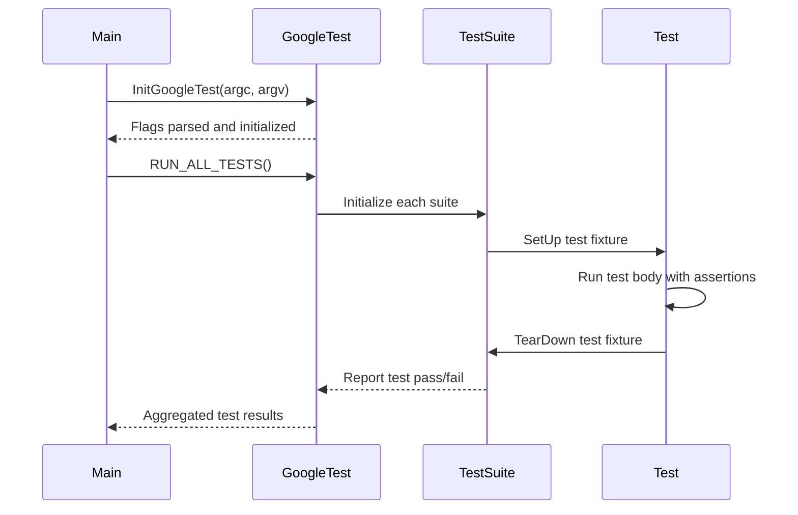

# Test Runner & Execution Control

Manage the flow and lifecycle of your tests with GoogleTest's test runner APIs. This includes customizing test environment setup, hooking into test runner events, controlling execution flags, and accessing detailed test results. These APIs empower you to finely integrate testing behavior with your build, CI pipelines, and advanced testing workflows.

---

## Overview

The test runner in GoogleTest orchestrates the execution of individual tests, manages their lifecycle, and reports outcomes. The APIs in this section allow you to:

- Initialize and configure the test environment globally.
- Register custom environment setups and teardown logic.
- Hook into test runner events to extend or customize behavior.
- Control execution flags and modes programmatically.
- Access and inspect detailed test results for reporting and analysis.

These controls are essential for tailoring the test execution to your project's specific needs, implementing complex test workflows, integrating with CI tools, and handling test failures gracefully.

---

## Key Concepts & User Intent

When using the test runner APIs, your primary goals typically include:

- Running all or subsets of tests with custom configurations.
- Setting up global or per-suite environments that prepare needed resources.
- Monitoring and responding to test lifecycle events (start, success, failure, end).
- Adjusting execution behavior via flags without requiring command-line args.
- Extracting test outcome data programmatically for advanced usage.

This API surface is designed not just to run tests but to give you insight and control over their execution, enabling integration and automation scenarios beyond simple test runs.

---

## Initializing and Running Tests

### `testing::InitGoogleTest(&argc, argv)`

Before running tests, you *must* call `InitGoogleTest` to parse GoogleTest-specific flags and initialize internal state. This function:

- Processes command-line arguments and removes recognized flags.
- Prepares the framework to execute tests.

**Typical usage:**

```cpp
int main(int argc, char** argv) {
  testing::InitGoogleTest(&argc, argv);
  return RUN_ALL_TESTS();
}
```

**Important:** Always call `InitGoogleTest` before `RUN_ALL_TESTS()`. Without this call, test flags will not be parsed, and execution behavior cannot be controlled.

---

### `RUN_ALL_TESTS()`

This function runs all registered tests in the binary and returns an integer status:

- Returns `0` if all tests succeed.
- Returns non-zero if any test fails.

**Execution Flow:**

1. Initializes test fixtures.
2. Executes each test in isolation, calling their setup and teardown.
3. Aggregates and reports test results.

**Note:** Call `RUN_ALL_TESTS()` only once per program to avoid conflicts with advanced features.

---

## Custom Test Environments

GoogleTest supports defining custom global test environments that allow you to perform setup and teardown once per entire test run.

### How to Create a Custom Environment

1. Derive a class from `testing::Environment`.

2. Override the following methods:

   - `SetUp()`: Code to run before any tests are executed.
   - `TearDown()`: Code to run after all tests have finished.

3. Register the environment instance via `AddGlobalTestEnvironment()`.

```cpp
class MyEnvironment : public testing::Environment {
 public:
  void SetUp() override {
    // Global setup logic here
  }

  void TearDown() override {
    // Global cleanup logic here
  }
};

int main(int argc, char** argv) {
  testing::InitGoogleTest(&argc, argv);
  testing::AddGlobalTestEnvironment(new MyEnvironment);
  return RUN_ALL_TESTS();
}
```

This mechanism is ideal for expensive shared setup, e.g., starting a database server or configuring external services.

---

## Controlling Test Execution Flags Programmatically

Beyond command-line flags, you can programmatically control test runner behaviors using GoogleMock's flag APIs (which also affect GoogleTest).

These flags include:

- `GMOCK_FLAG_SET(name, value)` — sets a GoogleMock or GoogleTest flag by name.
- Common flags include:
  - `verbose`: Controls the verbosity of output (e.g., "info", "warning", "error").
  - `catch_leaked_mocks`: Whether to catch leaked mock objects.
  - `default_mock_behavior`: Determines how mocks handle unexpected calls.

**Example:**

```cpp
GMOCK_FLAG_SET(verbose, "info");
GMOCK_FLAG_SET(catch_leaked_mocks, true);
```

Setting flags programmatically enables more flexible control within tests or integration scripts without relying on external input.

---

## Hooking Into Test Runner Events

To respond to test execution lifecycle events, GoogleTest allows you to define **listeners** that observe and react to test events.

### Creating a Custom Event Listener

1. Subclass `testing::TestEventListener` or extend an existing listener.
2. Override relevant callback methods such as:

   - `OnTestProgramStart()`
   - `OnTestStart()`
   - `OnTestPartResult()`
   - `OnTestEnd()`
   - `OnTestProgramEnd()`

3. Register your listener with the event listener list.

```cpp
class MyListener : public testing::TestEventListener {
  void OnTestStart(const testing::TestInfo& test_info) override {
    // Called before each test
  }
  // Override other methods as needed
};

int main(int argc, char** argv) {
  testing::InitGoogleTest(&argc, argv);

  testing::TestEventListeners& listeners =
    testing::UnitTest::GetInstance()->listeners();

  // Optionally remove the default listener
  delete listeners.Release(listeners.default_result_printer());

  // Add custom listener
  listeners.Append(new MyListener);

  return RUN_ALL_TESTS();
}
```

Using listeners, you can integrate with custom reporting tools, log test progress, or implement conditional test failure handling.

---

## Accessing and Querying Test Results

After execution, you can introspect detailed test results for customized reporting or decision-making.

### Key APIs

- `testing::UnitTest::GetInstance()` returns the singleton test controller.
- You can query:
  - Number of test suites
  - Test suite names and their status
  - Individual test results (passed, failed, disabled, flaky, etc.)
  - Failure messages and source locations

### Example: Iterate Through Tests

```cpp
const testing::UnitTest* unit_test = testing::UnitTest::GetInstance();
for (int i = 0; i < unit_test->total_test_suite_count(); ++i) {
  const testing::TestSuite* test_suite = unit_test->GetTestSuite(i);
  for (int j = 0; j < test_suite->total_test_count(); ++j) {
    const testing::TestInfo* test_info = test_suite->GetTestInfo(j);
    std::cout << "Test " << test_info->name()
              << (test_info->result()->Passed() ? " passed" : " failed") << std::endl;
  }
}
```

This access empowers CI pipelines and custom tools to generate reports based on exact test outcomes.

---

## Best Practices & Tips

- Always call `InitGoogleTest()` before running tests.
- Use `AddGlobalTestEnvironment()` for shared expensive setup/teardown.
- Prefer custom event listeners over parsing stdout for production integrations.
- Set execution flags programmatically if you require dynamic test configurations.
- Use provided introspection APIs to build reporting tools rather than relying on external parsers.
- Avoid calling `RUN_ALL_TESTS()` multiple times; it is designed for a single execution flow.

---

## Troubleshooting Common Issues

### Tests Not Running or Flags Not Respected
- Ensure `InitGoogleTest()` is called before `RUN_ALL_TESTS()`.
- Verify that flags are passed correctly or set programmatically before test run.

### Global Environment Setup Not Working
- Confirm your `Environment` subclass overrides both `SetUp()` and `TearDown()` properly.
- Make sure your environment is added with `AddGlobalTestEnvironment()` before running tests.

### Custom Listeners Are Not Called
- Remove the default listener if you want to replace it, or append your listener otherwise.
- Add listeners after `InitGoogleTest()` but before `RUN_ALL_TESTS()`.

---

## References & Further Reading

- [Test and Fixture Definition](https://google.github.io/googletest/reference/api-reference/core-testing-api/test-definition.html): For detailed test creation.
- [Assertions and Expectations](https://google.github.io/googletest/reference/api-reference/core-testing-api/assertions.html): Verify test correctness.
- [Mocking Reference](https://google.github.io/googletest/reference/api-reference/mocking-api/mocking-classes-methods.html): For working with mocks alongside test running.
- [Quickstart Workflow](https://google.github.io/googletest/overview/features-workflows/quickstart-workflow.html): To get started with writing and running tests.

You may also explore the [Integration & Extensibility](https://google.github.io/googletest/overview/architecture-concepts/integration-overview.html) documentation to leverage test runner APIs fully within your build and CI pipelines.

---

## Diagram: Test Runner Execution Flow



This sequence illustrates the overall interaction during a test run, from initialization through fixture setup, test execution, teardown, and reporting.
