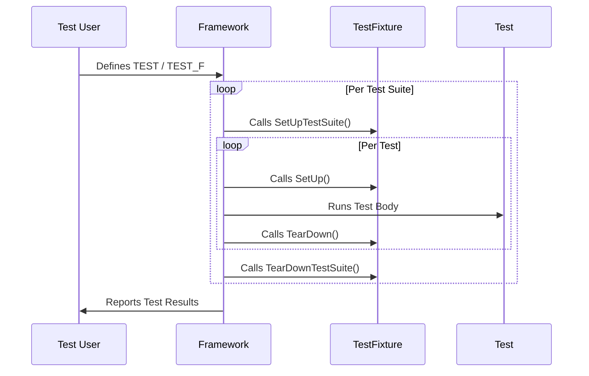

# Test Structure and Execution

This reference page guides you through creating and organizing tests using GoogleTest, focusing on the macros for test case and suite definitions, lifecycle methods, test fixtures, and main entry point patterns. It serves as your go-to manual for structuring robust test suites and managing test execution sequences effectively.

---

## Overview

GoogleTest leverages an xUnit-style architecture designed to help you define, organize, and run your tests with clarity and flexibility. This page covers:

- The primary macros for defining test cases and test suites
- Lifecycle hooks to set up and tear down test environments
- Usage of test fixtures for shared context
- Best practices for structuring and executing tests
- Patterns for main entry points and platform-specific setup

Understanding these components will empower you to write maintainable tests and execute them efficiently across different platforms and configurations.

## Test Case and Test Suite Macros

GoogleTest provides handy macros that are the first step in defining tests:

### TEST Macro

Use the `TEST(TestSuiteName, TestName)` macro to define a test function:

```cpp
TEST(MathTests, AdditionWorks) {
  EXPECT_EQ(2 + 2, 4);
}
```

- **Purpose**: Defines a single test function.
- **Scope**: Each `TEST` defines an independent test without shared setup.
- **Use case**: Simple, isolated checks without common context.

### TEST_F Macro

Use `TEST_F(TestFixtureName, TestName)` to write a test that uses a test fixture:

```cpp
class CalculatorTest : public ::testing::Test {
 protected:
  void SetUp() override {
    calc.Reset();
  }

  Calculator calc;
};

TEST_F(CalculatorTest, MultiplicationWorks) {
  EXPECT_EQ(calc.Multiply(3, 5), 15);
}
```

- **Purpose**: Use fixtures for sharing setup and teardown code among related tests.
- **Scope**: All tests in the suite share the fixture's context and state.
- **Use case**: When multiple tests require common setup and cleanup.

### TEST_P and INSTANTIATE_TEST_SUITE_P (Parameterized Tests)

For advanced scenarios, GoogleTest supports parameterized tests where the same test logic is run repeatedly with different data.

```cpp
class PrimeTest : public ::testing::TestWithParam<int> {};

TEST_P(PrimeTest, IsPrime) {
  int n = GetParam();
  EXPECT_TRUE(IsPrime(n));
}

INSTANTIATE_TEST_SUITE_P(PrimeTests, PrimeTest, ::testing::Values(2, 3, 5, 7));
```

- **Purpose**: Run tests with varying input sets.
- **Use case**: Testing code against a range of inputs efficiently.

## Test Fixture Lifecycle Methods

Test fixtures allow common setup and teardown logic for groups of tests. Key lifecycle methods include:

### SetUp() and TearDown()

- Called before and after *each* test in a test suite.

```cpp
class FooTest : public ::testing::Test {
protected:
  void SetUp() override {
    // Code here runs before every test
  }

  void TearDown() override {
    // Code here runs after every test
  }
};
```

- Use these for allocating and releasing per-test resources.

### SetUpTestSuite() and TearDownTestSuite()

- Static methods run once per test suite: before the first test and after the last test.

```cpp
class FooTest : public ::testing::Test {
public:
  static void SetUpTestSuite() {
    // Runs once before all tests
  }

  static void TearDownTestSuite() {
    // Runs once after all tests
  }
};
```

- Ideal for expensive global setup like database connections or large test data initializations.

## Organizing Tests with Fixtures

Test fixtures encapsulate the shared context for a group of tests:

- Define a class deriving from `::testing::Test`.
- Put shared data members and helper functions in this class.
- Implement the setup and teardown overrides as needed.
- Write test methods using `TEST_F` with this fixture.

**Benefits:**
- Avoids duplication
- Ensures consistent preparation and cleanup
- Encapsulates shared logic concisely

## Main Entry Point Patterns

GoogleTest provides a built-in `main()` function that initializes the framework and runs tests.

### Using `gtest_main`

- When linking against the `gtest_main` library, you get a default `main()` implementation.
- Most users need only call `RUN_ALL_TESTS()` inside the built-in `main`.

### Writing a Custom Main

For more control (e.g., custom initialization or platform-specific handling):

```cpp
int main(int argc, char** argv) {
  ::testing::InitGoogleTest(&argc, argv);

  // Custom setup here

  return RUN_ALL_TESTS();
}
```

- Use this to integrate with special environments or add custom CLI flags.

## Test Fixtures with Parameters

Use parameterized test fixtures when tests naturally vary over some data:

- Derive from `::testing::TestWithParam<Type>`.
- Use `GetParam()` in tests to access current parameter.
- Instantiate sets with `INSTANTIATE_TEST_SUITE_P` macro.

## Links to Configuration and Platforms

For details on:

- Test environment setup
- Platform-specific configurations
- Build and integration options

Please refer to [Test Configuration and Environment Setup](/api-reference/core-testing-api/test-configuration) and [Prerequisites & Supported Platforms](/getting_started/essentials_setup/prerequisites).

## Best Practices

- **Start simple**: Use `TEST` macros for isolated tests.
- **Leverage fixtures**: Transition to `TEST_F` for related tests sharing context.
- **Use parameterized tests** to avoid duplication over similar test logic.
- **Proper lifecycle management**: Use `SetUpTestSuite` for expensive global setup.
- **Avoid brittle tests** by isolating expectations and limiting reliance on order unless required.

## Troubleshooting Common Pain Points

- Ensure all tests set up expectations before exercising mock calls.
- Use proper teardown to avoid side effects polluting subsequent tests.
- Understand the distinction between global suite setup vs per-test setup to prevent leaks or wrong assumptions.
- When writing `TEST_F`, make sure your fixture constructor does not throw and is lightweight.

## Summary Diagram of Test Lifecycle



This flow highlights the main setup and teardown points where users can inject initialization and cleanup code for robust testing.

## See Also

- [Assertions and Expectations](/api-reference/core-testing-api/assertions)
- [Test Configuration and Environment Setup](/api-reference/core-testing-api/test-configuration)
- [Structuring Test Suites Guide](/guides/getting-started/structuring-test-suites)
- [Running Tests and Interpreting Results Guide](/guides/getting-started/running-tests-and-interpreting-results)

---

## References

- GoogleTest Primer: Introduction and quickstart
- GoogleMock Reference: For advanced mocking and interaction
- Platform Setup: Instructions for platform-specific environment setup

---

## Practical Tip

When defining test suites, name the suite clearly to reflect feature areas or modules. Combine small related cases into fixtures for readability and manageability. Use lifecycle hooks strategically to minimize overhead and maximize test isolation.

For platform-specific setup, place shared initialization in `SetUpTestSuite()`, and local changes within `SetUp()`.

<Check>
Always define virtual destructors in classes used as test fixtures to avoid undefined behavior.
</Check>

<Warning>
Avoid mutable global states in tests; they can cause flaky or order-dependent failures.
</Warning>

<Info>
Explore [Mocking with GoogleMock](/guides/advanced-testing/mocking-with-googlemock) to extend your tests with powerful mock object capabilities.
</Info>

---

<Callout title="Next Steps">
- Begin by writing your first test using the `TEST` macro.
- Learn to organize tests into suites with `TEST_F`.
- Dive into parameterized tests for versatile test coverage.
- Set up your test environment per platform requirements.
</Callout>

---

<Source url="https://github.com/google/googletest" paths='[{"path": "googletest/include/gtest/gtest.h", "range": "lines 200-250"}, {"path": "googletest/include/gtest/gtest-test-part.h", "range": "lines 100-130"}]' />