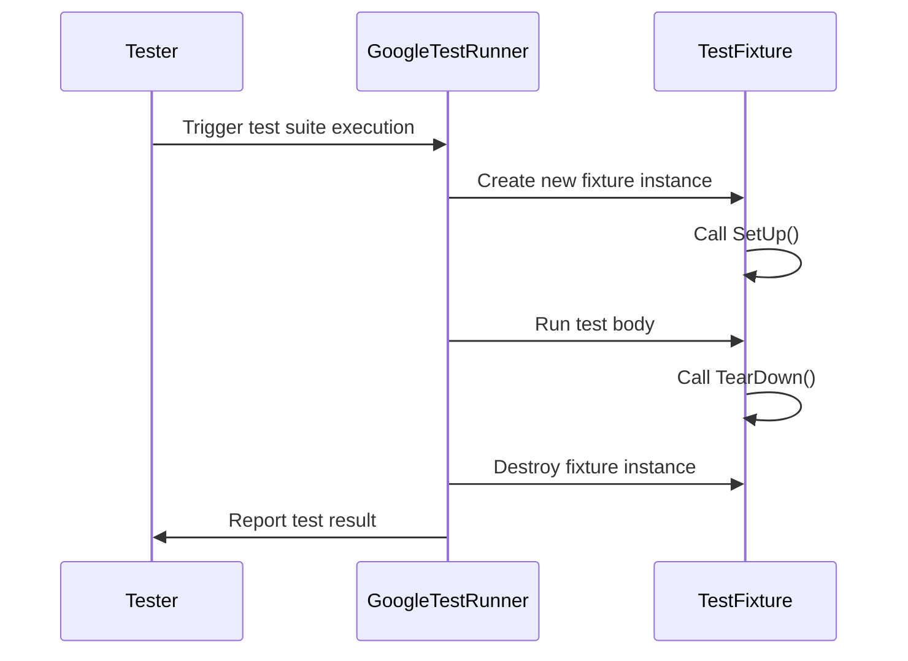

# Test Structure & Lifecycle

GoogleTest provides a clear and structured framework to organize and run your C++ tests efficiently. Understanding the anatomy of a test and the lifecycle of test execution is essential for building robust, maintainable test suites. This page introduces the fundamental constructs that define your tests, how to write them, and how GoogleTest manages their execution, including setup and teardown flows.

---

## 1. Anatomy of a GoogleTest

A GoogleTest test is composed of individual *test functions*, typically organized into *test suites* (formerly known as test cases). GoogleTest uses macros to define these tests, and provides mechanisms to share common code using *test fixtures*.

### Basic Test Definition

The simplest test can be defined using the `TEST` macro:

```cpp
#include <gtest/gtest.h>

TEST(MathTest, Factorial) {
  EXPECT_EQ(Factorial(0), 1);
  EXPECT_EQ(Factorial(5), 120);
}
```

- **Test Suite name**: `MathTest` groups related tests.
- **Test name**: `Factorial` describes this individual test.

This test consists of assertion statements (`EXPECT_EQ`) to verify behavior.

---

## 2. Test Fixtures: Reusing Setup and Teardown Code

When multiple tests require common setup code, you define a *test fixture* — a class inheriting from `testing::Test`:

```cpp
class QueueTest : public ::testing::Test {
 protected:
  void SetUp() override {
    // Code here is invoked before each test runs.
    q_.Enqueue(42);
  }

  void TearDown() override {
    // Code here is invoked after each test finishes.
  }

  Queue<int> q_;
};

TEST_F(QueueTest, IsInitiallyNotEmpty) {
  EXPECT_FALSE(q_.IsEmpty());
}

TEST_F(QueueTest, CanDequeue) {
  int* n = q_.Dequeue();
  ASSERT_NE(n, nullptr);
  EXPECT_EQ(*n, 42);
  delete n;
}
```

- `TEST_F` associates tests with the fixture.
- Each test gets a fresh fixture instance.
- Setup and teardown allow shared resource management.

---

## 3. GoogleTest Test Case Lifecycle

GoogleTest manages each test's lifecycle around your source code, ensuring isolation and repeatability.

### Lifecycle Phases

1. **Construction**: Creates a fresh fixture instance.
2. **SetUp()**: Called before each test; prepare your environment here.
3. **Test Execution**: Runs the code inside the `TEST` or `TEST_F` macro.
4. **TearDown()**: Called after the test completes; clean up resources here.
5. **Destruction**: The fixture instance is destroyed.

Each individual test gets this full lifecycle, ensuring that tests are independent of each other.

---

## 4. Writing Test Functions

### 4.1 Naming Conventions

- Use descriptive names for test suites to group related functionality.
- Use descriptive names for individual tests reflecting the scenario tested.
- Avoid underscores or special characters in names for compatibility.

### 4.2 Assertions

GoogleTest provides various assertions to check test conditions:

- `EXPECT_*` assertions report a non-fatal failure (test continues).
- `ASSERT_*` assertions report a fatal failure (test aborts).

Examples:
```cpp
EXPECT_EQ(foo, bar);       // Check equaliy and continue on failure.
ASSERT_NE(ptr, nullptr);   // Check non-null before dereferencing.
```

Use `ASSERT_*` when subsequent test code depends on a condition.

### 4.3 Multiple Assertions

Within a test, multiple `EXPECT_*` assertions can help identify multiple failures in one go, improving debugging efficiency.

---

## 5. Controlling Test Execution Flow

### Setup and Teardown Patterns

- Use constructor and destructor for lightweight, non-failing setup.
- Use `SetUp()` and `TearDown()` for operations that can fail or require exception handling.

### Test Parameters and Parameterized Tests

For scenarios where the same logic should be tested over multiple input values, GoogleTest offers parameterized tests (covered in other guides).

---

## 6. Test Suites and Isolation

- Each test belongs to a suite (group) by its suite name.
- Tests within the same suite should be independent.
- Fixtures isolate test dependencies and state.

GoogleTest runs tests in isolation, enabling you to run individual tests or entire suites.

---

## 7. Practical Tips and Best Practices

- **Start simple**: Write isolated tests first, expand to fixtures as duplication arises.
- **Keep state local**: Avoid sharing state between tests; use fixtures.
- **Use assertions wisely**: Prefer non-fatal assertions where possible.
- **Name clearly**: Make test and suite names descriptive.

<Tip>
Remember to define virtual destructors for your classes used in tests and fixtures to avoid resource leaks.
</Tip>

<Tip>
Write setup and teardown logic that is fast and side-effect free to keep tests performant and predictable.
</Tip>

---

## 8. Troubleshooting Common Pitfalls

- Forgetting to define or overriding `SetUp()`/`TearDown()` with wrong signatures causes tests not to run setup.
- Using `ASSERT_*` unnecessarily can abort tests prematurely.
- Sharing mutable state between tests leads to flaky and non-repeatable tests.
- Not isolating tests causes order dependencies and hidden bugs.

---

## 9. Summary

GoogleTest's test structure and lifecycle enforce best practices for reliable, maintainable tests. By leveraging `TEST` and `TEST_F` macros, alongside consistent use of setup and teardown, you can build powerful test suites with clear execution flows.

For deeper testing strategies including parameterized tests, fixtures inheritance, and advanced lifecycle control, explore related guides.

---

## See Also

- [gMock Cheat Sheet](https://google.github.io/googletest/gmock_cheat_sheet.html) for advanced mocking and fixture usage.
- [GoogleTest Primer](https://google.github.io/googletest/primer.html) for foundational concepts.
- [Mock Objects and Methods](../mock-objects-and-methods.md) for dependency mocking within tests.
- [Writing and Running Your First Test](https://google.github.io/googletest/guides/getting-started/writing-your-first-test.html) for practical test authoring.


---

### Request-Response Flow Diagram of Test Execution



This illustrates the controlled lifecycle around each test execution to ensure isolation and correctness.
