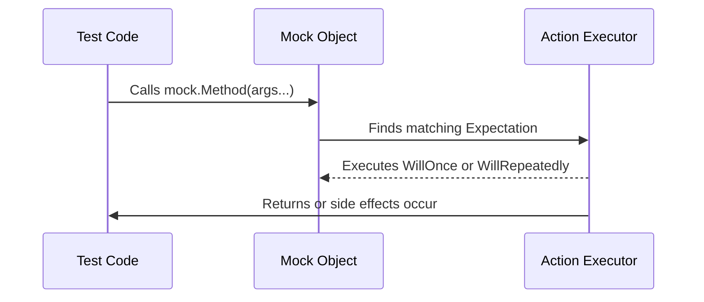

# Action APIs Reference

GoogleMock's Action framework empowers you to define *how* your mock methods behave when invoked. Actions are the building blocks you attach to mock expectations to specify return values, side effects, or complex custom behaviors. This reference details the built-in actions, how to combine them, and how to create your own.

---

## 1. Introduction to Actions

In mocking, defining *what* interactions you expect is crucial, but equally important is defining *how* mock objects respond. Actions specify this *behavior*.

When you use `EXPECT_CALL(mock, Method(...))`, you can chain `.WillOnce(action)` or `.WillRepeatedly(action)` to describe the mock's reaction. Actions can return values, modify arguments, throw exceptions, or even invoke provided callbacks.

Key value points:

- Actions offer fine-grained control over mock behavior.
- Built-in actions cover common scenarios including returning values, setting output parameters, or throwing exceptions.
- You can compose actions to execute multiple behaviors sequentially.
- User-defined actions enable modeling complex or domain-specific mock reactions.

## 2. Built-In Actions

### Returning Values

| Action              | Description                                                  |
|---------------------|--------------------------------------------------------------|
| `Return()`          | Returns from a `void` mock method (no value).                |
| `Return(value)`     | Returns the specified value. The value is converted at the time the expectation is set, not when executed. |
| `ReturnRef(variable)` | Returns a reference to a variable. Useful when mocking methods returning references. |
| `ReturnRefOfCopy(value)` | Returns a reference to a copy of the value. Useful when you want to safely return a reference to a temporary copy. |
| `ReturnNew<T>(args...)` | Returns a `new` instance of `T` constructed with the given arguments on each call. |
| `ReturnNull()`      | Returns a null pointer for pointer return types.             |
| `ReturnPointee(ptr)`| Returns the value pointed to by `ptr`, useful for pointer indirections. |
| `ReturnRoundRobin({a1,...,an})` | Returns successive elements from the list on each call, cycling back to the start after reaching the end. |

### Side Effects on Arguments

| Action                  | Description                                             |
|-------------------------|---------------------------------------------------------|
| `Assign(&var, value)`   | Assigns `value` to the given variable pointer `var`.      |
| `SetArgPointee<N>(value)` | Sets the value pointed to by the N-th argument to `value`. |
| `SetArrayArgument<N>(first, last)` | Copies elements from `[first, last)` to the array pointed to by the N-th argument. |
| `DeleteArg<N>()`        | Deletes the pointer passed as the N-th argument.           |
| `SaveArg<N>(pointer)`   | Copies the N-th argument to `*pointer` for later inspection in tests. |
| `SaveArgByMove<N>(pointer)` | Moves the N-th argument to `*pointer`.                     |
| `SaveArgPointee<N>(pointer)` | Saves the value pointed to by the N-th argument to `*pointer`.|
| `SetArgReferee<N>(value)` | Assigns `value` to the variable referenced by the N-th argument (must be a reference). |

### Exception Handling

| Action      | Description                           |
|-------------|-------------------------------------|
| `Throw(exception)` | Throws the given `exception` when the mock function is called (requires exception support). |

### Invoking Callables

| Action                                  | Description                                            |
|----------------------------------------|---------------------------------------------------------|
| `Invoke(f)`                            | Invokes the callable `f` with the mock function's arguments. Callable can be a function, functor, or lambda. |
| `Invoke(obj_ptr, &Class::Method)`     | Invokes the member method on the given object pointer with the mock's arguments. |
| `InvokeWithoutArgs(f)`                 | Invokes `f`, which must take no arguments. Ignores the mock's arguments. |
| `InvokeWithoutArgs(obj_ptr, &Class::Method)` | Invokes member method with no arguments.                    |
| `InvokeArgument<N>(args...)`          | Invokes the N-th argument of the mock function (which must be callable) with provided `args`.  Arguments should be wrapped with `std::ref()` if passed by reference. |

### Composite Actions

| Action                   | Description                                         |
|--------------------------|-----------------------------------------------------|
| `DoAll(a1, a2, ..., an)` | Executes all actions `a1` to `an` sequentially on each call, returns the last action's result. |
| `IgnoreResult(action)`   | Performs `action` but discards its return value. Useful in `DoAll` chains. |
| `WithArg<N>(action)`     | Passes the N-th argument to `action`. Adapts actions expecting fewer arguments. |
| `WithArgs<N1, N2, ...>(action)` | Passes multiple selected arguments to `action`. Allows argument reordering or repetition. |
| `WithoutArgs(action)`     | Performs `action` ignoring all arguments.             |

## 3. Defining Custom Actions

Custom actions extend gMock’s flexibility when built-ins are insufficient.

### Using ACTION Macros

GoogleMock provides macros to define custom actions succinctly:

- `ACTION(name) { /* statements */ }` defines a parameterless action.
- `ACTION_P(name, param) { /* statements using param */ }` defines an action with one parameter.
- Similarly, `ACTION_P2`, `ACTION_P3`, ... up to `ACTION_P10` support multiple parameters.

Inside the macro body, you have access to the mock function’s arguments as `arg0`, `arg1`, etc. Use `argN_type` to refer to the type of each argument. The return value of the block defines the mock method's return.

```cpp
ACTION(IncrementArg1) {
  return ++(*arg1);
}
EXPECT_CALL(mock, Foo).WillOnce(IncrementArg1());
```

Note: these macros must be used at namespace scope.

### Using Functions, Functors, and Lambdas

For greater flexibility, directly use lambdas, function pointers, or callable objects with `WillOnce()` or `WillRepeatedly()`:

```cpp
EXPECT_CALL(mock, Foo(_)).WillOnce([](int n) { return n * 2; });
```

The callable must be compatible with the mock method's signature.

### Polymorphic Actions

Implement actions that can operate on multiple mock method types by defining an implementation class with a templated `Perform` method, then wrapping it with `MakePolymorphicAction`. This is more advanced but powerful.

## 4. Managing Actions in Expectations

### Timing of Action Evaluation

Remember that argument expressions and action objects passed to `EXPECT_CALL` are **evaluated once** when the expectation is set, *not* each time the action is run. To produce dynamic behavior at runtime, use lambdas or functors.

### WillOnce vs WillRepeatedly

- `WillOnce(action)`: Specifies the action for a single matching call, consumes one use.
- `WillRepeatedly(action)`: Specifies the action for all subsequent matching calls after all `WillOnce()` actions are exhausted.

If you specify multiple `WillOnce()` actions without a `Times()`, GoogleMock infers the call count from the number of `WillOnce()` calls.

### RetiresOnSaturation

Use `.RetiresOnSaturation()` on an expectation to make it inactive (retired) once it reaches its call limit, letting subsequent calls match older or less specific expectations.

## 5. Practical Examples

### Simple Return

```cpp
EXPECT_CALL(mock, GetValue())
    .WillOnce(Return(10))
    .WillRepeatedly(Return(20));
```
This says the first call returns 10, and subsequent calls return 20.

### Setting Output Parameters

```cpp
int output;
EXPECT_CALL(mock, Process(_, _))
    .WillOnce(DoAll(SetArgPointee<1>(42), Return(true)));
```
Here, the second argument (index 1) will be set to 42, and the method returns `true`.

### Invoking a Callback Argument

```cpp
EXPECT_CALL(mock, DoWork(_, _))
    .WillOnce(InvokeArgument<1>(42)); // invokes the 2nd argument callback with 42
```

### Delegating to Lambdas

```cpp
EXPECT_CALL(mock, Calculate(_))
    .WillRepeatedly([](int x) { return x * x; });
```

## 6. Tips & Best Practices

- Use `ON_CALL` to set default (fallback) mock behaviors without imposing call expectations.
- Use `WillOnce` for fine-grained, call-specific behaviors.
- Avoid over-specifying expectations; only assert what your test cares about.
- Combine actions using `DoAll()` to implement side effects plus return values.
- Wrap arguments with `std::ref()` when you need to pass them by reference in `InvokeArgument`.
- Use `.RetiresOnSaturation()` on expectations involved in overlapping scenarios to avoid over-saturation errors.

## 7. Common Pitfalls & Troubleshooting

- Forgetting that actions are evaluated once: do not use expressions with side-effects directly in `Return()`.
- Using `Return(std::move(obj))` repeatedly causes errors since `obj` is moved from on first call.
- Use lambdas to return fresh or changing values.
- Calling `EXPECT_CALL` after exercising the mock leads to undefined behavior.
- Excessive calls beyond `Times()` cause failures unless handled with `RetiresOnSaturation()`.

---

## 8. Related Concepts

- See the [Mocking Reference](./mocking-apis.md) for how to integrate actions with expectations.
- Explore [Matchers Reference](./matchers-reference.md) to define argument matching conditions falling through to actions.
- The [gMock Cookbook](../gmock_cook_book.md) has guidance and recipes for advanced action usage.

---

# Appendix: Selected Code Snippets

<CodeGroup>
```cpp
// Simple Mock Method with Return Value
class MockFoo {
 public:
  MOCK_METHOD(int, Compute, (int x), (override));
};

// Setting expectations with actions
EXPECT_CALL(mock_foo, Compute(5))
    .WillOnce(Return(10));
```

```cpp
// Defining a simple custom action
ACTION(IncrementArg1) {
  return ++(*arg1);
}
EXPECT_CALL(mock, Foo).WillOnce(IncrementArg1());
```

```cpp
// Using DoAll to set output argument and return value
int out_value;
EXPECT_CALL(mock, DoStuff(_, _))
    .WillOnce(DoAll(SetArgPointee<1>(42), Return(true)));
```

```cpp
// Invoking callable passed as argument
EXPECT_CALL(mock, RegisterCallback(_))
    .WillOnce(InvokeArgument<0>(true));
```
</CodeGroup>

---

# Diagram: Action Flow When Mock Method is Called

