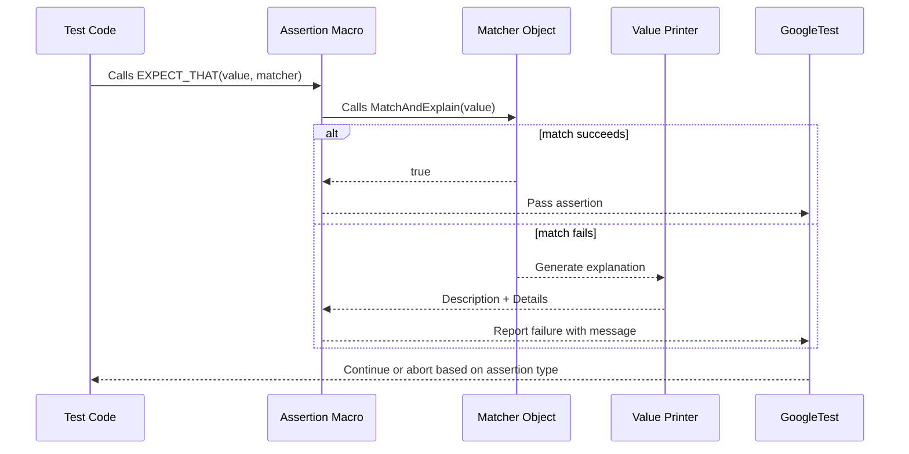

# Advanced Assertions and Matchers

This reference page dives deep into advanced assertion features that let you write expressive, readable, and reusable test code with GoogleTest. You'll learn how to craft user-defined assertions, leverage custom printers for improved failure diagnostics, and harness matcher-based assertions to verify complex conditions. By mastering these capabilities, you can transform your tests into powerful tools that clarify intent and accelerate debugging.

---

## User-Defined Assertions

Sometimes built-in assertions are not enough to capture complex validation logic or to generate clear failure messages tailored for your domain. User-defined assertions in GoogleTest enable you to encapsulate such logic, improving both readability and maintainability.

### Creating Simple User-Defined Assertions

Define a function that returns `testing::AssertionResult` to express success or failure:

```cpp
#include <gtest/gtest.h>

// Returns AssertionSuccess() if n is even, else AssertionFailure() with message.
testing::AssertionResult IsEven(int n) {
  if (n % 2 == 0)
    return testing::AssertionSuccess();
  else
    return testing::AssertionFailure() << n << " is odd";
}

TEST(NumberTest, CheckEven) {
  EXPECT_TRUE(IsEven(4));  // Passes silently
  EXPECT_TRUE(IsEven(3));  // Fails with message "3 is odd"
}
```

This approach allows your failure messages to contain rich explanations about why the check failed.

### Benefits of User-Defined Assertions

- **Clear failure messages:** Provide detailed context helping debug failed checks.
- **Declarative test code:** Hide complex logic behind clean, readable calls.
- **Reusable predicates:** Write once, use across many tests.

## Custom Printers

GoogleTest uses streaming (`operator<<`) to print values in failure messages. When you have types that don't print well by default, define custom printers to improve output quality.

### How to Define Custom Printers

- **Implement `PrintTo(const T&, std::ostream*)` function** in the same namespace as your type `T`.

Example:

```cpp
#include <ostream>

namespace my_namespace {

class Point {
 public:
  int x, y;
};

void PrintTo(const Point& p, std::ostream* os) {
  *os << "Point(" << p.x << ", " << p.y << ")";
}

}  // namespace my_namespace
```

This enables GoogleTest to print `Point` objects informatively in assertion messages.

### Interaction with `AbslStringify` Overloads

GoogleTest supports a generic sink-based printer `AbslStringify`. If both `PrintTo` and `AbslStringify` are defined, `PrintTo` takes precedence.

### Tips

- Ensure your printer is in the same namespace for proper lookup.
- For complex types, consider streaming minimal yet helpful details.

## Matcher-Based Assertions

Matchers are the heart of expressive verification in GoogleTest and GoogleMock. Matchers allow you to write assertions that read like English and produce actionable failure messages.

### Key Concepts

- A matcher encapsulates the criteria to test a value.
- GoogleTest provides built-in matchers (e.g., `Eq`, `Ge`, `StartsWith`, `ContainsRegex`).
- Use `EXPECT_THAT(value, matcher)` and `ASSERT_THAT(value, matcher)` to assert with matchers.

### Using Built-in Matchers

Basic usage:

```cpp
#include <gmock/gmock.h>

using ::testing::StartsWith;
using ::testing::MatchesRegex;
using ::testing::AllOf;
using ::testing::Gt;
using ::testing::Lt;

TEST(StringTest, MatcherExamples) {
  std::string s = "Hello, world!";
  EXPECT_THAT(s, StartsWith("Hello"));
  EXPECT_THAT(s, MatchesRegex("Hello, \w+!"));
  int value = 7;
  EXPECT_THAT(value, AllOf(Gt(5), Lt(10)));
}
```

If an assertion fails, GoogleTest produces a detailed message explaining the mismatch:

```
Value of: value
  Actual: 3
Expected: is > 5 and < 10
```

### Combining Matchers

Matchers can be combined with `AllOf()`, `AnyOf()`, and `Not()` to form powerful expressions:

```cpp
EXPECT_THAT(value, AllOf(Gt(5), Lt(10)));   // value > 5 && value < 10
EXPECT_THAT(value, AnyOf(Eq(0), Eq(1)));    // value == 0 || value == 1
EXPECT_THAT(str, Not(Contains("bad")));   // str does not contain "bad"
```

### Custom Matchers

If built-in matchers don’t suffice, you can write custom matchers to describe sophisticated checks.

#### Using `MATCHER` Macros

GoogleTest provides macros to write concise matchers.

```cpp
MATCHER(IsDivisibleBy7, "") {
  return (arg % 7) == 0;
}

TEST(NumberTest, DivisibleBy7) {
  EXPECT_THAT(14, IsDivisibleBy7());
  EXPECT_THAT(15, Not(IsDivisibleBy7()));
}
```

Include custom failure explanations:

```cpp
MATCHER(IsDivisibleBy7, "") {
  if ((arg % 7) == 0) return true;
  *result_listener << "the remainder is " << (arg % 7);
  return false;
}
```

Now failure messages indicate why it failed.

#### Parameterized Matchers

For matchers with parameters, use `MATCHER_P`, `MATCHER_P2`, etc.:

```cpp
MATCHER_P(InRange, range, "") {
  return arg >= range.first && arg <= range.second;
}

EXPECT_THAT(value, InRange(std::make_pair(1, 5)));
```

#### Writing Matcher Classes

For fine control, implement matcher interfaces directly. Implement `MatchAndExplain()`, `DescribeTo()`, and `DescribeNegationTo()`. Then wrap with `Matcher<T>` factory function.

### Ensuring Matchers Are Functional

Matchers must be pure functions without side effects to guarantee reliable tests and accurate failure messages.

## Complex Predicate Assertions

GoogleTest provides predicate-style assertions that enable checking complex conditions with clear failure diagnostics.

### `EXPECT_PREDn` and `ASSERT_PREDn`

Used for predicates taking n arguments returning `bool`.

Example:

```cpp
bool AreRelativelyPrime(int a, int b) {
  // Implement logic...
  return true_or_false;
}

EXPECT_PRED2(AreRelativelyPrime, 3, 4);
```

If the predicate fails, GoogleTest prints values of arguments involved.

### Predicate-Formatter Assertions: `EXPECT_PRED_FORMATn` and `ASSERT_PRED_FORMATn`

For richer messages, write a predicate function returning `testing::AssertionResult` and accepting argument expressions as strings and values.

```cpp
testing::AssertionResult AssertRelativelyPrime(
   const char* expr1, const char* expr2, int a, int b) {
  if (AreRelativelyPrime(a, b)) return testing::AssertionSuccess();
  return testing::AssertionFailure() << expr1 << " and " << expr2 <<
      " (" << a << " and " << b << ") are not relatively prime.";
}

EXPECT_PRED_FORMAT2(AssertRelativelyPrime, 3, 4);
```

### Use Cases

Use predicate assertions when complex logic is needed that cannot be easily expressed as a simple matcher or standard assertion, and when detailed error explanations improve test clarity.

## Integration with Matchers

`EXPECT_THAT(value, matcher)` and `ASSERT_THAT(value, matcher)` bring full power of GoogleMock matchers to assertions, allowing expressive and natural test statements.

Example:

```cpp
using ::testing::HasSubstr;
EXPECT_THAT(str, HasSubstr("needle"));
```

Check [Matchers Reference](/api-reference/mocking-framework-apis/using-matchers) for a full list of built-in matchers.

## Practical Tips and Best Practices

- Prefer *matchers* over verbose booleans or user-defined assertions where possible.
- Use `SCOPED_TRACE()` to add context when calling assertion subroutines.
- Invoke `EXPECT_PRED_FORMATn` for complex predicates that require detailed diagnostics.
- Write clear and meaningful descriptions in custom matchers to improve failure readability.
- User-defined predicates and matchers should be free of side effects.
- When mocking, combine `EXPECT_CALL` with matchers to precisely control method argument expectations.
- Consider using matchers within parameterized and typed tests to enhance test coverage effectively.

## Troubleshooting Common Issues

<AccordionGroup title="Troubleshooting Custom Assertions and Matchers">
<Accordion title="Custom Assertion Always Fails or Always Succeeds">
Ensure your predicate function correctly returns `AssertionSuccess()` or `AssertionFailure()` and doesn't have unintended side effects.
</Accordion>
<Accordion title="Matcher Does Not Print Expected Failure Message">
Make sure your matcher implements `DescribeTo()` and optionally `MatchAndExplain()` to provide informative messages. Streaming to `result_listener` improves clarity.
</Accordion>
<Accordion title="Overloaded Methods Confuse Matchers">
Disambiguate overloaded methods using `Const()` wrapper or explicitly casting matchers as shown in the [SelectOverload](https://google.github.io/googletest/gmock_cook_book.html#select_overload) technique.
</Accordion>
</AccordionGroup>

## References and Further Reading

- [Assertions Reference](reference/assertions.md) — Complete list of GoogleTest assertions.
- [Matchers Reference](reference/matchers.md) — Built-in matchers for expressive verification.
- [gMock Cookbook](docs/gmock_cook_book.md) — Recipes for creating mocks, matchers, and actions.
- [GoogleTest Primer](docs/primer.md) — Foundational concepts and simple test writing.
- [Advanced GoogleTest Topics](docs/advanced.md) — Deep dive into assertions and test fixtures.

---

## Mermaid Diagram: User Flow of an Assertion with Custom Matcher


