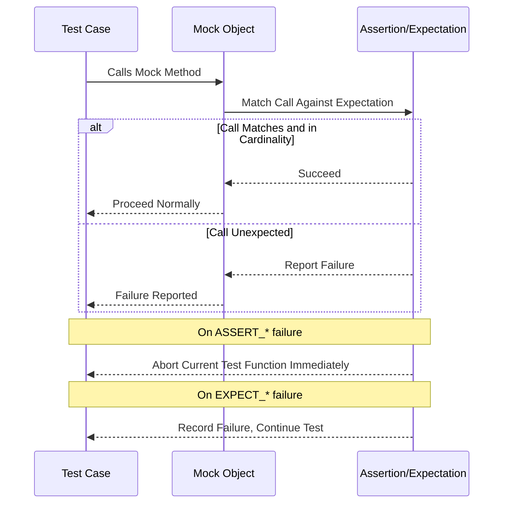

# Assertions & Expectations

Detailed guide to all assertion macros and expectation types in GoogleMock, including equality and comparison assertions, fatal and non-fatal failures, and death test assertions. This guide helps you select the right assertion type for your testing scenario, understand how test results are reported, and effectively handle negative testing patterns such as checking program termination.

---

## Overview

Assertions and expectations are the core mechanisms in GoogleTest and GoogleMock for verifying correctness in your tests. They allow you to check conditions at runtime and report failures in a controlled manner, enabling precise validation of program behavior.

- **Assertions**: Check conditions immediately, aborting the current function or test on fatal failure.
- **Expectations**: Similar checks that allow tests to continue even after failure, useful for non-critical verifications.
- **Death Tests & Fatal Checks**: Special assertions to verify that code under test terminates or fails as expected.


---

## Categories of Assertions

GoogleTest provides a rich set of assertion macros and functions categorized by their behavior and use case:

### 1. Assertion Macros

Assertions stop test execution depending on fatality:

- **Fatal Assertions (`ASSERT_*`)**
  - Stop the current test case or test function immediately upon failure.
  - Use when subsequent test logic depends on the assertion.

- **Non-Fatal Assertions (`EXPECT_*`)**
  - Record failure but continue the test execution.
  - Use when you want to verify multiple conditions in a single test.

### 2. Equality and Comparison Assertions

These verify equality, inequality, and relational comparisons:

- `ASSERT_EQ(expected, actual)` & `EXPECT_EQ(expected, actual)`: Checks if two values are equal.
- `ASSERT_NE`, `EXPECT_NE`: Not equal.
- `ASSERT_LT`, `EXPECT_LT`: Less than.
- `ASSERT_LE`, `EXPECT_LE`: Less than or equal.
- `ASSERT_GT`, `EXPECT_GT`: Greater than.
- `ASSERT_GE`, `EXPECT_GE`: Greater than or equal.

#### Example:
```cpp
EXPECT_EQ(10, calculator.Add(7, 3));
ASSERT_LT(calculator.Divide(10, 2), 10);
```

### 3. String Assertions

GoogleTest provides specialized macros for C-strings and `std::string`:

- `ASSERT_STREQ`, `EXPECT_STREQ`: Asserts string equality.
- `ASSERT_STRNE`, `EXPECT_STRNE`: String inequality.
- `ASSERT_STRCASEEQ`, `EXPECT_STRCASEEQ`: Case-insensitive equality.
- `ASSERT_STRCASENE`, `EXPECT_STRCASENE`: Case-insensitive inequality.

### 4. Boolean Assertions

- `ASSERT_TRUE(condition)` / `EXPECT_TRUE(condition)`
- `ASSERT_FALSE(condition)` / `EXPECT_FALSE(condition)`

### 5. Exception Assertions

- `ASSERT_THROW(statement, exception_type)`: Asserts a statement throws a specific exception.
- `ASSERT_ANY_THROW(statement)`: Asserts a statement throws any exception.
- `ASSERT_NO_THROW(statement)`: Asserts a statement does not throw.

### 6. Floating-Point Assertions

- `ASSERT_FLOAT_EQ`, `EXPECT_FLOAT_EQ`: Compares floats with tolerance.
- `ASSERT_DOUBLE_EQ`, `EXPECT_DOUBLE_EQ`: Compares doubles similarly.
- `ASSERT_NEAR(val1, val2, abs_error)`: Checks whether values are within a user-defined margin.

### 7. Death Tests

Used to check that certain code *terminates* the process or triggers fatal failures intentionally:

- `ASSERT_DEATH(statement, regex_or_predicate)`
- `EXPECT_DEATH(statement, regex_or_predicate)`

These tests ensure that crash conditions, failures, or assertions inside the code behave as expected.

### 8. Macro-Generated Matchers and `EXPECT_THAT`

For more expressive checks involving objects and containers, you can use `EXPECT_THAT` with GoogleMock matchers:

```cpp
EXPECT_THAT(my_vector, ::testing::Contains(42));
EXPECT_THAT(result, ::testing::HasSubstr("error"));
```

These allow for powerful, readable assertions based on matchers rather than simple equality.

---

## Choosing Between `ASSERT_` and `EXPECT_`

Your choice affects test flow:

- Use **`ASSERT_*`** when the continuation of the test depends strictly on the assertion passing.
- Use **`EXPECT_*`** when you want to gather multiple test failures in one test run, improving test throughput and diagnostic information.

**Tip:** Overuse of `ASSERT_*` may shorten test runs by aborting early, but can simplify debugging in some scenarios.

---

## Using Expectation Macros with GoogleMock

Beyond GoogleTest's assertions, GoogleMock provides macros to set *expectations* on mock method calls, verifying interactions precisely:

- `EXPECT_CALL(mock_object, Method(matchers))` sets an expectation that a specific call will occur.
- Expectations can be chained with modifiers like `.Times()`, `.WillOnce()`, `.WillRepeatedly()`, `.InSequence()`, etc.

```cpp
EXPECT_CALL(mock_printer, Print(42)).Times(3).WillRepeatedly(Return(true));
```

Expectations verify that the code interacts with mocks exactly as expected, with detailed diagnostics on mismatch.

**Important:** Expectations must be set *before* exercising the code using the mocks to avoid undefined behavior.

---

## Handling Unexpected and Uninteresting Calls

- **Unexpected Calls**: Calls to mocks that have expectations but whose arguments don't match any specified.
  - Always reported as test failures.
- **Uninteresting Calls**: Calls to mock methods without any expectation specified.
  - Generate warnings by default.
  - Suppress warnings using `NiceMock` wrappers or explicit `EXPECT_CALL(...).Times(AnyNumber())`.
  - Fail test on uninteresting calls with `StrictMock`.

---

## Negative Testing and Fatal Failures

Sometimes you want to confirm that certain operations *fail* or *terminate*: death tests cover these scenarios.

### Death Test Usage

```cpp
ASSERT_DEATH({ code_that_fails(); }, "death message regex");
```

- Verifies the `code_that_fails` terminates with a diagnostic message matching the regex.
- Can verify expected crashes, assertion failures, or fatal errors.

**Tip:** Death tests are usually slower and should focus on failure paths only.

---

## Understanding Result Reporting

When an assertion or expectation fails, GoogleTest/GoogleMock reports:

- Failure location (file and line number)
- The statement that failed
- Expected vs actual values
- Stack traces when verbosity is enabled (`--gmock_verbose=info`)

This detailed reporting helps you quickly identify why your test failed.

---

## Best Practices

- Prefer `EXPECT_` for non-critical verifications to get richer failure info.
- Use `ASSERT_` if failure means the test cannot continue.
- Use sequences and `RetiresOnSaturation()` for strict call ordering.
- Use `WITH` clause to match multiple arguments as a whole when necessary.
- Use `NiceMock` to reduce noise from uninteresting calls; use `StrictMock` to catch any unexpected calls.
- Use death tests sparingly, focusing on critical failure conditions.
- Always write expectations *before* exercising the mocks.
- Check call counts carefully to avoid excessive or missing calls.

---

## Example: Setting Expectations and Assertions

```cpp
#include <gmock/gmock.h>
#include <gtest/gtest.h>

using ::testing::AtLeast;
using ::testing::Return;
using ::testing::_; // wildcard matcher

class MockCalculator {
 public:
  MOCK_METHOD(int, Add, (int a, int b), ());
};

TEST(CalculatorTest, AddTest) {
  MockCalculator calc;

  // Expect Add(2, 3) to be called twice, return 5 each time.
  EXPECT_CALL(calc, Add(2, 3))
      .Times(2)
      .WillRepeatedly(Return(5));

  // Exercise mock
  int result1 = calc.Add(2, 3);
  int result2 = calc.Add(2, 3);

  // Verify results
  EXPECT_EQ(result1, 5);
  ASSERT_EQ(result2, 5);
}
```

---

## Troubleshooting Common Assertion and Expectation Issues

- **Unexpected mock function call**: Check if you set the correct expectations before exercising the mock.
- **Uninteresting mock function call warnings**: Use `NiceMock` or add a catch-all `EXPECT_CALL` with `Times(AnyNumber())`.
- **Too many or too few calls**: Verify the cardinalities specified with `.Times()`.
- **Match failures**: Use `--gmock_verbose=info` for detailed call traces.
- **Death test failures**: Ensure the code actually terminates and error message regex matches.

---

## Additional Resources

Explore related documentation to deepen your understanding:

- [gMock Cheat Sheet](https://google.github.io/googletest/gmock_cheat_sheet.html)
- [gMock for Dummies](https://google.github.io/googletest/gmock_for_dummies.html)
- [GoogleTest Assertions Reference](reference/assertions.md)
- [Matchers & Call Verification](https://google.github.io/googletest/reference/mocking.html#matchers)
- [Mocking Reference](docs/reference/mocking.md)
- [Core Workflows: Assertions and Matchers](https://google.github.io/googletest/guides/core-workflows/assertions-matchers.html)

---

## Summary Mermaid Diagram: Assertion Flow in Tests



---

*This documentation page focuses specifically on the assertion macros and expectation types in GoogleTest and GoogleMock, providing a user-centered guide to effectively leveraging these tools in validating code correctness and interactions.*

---