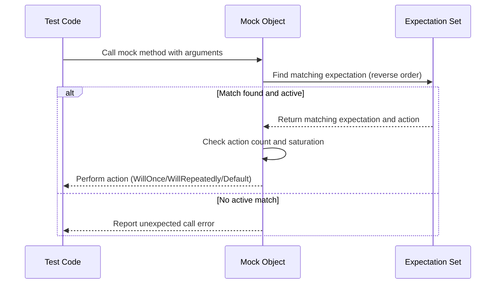

# Assertions and Expectations

Comprehensive guide to the set of built-in assertions and expectations in GoogleTest and GoogleMock, including equality, comparison, fatal and non-fatal failures, and user-defined conditions. This documentation covers usage patterns, customization, and how to verify code behavior effectively using assertions and mock expectations.

---

## Overview

Assertions and expectations are the core mechanisms by which you verify that your code behaves as intended in your tests. This page focuses on:

- Assertions: Verifying conditions within tests that cause immediate or deferred failures
- Expectations: Specifying and verifying expected calls and interactions on mock objects


Use assertions to check the correctness of values, states, and behaviors directly. Use expectations to define the interactions you require on mocks.


---

## Assertions

Assertions evaluate boolean conditions to indicate success or failure during test execution. They come in two main varieties:

- **Fatal assertions** (e.g., `ASSERT_EQ`, `ASSERT_TRUE`): Fail immediately and abort the current test function.
- **Non-fatal assertions** (e.g., `EXPECT_EQ`, `EXPECT_TRUE`): Report failure but allow the test to continue.


### Common Assertion Macros

| Macro                 | Description                              | Failure Behavior |
|-----------------------|------------------------------------------|------------------|
| `ASSERT_EQ(val1, val2)`  | Checks equality; fails fatally if unequal  | Immediate abort  |
| `EXPECT_EQ(val1, val2)`  | Checks equality; fails non-fatally if unequal | Continues running |
| `ASSERT_NE(val1, val2)`  | Checks inequality                         | Immediate abort  |
| `EXPECT_NE(val1, val2)`  | Checks inequality                         | Continues running |
| `ASSERT_TRUE(cond)`      | Checks condition is true                  | Immediate abort  |
| `EXPECT_TRUE(cond)`      | Checks condition is true                  | Continues running |
| `ASSERT_FALSE(cond)`     | Checks condition is false                 | Immediate abort  |
| `EXPECT_FALSE(cond)`     | Checks condition is false                 | Continues running |


### Using Assertions

```cpp
TEST(CalculatorTest, Addition) {
  int result = Add(2, 3);
  EXPECT_EQ(result, 5) << "Addition failed!";
  ASSERT_TRUE(result > 0);
  // If ASSERT_TRUE fails, test aborts here.
  EXPECT_NE(result, 0);
}
```

### Advanced Assertions

For complex conditions, you can use `EXPECT_THAT` with matchers, or define custom predicate assertions.

```cpp
using ::testing::AllOf;
using ::testing::Gt;
using ::testing::Le;
...
EXPECT_THAT(result, AllOf(Gt(0), Le(10)));  // Check result in [1, 10]
```

---

## Expectations in GoogleMock

Expectations specify how mocked methods should be called during tests — which methods, with what arguments, how many times, and in what order.

### Defining Expectations

Use the `EXPECT_CALL` macro to set expectations on mock objects:

```cpp
EXPECT_CALL(mock_object, MethodName(matchers...))
    .Times(cardinality)
    .WillOnce(action)
    .WillRepeatedly(action);
```

- `mock_object`: instance of a mock class
- `MethodName`: mocked method to expect calls to
- `matchers...`: argument matchers (e.g., `_` for wildcard, `Eq(5)` for equality)
- `Times()`: how many calls expected
- `WillOnce()/WillRepeatedly()`: define behavior (return values, side effects)


### Call Ordering and Sequences

You can control call order using:

- `.InSequence()`: place expectations in one or more sequences enforcing call order
- `.After()`: specify prerequisite expectations that must occur before this one

Example:

```cpp
using ::testing::Sequence;
Sequence s1, s2;

EXPECT_CALL(mock, FirstCall()).InSequence(s1, s2);
EXPECT_CALL(mock, SecondCall()).InSequence(s1);
EXPECT_CALL(mock, ThirdCall()).InSequence(s2);
```

This means `FirstCall` must happen before both `SecondCall` and `ThirdCall`, with `SecondCall` and `ThirdCall` unordered relative to each other.

### Cardinalities

Cardinalities specify how many times an expectation should be matched:

| Cardinality         | Meaning                                             |
|---------------------|-----------------------------------------------------|
| `AnyNumber()`       | Call can happen any number of times                  |
| `AtLeast(n)`        | At least `n` times                                   |
| `AtMost(n)`         | At most `n` times                                    |
| `Between(m, n)`     | Between `m` and `n` times, inclusive                 |
| `Exactly(n)` or `n` | Exactly `n` times                                    |

If omitted, cardinality is inferred based on `WillOnce` & `WillRepeatedly`.

### Behavior Specification

Use `WillOnce()` and `WillRepeatedly()` to specify what a mock method should do when called.

Examples:

- Return a value: `WillOnce(Return(42))`
- Invoke a lambda or function: `WillRepeatedly([](int x) { return x * 2; })`

---

## Using `ON_CALL` for Default Behavior

`ON_CALL` lets you define default behavior for mock methods without setting an expectation that the method must be called:

```cpp
ON_CALL(mock_object, MethodName(args...))
    .WillByDefault(Return(default_value));
```

This is commonly used in test setup to provide default behavior, while specific calls can be expected with `EXPECT_CALL`.


---

## Best Practices and Tips

- Use `EXPECT_CALL` only when you want to verify *that* a call happens.
- Use `ON_CALL` to define default behavior for calls you don't want to verify explicitly.
- Specify only the argument matchers you care about; use `_` for wildcards to avoid brittle tests.
- Use `InSequence` or `After` to enforce call order only when necessary; avoid over-constraining tests.
- For methods with multiple `WillOnce()` clauses, consider `RetiresOnSaturation()` to avoid saturation errors.
- Use `NiceMock` to suppress warnings on uninteresting calls, or `StrictMock` to treat them as errors.

---

## Troubleshooting Common Issues

- **Uninteresting call warnings:** If you see warnings for uninteresting calls, consider adding `ON_CALL` or use `NiceMock`.
- **Unexpected call errors:** Ensure that you have `EXPECT_CALL`s matching all expected calls with appropriate matchers.
- **Call count mismatch:** Check cardinalities set with `Times()`, or rely on defaults correctly.
- **Ordering failures:** Verify use of `InSequence` and `After` clauses; unintended ordering constraints cause failures.
- **Mock leaks:** Use `Mock::AllowLeak()` if intentional, else check that mock objects are destroyed properly.

---

## Example: Setting Expectations with Actions and Ordering

```cpp
using ::testing::_;  // wildcard matcher
using ::testing::Return;
using ::testing::Sequence;

class MockFoo {
 public:
  MOCK_METHOD(int, Bar, (int n), ());
};

TEST(FooTest, Example) {
  MockFoo foo;
  Sequence s;

  EXPECT_CALL(foo, Bar(5))
      .Times(2)
      .WillOnce(Return(10))
      .WillOnce(Return(20))
      .InSequence(s);

  EXPECT_CALL(foo, Bar(_))
      .WillRepeatedly(Return(0));

  EXPECT_EQ(foo.Bar(5), 10);  // Matches first WillOnce
  EXPECT_EQ(foo.Bar(5), 20);  // Matches second WillOnce
  EXPECT_EQ(foo.Bar(5), 0);   // Matches WillRepeatedly
}
```

---

## Advanced Topics

### Combining Matchers for Compound Argument Checks

Use `.With()` to apply a matcher to the entire tuple of arguments or sub-sets with `Args<N>()`.

Example:

```cpp
EXPECT_CALL(mock, Foo(_, _))
    .With(Lt())  // Checks that the first argument < second argument
    .WillOnce(Return(true));
```

### Handling Unsatisfied Expectations and Order

GoogleMock prints detailed messages identifying
- Which expectations are unsatisfied
- Whether expectations are retired or active
- Exact mismatch of argument values

This helps debug failures caused by ordering or argument matching issues.

### Customizing Behavior by Delegating to Fakes or Real Objects

Use `ON_CALL` with lambdas to delegate calls to a real or fake implementation for default behavior while capturing calls in mocks.

---

## Visualizing Mock Expectation Handling Flow



---

## Additional Resources

- [Writing Mock Expectations and Actions](https://google.github.io/googletest/gmock_writing_expectations.html)
- [Matchers Reference](https://google.github.io/googletest/gmock_matchers.html)
- [Actions Reference](https://google.github.io/googletest/gmock_actions.html)
- [gMock Cookbook](https://google.github.io/googletest/gmock_cook_book.html)
- [gMock for Dummies](https://google.github.io/googletest/gmock_for_dummies.html)
- [Mocking Reference](https://google.github.io/googletest/gmock_reference.html)

---

## Summary

This guide empowers you to write precise and maintainable tests by leveraging GoogleTest's assertions and GoogleMock's expectation syntax. From simple value checks to intricate call order controls and default behaviors, you gain comprehensive control over verifying your code's correctness and interactions.

---