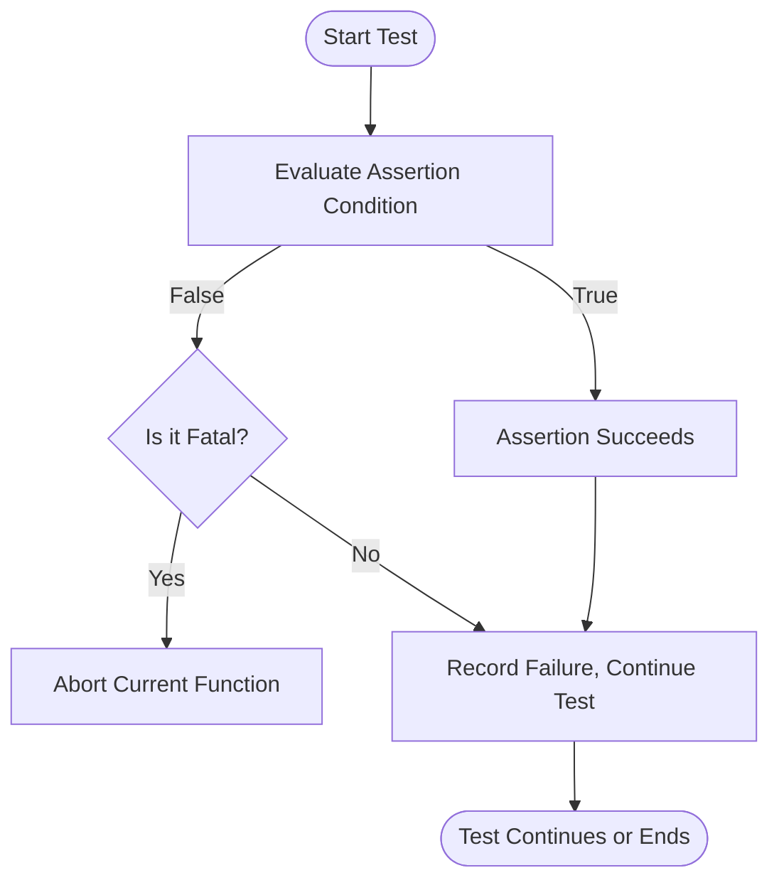

# Assertions and Test Expectations

GoogleTest offers a comprehensive catalog of assertion macros that let you verify your code’s behavior precisely and effectively. This page describes all assertion variants including fatal and non-fatal assertions, value comparisons, string and exception checks, predicate formatters, and mechanisms to extend assertions for custom use cases. Understanding and using these assertions empowers you to write reliable tests that provide clear diagnostics and actionable feedback.

---

## 1. Assertion Overview

Assertions in GoogleTest come in two flavors:

- **Fatal assertions (`ASSERT_` macros):** Abort the current function immediately upon failure, preventing further test code from executing.
- **Non-fatal assertions (`EXPECT_` macros):** Report failures but continue running the test function, allowing multiple failures to be detected in a single run.

You choose fatal assertions when continuing does not make sense (e.g., dereferencing a null pointer), and non-fatal assertions when you want to report multiple validation points.

All assertion macros support streaming of custom failure messages using `<<` for detailed, contextual diagnostics.

Example:

```cpp
ASSERT_EQ(x.size(), y.size()) << "Vectors differ in length";
EXPECT_EQ(x[0], y[0]) << "Vectors differ at first element";
```

## 2. Types of Assertions

### 2.1 Explicit Success and Failure

- `SUCCEED()` —  Signals an explicit success point.
- `FAIL()` — Immediately generates a fatal failure and aborts the function.
- `ADD_FAILURE()` — Reports a non-fatal failure, continuing test execution.

Use `FAIL()` when you want to forcibly fail a test at a point you should never reach.

### 2.2 Boolean Assertions

- `EXPECT_TRUE(condition)` / `ASSERT_TRUE(condition)` — Verify that a boolean condition is true.
- `EXPECT_FALSE(condition)` / `ASSERT_FALSE(condition)` — Verify that a boolean condition is false.

### 2.3 Equality and Relational Assertions

- Equality check macros:
  - `EXPECT_EQ(val1, val2)` / `ASSERT_EQ(val1, val2)` — Check `val1 == val2`.
  - `EXPECT_NE(val1, val2)` / `ASSERT_NE(val1, val2)` — Check `val1 != val2`.

- Relational checks:
  - `EXPECT_LT(val1, val2)` / `ASSERT_LT(val1, val2)` — Check `val1 < val2`.
  - `EXPECT_LE(val1, val2)` / `ASSERT_LE(val1, val2)` — Check `val1 <= val2`.
  - `EXPECT_GT(val1, val2)` / `ASSERT_GT(val1, val2)` — Check `val1 > val2`.
  - `EXPECT_GE(val1, val2)` / `ASSERT_GE(val1, val2)` — Check `val1 >= val2`.

Pointers are compared by address, so use string comparison macros for C strings.

### 2.4 String Assertions

GoogleTest provides string-specific assertions to check C strings and wide strings by content rather than pointer:

- `EXPECT_STREQ(s1, s2)` / `ASSERT_STREQ(s1, s2)` — Contents are equal.
- `EXPECT_STRNE(s1, s2)` / `ASSERT_STRNE(s1, s2)` — Contents differ.
- `EXPECT_STRCASEEQ(s1, s2)` / `ASSERT_STRCASEEQ(s1, s2)` — Case-insensitive equality.
- `EXPECT_STRCASENE(s1, s2)` / `ASSERT_STRCASENE(s1, s2)` — Case-insensitive inequality.

Use these when comparing character string contents, especially with C-style strings.

### 2.5 Floating-Point Comparison

Due to precision and rounding issues, floating-point numbers require special handling.

- `EXPECT_FLOAT_EQ(val1, val2)` / `ASSERT_FLOAT_EQ(val1, val2)` — Approximate equality for `float`, within 4 ULPs.
- `EXPECT_DOUBLE_EQ(val1, val2)` / `ASSERT_DOUBLE_EQ(val1, val2)` — Approximate equality for `double`, within 4 ULPs.
- `EXPECT_NEAR(val1, val2, abs_error)` / `ASSERT_NEAR(val1, val2, abs_error)` — Within a specified absolute error threshold.

These guards against false failures due to small floating-point inaccuracies.

### 2.6 Exception Assertions

Requires exceptions enabled in your build.

- `EXPECT_THROW(statement, ExceptionType)` / `ASSERT_THROW(statement, ExceptionType)` — Verify that `statement` throws the specified exception.
- `EXPECT_ANY_THROW(statement)` / `ASSERT_ANY_THROW(statement)` — Verify that `statement` throws any exception.
- `EXPECT_NO_THROW(statement)` / `ASSERT_NO_THROW(statement)` — Verify that `statement` does not throw.

Example:

```cpp
EXPECT_THROW(my_function(), std::runtime_error);
ASSERT_NO_THROW(my_safe_function());
```

### 2.7 Predicate Assertions

Useful for testing complex conditions that do not fit simple macros. They allow using custom functions or predicate-formatters for clearer messages.

- `EXPECT_PRED1(pred, val1)` ... `EXPECT_PRED5(pred, val1, val2, ... val5)` — Use a predicate function returning `bool` with 1 to 5 arguments.
- `EXPECT_PRED_FORMAT1(pred_formatter, val1)` ... `EXPECT_PRED_FORMAT5(pred_formatter, val1, ...)` — Use a predicate-formatter returning an `AssertionResult`, allowing custom failure messages.

Example:

```cpp
bool IsEven(int n) { return n % 2 == 0; }
EXPECT_PRED1(IsEven, 4); // Passes
EXPECT_PRED1(IsEven, 3); // Fails with argument value printed
```

### 2.8 Windows HRESULT Assertions

Windows users can assert HRESULT values conveniently.

- `EXPECT_HRESULT_SUCCEEDED(expression)` / `ASSERT_HRESULT_SUCCEEDED(expression)` — Verifies HRESULT success.
- `EXPECT_HRESULT_FAILED(expression)` / `ASSERT_HRESULT_FAILED(expression)` — Verifies HRESULT failure.

Provides detailed error messages with human-readable HRESULT codes.

### 2.9 No-Fatal Failure Assertions

Sometimes you want to assert that a statement doesn't generate fatal failures.

- `EXPECT_NO_FATAL_FAILURE(statement)` / `ASSERT_NO_FATAL_FAILURE(statement)` — Succeeds if `statement` generates no fatal failures.

Useful to ensure helper functions or code blocks don't cause fatal errors.

## 3. Using Assertion Macros

### 3.1 Syntax

All assertions are macros usually prefixed with `EXPECT_` or `ASSERT_`. They accept one or more expressions.

You can add custom failure messages using the output streaming operator `<<`:

```cpp
EXPECT_EQ(a, b) << "Mismatch where a does not equal b";
```

### 3.2 Selecting Between `EXPECT_` and `ASSERT_`

- Use `EXPECT_` for checks where continuing after failure is safe and beneficial.
- Use `ASSERT_` when continuing the test after failure is unsafe or meaningless.

### 3.3 Evaluating Arguments Exactly Once

All assertions guarantee that the arguments are evaluated exactly once, preventing side effects from causing misleading or multiple messages.

### 3.4 Comparing Null Pointers

For pointers, prefer comparing with `nullptr` instead of `NULL` or `0` for clarity.

### 3.5 Streaming Wide Strings

GoogleTest supports streaming wide (`wchar_t*` or `std::wstring`) strings correctly, translating output to UTF-8.

### 3.6 Failure Message Details

On failure, GoogleTest outputs:

- The assertion expression.
- The values of the compared arguments.
- For equality failures, expected versus actual values with helpful diffs for strings.
- Custom user message appended.

## 4. Extending Assertions

### 4.1 Writing Custom Assertion Macros

If your tests require specialized validation, write custom assertion functions returning `testing::AssertionResult` objects, which can encapsulate success/failure and detailed messages.

Example:

```cpp
testing::AssertionResult IsEven(int n) {
  if (n % 2 == 0) return testing::AssertionSuccess();
  return testing::AssertionFailure() << n << " is odd";
}
```

Use with:

```cpp
EXPECT_TRUE(IsEven(value));
```

### 4.2 Predicate-Formatter Assertions

Leverage `EXPECT_PRED_FORMAT*` macros to format failure messages with greatest control. This is helpful when the default message is too generic or when the predicate arguments cannot be streamed directly.

## 5. Best Practices & Common Pitfalls

- Prefer `EXPECT_` macros for most checks to maximize test feedback.
- Use `ASSERT_` macros for critical preconditions to prevent subsequent undefined behavior.
- Avoid fatal assertions in constructors or destructors to prevent partially constructed objects.
- Use string comparison macros for C strings to avoid pointer equality checks.
- Use floating-point comparison macros to handle precision subtleties.
- Add custom failure messages to aid debugging and traceability.
- Be mindful of the test’s control flow when using fatal assertions.
- Utilize `SCOPED_TRACE` to add context to assertions within helper subroutines.
- When handling exceptions, enable exceptions in your build and use the exception assertion macros.

## 6. Examples

### 6.1 Basic Assertions

```cpp
TEST(FactorialTest, Correctness) {
  EXPECT_EQ(Factorial(0), 1);
  EXPECT_EQ(Factorial(5), 120) << "Factorial calculation is incorrect";
  ASSERT_GT(Factorial(3), 0);
}
```

### 6.2 String Assertions

```cpp
const char* actual = "Hello";
EXPECT_STREQ("Hello", actual);
EXPECT_STRNE("Hello", "World");
EXPECT_STRCASEEQ("HELLO", "hello");
EXPECT_STRCASENE("HELLO", "world");
```

### 6.3 Floating-Point Assertions

```cpp
float expected = 3.14f;
float actual = 3.1415f;
EXPECT_FLOAT_EQ(expected, actual);
EXPECT_NEAR(expected, actual, 0.01f);
```

### 6.4 Exception Assertions

```cpp
EXPECT_THROW(FunctionThatThrows(), std::runtime_error);
ASSERT_NO_THROW(FunctionThatDoesNotThrow());
```

### 6.5 Custom Predicate

```cpp
testing::AssertionResult IsPositive(int n) {
  if (n > 0) return testing::AssertionSuccess();
  return testing::AssertionFailure() << n << " is not positive.";
}
EXPECT_TRUE(IsPositive(value));
```

## 7. Troubleshooting

- **Assertion not firing?** Check that your test runs, and that the condition is properly evaluated.
- **Unexpected test abort due to `ASSERT_`?** Use `EXPECT_` if you desire test continuation.
- **Failure message unclear?** Use predicate-formatters or provide custom failure messages with streaming.
- **Issues with string comparison?** Use the `STR*` macros for C strings explicitly.
- **Floating-point failures when values appear close?** Use `EXPECT_FLOAT_EQ`, `EXPECT_DOUBLE_EQ`, or `EXPECT_NEAR` instead of plain equality.

## Additional Notes

- All assertion macros are defined in `<gtest/gtest.h>`.
- Assertions show the exact source file and line number on failure, with the failing expression.
- Use `HasFatalFailure()`, `HasNonfatalFailure()`, and `HasFailure()` to programmatically detect test failure states inside your tests.

---

## References

- [GoogleTest Assertions Reference (official)](/docs/reference/assertions.md)
- [GoogleTest Primer - Basic Concepts and ASSERT/EXPECT](../primer.md#assertions)
- [Advanced Assertion Patterns and Predicate Assertions](../advanced.md#more-assertions)
- [GoogleMock Matchers & Expectations](../api-reference/mocking-apis/mock-expectations-actions)
- [Using SCOPED_TRACE for better diagnostic context](../advanced.md#adding-traces-to-assertions)


---

## Summary Diagram of Assertion Flow



---

This completes the full API reference for GoogleTest’s assertions and test expectations, enabling you to verify program behavior across conditions, types, and scenarios with precision and clarity.

---

{/* End of Assertions and Test Expectations */}