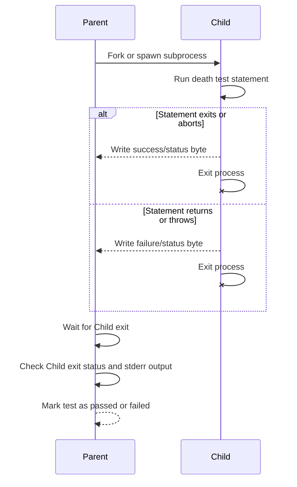

# Death Tests API Reference

GoogleTest's Death Tests API enables you to verify that specific code statements cause a program to terminate unexpectedly or exit abnormally. This is crucial for testing assertions and fatal conditions in your code that should lead to a process abort or crash when certain invariants or preconditions fail.

This documentation guides you through how to write, control, and interpret death tests using GoogleTest's macros and underlying mechanisms.

---

## Overview

### What Are Death Tests?
Death tests check that a particular statement causes your program to terminate, either by an explicit exit call, abort, or an unexpected crash such as signaling or assertion failure. Unlike standard assertions, these tests verify failure *detections* rather than correctness of output.

### Why Use Death Tests?
Death tests ensure that your error handling triggers as intended in critical failure scenarios, such as invalid inputs, out-of-bounds accesses, or violations of invariants. They help prevent latent bugs that cause undefined behavior by verifying that your code fails fast and loud.

### How Death Tests Work Internally
Death tests run the statement under test in a controlled child process, isolated from the parent running the rest of the test suite. Depending on your platform, GoogleTest will fork or spawn a subprocess to run the tested statement and then check:
- Whether the process died as expected.
- Whether the stderr output matches a user-provided pattern.
- Whether the exit status matches the expected conditions.

They support two main styles:
- **Fast**: The child runs the test code immediately after fork.
- **Threadsafe**: The child re-executes the test binary filtered to run just the death test.

You can configure the style via the `--gtest_death_test_style` flag.


---

## API and Usage

GoogleTest offers a set of assertion macros for writing death tests. They execute a statement and verify the program terminates with expected characteristics.

### Core Death Test Macros

#### ASSERT_DEATH(statement, regex_or_matcher)
Asserts that the `statement` terminates the process with a nonzero exit status and that the output written to stderr matches the given regex or matcher.

Example:
```cpp
ASSERT_DEATH(Foo(42), "ERROR: Invalid input");
```

#### EXPECT_DEATH(statement, regex_or_matcher)
Like `ASSERT_DEATH` but a nonfatal failure on test failure, so other tests continue.

#### ASSERT_EXIT(statement, predicate, regex_or_matcher)
Asserts that the `statement` leads to termination, with exit status satisfying the predicate (a function/functor taking an `int` exit code and returning `bool`) and matching stderr.

Example:
```cpp
ASSERT_EXIT(ExitImmediately(), ::testing::ExitedWithCode(0), "Goodbye");
```

Predicates provided:
- `::testing::ExitedWithCode(code)`: matches a normal exit with specific code.
- `::testing::KilledBySignal(signum)`: matches termination by a Unix signal (not available on Windows).

#### EXPECT_EXIT(statement, predicate, regex_or_matcher)
Like `ASSERT_EXIT` but nonfatal failure.

### Debug-Mode-Specific Macros

#### EXPECT_DEBUG_DEATH(statement, regex_or_matcher)
Runs `EXPECT_DEATH` in debug mode; in release mode only runs the statement with no death check.

#### ASSERT_DEBUG_DEATH(statement, regex_or_matcher)
Same as above, with fatal failure behavior.

### Conditional Death Test Macros

#### EXPECT_DEATH_IF_SUPPORTED(statement, regex_or_matcher)
#### ASSERT_DEATH_IF_SUPPORTED(statement, regex_or_matcher)
Use these macros to conditionally run death tests only if the platform supports it, otherwise, they do nothing but log warnings.


---

## Writing Death Tests

Death test statements can be any valid C++ code or block:

```cpp
TEST(MyDeathTest, CheckCrashOnNullPointer) {
  ASSERT_DEATH({ delete nullptr; }, "segmentation fault");
}
```

Multiple death tests can be included per test suite, but ideally each should have a descriptive name and be separated logically.

---

## Configuring Death Test Behavior

Set the death test style globally or per test program via:
```cpp
GTEST_FLAG_SET(death_test_style, "threadsafe"); // or "fast"
```

Or from the command line:
```
--gtest_death_test_style=threadsafe
```

Common build and runtime flags:
- `--gtest_death_test_use_fork`: On POSIX, forces fork/_Exit over clone for subprocess.

The `threadsafe` style provides improved stability in multithreaded environments but at a runtime cost.

---

## Understanding Failure Modes

Death tests fail if:
- The tested statement does not terminate the process.
- The process terminates but with an unexpected exit code.
- The stderr output does not match the expected regex/matcher.
- The statement executes an illegal `return` or throws an exception.

GoogleTest logs detailed diagnostics in these cases.


---

## Advanced Considerations

### Thread Safety
Due to issues with fork in multithreaded programs, the `threadsafe` style is recommended when your tests use multiple threads.

### Exception Handling
If your `statement` throws, that counts as a failure in a death test. GoogleTest catches exceptions and reports them with the exception's message.

### Writing Reliable Matchers
The regex or matcher used to match stderr should be as specific as feasible to avoid false positives or negatives. GoogleTest supports both POSIX extended regex on Unix and limited but sufficient regex support on other platforms.

<br>

## Example Usage
```cpp
TEST(MyDeathTest, TriggersFatalError) {
  ASSERT_DEATH({
    // This code must cause the program to crash or exit.
    CHECK(false) << "force failure";
  }, "force failure");
}

TEST(MyDeathTest, ExitWithSpecificCode) {
  EXPECT_EXIT(exit(42), ::testing::ExitedWithCode(42), "");
}

TEST(MyDeathTest, ThrowsSignalsFailure) {
  EXPECT_DEATH(throw std::runtime_error("fail"), "fail");
}
```

---

## Troubleshooting Death Tests

- If your death test fails to detect termination, ensure the tested code actually crashes or exits.
- Avoid returning from death test statements; this is treated as failure.
- When testing code with threads, use `threadsafe` style (`--gtest_death_test_style=threadsafe`).
- Your tests must be compiled and run in environments supporting subprocess creation.
- Death tests can't observe changes to process state since subprocesses isolate their memory.

---

## Integration with the Test Framework

Death tests increment internal death test counters and integrate with GoogleTest's reporting and XML/JSON output mechanisms.

They can be mixed with regular tests but require the test suite to be declared with meaningful names (often ending with `DeathTest`) to ensure early execution order.

---

## Internal Classes (For Reference)

- `testing::DeathTest`: Abstract base managing death test lifecycle.
- Concrete implementations like `WindowsDeathTest`, `ExecDeathTest`, `NoExecDeathTest` handle platform specifics.
- The framework uses pipes or sockets for IPC between parent and child to report results.


---

## Related Documentation

- [Assertions Reference](reference/assertions.md#death) for detailed usage of death assertions.
- [Death Testing Guide](guides/core-testing-workflows/death-testing) for writing and troubleshooting death tests.
- [Matchers Reference](api-reference/core-testing-apis/matchers) for constructing matchers used in death tests.
- [GoogleTest Primer](overview/introduction-value/what-is-googletest) for overall context.


---

## Summary
| Feature                       | Description                                                        |
|-------------------------------|--------------------------------------------------------------------|
| `ASSERT_DEATH` / `EXPECT_DEATH` | Verify process termination with stderr matching regex/matcher       |
| `ASSERT_EXIT` / `EXPECT_EXIT`   | Verify termination with custom exit status predicates               |
| Death Test Styles              | `fast` (immediate execution), `threadsafe` (re-exec test binary)    |
| Exception Handling            | Exceptions escaping death test count as failures                    |
| Thread Safety                 | Use `threadsafe` style for multithreaded tests                      |
| Failure Diagnosis             | Detailed diagnostics on failure reasons                             |

---

For platform-specific behavior, error codes, and further discussion, please explore GoogleTest's [source implementation](https://github.com/google/googletest/tree/main/googletest) and linked documentation.

---

### Flow of a Death Test



---

## Practical Tips

- Always provide a clear regex or matcher to find expected error text from your test.
- Avoid side effects inside death-tested code because the state is isolated in subprocess.
- Use `EXPECT_DEATH_IF_SUPPORTED` if you want platform-independent tests.
- Name death test suites ending with `DeathTest` for better execution ordering and thread safety warnings.

---

For example, to test a function that crashes on an invalid argument:

```cpp
TEST(FooDeathTest, CrashesOnNull) {
  ASSERT_DEATH(Foo(nullptr), "null pointer");
}
```

This test passes only if calling `Foo(nullptr)` causes the process to die with a message including "null pointer".


---

## Reference

More information is available in the following header and source files:
- `gtest/gtest-death-test.h`
- `gtest/internal/gtest-death-test-internal.h`
- `googletest/src/gtest-death-test.cc`

These contain the API declarations, internal helpers, and platform-specific handling.

---

For detailed examples of death tests usage and their test coverage, refer to:
- `googletest/test/googletest-death-test-test.cc`
- `googletest/test/googletest-death-test_ex_test.cc`

These test suites validate death test macros and their behavior across platforms.

---

End of Death Test API Reference.
