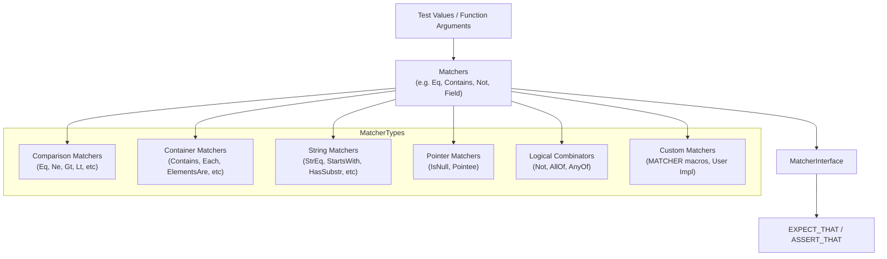

# Matchers

GoogleTest’s matcher system enables writing expressive and readable test expectations. Matchers allow you to describe properties and conditions that values should fulfill, empowering assertions with natural language style expressions and detailed failure explanations.

## Overview

Matchers are objects that determine whether a specific value matches certain criteria. They enable fine-grained control over expectations and provide helpful messages on success or failure.

Matchers in GoogleTest and GoogleMock are polymorphic, allowing them to be used flexibly with multiple types. You typically use them with the macros `EXPECT_THAT`, `ASSERT_THAT`, or in mock method expectations.

## Core Features of Matchers

- **Polymorphism:** Matchers can adapt to the type of the value being checked. This enables writing generic matchers like `Eq(5)` that works for any equality-comparable type.
- **Rich Built-in Library:** Includes comparisons, container contents, string operations, pointer checks, and more.
- **Custom Matchers:** Easily extendable with custom logic using the `MATCHER` macros or by implementing the `MatcherInterface`.
- **Detailed Explanations:** Matchers can provide human-friendly explanations for match success or failure.

## Using Matchers with Assertions

The primary macros that leverage matchers are:

```cpp
EXPECT_THAT(value, matcher);
ASSERT_THAT(value, matcher);
```

For example:

```cpp
#include <gmock/gmock.h>
using ::testing::StartsWith;
using ::testing::MatchesRegex;
using ::testing::AllOf;
using ::testing::Gt;
using ::testing::Lt;

EXPECT_THAT(value1, StartsWith("Hello"));
EXPECT_THAT(value2, MatchesRegex("Line \\d+"));
ASSERT_THAT(value3, AllOf(Gt(5), Lt(10)));
```

Failure messages generated by these macros will include the expected matcher description and an explanation of why the actual value did not match.

## Common Built-In Matchers

### Wildcard Matchers

- `_` or `A<T>()` or `An<T>()`: matches any value of type `T`.

### Comparison Matchers

- `Eq(x)`: matches values equal to `x`.
- `Ne(x)`: matches values not equal to `x`.
- `Lt(x)`, `Le(x)`, `Gt(x)`, `Ge(x)`: matches based on less than, less or equal, greater than, or greater or equal respectively.

These support comparison across compatible types, including implicit conversions.

### Pointer Matchers

- `IsNull()`: matches any null raw or smart pointer.
- `NotNull()`: matches any non-null pointer.
- `Pointee(m)`: matches a pointer whose pointee matches matcher `m`.
- `Pointer(m)`: matches a pointer itself that matches matcher `m`.

### Reference Matchers

- `Ref(variable)`: matches an argument that is a reference to the same variable.

### String Matchers

- `StrEq(str)`: matches strings equal to `str`.
- `StrNe(str)`: matches strings not equal to `str`.
- `StrCaseEq(str)`, `StrCaseNe(str)`: case-insensitive equal or not equal.
- `HasSubstr(substr)`: matches strings containing `substr`.
- `StartsWith(prefix)`: matches strings starting with `prefix`.
- `EndsWith(suffix)`: matches strings ending with `suffix`.
- `MatchesRegex(regex)`: matches strings fully matching the regex.
- `ContainsRegex(regex)`: matches strings containing a substring matching regex.
- `WhenBase64Unescaped(matcher)`: Matches strings that base64 decode to strings matching `matcher`.

### Container Matchers

- `Contains(m)`: matches containers with at least one element matching `m`.
- `Each(m)`: matches containers whose all elements match `m`.
- `SizeIs(m)`: matches containers whose size matches matcher `m` (e.g., `SizeIs(3)`).
- `ElementsAre(...)`: matches containers with elements matching the given matchers in order.
- `UnorderedElementsAre(...)`: similar to `ElementsAre` but element order does not matter.
- `Pointwise(tuple_matcher, rhs)`: matches containers elementwise with pairs matched by `tuple_matcher`.
- `UnorderedPointwise(tuple_matcher, rhs)`: like `Pointwise` but with any element order.

### Specialized Matchers

- `Key(m)`: Matches a pair-like element whose first field matches `m`.
- `Pair(m1, m2)`: Matches a pair-like element whose first field matches `m1` and second `m2`.
- `Optional(m)`: Matches `std::optional` values whose contained value matches `m`.
- `VariantWith(m)`, `AnyWith(m)`: Matches variant or any types with value matching `m`.

### Logical Combinators

- `Not(m)`: negates matcher `m`.
- `AllOf(m1, m2, ...)`: matches if all matchers match.
- `AnyOf(m1, m2, ...)`: matches if any matcher matches.

## Matcher Description and Explanation

Matchers describe themselves with human-readable descriptions used in failure messages. When a match fails, GoogleTest uses a listener to gather explanations from matchers to clarify exactly why a match failed.

For example, if `Gt(5)` fails on `3`, the explanation will indicate how `3` is less than `5`.

```cpp
Matcher<int> m = Gt(5);
EXPECT_TRUE(m.Matches(3));  // Fails
std::cout << Describe(m) << std::endl;  // prints "is > 5"
std::cout << Explain(m, 3) << std::endl;  // prints "which is 2 less than 5"
```

## Extending Matchers: Writing Custom Matchers

GoogleTest provides macros and interfaces to write custom matchers easily:

### MATCHER Macros

- `MATCHER(name, description) { ... }`: Defines a parameterless matcher.
- `MATCHER_P(name, param, description) { ... }`: Defines a matcher parameterized by one argument.
- `MATCHER_P2(name, p1, p2, description) { ... }` and so on, up to 10 parameters.

Inside the `MATCHER` body, you have access to:

- `arg`: the value being matched.
- `result_listener`: (optional) a pointer to a `MatchResultListener` for streaming detailed explanations.

The description string supports evaluating a conditional expression based on `negation` boolean, to customize messaging for negated contexts.

Example:

```cpp
MATCHER(IsEven, "") {
  return (arg % 2) == 0;
}

// Usage:
EXPECT_THAT(x, IsEven());
```

### Implementing MatcherInterface Directly

For advanced fine-grained control or polymorphic matchers, implement `testing::MatcherInterface<T>`. You must provide:

- `bool MatchAndExplain(const T& x, MatchResultListener* listener) const`: Returns whether `x` matches, optionally streaming explanation.
- `void DescribeTo(std::ostream* os) const`: Describe the matcher.
- Optionally `void DescribeNegationTo(std::ostream* os) const`: Describe negation.

You can then wrap your implementation with `Matcher<T>`.

## Practical Tips

- Use matchers liberally to create expressive, human-readable tests.
- Combine matchers with `AllOf`, `AnyOf`, and `Not` to precisely specify conditions.
- For container contents, use `ElementsAre`, `Contains`, and variants.
- Prefer `MATCHER` macros for quick custom matchers with detailed failure messages.
- Stream additional debug data to `result_listener` inside custom matchers to clarify failures.
- Use `EXPECT_THAT` and `ASSERT_THAT` macros to leverage matchers in assertions.

## Common Pitfalls

- Avoid using `Eq` (==) on C-string pointers if you want value comparison; use `StrEq` instead.
- Understand matcher polymorphism: the matcher adapts to the type of the value it is matched against.
- When writing custom matchers, ensure descriptive messages for both positive and negative cases.
- Be mindful that some matchers, especially those that rely on RTTI or dynamic casts, require RTTI enabled in your build.

## Examples

### Basic Usage

```cpp
#include <gmock/gmock.h>
using ::testing::Eq;
using ::testing::IsNull;
using ::testing::NotNull;
using ::testing::HasSubstr;

TEST(MyTest, BasicMatchers) {
  EXPECT_THAT(5, Eq(5));
  EXPECT_THAT(nullptr, IsNull());
  EXPECT_THAT(&x, NotNull());
  EXPECT_THAT(std::string("hello world"), HasSubstr("world"));
}
```

### Using Matchers with Mock Objects

```cpp
class MockFoo {
 public:
  MOCK_METHOD(bool, Bar, (int));
};

MockFoo mock;
EXPECT_CALL(mock, Bar(Gt(5))).WillOnce(Return(true));
```

### Custom Matcher Using `MATCHER`

```cpp
MATCHER(IsEven, "checks if number is even") {
  return (arg % 2) == 0;
}

EXPECT_THAT(value, IsEven());
```


## Related API Functions

- `MatcherCast<T>(m)`: safely cast a matcher to a matcher of type `T`.
- `SafeMatcherCast<T>(m)`: like `MatcherCast` but performs additional compile-time checks.
- `Explain(m, value)`: Returns a string explaining why `value` matches or doesn't match `m`.
- `Describe(m)`: Returns a string description of the matcher `m`.

## Summary

Matchers are the foundation for composing expressive test expectations in GoogleTest. By leveraging built-in and custom matchers, you can create assertions that read naturally and provide detailed output on test failures.

---

# Reference Links

- [GoogleTest Matchers Reference](https://github.com/google/googletest/blob/main/googlemock/include/gmock/gmock-matchers.h)
- [Writing New Matchers Quickly (GoogleMock Cookbook)](https://github.com/google/googletest/blob/main/docs/gmock_cook_book.md#NewMatchers)
- [Assertions Reference](../reference/assertions.md#EXPECT_THAT)
- [Matchers API Overview and Guide](https://github.com/google/googletest/blob/main/docs/matchers.md)

---

# Navigation

This page fits within the **API Reference / Core Testing APIs / Matchers** section, complementing related topics on Assertions, Parameterized Tests, and Mocking APIs.

---

# Troubleshooting

- Ensure RTTI is enabled if you use RTTI-dependent matchers like `WhenDynamicCastTo`.
- When comparisons fail unexpectedly for C-strings, verify using `StrEq` instead of `Eq`.
- For complex containers, use container-specific matchers like `Contains`, `ElementsAre`, to avoid brittle tests.

---

# Diagram: Matchers Relationship (Conceptual)


