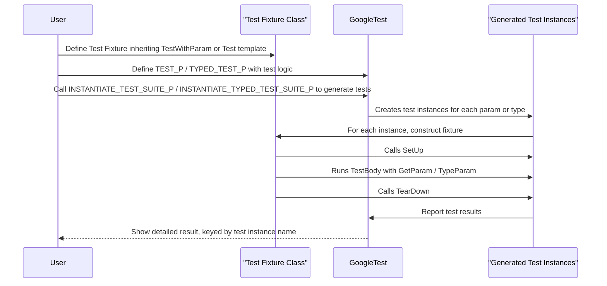

# Parameterized and Typed Tests

GoogleTest provides powerful APIs and workflows for writing tests that run multiple times with different data values or types. This page guides you through concepts and mechanisms to define **value-parameterized tests** and **type-parameterized tests**, enabling reusable and generalized test logic that scales elegantly.

---

## Overview

Parameterized tests help you efficiently verify code behavior over a variety of input values or type parameters without duplicating test code. Instead of manually writing multiple test cases for each data point, you write test patterns and instantiate them with sets of values or types. GoogleTest ensures each instance is treated as an independent test with its own result and unique, expressive test name.

This documentation covers:
- How to write value-parameterized tests using `TEST_P` and instantiate them via `INSTANTIATE_TEST_SUITE_P` with built-in parameter generators.
- How to write typed tests (`TYPED_TEST`) and type-parameterized tests (`TYPED_TEST_P`) for running the same logic over a list of types.
- Best practices and macros involved in defining fixtures and test suites for reusable test logic.

---

## Value-Parameterized Tests

### What Are Value-Parameterized Tests?

These allow you to test your code with different values without writing repetitive test cases. They are ideal for:
- Testing functions with various input parameters.
- Running tests across different configuration flags or options.

### How to Define Value-Parameterized Tests

1. **Create a test fixture class inheriting from `TestWithParam<T>`** where `T` is the type of parameter.

```cpp
class MyTestSuite : public ::testing::TestWithParam<int> {
  // Fixture setup if needed
};
```

2. **Define parameterized tests using `TEST_P`**.

```cpp
TEST_P(MyTestSuite, HandlesValues) {
  int param = GetParam();
  EXPECT_TRUE(param > 0);  // Sample assertion
}
```

3. **Instantiate tests with `INSTANTIATE_TEST_SUITE_P` macro** to supply parameters.

```cpp
INSTANTIATE_TEST_SUITE_P(
    PositiveValues, MyTestSuite, testing::Values(1, 2, 3));
```

### Accessing Parameters Inside Tests

Use the fixture member function `GetParam()` to access the current parameter in each test instance.

### Parameter Generators

GoogleTest provides helper functions to generate parameters:

| Generator         | Description                                           |
|-------------------|-------------------------------------------------------|
| `Range(b, e [, s])`        | Generates values from `b` to `< e`, stepping by `s` (defaults to 1).   |
| `Values(v1, v2, ...)`      | Yields provided values explicitly.                     |
| `ValuesIn(container)`      | Uses values from container (C arrays, STL containers, iterator ranges). |
| `Bool()`                   | Yields `{false, true}`.                                |
| `Combine(g1, g2, ...)`     | Creates Cartesian product tuples from multiple generators. |
| `ConvertGenerator<T>(g)`   | Converts generated values to type `T`, optionally with a custom converter function. |

### Custom Test Names

You can provide a custom name generator function to produce readable test names reflecting parameters:

```cpp
INSTANTIATE_TEST_SUITE_P(
    MyInstantiation, MyTestSuite, testing::Values(1, 2, 3),
    [](const testing::TestParamInfo<MyTestSuite::ParamType>& info) {
      return "Param_" + std::to_string(info.index);
    });
```

Note that test names must consist of alphanumeric characters and underscores only.

### Example Summary

```cpp
class MyTest : public testing::TestWithParam<int> {};

TEST_P(MyTest, IsPositive) {
  EXPECT_GT(GetParam(), 0);
}

INSTANTIATE_TEST_SUITE_P(Positives, MyTest, testing::Values(1, 2, 3));
```

This instantiates three tests, each running the same logic with parameters `1`, `2`, and `3`.

### Allowing Uninstantiated Parameterized Tests

If you define a `TEST_P` but do not instantiate it, GoogleTest will fail by default. Suppress this check with:

```cpp
GTEST_ALLOW_UNINSTANTIATED_PARAMETERIZED_TEST(MyTestSuite);
```

---

## Typed Tests

Typed tests run the same test logic over a fixed list of types known at definition time. They are useful when verifying behavior across types such as `int`, `float`, or user-defined classes.

### Defining Typed Tests

1. **Declare a fixture as a class template parameterized by a type:**

```cpp
template <typename T>
class MyTypedTest : public ::testing::Test {
 protected:
  T value_;
};
```

2. **Associate a list of types with the suite using `TYPED_TEST_SUITE`:**

```cpp
using MyTypes = ::testing::Types<int, double, char>;
TYPED_TEST_SUITE(MyTypedTest, MyTypes);
```

3. **Define typed tests with `TYPED_TEST` macro:**

```cpp
TYPED_TEST(MyTypedTest, IsDefaultConstructible) {
  TypeParam instance{};  // TypeParam refers to the type
  (void)instance;       // silence unused warning
  SUCCEED();
}
```

Each typed test will run once for each type specified in the type list.

### Customizing Test Suite Names

You may optionally provide a type name generator class to specify suffixes for test suite names per type.

```cpp
class MyNameGen {
 public:
  template <typename T>
  static std::string GetName(int) {
    if constexpr (std::is_same_v<T, int>) return "Int";
    else if constexpr (std::is_same_v<T, double>) return "Double";
    else return "Unknown";
  }
};
TYPED_TEST_SUITE(MyTypedTest, MyTypes, MyNameGen);
```

This influences how the test suite names appear in test reports.

---

## Type-Parameterized Tests

Type-parameterized tests provide reusable test logic that can be instantiated with any set of types at multiple points, even across different translation units.

They are defined with macros ending in `_P` and require explicit registration and instantiation.

### Workflow

1. **Define a fixture class template:**

```cpp
template <typename T>
class MyTypeParamTest : public ::testing::Test {};
```

2. **Declare the type-parameterized test suite:**

```cpp
TYPED_TEST_SUITE_P(MyTypeParamTest);
```

3. **Define tests using `TYPED_TEST_P`:**

```cpp
TYPED_TEST_P(MyTypeParamTest, HasDefaultConstructor) {
  TypeParam instance{};
  SUCCEED();
}
```

4. **Register the test names:**

```cpp
REGISTER_TYPED_TEST_SUITE_P(MyTypeParamTest, HasDefaultConstructor);
```

5. **Instantiate the suite with specific types:**

```cpp
using MyTypes = ::testing::Types<int, double>;
INSTANTIATE_TYPED_TEST_SUITE_P(MyInstance, MyTypeParamTest, MyTypes);
```

### Advantages

- Abstract reusable test patterns.
- Instantiate with different type lists in multiple places.
- Great for interface or concept verification across implementations.

---

## Macros Reference Summary

| Macro                                 | Purpose                                               |
|---------------------------------------|-------------------------------------------------------|
| `TEST_P(Fixture, TestName)`            | Define a single value-parameterized test.             |
| `INSTANTIATE_TEST_SUITE_P(Name, TestSuite, Params, NameGen?)` | Instantiate value-parameterized tests with parameters and optionally custom naming. |
| `TYPED_TEST_SUITE(Fixture, Types, NameGen?)`  | Define typed test suite with fixed list of types.       |
| `TYPED_TEST(Fixture, TestName)`        | Define a typed test instance.                          |
| `TYPED_TEST_SUITE_P(Fixture)`           | Declare a type-parameterized test suite.              |
| `TYPED_TEST_P(Fixture, TestName)`        | Define a test in a type-parameterized suite.           |
| `REGISTER_TYPED_TEST_SUITE_P(Fixture, TestNames...)` | Register tests in a type-parameterized suite.           |
| `INSTANTIATE_TYPED_TEST_SUITE_P(Name, Fixture, Types, NameGen?)` | Instantiate a type-parameterized test suite with types. |
| `GTEST_ALLOW_UNINSTANTIATED_PARAMETERIZED_TEST(Fixture)` | Mark a value-parameterized test suite as allowed to be uninstantiated. |

---

## Best Practices

- **Parameterize tests when testing multiple values or configurations to avoid duplication and improve maintainability.**
- Avoid overly complex test parameter combinations that make diagnosis harder.
- Use meaningful, unique test instance names by implementing custom name generators.
- For type-parameterized and type-parameterized tests, keep fixtures minimal and clean to ensure compilation efficiency.
- Use `GTEST_ALLOW_UNINSTANTIATED_PARAMETERIZED_TEST` when creating libraries with abstract tests to avoid unwanted test failures.

---

## Troubleshooting

- Tests defined with `TEST_P` but not instantiated cause failures; either instantiate them or explicitly allow uninstantiated tests.
- Ensure parameter types are copyable.
- When using `ConvertGenerator`, be careful with lifetimes especially with references or views in conversion lambdas.
- Names generated by custom name functions must be valid identifiers (alphanumeric + underscore).
- Test fixture `SetUpTestSuite()` and `TearDownTestSuite()` must be `public` for use with `TEST_P`.

---

## Getting the Current Test Name and Parameter

Within a test body, you can fetch metadata about the current test case and parameter via `::testing::UnitTest::GetInstance()->current_test_info()`. This helps for dynamic test behavior or logging:

```cpp
const ::testing::TestInfo* info = ::testing::UnitTest::GetInstance()->current_test_info();
std::cout << "Running test: " << info->test_suite_name() << "." << info->name() << " with parameter " << info->value_param() << std::endl;
```

---

## Related Concepts

Further refine your parameterized and typed tests experience by exploring:

- **Using Powers of Combination:** `Combine` parameter generator for Cartesian products of parameters.
- **Custom Predicates in Tests:** For expressive assertions that adapt to parameters.
- **Global and Suite-Level Setup:** For shared test resources even across parameterized suites.

For advanced scenarios beyond this reference, see [Advanced GoogleTest Topics](../advanced.md#value-parameterized-tests) and [Typed Tests](../advanced.md#typed-tests).

---

## Additional Resources

- [GoogleTest Primer](../primer.md) — To grasp basic test writing.
- [Testing Reference](../reference/testing.md) — For macro and type definitions.
- [Advanced Guide on Parameterized Tests](../advanced.md#value-parameterized-tests) — For deeper knowledge.
- [Assertions Reference](../../api-reference/core-testing-apis/assertions-reference.mdx) — To master assertions within parameterized tests.

---

## Source Code and Examples

You may review GoogleTest’s internal parameterized test implementation and comprehensive tests in the following files to understand usage patterns and details:

- `googletest/include/gtest/gtest-param-test.h`
- `googletest/include/gtest/gtest-typed-test.h`
- `googletest/test/googletest-param-test-test.cc`
- `googletest/test/gtest-typed-test_test.cc`

You can access these sources in the [GoogleTest GitHub repository](https://github.com/google/googletest/tree/main/googletest).

---

## Summary Diagram of Parameterized Test Workflow



---

