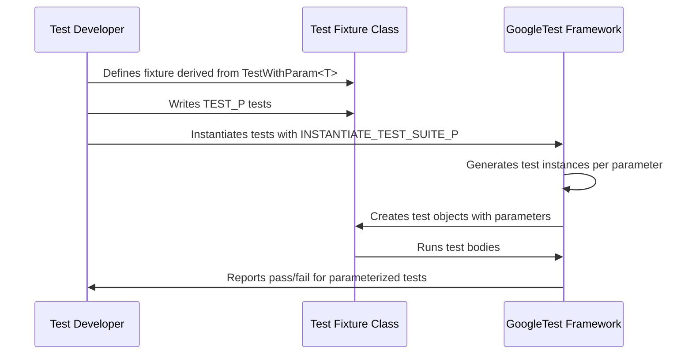

# Parameterized and Typed Tests

GoogleTest offers powerful macros and APIs to run your test logic against a variety of input values and data types, enabling comprehensive test coverage without redundant code. This document provides a detailed reference for value-parameterized tests, typed tests, and type-parameterized tests, covering how to write reusable tests that operate over different inputs or types using fixtures, macros, and parameter generators.

---

## Value-Parameterized Tests (Using `TEST_P` and `INSTANTIATE_TEST_SUITE_P`)

### Purpose

Use value-parameterized tests to run the same test logic multiple times with different input values, minimizing code duplication and ensuring robustness of your code across diverse data sets.

### Defining a Parameterized Test Fixture

1. Define a fixture class derived from `::testing::TestWithParam<T>`, where `T` is the type of your test parameter.

```cpp
class FooTest : public ::testing::TestWithParam<const char*> {
  // Usual fixture members here
};
```

2. Write parameterized tests using `TEST_P`, which allows access to the current parameter via `GetParam()`:

```cpp
TEST_P(FooTest, DoesBlah) {
  EXPECT_TRUE(foo.Blah(GetParam()));
}

TEST_P(FooTest, HasBlahBlah) {
  ...
}
```

### Instantiating Test Suites with Parameters

Instantiate the parameterized test suite with test data using `INSTANTIATE_TEST_SUITE_P`. The first argument is a unique prefix to distinguish sets of parameterized tests.

```cpp
INSTANTIATE_TEST_SUITE_P(InstantiationName,
                         FooTest,
                         ::testing::Values("meeny", "miny", "moe"));
```

This generates tests with names like:

- `InstantiationName/FooTest.DoesBlah/0` for parameter `"meeny"`
- `InstantiationName/FooTest.DoesBlah/1` for parameter `"miny"`
- `InstantiationName/FooTest.DoesBlah/2` for parameter `"moe"`

You can also instantiate multiple instances of a parameterized test with different parameter sets:

```cpp
const char* pets[] = {"cat", "dog"};
INSTANTIATE_TEST_SUITE_P(AnotherInstantiationName, FooTest, ::testing::ValuesIn(pets));
```

### Parameter Generators

GoogleTest provides several built-in functions to generate sequences of parameters:

| Generator Function       | Description                                                                                             |
|-------------------------|-----------------------------------------------------------------------------------------------------|
| `Range(begin, end[, step])` | Generates values starting at `begin` up to but not including `end`, incremented by `step` (default 1). |
| `Values(v1, v2, ..., vN)`     | Generates the specified values explicitly.                                                           |
| `ValuesIn(container)` or `ValuesIn(begin, end)` | Generates values from arrays, STL containers, or iterator ranges.                                |
| `Bool()`                      | Generates `false` and `true`.                                                                         |
| `Combine(g1, g2, ..., gN)`    | Generates all combinations (Cartesian product) of values from the generators `g1` to `gN`.            |

### Customizing Test Names

`INSTANTIATE_TEST_SUITE_P` optionally accepts a name generator, a callable that produces readable and unique test suffixes from the test parameters to improve test reporting:

```cpp
INSTANTIATE_TEST_SUITE_P(
    MyInstantiation, FooTest,
    ::testing::Values(...),
    [](const ::testing::TestParamInfo<FooTest::ParamType>& info) {
      return std::string("Custom") + std::to_string(info.index);
    });
```

### Handling Parameterized Tests in Complex Hierarchies

In more complex cases, inherit separately from `::testing::Test` and `::testing::WithParamInterface<T>` rather than from `TestWithParam<T>`. This allows mixing parameterized behavior in test class hierarchies.

### Marking Uninstantiated Parameterized Tests

If you define parameterized tests with `TEST_P` but do not instantiate them with `INSTANTIATE_TEST_SUITE_P`, this causes a failure. You can suppress this with:

```cpp
GTEST_ALLOW_UNINSTANTIATED_PARAMETERIZED_TEST(MyTestSuite);
```


---

## Typed Tests (`TYPED_TEST_SUITE` and `TYPED_TEST`)

### Purpose

Typed tests allow you to write the same test logic once and run it over a fixed set of C++ types determined at compile time.

### Defining Typed Tests

1. Define a test fixture class template parameterized by a type `T`, typically inheriting from `::testing::Test`:

```cpp
template <typename T>
class FooTest : public ::testing::Test {
 public:
  using List = std::list<T>;
  static T shared_;
  T value_;
};
```

2. Associate a list of types using `::testing::Types` and the `TYPED_TEST_SUITE` macro:

```cpp
using MyTypes = ::testing::Types<char, int, unsigned int>;
TYPED_TEST_SUITE(FooTest, MyTypes);
```

3. Use `TYPED_TEST` to write tests that run for each type `T`:

```cpp
TYPED_TEST(FooTest, DoesBlah) {
  TypeParam n = this->value_;
  n += TestFixture::shared_;
  typename TestFixture::List values;
  values.push_back(n);
  ...
}
```

Note: Within typed tests, use `TypeParam` to refer to the current type being tested, and use `this->` or `TestFixture::` to access members.

### Custom Type Naming

Optionally, use a type-name generator class in `TYPED_TEST_SUITE` to provide human-readable suffixes to type tests:

```cpp
class MyTypeNames {
 public:
  template <typename T>
  static std::string GetName(int) {
    if (std::is_same<T, char>()) return "char";
    if (std::is_same<T, int>()) return "int";
    return "unknown";
  }
};
TYPED_TEST_SUITE(FooTest, MyTypes, MyTypeNames);
```

---

## Type-Parameterized Tests (Pattern-Based Typed Tests) (`TYPED_TEST_SUITE_P`, `TYPED_TEST_P`, and registration macros)

### Purpose

Type-parameterized tests are helpful when you want to define an abstract test pattern without knowing the types up front. These tests can be instantiated multiple times with different type lists in different translation units.

### Defining Type-Parameterized Tests

1. Define a fixture class template:

```cpp
template <typename T>
class FooTest : public ::testing::Test {
  ...
};
```

2. Declare you will define a type-parameterized test suite:

```cpp
TYPED_TEST_SUITE_P(FooTest);
```

3. Define tests with `TYPED_TEST_P`:

```cpp
TYPED_TEST_P(FooTest, DoesBlah) {
  TypeParam n = 0;
  ...
}

TYPED_TEST_P(FooTest, HasPropertyA) {
  ...
}
```

4. Register the names of tests:

```cpp
REGISTER_TYPED_TEST_SUITE_P(FooTest, DoesBlah, HasPropertyA);
```

5. Instantiate tests with a type list and optional instantiation prefix:

```cpp
using MyTypes = ::testing::Types<char, int, unsigned int>;
INSTANTIATE_TYPED_TEST_SUITE_P(My, FooTest, MyTypes);
```

6. Optionally, add a type-naming generator to provide readable test suite names.

### Benefits

- Define your tests in headers without binding to concrete types.
- Instantiate the test suite multiple times with different types.
- Allow separate compilation and modular testing.

### Notes

- The test suite name is the fixture class template name.
- Tests within the suite must be registered before instantiation.

---

## Using `FRIEND_TEST` to Access Private Members

Declare tests as friends of a class to allow testing private implementation details:

```cpp
class MyClass {
  FRIEND_TEST(MyClassTest, HasPropertyA);
  ...
};
```

The test fixture must be in the same namespace.

---

## Scoped Trace Messages (`SCOPED_TRACE`)

Add contextual trace information to failures within a test scope, aiding debugging especially in loops or complex tests:

```cpp
SCOPED_TRACE("Iteration 3");
EXPECT_EQ(foo, bar);
```

All failures in this scope will include the trace and source info.

---

## Skipping Tests at Runtime (`GTEST_SKIP`)

Temporarily skip tests during runtime conditionally:

```cpp
GTEST_SKIP() << "Skipping test because of unmet precondition.";
```

Allows streaming a message similar to assertions.

---

## Best Practices and Troubleshooting

- **Use valid identifiers:** Test suite names and test names must be valid C++ identifiers without underscores for parameterized and typed tests.
- **Avoid duplicate parameterized test names:** Custom test name generators must produce unique suffixes.
- **Instantiate all parameterized tests:** Forgetting to instantiate parameterized tests leads to test suite warnings or no test run.
- **Use `SCOPED_TRACE` for nested assertions:** Helps trace the failure context.
- **Use `GTEST_ALLOW_UNINSTANTIATED_PARAMETERIZED_TEST` for tests you declare but do not instantiate intentionally.**

---

## Summary

This reference comprehensively covers macros and techniques for writing parameterized and typed tests in GoogleTest, including:

- The `TEST_P` macro for value-parameterized tests and use of parameter generators like `Values()`, `Range()`, and `Combine()`.
- Instantiating parameterized test suites with `INSTANTIATE_TEST_SUITE_P` and customizing parameter-based test names.
- Defining typed tests using `TYPED_TEST_SUITE` and `TYPED_TEST` to run tests over a fixed list of types.
- Using type-parameterized test suites (`TYPED_TEST_SUITE_P`, `TYPED_TEST_P`, `REGISTER_TYPED_TEST_SUITE_P`) for flexible reusable abstract test patterns.
- Utilities for managing friendship (`FRIEND_TEST`), adding trace context (`SCOPED_TRACE`), and skipping tests (`GTEST_SKIP`).

## References

- [GoogleTest Primer](../primer.md)
- [Testing Reference](testing.md)
- [Advanced Guide: Parameterized and Typed Tests](../advanced.md#value-parameterized-tests)
- [Matchers Reference](../reference/matchers.md)
- [Assertions Reference](../reference/assertions.md)

---

For a visual overview of the parameterized test workflow, see the flow below:


