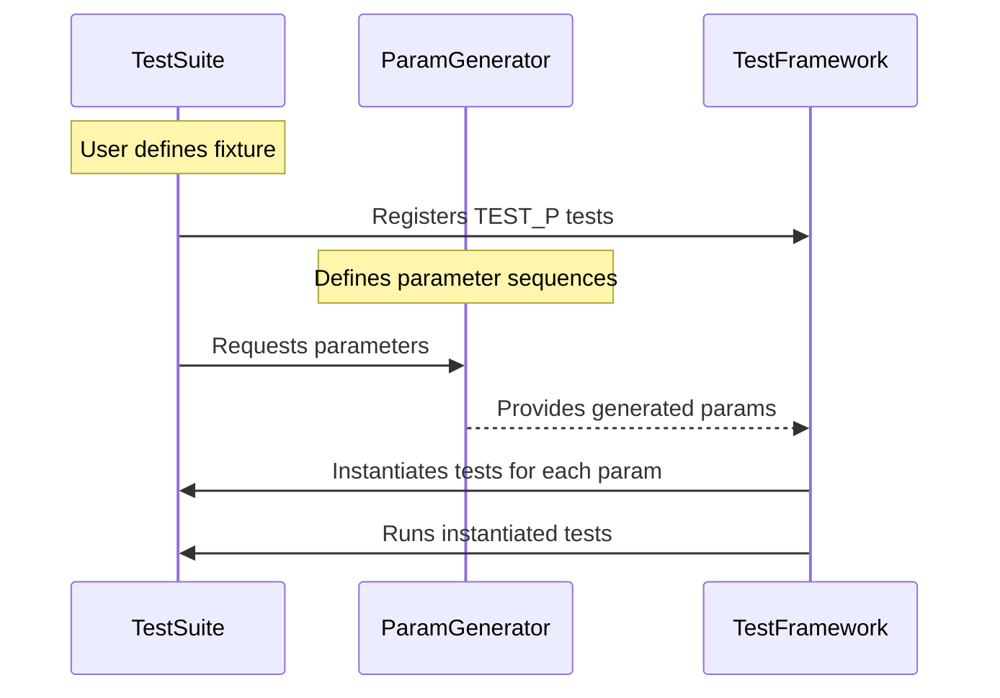

# Parameterized and Typed Tests

GoogleTest extends its powerful testing infrastructure with **parameterized tests** and **typed tests**, enabling you to write flexible, maintainable, and concise tests that automatically run across multiple input values or types. This reference documents the core macros, test fixture patterns, parameter generators, and instantiation mechanisms essential for creating scalable and DRY test coverage.

---

## Value-Parameterized Tests

Value-parameterized tests let you write a single test logic that runs multiple times with different parameter values, eliminating the need to duplicate test code.

### Defining a Value-Parameterized Test Fixture

Your fixture class should derive from `::testing::TestWithParam<T>`, where `T` is your parameter type. This type can be any copyable type (including primitive types, structs, tuples, or pointers).

```cpp
class FooTest : public ::testing::TestWithParam<const char*> {
  // Implement setup, teardown, and test helpers here.
};
```

### Writing Tests with `TEST_P`

Use the macro `TEST_P` (the _P stands for parameterized or pattern) to define each test using the parameterized fixture. Access the current parameter with `GetParam()`.

```cpp
TEST_P(FooTest, DoesBlah) {
  EXPECT_TRUE(foo.Blah(GetParam()));
}

TEST_P(FooTest, HasBlahBlah) {
  // Additional tests using GetParam().
}
```

### Instantiating Tests with `INSTANTIATE_TEST_SUITE_P`

Create instantiations of your parameterized test suite by specifying a unique instantiation name and a parameter generator. Generator functions produce sequences of parameter values for individual test runs.

```cpp
INSTANTIATE_TEST_SUITE_P(InstantiationName, FooTest, 
    testing::Values("meeny", "miny", "moe"));
```

Each instantiated test will appear in test results with the pattern:

```
InstantiationName/FooTest.DoesBlah/0
InstantiationName/FooTest.DoesBlah/1
InstantiationName/FooTest.DoesBlah/2
```

You can instantiate the same test suite multiple times with different parameter sets:

```cpp
const char* pets[] = {"cat", "dog"};
INSTANTIATE_TEST_SUITE_P(AnotherInstantiationName, FooTest, testing::ValuesIn(pets));
```

### Built-in Parameter Generators

GoogleTest provides several generator utility functions:

| Generator Function  | Description |
|---------------------|-------------|
| `Range(begin, end [, step])`  | Generates values from `begin` up to but excluding `end`, with optional `step` (default 1). |
| `Values(v1, v2, ..., vN)`     | Generates the explicitly specified values. |
| `ValuesIn(container or begin, end)` | Generates values read from a container or iterator range. |
| `Bool()`                     | Generates `{false, true}`. Useful for binary flags. |
| `Combine(g1, g2, ..., gN)`   | Cartesian product of multiple generators, producing `std::tuple`s. |

Example usage:

```cpp
INSTANTIATE_TEST_SUITE_P(
    AllCombinations,
    MyTest,
    Combine(Values("cat", "dog"), Bool()));
```

This runs all combination pairs of strings and Boolean values.

### Using `ConvertGenerator` for Custom Types

When your test fixture uses a parameter type that is not directly produced by the built-in generators, you can convert generated values into your custom type either via `static_cast` or a callable.

```cpp
class MyParam {
 public:
  explicit MyParam(const std::tuple<int, bool>& t) { /*...*/ }
};

INSTANTIATE_TEST_SUITE_P(
    CustomParams, MyTest,
    ConvertGenerator<std::tuple<int, bool>>(
        Combine(Values(0, 1), Bool())));
```

For more complex conversions involving lambdas:

```cpp
INSTANTIATE_TEST_SUITE_P(
    CustomLambda,
    MyTest,
    ConvertGenerator(Combine(Values(1, 2), Bool()),
                     [](const std::tuple<int, bool>& t) {
                       return MyParam(t);
                     }));
```

### Important Details

- Test instantiations will run after `main()` starts, allowing dynamic configuration.
- The instantiation prefix (`InstantiationName`) differentiates the test instances,
  so choose meaningful unique names.
- The actual test names include the parameter index by default but can be customized using optional name generators.
- Generator expressions are evaluated exactly once after `InitGoogleTest()` is called.
- The parameter names must contain only alphanumeric characters and underscores.

### Common Pitfalls

- Forgetting to instantiate the test suite leads to no test runs.
- Using invalid characters in test or parameter names causes registration errors.
- Dangling references from parameter names generated from temporary values require explicit type annotations in `ConvertGenerator`.

---

## Typed Tests

Typed tests allow the same test logic to be run over a list of types rather than values, expanding coverage of template classes or type-specific behavior.

### Defining Typed Test Fixtures

Define a class template derived from `testing::Test`:

```cpp
template <typename T>
class FooTest : public testing::Test {
  // Test fixture code for all types T.
};
```

Declare the types to test as a `Types` list:

```cpp
using MyTypes = ::testing::Types<char, int, unsigned int>;
```

Associate the types with the test suite:

```cpp
TYPED_TEST_SUITE(FooTest, MyTypes);
```

### Writing Typed Tests

Use the `TYPED_TEST` macro, referring to the current type with `TypeParam`:

```cpp
TYPED_TEST(FooTest, DoesBlah) {
  TypeParam n = this->value_;
  EXPECT_TRUE(SomeOperation(n));
}
```

Each typed test is run once for each type in the list.

### Type-Parameterized Tests (Type-Parameterized Test Suites)

For even more flexibility, define type-parameterized test suites that can be instantiated multiple times with different type lists across translation units.

1. Declare your fixture with `TYPED_TEST_SUITE_P(FooTest);`
2. Define tests with `TYPED_TEST_P(FooTest, TestName) { ... }`
3. Register the tests:

```cpp
REGISTER_TYPED_TEST_SUITE_P(FooTest, TestName1, TestName2);
```

4. Instantiate with `INSTANTIATE_TYPED_TEST_SUITE_P(Prefix, FooTest, TypesList);`

This allows defining abstract test patterns reusable across different sets of types.

---

## Example Walk-Through

```cpp
// Define a parameterized fixture
class MyParamTest : public ::testing::TestWithParam<int> {};

// Define tests using GetParam()
TEST_P(MyParamTest, IsPositive) {
  EXPECT_GT(GetParam(), 0);
}

// Instantiate with a range
INSTANTIATE_TEST_SUITE_P(PositiveRange, MyParamTest, testing::Range(1, 5));
```

```cpp
// Define a typed test fixture template
template <typename T>
class MyTypedTest : public ::testing::Test {
 public:
  T value_{};
};

using MyTypes = ::testing::Types<int, double>;
TYPED_TEST_SUITE(MyTypedTest, MyTypes);

TYPED_TEST(MyTypedTest, InitializedToZero) {
  EXPECT_EQ(this->value_, TypeParam{});
}
```

---

## Troubleshooting & Best Practices

- **Ensure Instantiations**: Always pair `TEST_P` with `INSTANTIATE_TEST_SUITE_P` to activate tests.
- **Unique Instantiation Names**: Provide distinct prefixes for multiple instantiations of the same suite.
- **Parameter Name Validity**: Use only alphanumeric and underscore characters in test parameter names.
- **Use `GetParam()` Safely**: Access parameters only inside `TEST_P` bodies; accessing them prematurely leads to undefined behavior.
- **Customizing Test Names**: Supply a custom name generator lambda or functor if default names are insufficient or cause conflicts.
- **Leverage Generators**: Utilize built-in generators like `Range()`, `Values()`, `ValuesIn()`, `Bool()`, and `Combine()` for concise parameter definition.
- **Avoid Dangling References**: When using strings or temporaries in `ConvertGenerator` callables, ensure the lifetime is managed appropriately.
- **Typed Test Names**: Define a name generator class for typed tests if default automatic naming is not descriptive enough.

---

## References and Related Documentation

- [Value-Parameterized Tests Guide](../guides/advanced-testing-features/parameterized-tests.md)
- [Typed Tests Guide](../guides/advanced-testing-features/parameterized-tests.md#typed-tests)
- [`TEST_P` macro Reference](../api-reference/core-testing-apis/testing.md#TEST_P)
- [`INSTANTIATE_TEST_SUITE_P` macro Reference](../api-reference/core-testing-apis/testing.md#INSTANTIATE_TEST_SUITE_P)
- [`TYPED_TEST` and `TYPED_TEST_SUITE` macros](../api-reference/core-testing-apis/testing.md#TYPED_TEST)

---

## Diagram: Parameterized Test Instantiation Flow


---

## Source Reference
<Source url="https://github.com/google/googletest" paths={[{"path": "googletest/include/gtest/gtest-param-test.h", "range": "1-400"},{"path": "googletest/include/gtest/gtest-typed-test.h", "range": "1-200"}]}/>
