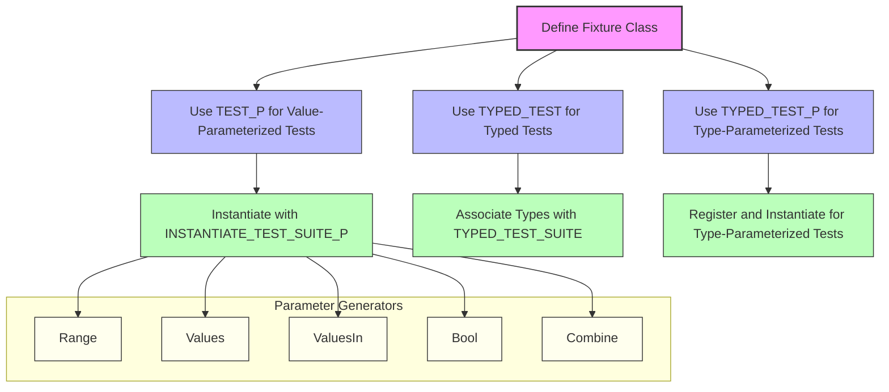

# Parameterized and Typed Tests

GoogleTest empowers you to write tests that automatically repeat across different data sets and types, significantly enhancing test coverage without redundant code. This page guides you through value-parameterized and type-parameterized tests, explaining how to define, instantiate, and leverage these powerful features to craft reusable test logic that scales.

---

## 1. Introduction to Parameterized and Typed Tests

Traditional testing often requires writing multiple test cases to validate the same functionality over varying inputs or types. Parameterized and typed tests eliminate this duplication by allowing a single test definition to execute multiple times with different parameters or types.

This approach not only reduces boilerplate but also promotes consistency and thoroughness by encouraging broad data and type coverage.

---

## 2. Value-Parameterized Tests

### What They Are
Value-parameterized tests let you write a test once and run it with different parameter values. They are ideal when your test logic is the same but input data varies.

### How to Write Value-Parameterized Tests

1. **Define a Test Fixture Class**
    - Derive your fixture from `testing::TestWithParam<T>`, where `T` is the parameter type.

```cpp
class FooTest : public ::testing::TestWithParam<int> {
  // Usual fixture members here.
};
```

2. **Define Tests Using `TEST_P`**
    - Define your test logic using the `TEST_P` macro.
    - Access the parameter inside tests with `GetParam()`.

```cpp
TEST_P(FooTest, HandlesInput) {
  int param = GetParam();
  EXPECT_TRUE(Process(param));
}
```

3. **Instantiate the Test Suite**
    - Use `INSTANTIATE_TEST_SUITE_P` to provide the parameter set.
    - Supply a unique instantiation name and a parameter generator like `Values()`, `Range()`, or `ValuesIn()`.

```cpp
INSTANTIATE_TEST_SUITE_P(
    IntTests, FooTest, testing::Values(1, 2, 3));
```

### Parameter Generators
GoogleTest offers flexible parameter generators:

| Generator                 | Description                                                  |
|---------------------------|--------------------------------------------------------------|
| `Range(begin, end [, step])` | Generates sequential values from `begin` up to (but not including) `end` with optional `step`.
| `Values(v1, v2, ..., vN)`    | Enumerates the listed values explicitly.
| `ValuesIn(container or array)` | Uses elements from a container or iterator range.
| `Bool()`                     | Generates `false` and `true` values.
| `Combine(g1, g2, ..., gN)`   | Produces tuples of Cartesian product of generators.

### Customizing Test Names
To create meaningful test names for different parameter values, use the optional last argument in `INSTANTIATE_TEST_SUITE_P` to specify a naming function or functor:

```cpp
INSTANTIATE_TEST_SUITE_P(
    NamedInstances, FooTest, testing::Range(0, 3),
    [](const testing::TestParamInfo<int>& info) {
      return "Param_" + std::to_string(info.param);
    });
```

### Notes
- `INSTANTIATE_TEST_SUITE_P` can instantiate tests either before or after `TEST_P` definitions.
- Uninstantiated `TEST_P` suites cause failures by default; use `GTEST_ALLOW_UNINSTANTIATED_PARAMETERIZED_TEST` to suppress this.
- Parameters must be copyable.

---

## 3. Typed Tests

### Overview
Typed tests let you write tests over multiple types without rewriting the test logic. This is particularly useful when verifying multiple implementations of the same interface or concept.

### How to Write Typed Tests

1. **Define a Fixture Class Template**
    - Template your fixture on a type parameter.
    - Derive from `testing::Test`.

```cpp
template <typename T>
class MyTypedTest : public testing::Test {
 protected:
  T value_ = T(42);
};
```

2. **Associate a Type List**
    - Use `TYPED_TEST_SUITE` to register the list of types.

```cpp
using MyTypes = ::testing::Types<int, double, char>;
TYPED_TEST_SUITE(MyTypedTest, MyTypes);
```

3. **Define Typed Tests Using `TYPED_TEST`**
    - Use `TypeParam` inside the test as the current type.

```cpp
TYPED_TEST(MyTypedTest, ValueIsCorrect) {
  TypeParam val = this->value_;
  EXPECT_NE(val, TypeParam());
}
```

### Typed Test Name Customization
You may provide a custom naming class with a static `GetName(int)` method allowing fine control over the type suffix in test names:

```cpp
class TypeNameGenerator {
 public:
  template <typename T>
  static std::string GetName(int) {
    if constexpr (std::is_same<T, int>::value) return "Int";
    if constexpr (std::is_same<T, double>::value) return "Double";
    return "Other";
  }
};

TYPED_TEST_SUITE(MyTypedTest, MyTypes, TypeNameGenerator);
```

### Notes
- The test fixture is instantiated separately for each type.
- Typed tests require the set of types at compile time.

---

## 4. Type-Parameterized Tests

Type-parameterized tests extend typed tests by allowing you to define abstract test templates that are only instantiated with type lists later. This promotes modularity and reuse across translation units.

### How to Write Type-Parameterized Tests

1. **Define a Fixture Class Template**
    - Templated on a type.

```cpp
template <typename T>
class MyTypeParamTest : public testing::Test {
};
```

2. **Declare a Type-Parameterized Test Suite**
    - Use `TYPED_TEST_SUITE_P`.

```cpp
TYPED_TEST_SUITE_P(MyTypeParamTest);
```

3. **Define Tests Using `TYPED_TEST_P`**

```cpp
TYPED_TEST_P(MyTypeParamTest, DoesSomething) {
  TypeParam val = TypeParam();
  EXPECT_TRUE(SomeCondition(val));
}
```

4. **Register Tests**
    - Use `REGISTER_TYPED_TEST_SUITE_P` listing all tests.

```cpp
REGISTER_TYPED_TEST_SUITE_P(MyTypeParamTest, DoesSomething);
```

5. **Instantiate with Types**
    - Use `INSTANTIATE_TYPED_TEST_SUITE_P` in your source files, 
      specifying the type list.

```cpp
using MyTypes = ::testing::Types<int, char>;
INSTANTIATE_TYPED_TEST_SUITE_P(MyInstance, MyTypeParamTest, MyTypes);
```

### Notes
- This separates test logic definition from type instantiation.
- Can instantiate the same test suite multiple times with different type lists.

---

## 5. Reusability and Advanced Usage

### Abstract Tests
Define parameterized test logic in a header with `TEST_P` or `TYPED_TEST_P` and implement them in the corresponding source file. Users can then instantiate the tests with their own parameter sets elsewhere.

### Factory Functions as Parameters
Sometimes parameterized tests pass factory functions or configurations instead of raw values to flexibly create test instances.

### Managing Shared Resources
Value-parameterized and typed tests support suite-level shared setup and teardown using `SetUpTestSuite()` and `TearDownTestSuite()` for expensive resources.

### Best Practices
- Avoid mixing `TEST_F` and `TEST` in the same suite.
- Use descriptive instantiation names to clarify test output.
- Annotate parameterized tests with `GTEST_ALLOW_UNINSTANTIATED_PARAMETERIZED_TEST` if dynamic instantiation is expected.

---

## 6. Example

```cpp
#include <gtest/gtest.h>

// Define a parameterized test fixture for integers.
class IsEvenTest : public ::testing::TestWithParam<int> {};

TEST_P(IsEvenTest, ReturnsTrueForEvenNumbers) {
  int n = GetParam();
  EXPECT_EQ(n % 2, 0);
}

INSTANTIATE_TEST_SUITE_P(
    EvenNumbers, IsEvenTest,
    testing::Values(2, 4, 6, 8));

// Typed test example

template <typename T>
class NumericLimitsTest : public testing::Test {
};

using NumericTypes = ::testing::Types<int, double, float>;
TYPED_TEST_SUITE(NumericLimitsTest, NumericTypes);

TYPED_TEST(NumericLimitsTest, DefaultIsZero) {
  TypeParam val = TypeParam();
  EXPECT_EQ(val, TypeParam(0));
}
```

---

## 7. Troubleshooting Parameterized and Typed Tests

### Common Pitfalls
- **No test definitions for instantiated suites**: Ensure `TEST_P` or `TYPED_TEST` definitions accompany each test suite.
- **Mismatching fixture and parameter types**: The fixture's parameter type must exactly match the instantiation.
- **Duplicate test or suite names**: Make sure each instantiation name is unique.
- **Skipping instantiation**: If tests are defined but not instantiated, tests silently fail unless `GTEST_ALLOW_UNINSTANTIATED_PARAMETERIZED_TEST` is used.

### Debugging Tips
- Use `--gtest_list_tests` to verify test registration.
- Specify `INSTANTIATE_TEST_SUITE_P` carefully for every parameterized test fixture.
- Verify parameter generator correctness with unit tests.

---

## 8. References and Further Reading

- [Value-Parameterized Tests](../advanced.md#value-parameterized-tests)
- [Typed Tests](../advanced.md#typed-tests)
- [Type-Parameterized Tests](../advanced.md#type-parameterized-tests)
- [Test Fixtures](../primer.md#same-data-multiple-tests)
- [Testing Reference](reference/testing.md)
- [FAQ on Using Parameterized and Typed Tests](faq.md)

For deeper exploration, consult the GoogleTest advanced topics and examples in the samples directory.

---

## Mermaid Diagram Overview

