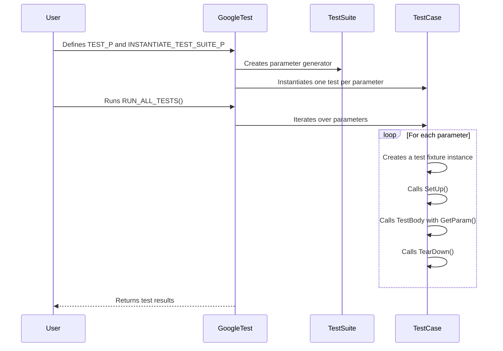

# Parameterized and Typed Tests

GoogleTest enhances your testing capabilities by enabling *value-parameterized* and *type-parameterized* tests. These powerful features allow you to write concise, reusable test logic against multiple inputs or types, maximizing coverage without code duplication.

---

## Value-Parameterized Tests

Value-parameterized tests let you run the same test logic against a range or set of input values, letting you verify behavior across multiple scenarios efficiently.

### Defining Value-Parameterized Tests

1. **Create a Test Fixture:** Derive your test fixture from `testing::TestWithParam<T>` where `T` is the type of the parameter.

```cpp
class FooTest : public testing::TestWithParam<int> {
  // Fixture setup and helpers...
};
```

2. **Write Parameterized Test Cases:** Use the `TEST_P` macro to define tests that consume the parameter via `GetParam()`.

```cpp
TEST_P(FooTest, HandlesVariousInputs) {
  int param = GetParam();
  EXPECT_TRUE(Validate(param));
}
```

3. **Instantiate the Test Suite:** Bind the parameterized tests with your desired parameters using `INSTANTIATE_TEST_SUITE_P` and use GoogleTest's parameter generators like `Values`, `Range`, `Bool`, `ValuesIn`, and `Combine`.

```cpp
INSTANTIATE_TEST_SUITE_P(MyInputs, FooTest, testing::Values(1, 2, 3));
```

Parameters can be generated in many ways, such as:

- `Range(start, end [, step])`: Sequential values from start (inclusive) to end (exclusive).
- `Values(v1, v2, ...)`: Explicit list of values.
- `ValuesIn(container)`: Values from an STL container or array.
- `Bool()`: Generates `false` and `true`.
- `Combine(g1, g2, ...)`: Cartesian product of multiple generators producing tuples.

### Advanced Parameter Generators

You can transform generated parameter tuples to your own types with `ConvertGenerator`.

```cpp
struct Param {
  int x; bool flag;
  Param(std::tuple<int, bool> t) : x(std::get<0>(t)), flag(std::get<1>(t)) {}
};

INSTANTIATE_TEST_SUITE_P(
  Converted, FooTest,
  testing::ConvertGenerator<Param>(
      testing::Combine(testing::Values(1, 2), testing::Bool())));
```

### Naming Parameterized Tests

You can specify custom test suffixes using a function or functor in the optional last argument of `INSTANTIATE_TEST_SUITE_P`.

```cpp
INSTANTIATE_TEST_SUITE_P(
    NamedTests, FooTest, testing::Values(1, 2),
    [](const testing::TestParamInfo<int>& info) {
        return "Value" + std::to_string(info.param);
    });
```

This improves test output readability by using meaningful parameter names.

### Important Practices and Notes

- Place `INSTANTIATE_TEST_SUITE_P` statements at **global or namespace scope**, not inside functions.
- Parameter generator expressions are evaluated during GoogleTest initialization, not at the point of the macro invocation.
- Instantiating a test suite multiple times is allowed; use unique instantiation names to differentiate.
- Parameters should be copyable, and it’s the user's responsibility to manage raw pointer lifetimes if used.
- Use `GTEST_ALLOW_UNINSTANTIATED_PARAMETERIZED_TEST` to suppress warnings if a parameterized test suite is defined but not instantiated.

---

## Typed Tests

Typed tests allow you to run the same test logic over multiple types when the exact types are known at test definition time.

### Defining Typed Tests

1. **Define a Fixture Class Template:** Parameterize your test fixture by a type.

```cpp
template <typename T>
class MyTypedTest : public testing::Test {
 public:
  void SetUp() override { /* Setup using T */ }
};
```

2. **Define Type List:** Use `testing::Types` to specify which types you want to test.

```cpp
using MyTypes = testing::Types<int, double, std::string>;
TYPED_TEST_SUITE(MyTypedTest, MyTypes);
```

3. **Write Tests with `TYPED_TEST`:** Use `TypeParam` inside the tests to refer to the instantiated type.

```cpp
TYPED_TEST(MyTypedTest, DoesStuff) {
  TypeParam value{};
  EXPECT_TRUE(DoSomething(value));
}
```

---

## Type-Parameterized Tests

Type-parameterized tests improve on typed tests by allowing test logic definitions that are independent of the type list, which can be instantiated multiple times (even in different translation units) with different type lists.

### Usage Steps

1. **Define a Fixture Template and Suite:**

```cpp
template <typename T>
class MyTypeParamTest : public testing::Test {
  // ...
};

TYPED_TEST_SUITE_P(MyTypeParamTest);
```

2. **Define Test Patterns:** Use `TYPED_TEST_P` to define type-parameterized tests.

```cpp
TYPED_TEST_P(MyTypeParamTest, TestA) {
  ...
}
```

3. **Register Tests:**

```cpp
REGISTER_TYPED_TEST_SUITE_P(MyTypeParamTest, TestA, TestB);
```

4. **Instantiate the Suite:** Provide one or more type lists for instantiation.

```cpp
using MyTypes = testing::Types<int, double>;
INSTANTIATE_TYPED_TEST_SUITE_P(MyInstantiation, MyTypeParamTest, MyTypes);
```

### Advantages

- Test logic and type lists can be decoupled.
- Multiple instantiations for different type sets allowed.
- Useful when defining interfaces and concepts tested by various implementations.

---

## Test Naming and Execution

- Test names for parameterized and typed tests include the instantiation prefix and parameter index or name.
- Use `testing::PrintToStringParamName` for default parameter name generation.
- Custom naming functions or functors enhance readability and debugging.

---

## Troubleshooting and Best Practices

- **Custom Output for Parameters:** Teach GoogleTest how to print complex parameter types by implementing `PrintTo()` or `AbslStringify()` functions.
- **Iterator Reuse:** Parameter generators support forward iterators; verify generator output with iteration.
- **Separate Instances:** Each test is run in a fresh test fixture instance, preventing shared state side effects.
- **Avoid Underscores in Names:** Underscores can cause naming conflicts; prefer alphanumeric test and suite names.
- **Suppress Uninstantiated Tests Warning:** Use `GTEST_ALLOW_UNINSTANTIATED_PARAMETERIZED_TEST` to explicitly allow uninstantiated parameterized test suites.

---

## Example of a Complete Value-Parameterized Test

```cpp
class IsEvenTest : public ::testing::TestWithParam<int> {};

TEST_P(IsEvenTest, ReturnsTrueForEvenNumbers) {
  int n = GetParam();
  EXPECT_EQ(n % 2, 0);
}

INSTANTIATE_TEST_SUITE_P(EvenValues, IsEvenTest, testing::Values(2, 4, 6, 8));
```

This will run the test four times with each parameter value.

---

## Example of a Typed Test

```cpp
template <typename T>
class NumericLimitsTest : public testing::Test {};

using MyTypes = testing::Types<int, float, double>;
TYPED_TEST_SUITE(NumericLimitsTest, MyTypes);

TYPED_TEST(NumericLimitsTest, IsNonNegative) {
  EXPECT_GE(std::numeric_limits<TypeParam>::min(), 0);
}
```

---

## Summary

Both parameterized and typed tests allow you to write scalable, maintainable tests that maximize code reuse and coverage. By mastering their usage and supporting macros and parameter generators, you can efficiently validate your software over broad input ranges and type domains.

---

## See Also

- [GoogleTest Primer](primer.md) - Foundations of GoogleTest usage.
- [Parameterized Tests Guide](advanced.md#value-parameterized-tests) - Detailed guide for value-parameterized tests.
- [Typed Tests Guide](advanced.md#typed-tests) - Further guidance on typed and type-parameterized tests.
- [API Reference: INSTANTIATE_TEST_SUITE_P](reference/testing.md#INSTANTIATE_TEST_SUITE_P) - Documentation on instantiation macros.
- [GoogleTest FAQ on Naming Conventions](faq.md#why-should-test-suite-names-and-test-names-not-contain-underscore)

---

## Visualization of Parameterized Test Flow



This sequence shows how parameterized test cases are instantiated and run for each parameter.

---

## Troubleshooting Tips

- **Tests Not Running?** Ensure that `INSTANTIATE_TEST_SUITE_P` is declared at file scope and that `InitGoogleTest()` is called before `RUN_ALL_TESTS()`.
- **Custom Types Not Printable?** Implement a `PrintTo()` method or `operator<<` to get meaningful output during failures.
- **Parameter Names Colliding?** Provide a custom name generator to disambiguate.
- **Tests Not Being Instantiated?** Use `GTEST_ALLOW_UNINSTANTIATED_PARAMETERIZED_TEST` if intentional.

---

## Practical Tips

- Prefer using `Values` and `Range` for simple sequences.
- Use `Combine` to generate test coverage over several parameter dimensions.
- Use `ConvertGenerator` to adapt tuples to custom parameter classes.
- Always use clear, meaningful instantiation names.
- Avoid underscores in test suite and test names to prevent internal name mangling issues.

---

Harnessing GoogleTest's parameterized and typed tests maximizes your productivity and testing robustness, preventing redundant code while ensuring thorough verification across data variations and type implementations.
