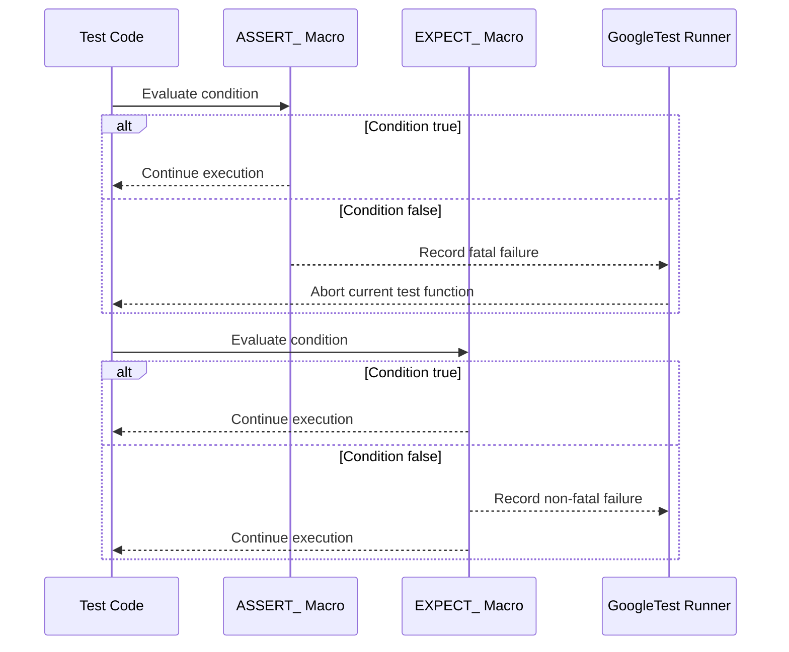

# Assertions API

This page provides an in-depth reference for GoogleTest assertions, detailing the built-in and user-definable macros for expressing test expectations. It guides you through the usage patterns that help you verify expected behavior in your code and handle failure outcomes in tests. This includes explanations of assertion macros, distinctions between fatal and non-fatal assertions, practical workflows, and advice for extending assertions with custom types.

---

## 1. Overview of Assertions

Assertions in GoogleTest allow you to specify conditions that your code must satisfy during tests. When an assertion fails, it reports an error with descriptive information, facilitating debugging.

- **ASSERT_*** macros generate a *fatal failure*; they stop execution of the current test function immediately.
- **EXPECT_*** macros generate a *non-fatal failure*; the test continues execution after a failure.

You should choose between ASSERT and EXPECT based on whether continuing the test after failure is meaningful.

---

## 2. Assertion Macros

All assertions support streaming a custom failure message via the insertion operator (`<<`), allowing you to provide context when failures occur.

### 2.1 Explicit Success and Failure

These macros allow you to explicitly mark a test point as successful or failed:

- `SUCCEED()` - marks a successful check (does not force test success but documents intent).
- `FAIL()` - generates a fatal failure and aborts the current function (usable only in void-returning functions).
- `ADD_FAILURE()` - generates a non-fatal failure and continues execution.
- `ADD_FAILURE_AT(file, line)` - generates a non-fatal failure at a specific source location.

### 2.2 Boolean Conditions

- `EXPECT_TRUE(condition)` / `ASSERT_TRUE(condition)` - verify that *condition* is true.
- `EXPECT_FALSE(condition)` / `ASSERT_FALSE(condition)` - verify that *condition* is false.

### 2.3 Binary Comparisons

Compare two values using standard relational operators:

- `EXPECT_EQ(val1, val2)` / `ASSERT_EQ(val1, val2)` — tests if `val1 == val2`.
- `EXPECT_NE(val1, val2)` / `ASSERT_NE(val1, val2)` — tests if `val1 != val2`.
- `EXPECT_LT(val1, val2)` / `ASSERT_LT(val1, val2)` — tests if `val1 < val2`.
- `EXPECT_LE(val1, val2)` / `ASSERT_LE(val1, val2)` — tests if `val1 <= val2`.
- `EXPECT_GT(val1, val2)` / `ASSERT_GT(val1, val2)` — tests if `val1 > val2`.
- `EXPECT_GE(val1, val2)` / `ASSERT_GE(val1, val2)` — tests if `val1 >= val2`.

**Note:** Use `EXPECT_STREQ` for C string content comparison rather than pointer equality.

### 2.4 String Comparisons for C Strings

- `EXPECT_STREQ(str1, str2)` / `ASSERT_STREQ` — verifies contents are equal.
- `EXPECT_STRNE(str1, str2)` / `ASSERT_STRNE` — verifies contents are not equal.
- `EXPECT_STRCASEEQ(str1, str2)` / `ASSERT_STRCASEEQ` — case-insensitive equality.
- `EXPECT_STRCASENE(str1, str2)` / `ASSERT_STRCASENE` — case-insensitive inequality.

### 2.5 Floating-Point Comparisons

Due to rounding and representation, special macros compare floating-point numbers approximately:

- `EXPECT_FLOAT_EQ(val1, val2)` / `ASSERT_FLOAT_EQ(val1, val2)` — compares `float` values with a tolerance of 4 ULPs.
- `EXPECT_DOUBLE_EQ(val1, val2)` / `ASSERT_DOUBLE_EQ(val1, val2)` — compares `double` similarly.
- `EXPECT_NEAR(val1, val2, abs_error)` / `ASSERT_NEAR` — verifies difference does not exceed `abs_error`.

### 2.6 Exception Assertions

Verify whether code throws exceptions:

- `EXPECT_THROW(statement, exception_type)` / `ASSERT_THROW` — expects a specific exception type.
- `EXPECT_ANY_THROW(statement)` / `ASSERT_ANY_THROW` — expects any exception.
- `EXPECT_NO_THROW(statement)` / `ASSERT_NO_THROW` — expects no exception.

### 2.7 Predicate Assertions

Support testing predicates with multiple arguments, providing clear error messages:

- `EXPECT_PRED1` to `EXPECT_PRED5` / `ASSERT_PRED1` to `ASSERT_PRED5` — test predicates with 1 to 5 arguments.
- `EXPECT_PRED_FORMAT*` / `ASSERT_PRED_FORMAT*` — allow use of predicate-formatter functions for custom failure messages.

### 2.8 Generalized Assertions Using Matchers

- `EXPECT_THAT(value, matcher)` / `ASSERT_THAT` allow using sophisticated predicates (matchers) to express complex constraints in readable form.

Example:

```cpp
EXPECT_THAT(value, StartsWith("Hello"));
EXPECT_THAT(arr, ElementsAre(1, 2, 3));
```

Matchers offer rich expressiveness and meaningful failure outputs.

### 2.9 Windows HRESULT Assertions

Check for success or failure HRESULT results in Windows COM APIs:

- `EXPECT_HRESULT_SUCCEEDED(expression)` / `ASSERT_HRESULT_SUCCEEDED`
- `EXPECT_HRESULT_FAILED(expression)` / `ASSERT_HRESULT_FAILED`

These provide translated error messages for HRESULT codes.

### 2.10 Death Assertions

Verify that code causes the process to terminate:

- `EXPECT_DEATH(statement, matcher)` / `ASSERT_DEATH`
- `EXPECT_DEATH_IF_SUPPORTED` / `ASSERT_DEATH_IF_SUPPORTED`
- `EXPECT_DEBUG_DEATH` / `ASSERT_DEBUG_DEATH`
- `EXPECT_EXIT(statement, predicate, matcher)` / `ASSERT_EXIT`

Use regular expressions or matchers on error output and exit status.

---

## 3. Assertion Usage and Common Patterns

### 3.1 Streaming Failure Messages

You can append additional context to assertions using `<<`:

```cpp
EXPECT_TRUE(condition) << "Failure when testing condition X";
```

### 3.2 Choosing Between ASSERT and EXPECT

- Use `ASSERT_*` when failure should abort the current test function because later code depends on the assertion being true.
- Use `EXPECT_*` when the test can continue to check other properties even if this assertion fails.

### 3.3 Using Matchers for Complex Validation

Matchers from GoogleMock offer powerful and readable assertions:

```cpp
EXPECT_THAT(my_string, HasSubstr("expected"));
EXPECT_THAT(container, ElementsAre(1, _, 3));
```

### 3.4 Handling Floating-Point Comparison

Avoid direct equality checks with floating-point types; use `EXPECT_FLOAT_EQ`, `EXPECT_DOUBLE_EQ`, or `EXPECT_NEAR`.

### 3.5 Exception and Death Test Best Practices

- Wrap multi-statement code blocks for exception and death assertions using `{ ... }` braces.
- Provide clear regular expressions or matchers for expected error messages.

### 3.6 Using Predicate Assertions

When you have complex boolean predicates, `EXPECT_PRED_FORMAT*` allows you to supply a custom formatter producing insightful failure diagnostics.

---

## 4. Practical Examples

### 4.1 Simple Equality Check

```cpp
TEST(MyTestSuite, SimpleEquality) {
  int result = ComputeValue();
  EXPECT_EQ(result, 42) << "Result should be 42";
}
```

### 4.2 Using EXPECT_THAT with Matchers

```cpp
#include <gmock/gmock.h>
using ::testing::StartsWith;
using ::testing::ElementsAre;

TEST(MyTestSuite, ContainerContents) {
  std::vector<int> numbers = {1, 2, 3};
  EXPECT_THAT(numbers, ElementsAre(1, 2, 3));
  std::string text = "Hello, world!";
  EXPECT_THAT(text, StartsWith("Hello"));
}
```

### 4.3 Exception Check

```cpp
TEST(MyTestSuite, ThrowsOnBadInput) {
  EXPECT_THROW(FunctionUnderTest(-1), std::invalid_argument);
}
```

### 4.4 Death Test Example

```cpp
TEST(MyTestSuite, DeathTestOnAbort) {
  EXPECT_DEATH({ AbortFunction(); }, "Aborted");
}
```

### 4.5 Predicate Assertion

```cpp
bool IsEven(int n) { return n % 2 == 0; }

TEST(MyTestSuite, CheckEvenness) {
  EXPECT_PRED1(IsEven, 4);
  EXPECT_PRED1(IsEven, 5) << "5 is not even";
}
```

---

## 5. Extending Assertions

GoogleTest supports defining your own assertions by writing custom matchers or predicate-formatters. This lets you tailor assertions for domain-specific types or validation logic with expressive failure messages.

Refer to user-defined matcher and assertion guidance in the [User-Defined Assertions](https://github.com/google/googletest/blob/main/docs/concepts/extensibility/user-defined-assertions.md) documentation.

---

## 6. Troubleshooting Common Issues

- **Expression not compiling?** Check that the expressions used in assertions are valid and have no side effects; arguments to assertions are evaluated only once.
- **Unexpected failure location?** Make sure you use macros, not functions, so failure location points to your source.
- **Test aborts too early?** Switch non-fatal EXPECTs to fatal ASSERTs carefully only when continuation is unsafe.
- **Floating-point mismatches?** Use the specialized floating-point comparison assertions instead of `EXPECT_EQ`.
- **Exception tests failing unexpectedly?** Enclose multi-line test code in `{ ... }` blocks.

---

## 7. Related References

- [Matchers Reference](matchers.md): Learn about expressive matchers for generalized assertions.
- [gMock Cookbook](https://github.com/google/googletest/blob/main/docs/gmock_cook_book.md) for practical advice on matcher use in tests.
- [GoogleMock for Dummies](https://github.com/google/googletest/blob/main/docs/gmock_for_dummies.md) for beginner-friendly introduction.
- [Test Discovery and Execution](api-reference/core-testing-apis/test-discovery-execution.md) for running tests.

---

_For all assertions, ensure inclusion of the header:_

```cpp
#include <gtest/gtest.h>
```

---

For more on assertion behavior, usage, and extensibility, please consult the official [Assertions Reference](https://github.com/google/googletest/blob/main/docs/reference/assertions.md).

---

<Callout title="Note">
Remember: `EXPECT_` assertions allow tests to continue after failure, while `ASSERT_` assertions abort the current test function on failure. Choose accordingly for effective testing.
</Callout>

---

### Diagram: Assertion Workflow


