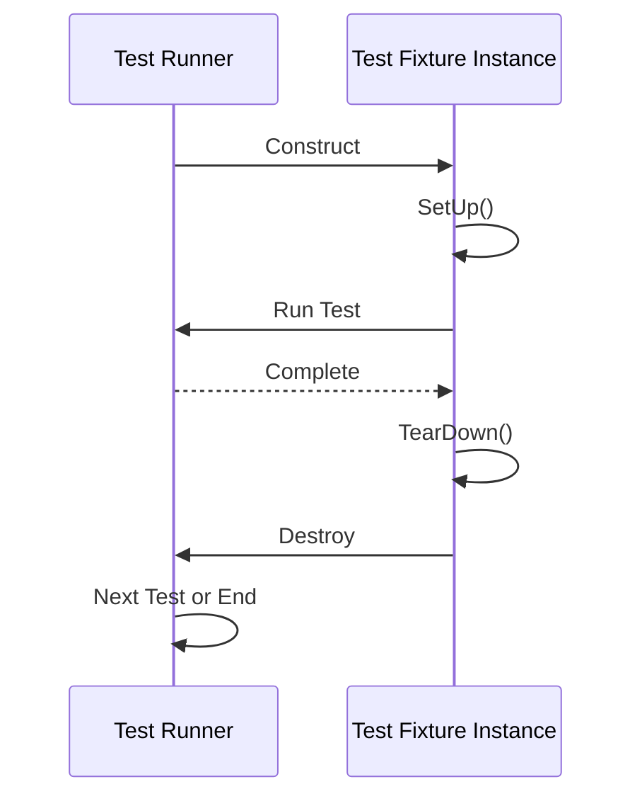

# Test Cases & Fixtures

Comprehensive reference for defining, organizing, and running test cases and fixtures within GoogleTest. This documentation explains how to create tests using macros such as `TEST`, `TEST_F`, `TEST_P`, and introduces support for typed and value-parameterized tests. You will learn best practices for structuring test suites, sharing setup/teardown logic, discovering tests, and managing parameterized test workflows to build robust, maintainable, and scalable test suites.

---

## 1. Introduction to Test Cases and Fixtures

GoogleTest helps you create well-organized and independent test cases to verify your code's behavior.

- **Test Case / Test Suite:** A named group of related tests.
- **Test:** An individual check verifying specific behavior or functionality.
- **Fixture:** A test class that defines shared objects and setup/teardown behavior used by multiple tests.

GoogleTest offers several macros and fixture classes optimized for different testing styles and reuse scenarios.

### Why Use Fixtures?
Fixtures enable you to:

- Reuse common setup and cleanup code across tests.
- Share expensive-to-create resources safely.
- Keep tests isolated and independent by creating fresh fixture instances per test.

---

## 2. Defining Simple Tests with `TEST`

Use the `TEST(TestSuiteName, TestName)` macro to define a simple independent test function.

```cpp
TEST(FactorialTest, HandlesZeroInput) {
  EXPECT_EQ(Factorial(0), 1);
}
```

- `TestSuiteName` groups related tests logically.
- `TestName` identifies the specific behavior under test.

**Key points:**
- Both names must be valid C++ identifiers, avoiding underscores (`_`).
- Tests within the same suite can share a theme but do not share code automatically.
- Tests run independently, and failures are localized.

For more examples and usage, see the [GoogleTest Primer](primer.md#simple-tests).

---

## 3. Using Test Fixtures with `TEST_F`

When multiple tests share common initialization/cleanup or test objects, use a fixture class derived from `testing::Test`.

### Creating a Fixture

Define a fixture class:

```cpp
class QueueTest : public testing::Test {
 protected:
  QueueTest() {
    q1_.Enqueue(1);
    q2_.Enqueue(2);
    q2_.Enqueue(3);
  }

  Queue<int> q0_;
  Queue<int> q1_;
  Queue<int> q2_;
};
```

Then write tests using `TEST_F`:

```cpp
TEST_F(QueueTest, IsEmptyInitially) {
  EXPECT_EQ(q0_.size(), 0);
}

TEST_F(QueueTest, DequeueWorks) {
  int* n = q1_.Dequeue();
  ASSERT_NE(n, nullptr);
  EXPECT_EQ(*n, 1);
  delete n;
}
```

**How it works:**
- GoogleTest creates a new fixture instance for each test.
- Calls constructor, then runs `SetUp()`, then test body, then `TearDown()`, then destroys fixture.
- Allows test isolation and independent fixture state.

See [GoogleTest Primer](primer.md#same-data-multiple-tests) for detailed guidance.

---

## 4. Parameterized Tests with `TEST_P` and Instantiation

Value-parameterized tests allow running the same test logic with different inputs.

### Defining Parameterized Fixture

Derive from `testing::TestWithParam<T>` where `T` is the type of the parameter:

```cpp
class MyParamTest : public testing::TestWithParam<int> {
 // Fixture code
};
```

### Writing Parameterized Tests

Use the `TEST_P` macro to define the test body:

```cpp
TEST_P(MyParamTest, HandlesVariousValues) {
  int param = GetParam();
  EXPECT_GT(param, 0);
}
```

### Instantiating Parameterized Tests

Create test instances with parameter values using `INSTANTIATE_TEST_SUITE_P`:

```cpp
INSTANTIATE_TEST_SUITE_P(PositiveValues, MyParamTest, testing::Values(1, 2, 3));
```

- The first argument is a unique name for the instantiation.
- The third argument is a parameter generator (`Values`, `Range`, `ValuesIn`, etc).
- The tests will execute once per parameter.

### Naming and Filtering

You can provide custom functions to generate readable test names for each parameter for better test output.

Detailed instructions and examples are available in the [Testing Reference](reference/testing.md#TEST_P).

---

## 5. Typed and Type-Parameterized Tests

GoogleTest supports running the same tests over multiple types.

### Typed Tests (`TYPED_TEST_SUITE` and `TYPED_TEST`)

- Define a fixture class template `template <typename T> class FooTest`.
- Use `TYPED_TEST_SUITE(FooTest, TypeList)` with a list of types.
- Write tests with `TYPED_TEST(FooTest, TestName)`.
- Within tests, use `TypeParam` to refer to the type.

Example:

```cpp
template <typename T>
class NumericTest : public testing::Test {
 /* shared data */
};

using MyTypes = testing::Types<int, double, float>;
TYPED_TEST_SUITE(NumericTest, MyTypes);

TYPED_TEST(NumericTest, IsPositive) {
  TypeParam val = 5;
  EXPECT_GT(val, 0);
}
```

### Type-Parameterized Tests (Dynamic type lists)

- Define test suite using `TYPED_TEST_SUITE_P` and tests with `TYPED_TEST_P`.
- Register tests with `REGISTER_TYPED_TEST_SUITE_P`.
- Instantiate with `INSTANTIATE_TYPED_TEST_SUITE_P`.

Useful for abstract or reusable test suites.

Refer to [Testing Reference](reference/testing.md#TYPED_TEST_SUITE) for comprehensive examples.

---

## 6. Setup and Teardown

GoogleTest fixtures support:

- **Per-test setup:** Override `SetUp()` for setup before each test.
- **Per-test teardown:** Override `TearDown()` executed after each test.
- **Per-test-suite setup:** Static method `SetUpTestSuite()` called once before any test in the suite runs.
- **Per-test-suite teardown:** Static method `TearDownTestSuite()` called once after all tests finish.

Example:

```cpp
class MyTestSuite : public testing::Test {
protected:
  static void SetUpTestSuite() {
    // expensive shared setup
  }

  static void TearDownTestSuite() {
    // shared cleanup
  }

  void SetUp() override {
    // per-test setup
  }

  void TearDown() override {
    // per-test cleanup
  }
};
```

**Tip:** Use per-suite setup for costly or shared resources to speed up tests.

See [Advanced GoogleTest Topics](advanced.md#sharing-resources-between-tests-in-the-same-test-suite) for detailed guidance.

---

## 7. Test Discovery and Execution Flow

GoogleTest discovers tests automatically at runtime.

- Tests defined with `TEST`, `TEST_F`, and `TEST_P` macros are registered globally.
- When you call `RUN_ALL_TESTS()`, GoogleTest runs all registered tests in order.
- Test suites are run sequentially and each test uses a fresh fixture instance.
- Your tests should *not* rely on test execution order.

You can filter which tests to run using command-line flags like `--gtest_filter`.

See [Running Test Programs: Advanced Options](advanced.md#selecting-tests) for more.

---

## 8. Practical Examples

### 8.1 Simple Test Example

```cpp
TEST(MathTest, Add) {
  EXPECT_EQ(Add(2, 2), 4);
}
```

### 8.2 Fixture Based Tests

```cpp
class StackTest : public testing::Test {
protected:
  void SetUp() override { stack_.push(1); }
  std::stack<int> stack_;
};

TEST_F(StackTest, IsNotEmpty) {
  EXPECT_FALSE(stack_.empty());
}

TEST_F(StackTest, PopReturnsCorrectValue) {
  EXPECT_EQ(stack_.top(), 1);
  stack_.pop();
  EXPECT_TRUE(stack_.empty());
}
```

### 8.3 Parameterized Test Example

```cpp
class EvenTest : public testing::TestWithParam<int> {};

TEST_P(EvenTest, IsEven) {
  EXPECT_EQ(GetParam() % 2, 0);
}

INSTANTIATE_TEST_SUITE_P(EvenNumbers, EvenTest, testing::Values(2, 4, 6, 8));
```

### 8.4 Typed Test Example

```cpp
template <typename T>
class NumericTest : public testing::Test {};

using MyTypes = testing::Types<int, float>;
TYPED_TEST_SUITE(NumericTest, MyTypes);

TYPED_TEST(NumericTest, CanAdd) {
  TypeParam a = 1;
  TypeParam b = 2;
  EXPECT_EQ(a + b, 3);
}
```

---

## 9. Best Practices

- Prefer fixtures (`TEST_F`) for tests sharing setup and tear-down.
- Initialize immutable objects in constructor, use `SetUp()` for runtime setup.
- Use `TEST_P` and `INSTANTIATE_TEST_SUITE_P` for data-driven tests.
- For shared resources across tests, use `SetUpTestSuite()` and `TearDownTestSuite()`.
- Avoid dependencies on test execution order.
- Use clear and descriptive test suite and test names (avoid underscores).
- Harness parameterized and typed tests to boost coverage with less duplication.

---

## 10. Troubleshooting & Tips

- If `TEST_F` fails to compile, ensure fixture class has a public default constructor.
- Use `SCOPED_TRACE` to add context when assertions are in helper functions.
- Use `GTEST_SKIP()` inside `SetUp()` or tests to conditionally skip tests.
- Disable flaky or broken tests temporarily by prefixing with `DISABLED_`.

---

## 11. Further Reading

- [GoogleTest Primer](primer.md) - beginner-friendly tutorial.
- [Testing Reference](reference/testing.md) - detailed API information on test macros.
- [Advanced GoogleTest Topics](advanced.md) - advanced patterns, sharing, and more.
- [Mocking Framework APIs](api-reference/mocking-framework-apis) - for using mocks with fixtures.

---

## 12. Summary Diagram of Test Lifecycle




---

## 13. Appendix: Key Macro Summaries

| Macro                      | Purpose                              |
|----------------------------|------------------------------------|
| `TEST(TestSuite, TestName)`| Defines an independent test function. |
| `TEST_F(Fixture, TestName)`| Defines a test using a fixture.     |
| `TEST_P(Fixture, TestName)`| Defines a value-parameterized test. |
| `INSTANTIATE_TEST_SUITE_P` | Instantiates parameterized test suites. |
| `TYPED_TEST_SUITE`          | Defines types for typed tests.     |
| `TYPED_TEST`                | Defines typed tests.                |


---

## 14. References

- [Testing Reference - TEST, TEST_F, TEST_P Macros](reference/testing.md#TEST)
- [GoogleTest Primer - Test Fixtures](primer.md#same-data-multiple-tests)
- [GoogleTest Primer - Value-Parameterized Tests](primer.md#value-parameterized-tests)
- [Advanced GoogleTest Topics - Sharing Resources](advanced.md#sharing-resources-between-tests-in-the-same-test-suite)
- [GoogleMock for Dummies](gmock_for_dummies.html) (for using mocks with fixtures)


---

This page offers a detailed, user-focused guide to defining and organizing test cases and fixtures in GoogleTest, equipping you to write scalable, maintainable tests tailored to your project’s needs.