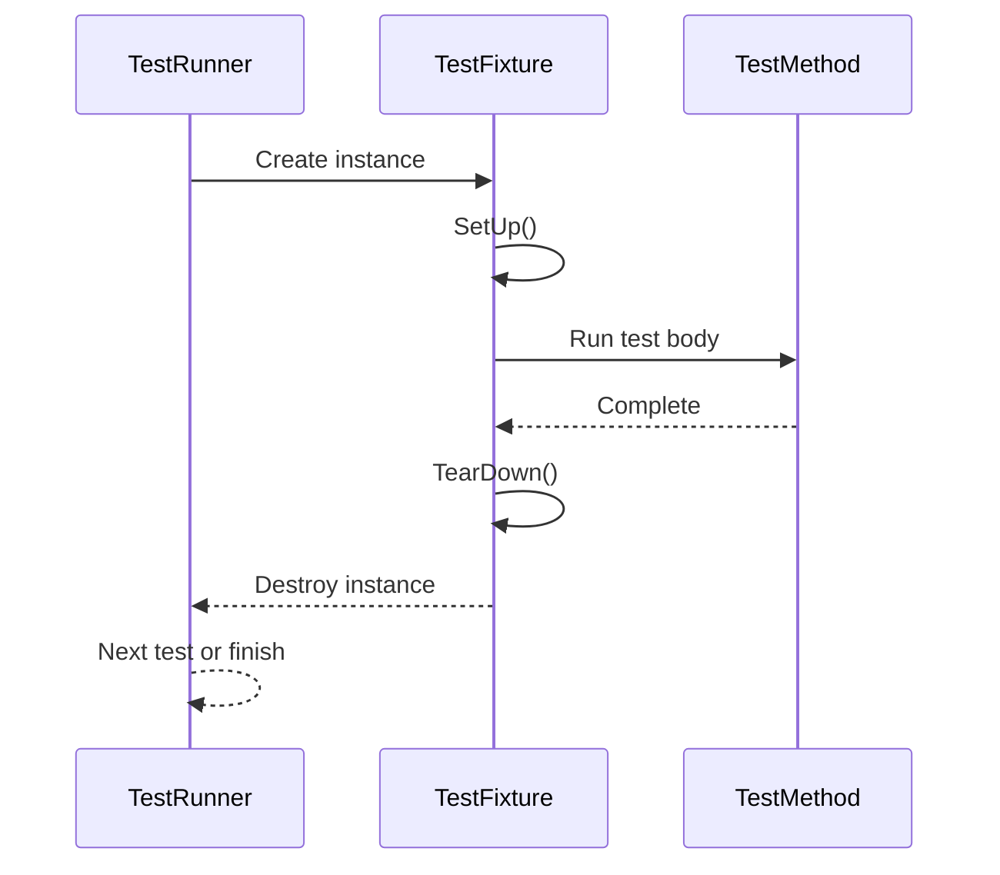

# Test Case and Fixture APIs

This reference documents the APIs provided by GoogleTest to create test cases, test suites, and fixtures—essential for structuring your unit tests in C++. It covers test macros, fixture lifecycle, setup and teardown hooks, and advanced features enabling clear and reusable test code.

---

## 1. Test Basics

GoogleTest uses macros to define tests and suites:

- `TEST(TestSuiteName, TestName)`
- `TEST_F(TestFixtureName, TestName)`

### `TEST` Macro

Defines a simple test without a fixture:

```cpp
TEST(MathTest, Addition) {
  EXPECT_EQ(2 + 2, 4);
}
```

- `TestSuiteName`: Groups related tests.
- `TestName`: Unique test within the suite.

### Naming Rules

- Test suite and names must be valid C++ identifiers.
- Duplicate suite+test names cause errors.

### Running Tests

Each test runs independently; all failures are reported.

---

## 2. Test Fixtures

Fixtures organize common setup and cleanup for multiple related tests.

### Declaring a Test Fixture

Derive from `::testing::Test`:

```cpp
class MyFixture : public ::testing::Test {
 protected:
  void SetUp() override {
    // Initialization code
  }

  void TearDown() override {
    // Cleanup code
  }

  // Helper members
  int shared_resource_;
};
```

### Writing Tests Using Fixtures

Use the `TEST_F` macro with your fixture:

```cpp
TEST_F(MyFixture, TestSomething) {
  shared_resource_ = 5;
  EXPECT_EQ(shared_resource_ * 2, 10);
}
```

This makes the test run with fixture setup and teardown logic.

### Benefits

- Avoids duplication of setup code.
- Tests can share common state.
- Consistent environment for tests.

---

## 3. Fixture Lifecycle and Hooks

The fixture class provides these overridable methods:

| Method       | Called When                          |
| ------------ | ---------------------------------- |
| `SetUp()`    | Before every test in the fixture    |
| `TearDown()` | After every test in the fixture     |
| `SetUpTestSuite()` (static)    | Once before the first test in the suite |
| `TearDownTestSuite()` (static) | Once after the last test in the suite  |

### Usage Example

```cpp
class DatabaseTest : public ::testing::Test {
 protected:
  static void SetUpTestSuite() {
    // Open database connection
  }

  static void TearDownTestSuite() {
    // Close database connection
  }

  void SetUp() override {
    // Begin transaction
  }

  void TearDown() override {
    // Rollback transaction
  }
};

TEST_F(DatabaseTest, QueryOne) {
  // Test with transactional database state
}

TEST_F(DatabaseTest, QueryTwo) {
  // Another test
}
```

This ensures shared expensive setup runs only once, optimizing tests.

---

## 4. Test Parameters and Typed Tests

GoogleTest supports parameterized tests allowing a single test logic to run with different inputs.

### Typed Tests

For templates or multiple types:

```cpp
template <typename T>
class MyTypedTest : public ::testing::Test {
public:
  T value_;
};

using MyTypes = ::testing::Types<int, double>;
TYPED_TEST_SUITE(MyTypedTest, MyTypes);

TYPED_TEST(MyTypedTest, DoesSomething) {
  EXPECT_TRUE(sizeof(TypeParam) > 0);
}
```

### Value-Parameterized Tests

Run tests with different parameter values:

```cpp
class MyTest : public ::testing::TestWithParam<int> {};

TEST_P(MyTest, IsEven) {
  EXPECT_EQ(GetParam() % 2, 0);
}

INSTANTIATE_TEST_SUITE_P(
    EvenTests, MyTest,
    ::testing::Values(2, 4, 6, 8));
```

---

## 5. Death Tests

Tests that expect code to exit or crash:

Use `ASSERT_DEATH` or `EXPECT_DEATH` macros:

```cpp
TEST(MyTest, DeathTestExample) {
  EXPECT_DEATH(
    { AbortFunction(); }, "Expected error message");
}
```

*Note*: Death tests run in a subprocess; they have special considerations, such as isolation and system dependencies.

---

## 6. Advanced Fixture Features

### Sharing Resources

- Use `static` data members and `SetUpTestSuite` / `TearDownTestSuite` to share expensive resources.

### Custom Setup and Teardown

- Override `SetUp()` and `TearDown()` to control per-test initialization and cleanup.

### Test Environment

For global setup/cleanup beyond test fixtures, define a subclass of `::testing::Environment`:

```cpp
class MyEnvironment : public ::testing::Environment {
 public:
  void SetUp() override {
    // Global setup
  }

  void TearDown() override {
    // Global cleanup
  }
};

int main(int argc, char** argv) {
  ::testing::InitGoogleTest(&argc, argv);
  ::testing::AddGlobalTestEnvironment(new MyEnvironment());
  return RUN_ALL_TESTS();
}
```

---

## 7. Managing Test Execution

### Test Fixtures are Thread-Safe

Each test is run in isolation; if multi-threaded, concurrency is supported.

### Fixtures per Test

Each test creates a fresh fixture instance, ensuring test isolation.

### Reusing Fixture Objects

Fixture objects are not reused across tests; `SetUp()` and `TearDown()` prepare per-test environment.

---

## 8. Example Complete Test Using a Fixture

```cpp
#include <gtest/gtest.h>

class Calculator {
 public:
  int Add(int a, int b) { return a + b; }
};

class CalculatorTest : public ::testing::Test {
 protected:
  void SetUp() override { calc_ = Calculator(); }
  Calculator calc_;
};

TEST_F(CalculatorTest, AddsPositiveNumbers) {
  EXPECT_EQ(calc_.Add(1, 2), 3);
}

TEST_F(CalculatorTest, AddsNegativeNumbers) {
  EXPECT_EQ(calc_.Add(-1, -2), -3);
}
```

---

## 9. Troubleshooting

- Make sure test names are unique within test suites.
- Remember fixture lifecycle ensures isolation; do not assume shared state except static members.
- Avoid reliance on test order unless using sequences or explicit dependency APIs.

---

## 10. Related Topics

- [Assertions and Expectations](../core-testing-apis/assertions-expectations) — Using assertions inside tests
- [Mocking with GoogleMock](../mocking-apis/declaring-mocks) — Testing interactions with mock objects
- [Writing Your First Unit Test](../../getting-started/configuration-and-first-test/writing-your-first-unit-test) — Beginner tutorial
- [Test and Mock Object Lifecycle](../../concepts/core-architecture/test-and-mock-lifecycle) — Deep dive on lifecycle management

---

## 11. Additional References

- `RUN_ALL_TESTS()` to execute tests
- `InitGoogleTest()` for startup
- Test filters for selective execution
- Test fixtures and parameterized tests in official GoogleTest documentation

---

## Diagram: Test Execution Flow



---

## Source Code Links

<Source url="https://github.com/google/googletest" paths='[{"path": "googletest/include/gtest/gtest.h", "range": "1-1500"},{"path": "googletest/src/gtest_main.cc", "range": "1-200"}]' />

---