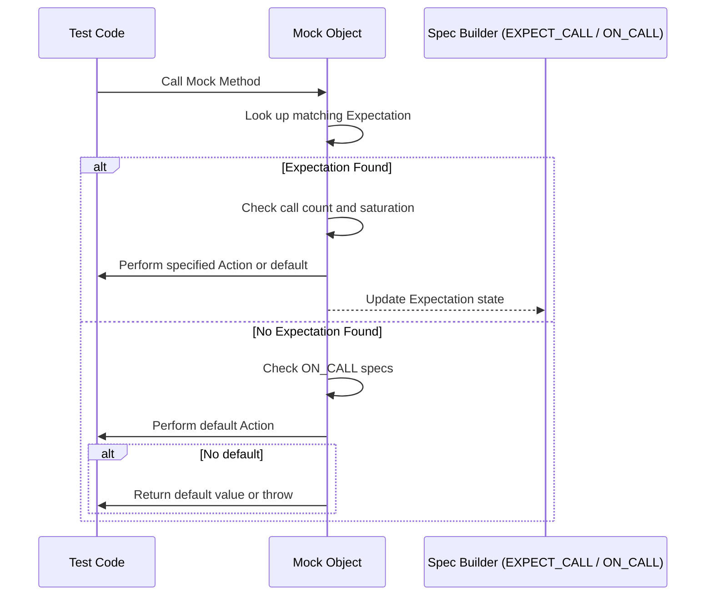

# Test and Mock Control Macros

This page provides a detailed listing and explanation of key macros in GoogleTest and GoogleMock that help you structure your tests, control test execution, and assert expectations on both mocks and test outcomes. Familiarity with these macros will allow you to write more readable, expressive, and reliable tests.

---

## 1. Core Test Macros

GoogleTest offers several fundamental macros to define and organize tests. These macros are the starting point for creating unit tests and test fixtures.

### TEST

Defines a basic, parameterless test case.

```cpp
TEST(TestSuiteName, TestName) {
  // Your test code here
}
```

- The `TestSuiteName` groups related tests.
- The `TestName` uniquely identifies the test within that suite.
- When run, frameworks report success or failure of the test.

### TEST_F

Defines a test that uses a test fixture class to share common setup/teardown.

```cpp
class MyFixture : public ::testing::Test {
 protected:
  void SetUp() override { /* common setup */ }
  void TearDown() override { /* common teardown */ }
  // Shared data members
};

TEST_F(MyFixture, TestName) {
  // Test code uses members from MyFixture
}
```

- Enables code reuse and organization when multiple tests share setup.

### TEST_P and INSTANTIATE_TEST_SUITE_P

Support for parameterized tests that run the same logic with multiple data sets.

---

## 2. Mocking Control Macros

GoogleMock builds on GoogleTest to provide powerful macros for mocking interfaces and setting expectations.

### ON_CALL

```cpp
ON_CALL(mock_object, Method(matchers...))
    .With(multi_argument_matcher)  // optional
    .WillByDefault(action);
```

- Specifies the default behavior of a mock method without setting an expectation.
- Useful to define common mock responses across tests without requiring calls.
- The `.With()` clause restricts the behavior to arguments matching a tuple matcher.
- The `.WillByDefault()` clause sets the action performed on matching calls.

### EXPECT_CALL

```cpp
EXPECT_CALL(mock_object, Method(matchers...))
    .With(multi_argument_matcher)      // optional
    .Times(cardinality)                // optional, default inferred
    .InSequence(sequences...)          // zero or more sequences
    .After(expectations...)            // zero or more prerequisites
    .WillOnce(action)                  // zero or more
    .WillRepeatedly(action)            // zero or one
    .RetiresOnSaturation();            // zero or one
```

- Sets an explicit expectation that the method will be called with matching arguments.
- Each clause refines the expectation:
  - `.Times()` controls how many calls are expected;
  - `.InSequence()` imposes call ordering among multiple expectations;
  - `.After()` requires other expectations be satisfied first;
  - `.WillOnce()` and `.WillRepeatedly()` specify the behavior on each matching call;
  - `.RetiresOnSaturation()` disables the expectation after limits are reached.

---

## 3. Assertion Macros

Assertions verify conditions during tests and fail tests when conditions are unmet.

### Basic Assertions

| Macro         | Description                                   |
|---------------|-----------------------------------------------|
| `ASSERT_TRUE(condition)`  | Fails the test and aborts if condition is false |
| `ASSERT_FALSE(condition)` | Fails the test and aborts if condition is true  |
| `EXPECT_TRUE(condition)`  | Fails the test but continues if condition is false |
| `EXPECT_FALSE(condition)` | Fails the test but continues if condition is true  |

### Equality & Comparison

| Macro             | Description                               |
|-------------------|-------------------------------------------|
| `ASSERT_EQ(val1, val2)` | Checks if values are equal, aborts test on failure   |
| `EXPECT_EQ(val1, val2)` | Checks equality, continues test on failure          |
| `ASSERT_NE(val1, val2)` | Checks inequality, aborts test on failure           |
| `EXPECT_NE(val1, val2)` | Checks inequality, continues test on failure        |
| `ASSERT_LT(val1, val2)` | Checks less-than, aborts test on failure             |
| `EXPECT_LT(val1, val2)` | Checks less-than, continues test on failure          |
| `ASSERT_LE(val1, val2)` | Checks less-or-equal, aborts test on failure         |
| `EXPECT_LE(val1, val2)` | Checks less-or-equal, continues test on failure      |
| `ASSERT_GT(val1, val2)` | Checks greater-than, aborts test on failure          |
| `EXPECT_GT(val1, val2)` | Checks greater-than, continues test on failure       |
| `ASSERT_GE(val1, val2)` | Checks greater-or-equal, aborts test on failure      |
| `EXPECT_GE(val1, val2)` | Checks greater-or-equal, continues test on failure   |

### Exception Assertions

- `ASSERT_THROW(statement, exception_type)`
- `EXPECT_THROW(statement, exception_type)`
- `ASSERT_ANY_THROW(statement)`
- `EXPECT_NO_THROW(statement)`

---

## 4. Combining ON_CALL and EXPECT_CALL

- Use `ON_CALL` to set default behavior that applies whenever an expectation is not set.
- Use `EXPECT_CALL` to require that the method be called according to the specification.
- You can have multiple `ON_CALL` statements for different argument matchers, with later ones overriding earlier ones.
- `EXPECT_CALL` statements override `ON_CALL` behavior for matched calls.

### Example

```cpp
using ::testing::Return;

class MockFoo {
 public:
  MOCK_METHOD(int, GetValue, (int), ());
};

MockFoo mock;

// Set default: return 42 for any argument
ON_CALL(mock, GetValue(_)).WillByDefault(Return(42));

// Expect GetValue(5) to be called once and return 100
EXPECT_CALL(mock, GetValue(5)).WillOnce(Return(100));

EXPECT_EQ(mock.GetValue(5), 100);  // Matches EXPECT_CALL.
EXPECT_EQ(mock.GetValue(3), 42);   // Matches ON_CALL default.
```

---

## 5. Common Pitfalls & Best Practices

- Always call `EXPECT_CALL` before exercising the code under test; otherwise behavior is undefined.
- Be cautious with `EXPECT_CALL` ordering; later expectations override earlier ones for matching calls.
- Use `NiceMock` or `StrictMock` wrappers to control warnings on uninteresting calls:
  - `NiceMock` suppresses warnings;
  - `StrictMock` treats them as errors;
  - default mocks are `Naggy` (warn but don't fail).
- Use `RetiresOnSaturation()` to disable sticky expectations when repeated calls should be matched by later ones.
- Combine `.InSequence()` or `.After()` clauses to enforce call ordering.
- Use `ON_CALL` for default behaviors shared across tests, reserving `EXPECT_CALL` for actual expectations.
- When mocking overloaded methods, specify argument matchers or use `Const()` to disambiguate.

---

## 6. Verification and Cleanup

- When a mock object is destructed, GoogleMock verifies that all expectations are satisfied.
- You can manually verify and clear expectations before destruction using:

```cpp
// Returns true if all expectations are met.
bool success = ::testing::Mock::VerifyAndClearExpectations(&mock_obj);

// Also clears default actions.
bool success2 = ::testing::Mock::VerifyAndClear(&mock_obj);
```

- Use `Mock::AllowLeak(&mock_obj);` to explicitly allow a mock object to be leaked without verification failures.

---

## 7. Wrappers for Mock Strictness

| Wrapper               | Behavior on Uninteresting Calls                | Usage Example                        |
|-----------------------|------------------------------------------------|------------------------------------|
| `NiceMock<T>`         | Suppresses warnings on uninteresting calls     | `NiceMock<MockFoo> nice_mock;`      |
| `NaggyMock<T>` (default) | Emits warnings on uninteresting calls          | `NaggyMock<MockFoo> naggy_mock;`    |
| `StrictMock<T>`       | Fails test on uninteresting calls               | `StrictMock<MockFoo> strict_mock;`  |

- These wrappers inherit from the mock class.
- To suppress warnings on uninteresting calls in specific tests, prefer `NiceMock`.
- `StrictMock` is useful to strictly enforce all mock interactions.

---

## 8. Additional Tips

- Prefer matchers like `_` to specify “anything goes” when argument values don't matter.
- Use `.Times(AnyNumber())` on `EXPECT_CALL` to ignore the number of calls without losing the ability to stub behavior.
- Beware of mocking methods with move-only types and understand proper return patterns (see gMock Cookbook).
- Use sequences (`Sequence` and `InSequence`) to control complex call ordering.

---

## 9. Summary Diagram of the Mocking Flow



---

## 10. References and Related Documentation

- [GoogleMock Cheat Sheet](reference/gmock_cheat_sheet.md) for quick syntax and usage tips.
- [Mocking Reference](reference/mocking.md) for comprehensive facility descriptions.
- [gMock Cookbook](guides/gmock_cook_book.md) for recipes on complex mocking scenarios.
- [Mock Strictness Wrappers](api-reference/mock-behavior-config/nice-naggy-strict-mock) for controlling uninteresting call behavior.
- [Matchers API](api-reference/matchers-actions-cardinalities/argument-matchers) and [Actions API](api-reference/matchers-actions-cardinalities/actions-api) for building detailed behaviors.

---

Feel confident applying these macros and patterns to effectively mock interfaces, assert your expectations, and manage test cases in your C++ projects using GoogleTest and GoogleMock.


<Check>
Ensure to always set expectations before invoking mock methods to avoid undefined behavior.
Prefer `ON_CALL` for default behaviors and `EXPECT_CALL` for explicit expectations.
Manage mock strictness via `NiceMock` or `StrictMock` wrappers based on your test needs.
Use sequences and ordering clauses to enforce call order precisely.
</Check>
