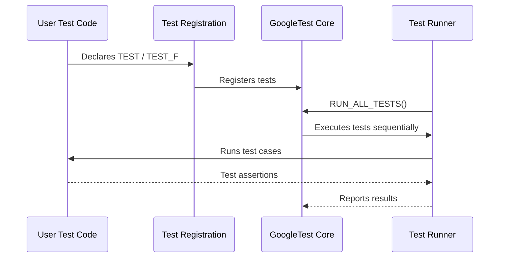

# Test Declaration and Registration Macros

GoogleTest provides a collection of powerful macros that allow you to define and register tests efficiently, enabling rapid creation and organization of test suites. This page focuses on the core macros for declaring tests and test fixtures with flexibility for various testing scenarios, while seamlessly integrating with the GoogleTest test discovery mechanism.

---

## Basic Test Definitions with `TEST`

The simplest way to declare a test is by using the `TEST()` macro. It defines a standalone test function that belongs to a test suite.

### Syntax:
```cpp
TEST(TestSuiteName, TestName) {
  // Test code goes here
}
```

- **`TestSuiteName`**: The name of the suite to which the test belongs.
- **`TestName`**: The name of the individual test.

GoogleTest treats the combination of `(TestSuiteName, TestName)` as a unique identifier. There may be tests with the same `TestName` in different test suites.

### Example:
```cpp
TEST(FactorialTest, HandlesZeroInput) {
  EXPECT_EQ(Factorial(0), 1);
}

TEST(FactorialTest, HandlesPositiveInput) {
  EXPECT_EQ(Factorial(1), 1);
  EXPECT_EQ(Factorial(3), 6);
}
```

This defines two tests in the `FactorialTest` suite.

---

## Test Fixtures with `TEST_F`

For grouping tests that share common setup and teardown logic, GoogleTest uses test fixtures—classes derived from `testing::Test`.

`TEST_F()` declares a test that runs within the context of a fixture class.

### How to Define a Test Fixture:

```cpp
class QueueTest : public testing::Test {
 protected:
  QueueTest() {
    // Common initialization before each test
    q_.Enqueue(1);
  }

  // Optional override for setup and teardown
  void SetUp() override {}
  void TearDown() override {}

  Queue<int> q_;
};
```

### Declaring Tests with the Fixture:

```cpp
TEST_F(QueueTest, IsInitiallyNotEmpty) {
  EXPECT_NE(q_.size(), 0);
}

TEST_F(QueueTest, DequeueReducesSize) {
  int* val = q_.Dequeue();
  ASSERT_NE(val, nullptr);
  EXPECT_EQ(*val, 1);
  EXPECT_EQ(q_.size(), 0);
  delete val;
}
```

Each test declared with `TEST_F` uses a new instance of the fixture class.

---

## Important Notes on Naming and Usage

- Test suite and test names must be valid C++ identifiers without underscores.
- Tests in different suites can have the same test name without conflict.
- Each test defined with `TEST` or `TEST_F` is automatically registered for discovery.
- The tests are run independently by the GoogleTest framework.

---

## Test Discovery and Registration

GoogleTest automatically registers all tests declared with the macros shown above at program startup. This enables:

- Running all tests with a single command
- Filtering tests by suite or test name
- Selecting tests programmatically or from command-line options

### Test Program Flow
1. Tests are declared using `TEST` or `TEST_F` macros.
2. GoogleTest internally registers these tests.
3. Calling `RUN_ALL_TESTS()` executes all registered tests.

This automatic registration vastly simplifies test management.

---

## Example: Full Minimal Test Program

```cpp
#include <gtest/gtest.h>

// Simple function to test.
int Factorial(int n) {
  return (n <= 1) ? 1 : n * Factorial(n - 1);
}

// Test without fixture.
TEST(FactorialTest, HandlesZeroInput) {
  EXPECT_EQ(Factorial(0), 1);
}

// Test fixture for Queue.
class QueueTest : public testing::Test {
 protected:
  QueueTest() { q_.Enqueue(1); }
  Queue<int> q_;
};

TEST_F(QueueTest, DequeueRemovesElement) {
  int* val = q_.Dequeue();
  ASSERT_NE(val, nullptr);
  EXPECT_EQ(*val, 1);
  EXPECT_EQ(q_.size(), 0);
  delete val;
}

int main(int argc, char **argv) {
  ::testing::InitGoogleTest(&argc, argv);
  return RUN_ALL_TESTS();
}
```

---

## Best Practices

- Group related tests logically into test suites.
- Use test fixtures (`TEST_F`) for shared setup and cleanup.
- Keep tests independent and focused.
- Avoid underscores in test and suite names to comply with macro parsing.
- Name tests descriptively to improve readability and debugging.

---

## Common Troubleshooting

<Accordion title="Why does my TEST not run?"><p>
Ensure that you call `RUN_ALL_TESTS()` in your `main` function after initializing GoogleTest with `InitGoogleTest`. Also verify that test suite and test names are valid.
</p></Accordion>

<Accordion title="How do I share resources among multiple tests?">
<p>Use a test fixture class and declare shared resources as members. Use `SetUp()` and `TearDown()` as needed for initialization and cleanup.</p>
</Accordion>

---

## Further References

- [GoogleTest Primer](../primer.md) for foundational concepts and quick-start
- [Advanced Test Registration: Typed and Parameterized Tests](../api-reference/core-testing-apis/advanced-test-features.md) for sophisticated patterns
- [Writing Your First Unit and Mock Tests](../guides/getting_started/writing_first_tests.md) guide for practical usage

---

<Callout>
**Tip:** Use descriptive suite and test names to facilitate test discovery and reporting. Avoid underscores to keep compatibility with macro parsing rules.
</Callout>

---

## Summary Diagram of Test Lifecycle



---

This page provides the foundation for declaring tests and organizing them effectively in GoogleTest.

---

<Source url="https://github.com/google/googletest" paths='[{"path": "googletest/include/gtest/gtest.h", "range": "300-355"}]' />