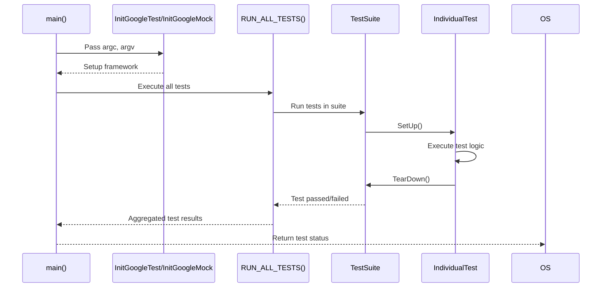

# Test Definition & Execution

The **Test Definition & Execution** API provides the essential macros, functions, and patterns needed to define tests, individual test cases, and test suites. It also offers mechanisms to execute these tests in various environments, ensuring an integral flow from test initialization to core lifecycle management.

This documentation covers the critical entry points for defining your tests, how to initialize the testing environment, set up core lifecycle controls, and execute your tests with confidence.

---

## 1. Defining Tests, Test Cases, and Test Suites

GoogleTest uses macros to define tests and organize them into test cases and test suites. At its core, the framework relies on the following structure:

- **Test Suites** (previously called Test Cases) group related tests logically.
- **Tests** are individual units verifying a particular behavior.

### Basic Syntax for Defining a Test

```cpp
TEST(TestSuiteName, TestName) {
  // Your test code
  EXPECT_EQ(1, 1);
}
```

- `TestSuiteName` groups related tests.
- `TestName` identifies the particular test.

This simple test will be discovered and executed by the framework when the test binary runs.

### Writing Parameterized and Typed Tests

GoogleTest supports advanced forms of tests such as parameterized and typed tests to enable reuse and coverage across different data sets or types. These are introduced separately in specialized documentation but are rooted in the same test definition patterns.

## 2. Initialization and Entry Points

To execute tests, the testing framework requires an initialization routine that parses command-line arguments, sets up necessary resources, and registers all test cases.

### Initialization Routine

The entry point for GoogleTest (and GoogleMock) initialization is:

```cpp
int main(int argc, char** argv) {
  ::testing::InitGoogleTest(&argc, argv);
  return RUN_ALL_TESTS();
}
```

- `InitGoogleTest()` processes framework-specific and googletest flags.
- `RUN_ALL_TESTS()` runs all tests registered with the framework and returns the number of failed tests.

### Integration with GoogleMock

If your tests use mocks, initialize GoogleMock with:

```cpp
::testing::InitGoogleMock(&argc, argv);
```

which internally calls `InitGoogleTest` as well, and prepares the mock environment.

## 3. Test Lifecycle Controls

GoogleTest manages the lifecycle of each test, providing hooks and controls to set up and tear down shared resources.

### Test Fixtures

Use test fixtures to share setup and teardown code among multiple tests:

```cpp
class MyTestFixture : public ::testing::Test {
 protected:
  void SetUp() override {
    // Setup code here
  }

  void TearDown() override {
    // Cleanup code here
  }
};

TEST_F(MyTestFixture, Test1) {
  // Test code here
}
```

- `SetUp()` runs before each test.
- `TearDown()` runs after each test.

### Global and Environment Setup

For cases where you need setup or cleanup at the entire test program level:

```cpp
class MyEnvironment : public ::testing::Environment {
 public:
  void SetUp() override {
    // Global setup
  }

  void TearDown() override {
    // Global cleanup
  }
};

int main(int argc, char** argv) {
  ::testing::AddGlobalTestEnvironment(new MyEnvironment);
  ::testing::InitGoogleTest(&argc, argv);
  return RUN_ALL_TESTS();
}
```

This approach ensures your environment is prepared before any tests run and cleaned up after all tests finish.

## 4. Test Execution Mechanisms

Once tests are defined and the framework is initialized, you can control execution through:

### Running Tests

- `RUN_ALL_TESTS()` executes all tests and returns the number of tests that failed.
- You can selectively run tests using command-line flags, for example, `--gtest_filter=TestSuiteName.TestName` to run specific tests.

### Test Result Reporting

The framework produces detailed test reports, including passed and failed test counts, failure details, and stack traces.

### Advanced Execution Controls

GoogleTest supports options to control parallel test execution, repeat tests, shuffle test order, break on failure, and more via command-line flags.

## 5. Core Macros and APIs

Here are key macros and functions central to test definition and execution:

| Macro / Function                           | Description                                                  |
|-------------------------------------------|--------------------------------------------------------------|
| `TEST(TestSuiteName, TestName)`           | Defines a test function under a test suite.                  |
| `TEST_F(TestFixtureName, TestName)`       | Defines a test using a test fixture (for setup/teardown).    |
| `SetUp()` / `TearDown()`                   | Methods in test fixtures for per-test setup and teardown.    |
| `AddGlobalTestEnvironment()`               | Registers a global environment for setup/teardown.           |
| `InitGoogleTest()`                         | Initializes the test framework (processes flags, etc).       |
| `InitGoogleMock()`                         | Initializes GoogleMock and GoogleTest environments.           |
| `RUN_ALL_TESTS()`                          | Runs all tests registered and returns test run status.       |

## 6. Additional Features & Best Practices

- Define **test names and suites** clearly and consistently to aid test management.
- Use **fixtures** liberally to encapsulate resource management.
- Leverage **global environment** objects for costly pre-test setup or system-wide configurations.
- Always initialize the framework at the **start of main()** before running tests.
- Use filter and run options for **targeted test execution** in CI or debugging.
- Adopt **assertions** and **expectations** from GoogleTest to verify conditions robustly within tests.

## 7. Troubleshooting Common Issues

- Ensure virtual destructors are declared in mock or base classes to prevent leaks and undefined behavior.
- Define tests before use; the framework depends on registration before execution.
- Avoid mixing expectation setting and mock calls; always set expectations **before** exercising the mock.
- If tests unexpectedly pass or fail, consider running with verbose flags or `--gtest_break_on_failure` to diagnose.

## See Also

- [GoogleTest Primer](https://google.github.io/googletest/primer.html) for a gentle introduction.
- [gMock Cookbook](../guides/mocking-advanced-usage/gmock_cook_book.md) for advanced mocking scenarios.
- [Assertions Reference](../api-reference/core-testing-apis/assertions.md) for verifying test conditions.
- [Matchers and Actions Reference](../api-reference/mocking-apis/matchers-actions.md) for mocking support.

---

### Diagram: Test Execution Flow



---

### Practical Example: Defining and Running a Simple Test

```cpp
#include <gtest/gtest.h>

TEST(MathTest, Sum) {
  EXPECT_EQ(2 + 2, 4);
}

int main(int argc, char** argv) {
  ::testing::InitGoogleTest(&argc, argv);
  return RUN_ALL_TESTS();
}
```

Run your compiled test binary. It will report test pass/fail status and provide detailed diagnostics for failures.

---

### Tips

- Use meaningful **test suite and test names** to organize and filter tests.
- Keep test cases **small and focused** on a single behavior.
- Use `TEST_F` for tests requiring shared setup.
- Use `AddGlobalTestEnvironment` if setup/teardown spans multiple tests or is costly.
- Always check the **return code** of `RUN_ALL_TESTS()`, especially in build pipelines.

---

This API is foundational for writing reliable, maintainable, and scalable tests in C++ using GoogleTest and GoogleMock frameworks.

<Info>
For the companion guide on mocking APIs that complement test definition and execution, consult 'Mock Class Definition & Method Mocking' and 'Setting Expectations & Behaviors' in the mocking API reference.
</Info>
