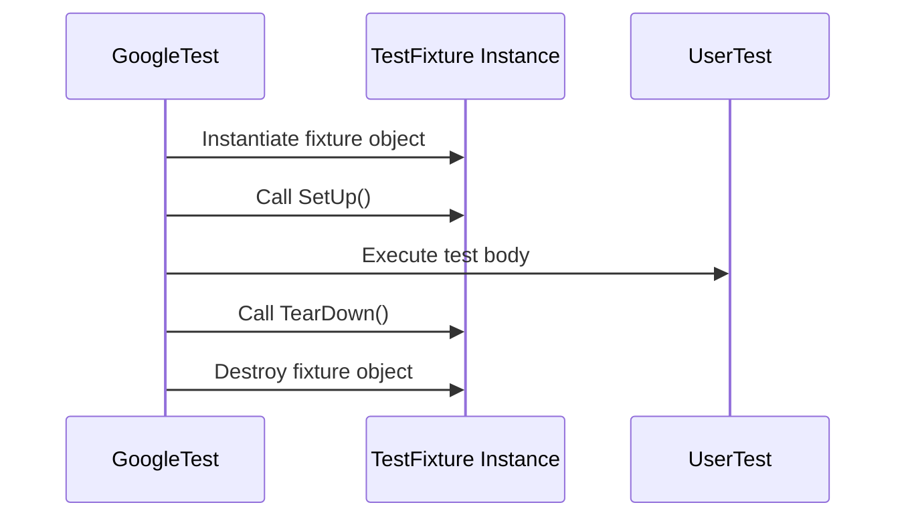

# Test Case and Fixture Definition

Learn how to declare and structure tests and test fixtures using GoogleTest's macros. This guide covers both simple test cases and the use of shared setup and teardown logic via test fixtures, empowering you to write maintainable, reusable test code.

---

## Overview

In GoogleTest, the fundamental building blocks for writing tests are *test cases* (also known as *test suites*) and *test fixtures*. This page explains how to define individual tests and group them logically with shared context to avoid redundancy and enhance maintainability.

### What Are Test Cases and Test Fixtures?

- **Test Case / Test Suite:** A named collection of related tests. Each test under the same test suite name can be run independently and reported together.
- **Test Fixture:** A class that you derive from `testing::Test` to provide a shared environment for multiple tests. It encapsulates common setup and teardown code so you don’t repeat it in each test.

## Declaring Simple Tests with `TEST()`

The simplest way to write a test is with the `TEST` macro. It defines a test function associated with a test suite.

```cpp
TEST(TestSuiteName, TestName) {
  // test logic goes here
  EXPECT_EQ(foo, bar);
}
```

- The **first argument** is the test suite name.
- The **second argument** is the test name.
- Both must be valid C++ identifiers (no underscores).

### Usage Flow

1. You write your test logic inside the test body.
2. GoogleTest will run this test along with all others.
3. Assertions within the test determine pass/fail outcomes.

This macro is ideal for standalone tests without shared setup.

## Using Test Fixtures for Shared Setup with `TEST_F()`

When multiple tests need to share common initialization and cleanup, use a *test fixture*. Define a class deriving from `testing::Test`, then write tests with the `TEST_F()` macro referencing that fixture.

### Defining a Test Fixture

```cpp
class MyFixture : public testing::Test {
 protected:
  MyFixture() {
    // constructor: set up objects shared by tests
  }

  void SetUp() override {
    // called before each test
  }

  void TearDown() override {
    // called after each test
  }

  // Shared objects for tests
  SomeClass obj_;
};
```

- Use the fixture constructor or `SetUp()` for initializing per-test state.
- Use `TearDown()` or the destructor to clean up.

### Writing Tests Using the Fixture

```cpp
TEST_F(MyFixture, Test1) {
  EXPECT_TRUE(obj_.DoSomething());
}

TEST_F(MyFixture, Test2) {
  EXPECT_EQ(obj_.GetValue(), 42);
}
```

- Each test gets a fresh instance of `MyFixture`
- Setup and teardown are run for each test
- Avoid shared mutable state between tests unless properly protected

### Benefits

- Promotes test independence
- Simplifies test code by reusing common setup
- Improves maintainability of complex test suites

## Advanced Fixture Features

### Per-Test-Suite Setup and Teardown

You can reuse expensive resources across all tests in a fixture by defining static methods:

```cpp
class DatabaseTest : public testing::Test {
 protected:
  static void SetUpTestSuite() {
    // Allocate or initialize shared resource
  }

  static void TearDownTestSuite() {
    // Cleanup
  }
  
  // Per-test setup
  void SetUp() override {}
  
  // Per-test teardown
  void TearDown() override {}
};
```

These static methods run once before/after the entire test suite.

<Note>
Make sure shared resources are thread-safe or immutable, as the test order is not guaranteed.
</Note>

### Sharing Fixture Logic via Inheritance

You can derive new fixtures from existing ones to extend or customize setup:

```cpp
class BaseFixture : public testing::Test { /* ... */ };
class DerivedFixture : public BaseFixture {
 protected:
  void SetUp() override {
    BaseFixture::SetUp();
    // Additional setup
  }
};
```

Use `TEST_F(DerivedFixture, TestName)` to run tests with the extended fixture.

## Typed and Type-Parameterized Test Fixtures

GoogleTest supports writing tests that run for multiple types, useful for testing templates or interfaces:

### Typed Tests

- Define a fixture class template parameterized on a type.
- Link a list of types using `TYPED_TEST_SUITE`.
- Write tests using `TYPED_TEST` which runs once for each type.

Example:

```cpp
template <typename T>
class FooTest : public testing::Test {
 public:
  T value_;
};

using MyTypes = ::testing::Types<int, double, char>;
TYPED_TEST_SUITE(FooTest, MyTypes);

TYPED_TEST(FooTest, TestBehavior) {
  TypeParam val = this->value_;
  // test code using TypeParam
}
```

### Type-Parameterized Tests

- Similar to typed tests, but defined without specifying the type list.
- Registered test names are declared with `REGISTER_TYPED_TEST_SUITE_P`
- Instantiated later with `INSTANTIATE_TYPED_TEST_SUITE_P`

These provide more flexibility for library authors.

## Common Pitfalls and Best Practices

- **Always define a default constructor for fixture classes.** GoogleTest requires creating a fresh instance per test.
- **Do not store test state in static non-const members unless carefully managed,** to avoid unexpected interactions.
- **Always use `TEST_F()` for tests depending on a fixture**, and `TEST()` for standalone tests.
- **Spell `SetUp()` and `TearDown()` exactly as is,** capitalization matters.
- **Do not assume test order.** Tests must be independent and not rely on side effects.

## Example: Full Test Fixture Usage

```cpp
#include <gtest/gtest.h>

// Fixture for testing Queue
class QueueTest : public testing::Test {
 protected:
  QueueTest() {
    // Prepare queues
    q0_ = Queue<int>();  // Empty
    q1_.Enqueue(1);
    q2_.Enqueue(2);
    q2_.Enqueue(3);
  }

  // Queues to use in tests
  Queue<int> q0_;
  Queue<int> q1_;
  Queue<int> q2_;
};

TEST_F(QueueTest, IsEmptyInitially) {
  EXPECT_EQ(q0_.size(), 0);
}

TEST_F(QueueTest, DequeueWorks) {
  int* n = q0_.Dequeue();
  EXPECT_EQ(n, nullptr);

  n = q1_.Dequeue();
  ASSERT_NE(n, nullptr);
  EXPECT_EQ(*n, 1);
  EXPECT_EQ(q1_.size(), 0);
  delete n;

  n = q2_.Dequeue();
  ASSERT_NE(n, nullptr);
  EXPECT_EQ(*n, 2);
  EXPECT_EQ(q2_.size(), 1);
  delete n;
}
```

## Summary

The framework creates a fresh fixture object for each test:

1. Construct the fixture object
2. Run `SetUp()`
3. Run the test body
4. Run `TearDown()`
5. Destroy the fixture object

This ensures each test runs isolated from the others.

## Troubleshooting

- **Test fixture’s constructor not found error:** Ensure your fixture class has a public default constructor.
- **SetUp() not called?:** Check you did not accidentally write `Setup()` (lowercase u).
- **State sharing issues:** Verify static members are properly managed or replaced with instance members.
- **Test ordering assumptions:** GoogleTest runs tests in an undefined order. Do not depend on order.

## Additional Resources

- [GoogleTest Primer](../primer.md#same-data-multiple-tests) — tutorial on test fixtures.
- [Typed Tests](../reference/testing.md#TYPED_TEST) — details and macros for typed tests.
- [Type-Parameterized Tests](../reference/testing.md#TYPED_TEST_P) — advanced pattern for reusable typed tests.

---

## Code Examples

### Simple Test

```cpp
TEST(FactorialTest, HandlesZeroInput) {
  EXPECT_EQ(Factorial(0), 1);
}
```

### Fixture Test

```cpp
class FooTest : public testing::Test {
 protected:
  FooTest() { /* Setup code */ }
  void SetUp() override { /* Setup before each test */}
  void TearDown() override { /* Cleanup after each test */ }

  int shared_value;
};

TEST_F(FooTest, Example) {
  EXPECT_EQ(shared_value, 42);
}
```

### Typed Test

```cpp
template <typename T>
class MyTypedTest : public testing::Test {
 public:
  T value = T();
};

using MyTypes = ::testing::Types<int, double>;
TYPED_TEST_SUITE(MyTypedTest, MyTypes);

TYPED_TEST(MyTypedTest, DoesSomething) {
  EXPECT_TRUE(true);
  TypeParam val = this->value;
}
```

### Type-Parameterized Test

```cpp
template <typename T>
class MyParamTest : public testing::Test {};

TYPED_TEST_SUITE_P(MyParamTest);

TYPED_TEST_P(MyParamTest, DoesSomething) {
  // Test code using TypeParam
}

REGISTER_TYPED_TEST_SUITE_P(MyParamTest, DoesSomething);

using MyTypes = ::testing::Types<int, float>;
INSTANTIATE_TYPED_TEST_SUITE_P(MyPrefix, MyParamTest, MyTypes);
```

---

## Diagram: Test Fixture Lifecycle



---

## Tips & Best Practices

- Favor test fixtures for grouping tests sharing setup.
- Keep fixtures lightweight; use `SetUpTestSuite()` for expensive shared resources.
- Avoid mutable static data unless strictly controlled.
- Name test suites and tests following C++ identifier rules; avoid underscores.
- When using typed tests, ensure type parameters are meaningful and instantiations are explicit.
- Use `ASSERT_*` macros within fixtures carefully, especially in `SetUp()/TearDown()`.

## Common Pitfalls

- Forgetting to use `TEST_F()` when a fixture is involved leads to compilation errors.
- Defining `SetUp()` as `Setup()` (lowercase `u`) causes it never to be called.
- Assuming test execution order can cause flaky tests.
- Using non-default constructors in fixtures without providing default constructor causes errors.

<Check>
Verify your test fixture classes have public default constructors before writing tests.
</Check>

---

For further learning, explore these companion references:

- [Assertions and Expectations](assertions.md) — for verifying test outcomes
- [Parameterized and Typed Tests](advanced.md#typed-tests) — advanced test reuse
- [GoogleTest Primer](primer.md) — beginner friendly guide
- [Mock Object and Method Definition](defining-mocks.md) — for mocking support

---

This documentation empowers developers to effectively define individual tests and scalable fixtures using GoogleTest macros, maximizing maintainability and clarity in C++ testing projects.
