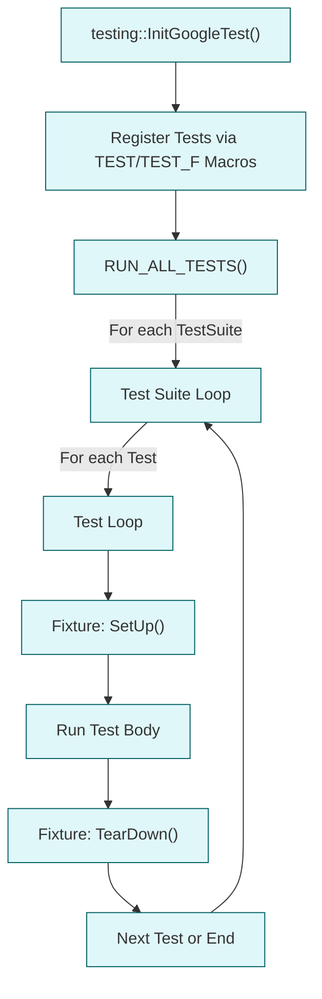

# Test Discovery and Structure

GoogleTest excels at automatically discovering, registering, and executing test cases in your C++ projects. This page guides you through how GoogleTest organizes test code, manages test fixtures, supports parameterized and typed tests, and helps you group tests effectively. Understanding this structure empowers you to write scalable, maintainable, and efficient test suites.

---

## 1. How GoogleTest Discovers Tests

GoogleTest finds tests through the `TEST` and `TEST_F` macros you write in your source files. When these macros run, GoogleTest registers the test functions with the test runner. Upon execution, GoogleTest runs all registered tests.

### Test Registration Flow

- When the test executable starts, it calls `testing::InitGoogleTest()` to initialize the framework.
- Each `TEST` or `TEST_F` macro definition creates a test factory that registers the test with a global registry.
- `RUN_ALL_TESTS()` triggers execution of all registered tests in the order of their suites and individual test names.

This automatic registration means you don’t need to maintain any lists of tests manually.

### Test Suites and Test Names

Tests are grouped into *test suites* to logically organize them. The first argument to `TEST` or `TEST_F` is the suite name, the second is the test name.

Example:

```cpp
TEST(MathTest, HandlesPositiveNumbers) {
  EXPECT_EQ(Factorial(3), 6);
}

TEST(MathTest, HandlesZero) {
  EXPECT_EQ(Factorial(0), 1);
}
```

Here, both tests belong to the `MathTest` suite.

<Tip>
Use suites to group related tests for easier navigation, parallel execution, and selective runs.
</Tip>

## 2. Test Fixtures and Their Role

Test fixtures allow you to reuse common setup and teardown code across multiple tests, reducing redundancy and improving readability.

### Creating Fixtures

Derive a class from `testing::Test`, define member variables and methods for shared test state and helper functions:

```cpp
class DatabaseTest : public testing::Test {
 protected:
  void SetUp() override {
    db_.Connect();
  }

  void TearDown() override {
    db_.Disconnect();
  }

  Database db_;
};
```

### Using Fixtures

Use `TEST_F` instead of `TEST` to tie a test to a fixture. GoogleTest will:

- Create a fresh fixture object per test
- Call `SetUp()`
- Run the test body
- Call `TearDown()`
- Destroy the fixture

Example:

```cpp
TEST_F(DatabaseTest, CanInsertRecord) {
  EXPECT_TRUE(db_.Insert("record1"));
}

TEST_F(DatabaseTest, CanDeleteRecord) {
  EXPECT_TRUE(db_.Delete("record1"));
}
```

<Tip>
Write all setup code in `SetUp()` for clarity and avoid `Setup()` typo errors.
</Tip>

## 3. Parameterized and Typed Tests for Reusability

GoogleTest provides powerful mechanisms to run the same test logic with different data or types.

### Parameterized Tests

Use `::testing::TestWithParam<T>` to define a test fixture that accepts parameters:

```cpp
class FactorialTest : public ::testing::TestWithParam<int> {};

TEST_P(FactorialTest, ReturnsExpectedResult) {
  int n = GetParam();
  EXPECT_GE(Factorial(n), 1);
}

INSTANTIATE_TEST_SUITE_P(PositiveNumbers, FactorialTest, ::testing::Values(1, 2, 3, 10));
```

Each parameter will execute the test independently.

### Typed Tests

Use typed tests to run the same test with different types:

```cpp
template <typename T>
class ContainerTest : public ::testing::Test {
  //...
};

TYPED_TEST_SUITE(ContainerTest, ::testing::Types<int, float, double>);

TYPED_TEST(ContainerTest, CanAddElements) {
  TypeParam value = static_cast<TypeParam>(2);
  // Test logic...
}
```

Appropriate when your test logic is generic over types.

<Tip>
Use parameterized tests for data-driven scenarios, typed tests for type-generic verification.
</Tip>

## 4. Advanced Test Grouping Techniques

Large projects become manageable with good test organization.

### Sequences and Partial Ordering

Use the `InSequence` helper and `Sequence` objects to enforce specific call orders in mocks, which affect test flow but relate closely to test grouping strategies for expectations.

### Test Fixtures with Parameterization

Combine parameterized tests with fixtures for complex scenarios needing state reuse and iteration over data sets or type lists.

### Naming Conventions

Choose descriptive suite and test names that reflect behavior or scenario tested. Avoid underscores in names for portability and tooling compatibility.

## 5. Practical Tips for Efficient Test Discovery

- **Keep tests in well-known source files:** GoogleTest finds all registered tests automatically. Organizing tests by module or feature helps.
- **Avoid reliance on global state:** Tests are independent and run in unpredictable order.
- **Define fixtures per logical group:** Don’t overload huge fixtures; keep them focused.
- **Use typed & parameterized tests to eliminate duplication:** This reduces maintenance and increases coverage.

## 6. Troubleshooting Common Issues

### Tests Not Running

- Ensure tests are defined using the `TEST` or `TEST_F` macros.
- Confirm `RUN_ALL_TESTS()` is called in your `main()` function.
- Confirm `InitGoogleTest()` is called before running tests.

### Tests Executed in Unexpected Order

- By default, tests run in the order of registration.
- Use command-line flags to filter or reorder if needed.

### Fixture Setup Not Invoked

- Remember to override `SetUp()` with exact capitalization.
- Use `TEST_F`, not `TEST`, for fixtures.

<Tip>
Enable verbose logging with `--gtest_verbose=info` to get insight into test discovery and execution.
</Tip>


---

# Mermaid Diagram: Test Discovery & Execution Flow



---

## Additional Resources

- [GoogleTest Primer](primer.md) - Learn test basics
- [Mocking Reference](docs/reference/mocking.md) - For mocks & expectations
- [gMock Cheat Sheet](docs/gmock_cheat_sheet.md) - Quick syntax aid
- [Using Mocks: Patterns and Best Practices](guides/mocking-and-advanced-techniques/using-mocks.mdx) - Mock design advice
- [Test Discovery and Execution Workflow](guides/getting-started/test-discovery-execution.mdx) - Related guide

---