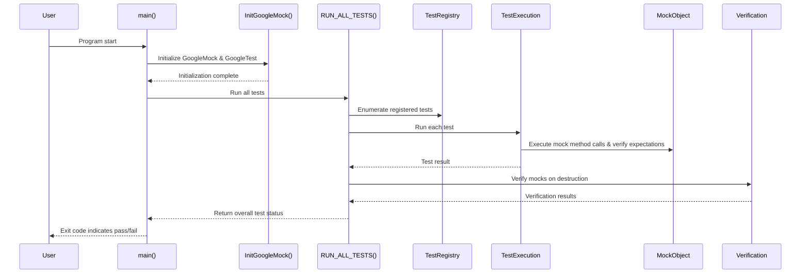

# Test Execution

This documentation provides detailed guidance on how to initialize and run test suites using GoogleTest and GoogleMock. It covers test discovery mechanisms, customizing test execution with runner options, integration with build tools, and the main entry point functions for invoking tests effectively.

---

## 1. Overview of Test Execution Flow

GoogleTest offers a streamlined flow for discovering, running, and managing tests, ensuring that each test's lifecycle—from setup to teardown—is handled automatically. GoogleMock, integrated into GoogleTest, extends this by enabling mock object expectations and verifications during test execution.

### Key Steps in Test Execution

1. **Initialization**: The framework is initialized via `testing::InitGoogleMock()`, which internally initializes GoogleTest as well.

2. **Test Discovery**: All registered tests are enumerated automatically without requiring manual intervention.

3. **Test Running**: `RUN_ALL_TESTS()` executes all discovered tests sequentially and aggregates results.

4. **Expectation Verification**: GoogleMock automatically verifies that all mock expectations are satisfied upon mock object destruction or can be triggered manually.

5. **Result Reporting**: Detailed reports, including failures, warnings, and success statuses, are produced.

---

## 2. Initializing GoogleMock and GoogleTest

Before any tests can run, the testing framework must be initialized using the following function:

```cpp
int main(int argc, char** argv) {
  testing::InitGoogleMock(&argc, argv);  // Initializes both GoogleMock and GoogleTest
  return RUN_ALL_TESTS();                // Runs all registered tests
}
```

**Notes:**
- `InitGoogleMock()` parses command line arguments for flags that control test behavior.
- It automatically calls `InitGoogleTest()`, so calling the latter separately is unnecessary.
- This initialization must happen before running the tests for proper flag configuration and environment setup.

---

## 3. Running Tests with `RUN_ALL_TESTS()`

The `RUN_ALL_TESTS()` macro executes all tests that have been registered through the `TEST()` and `TEST_F()` macros. It returns 0 on success and 1 on failure.

### What Happens During `RUN_ALL_TESTS()`

- The framework iterates through every test suite and test.
- For each test:
  - A fresh test fixture (if any) is created and initialized.
  - The test body is executed with assertions reporting failures as encountered.
  - Test fixture teardown and destruction happen.
- GoogleMock verifies that all mock expectations were met (unexpected or missing calls cause failures).

Use this macro only once per test program.

---

## 4. Test Discovery and Registration

Test registration in GoogleTest/GoogleMock is entirely automatic when using the `TEST` and `TEST_F` macros. During compilation, these macros register tests, associating them with test suites and fixtures.

### Automatic Discovery

- Tests are collected without manual enumeration.
- Tests from different translation units will all be discovered and available to `RUN_ALL_TESTS()`.

### Integration with Build Systems

- Standard build systems like CMake or Bazel easily integrate with this automatic test registration.
- Common practice is linking test binaries with `gtest_main` or `gmock_main` provides a default main that initializes and runs tests.

---

## 5. Customizing Test Execution

GoogleTest's execution can be modified via command-line flags or programmatic options during initialization.

### Common Flags

| Flag                  | Purpose                                    |
|-----------------------|--------------------------------------------|
| `--gtest_filter`       | Specify which tests to run by pattern.     |
| `--gtest_repeat`       | Run tests multiple times.                    |
| `--gtest_break_on_failure` | Break on first failure for debugging.  |
| `--gmock_verbose`      | Sets verbosity level for GoogleMock output (`info`, `warning`, `error`). Defaults to `warning`.

### GoogleMock-Specific Options

- **`--gmock_catch_leaked_mocks`**: Controls leak detection for mock objects.
- **`--gmock_verbose`** controls how much mock call information is printed, helping debug expectation matches or violations.

### Programmatic Control

- Use `GMOCK_FLAG_SET(flag_name, value)` to set flags during runtime.

Example:

```cpp
GMOCK_FLAG_SET(catch_leaked_mocks, true);
GMOCK_FLAG_SET(verbose, testing::internal::kWarningVerbosity);
```

---

## 6. Mock Execution and Expectation Verification

GoogleMock enhances the test run by managing mock objects, their expectations, and behaviors during test execution.

### Setting Expectations

- Use `EXPECT_CALL` to define expected calls and behaviors on mock methods.
- Calls that don't meet expectations trigger immediate test failures.

### Default Behaviors

- Uninteresting calls (calls to mock methods without expectations) by default generate warnings but do not fail tests.
- Override default actions for mock methods via `ON_CALL` to control behavior when no explicit expectation applies.

### Verification

- Mock object expectations are verified upon their destruction.
- You can trigger manual verification and clearing via:

```cpp
testing::Mock::VerifyAndClearExpectations(&mock_obj);  // Verifies method calls
// or

testing::Mock::VerifyAndClear(&mock_obj);             // Verifies and clears expectations and default actions
```

### Controlling Object Lifetime

- Use `Mock::AllowLeak()` to suppress leaks reported for mocks that intentionally outlive the test.

---

## 7. Using Sequences and Ordering Constraints

GoogleMock supports specifying call order, either fully or partially, to enforce sequences of calls.

- Use `InSequence` objects or `EXPECT_CALL(...).InSequence(some_sequence)` to require strict order.
- Use `.After()` clauses to express partial order dependencies.

Failure to meet ordering constraints results in test failures with descriptive messages.

---

## 8. Integration with Build Tools

The test execution model fits seamlessly with modern build tools.

- Using `gmock_main` or `gtest_main` libraries simplifies the creation of test executables by supplying main functions.
- CMake, Bazel, and other popular build systems readily support running `RUN_ALL_TESTS()` binaries in CI pipelines.
- The automatic test discovery means build tools do not need to maintain test listing.

---

## 9. Troubleshooting Test Execution

### Common Issues

- **Failure to Discover Tests**: Ensure `TEST()`/`TEST_F()` macros are properly used and linked.
- **Expectations Not Verified**: Mock objects must be destroyed for automatic verification; otherwise, call `VerifyAndClear` manually.
- **Uninteresting Calls Warnings**: Consider `NiceMock` to suppress such warnings when appropriate.
- **Incorrect Ordering Failures**: Check the use of sequences and `After()` dependencies carefully.

### Best Practices

- Always call `InitGoogleMock()` once at start.
- Run your tests via `RUN_ALL_TESTS()` once.
- Use `NiceMock` or `StrictMock` deliberately depending on your scenario.
- Use command line flags to control verbosity and testing scope.

---

## 10. Example: Minimal Test Main Function

```cpp
#include "gmock/gmock.h"
#include "gtest/gtest.h"

int main(int argc, char** argv) {
  testing::InitGoogleMock(&argc, argv);  // Initializes GoogleMock and GoogleTest
  // Optional: customize flags here
  GMOCK_FLAG_SET(catch_leaked_mocks, true);
  GMOCK_FLAG_SET(verbose, testing::internal::kWarningVerbosity);

  return RUN_ALL_TESTS();                 // Runs all tests and returns success/failure
}
```

---

## 11. Additional Resources

For a guided introduction to writing mock tests, the following resources are recommended:

- [gMock for Dummies Guide](https://google.github.io/googletest/gmock_for_dummies.html)
- [gMock Cookbook](https://google.github.io/googletest/gmock_cook_book.html)
- [Mocking Reference](https://google.github.io/googletest/reference/mocking.html)
- [GoogleTest Primer](https://google.github.io/googletest/primer.html)

These resources help deepen understanding of mocking, setting expectations, actions, and handling asynchronous or complex test scenarios.

---

## 12. Summary Diagram of Test Execution Flow



---

## 13. Practical Tips

- **Always initialize GoogleMock at the start** with `InitGoogleMock` to avoid uninitialized flags.
- **Set expectations before exercising code**; setting expectations afterward is undefined.
- **Use sequences and `.After()` to enforce call orders when necessary** to ensure tests reflect real interaction workflows.
- **Control verbosity with `--gmock_verbose`** to tune diagnostic output during test runs.
- **Call `Mock::VerifyAndClearExpectations`** when managing mock lifetimes manually to catch unsatisfied expectations early.
- **Consider using `NiceMock` to suppress noisy uninteresting call warnings** in stable or large test suites.

---

For more detailed guidance, users are encouraged to consult the full set of API references and practical guides linked in the Additional Resources section.

---

<Source url="https://github.com/google/googletest" branch="main" paths={[{"path": "googlemock/src/gmock_main.cc", "range": "1-57"}]} />

<Source url="https://github.com/google/googletest" branch="main" paths={[{"path": "docs/reference/mocking.md", "range": "1-162"}]} />

---

