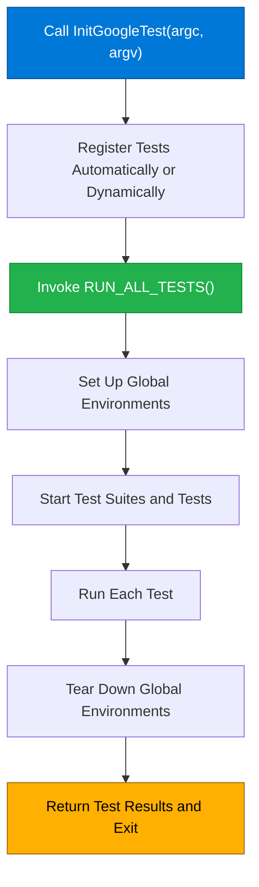

# Test Execution and Initialization

GoogleTest provides a comprehensive API for initializing test environments, controlling test execution, and running tests programmatically. This API supports flexible integration into development workflows, including continuous integration (CI) pipelines and custom test runners.

---

## Overview

At the heart of GoogleTest's test execution API is a simple but powerful flow:

1. **Initialize GoogleTest:** Parse command-line flags and set up the framework.
2. **Register Tests:** Tests are automatically registered via macros or can be registered dynamically.
3. **Run Tests:** Invoke all registered tests, either in one batch or selectively.
4. **Retrieve Results:** Analyze and process test results programmatically.

Most developers rely on the default main entry points, but the API also supports writing customized runners for special workflows.

## Initialization

### `InitGoogleTest(&argc, argv)`

To prepare GoogleTest for execution, you must call `InitGoogleTest()` early in your program, typically at the start of your `main()` function. This function:

- Parses GoogleTest-specific command-line flags.
- Removes recognized flags from `argv`, adjusting `argc` accordingly.
- Initializes internal state used during test execution.

**Important:** Always call `InitGoogleTest` before running tests or invoking any test-related API.

```cpp
int main(int argc, char** argv) {
  ::testing::InitGoogleTest(&argc, argv);
  return RUN_ALL_TESTS();
}
```

> `InitGoogleTest()` is available in variants to support wide-character Windows programs and embedded systems with no `argc/argv`.

### Command-Line Flags

GoogleTest supports multiple flags to control test execution, including test filters, output format, repeat count, and more. These are documented in the user guides and parsed by `InitGoogleTest()` transparently.

---

## Running Tests

### `RUN_ALL_TESTS()`

Once initialized, invoke `RUN_ALL_TESTS()` to execute all tests registered in the current binary. It automatically:

- Runs all enabled tests,
- Aggregates results,
- Cleans up any registered environments,
- Returns the overall success status (0 for success, non-zero otherwise).

```cpp
int main(int argc, char** argv) {
  ::testing::InitGoogleTest(&argc, argv);
  int result = RUN_ALL_TESTS();
  // Optionally use 'result' for your own process handling
  return result;
}
```

**Usage Notes:**

- You must **not** ignore the return value of `RUN_ALL_TESTS()`. It represents whether all tests passed.
- Call this function only once during your program’s lifetime.
- If a fatal failure occurs in a test, subsequent tests are skipped.

### Custom Test Execution

In advanced use cases, such as when integrating with CI systems or building a custom runner, you may want to invoke tests selectively or programmatically control execution.

You can use the singleton `UnitTest` class to query and run tests:

```cpp
using ::testing::UnitTest;

UnitTest* unit_test = UnitTest::GetInstance();
int total_tests = unit_test->total_test_count();

// Run tests individually
for (int i = 0; i < total_tests; ++i) {
  const ::testing::TestInfo* test_info = unit_test->GetTestSuite(i)->GetTestInfo(0);
  if (test_info->should_run()) {
    // You can programmatically invoke this test
  }
}
```

However, GoogleTest does not provide a public API to invoke tests individually; test registration and execution remain under internal control to maintain consistent test lifecycle management.

---

## Test Environment Management

GoogleTest supports registering global environments via `testing::Environment` subclasses. These environments allow setup and teardown arrangements that span multiple tests or test suites.

### Adding Environments

Register environments *before* calling `RUN_ALL_TESTS`:

```cpp
class MyEnvironment : public testing::Environment {
 public:
  void SetUp() override {
    // Code to set up before any test runs
  }
  void TearDown() override {
    // Code to clean up after all tests run
  }
};

testing::AddGlobalTestEnvironment(new MyEnvironment);
```

Environments are initialized in the order they are registered and torn down in reverse order.

---

## Main Entry Points Provided by GoogleMock

When using GoogleMock alongside GoogleTest, integration is seamless. GoogleMock offers a variant of `main()` with `gmock_main` that handles initialization for both frameworks.

### Using `gmock_main` Library

Linking with `gmock_main` provides a pre-built `main()` that:

- Calls `InitGoogleMock()`, which initializes both GoogleMock and GoogleTest,
- Invokes `RUN_ALL_TESTS()`.

This saves you from writing boilerplate initialization code.

### Writing a Custom `main()` With GoogleMock

If you need custom setup, you can replicate the default main:

```cpp
#include "gmock/gmock.h"

int main(int argc, char** argv) {
  testing::InitGoogleMock(&argc, argv);
  return RUN_ALL_TESTS();
}
```

This approach allows you to add any setup or teardown logic while controlling test execution explicitly.

### Support for Embedded Platforms

For platforms like ESP8266 or Arduino where no standard `main()` exists, GoogleMock provides hooks `setup()` and `loop()` to integrate with the platform lifecycle:

```cpp
void setup() {
  testing::InitGoogleMock();
}

void loop() {
  RUN_ALL_TESTS();
}
```

This makes it straightforward to use GoogleMock on constrained and embedded systems.

---

## Practical Example: Integrating GoogleTest in a CI Pipeline

1. **Initialize GoogleTest in `main()`:**

   ```cpp
   int main(int argc, char** argv) {
     ::testing::InitGoogleTest(&argc, argv);
     return RUN_ALL_TESTS();
   }
   ```

2. **Configure your CI tool to run the test binary:**

   ```bash
   ./my_tests --gtest_filter=* --gtest_output=xml:report.xml
   ```

3. **Collect and parse the XML report** to evaluate test results and generate dashboards or alerts.

4. **Use command-line flags** like `--gtest_repeat=N` to rerun tests multiple times or `--gtest_fail_fast` to stop on first failure.

This flow ensures automated, repeatable, and maintainable test runs in integration environments.

---

## Troubleshooting Common Issues

### Tests Not Running

- Make sure you call `InitGoogleTest()` before `RUN_ALL_TESTS()`.
- Confirm that your tests are properly registered (using `TEST()` or `TEST_F()`) and not disabled.
- Check any filtering flags that might exclude tests.

### Duplicate or Missing `main()`

- If linking against both `gtest_main` and a custom `main()`, you may get linker errors — only one entry point should be defined.
- When using GoogleMock, prefer linking `gmock_main` or provide your own `main()` that calls `InitGoogleMock()`.

### Ignored Command-Line Flags

- Ensure `InitGoogleTest()` consumes your flags by calling it early in `main()`.
- Flags unknown to GoogleTest will remain in `argv`; verify you're passing correct flags.

---

## Summary

This page covered GoogleTest's APIs for initializing test environments, running tests programmatically, and controlling test execution flow. Key entry points like `InitGoogleTest()` and `RUN_ALL_TESTS()` enable both simple and customized test runners, including integration with GoogleMock's initialization. Understanding this API empowers developers to build robust, automated testing pipelines and custom test instruments.

---

## References and Further Reading

- [GoogleTest Primer](../docs/primer.md) — Foundations of writing and running tests
- [GoogleMock README](../googlemock/README.md) — Integration details for mocks and custom main()
- [GoogleTest User's Guide](../docs/index.md) — Overview and tutorials
- [Test and Fixture Declarations API](./test-declarations.md) — Defining tests properly
- [Mocking Reference](./mocking.md) — Covers GoogleMock features

---

## Visual Flow of Test Initialization and Execution


