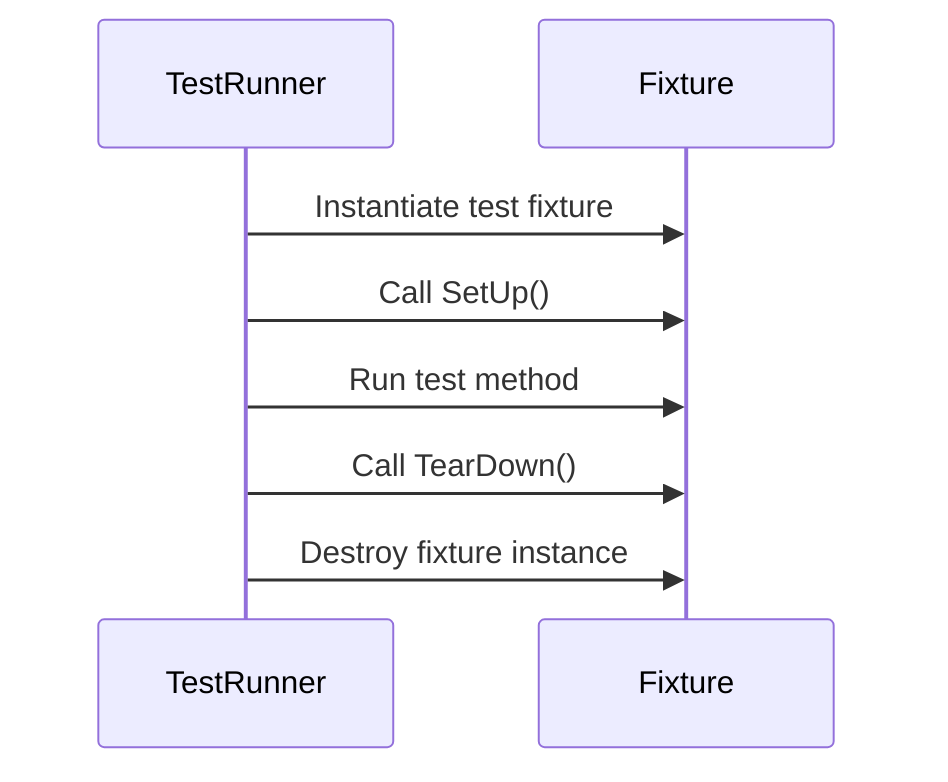

# Test Fixtures & Test Cases

GoogleTest allows you to create structured and maintainable sets of tests through the use of test cases and test fixtures. This page guides you on how to define, organize, and run test cases with fixtures to manage shared setup and teardown logic efficiently.

---

## 1. Understanding Test Cases and Test Fixtures

### What is a Test Case?
A **test case** groups together related tests. It provides a logical organization allowing you to run all tests for a feature or unit together.

### What is a Test Fixture?
A **test fixture** is a class that prepares the environment for tests by managing setup and teardown procedures common to multiple tests. This improves reusability and reduces duplication.

---

## 2. Defining Basic Tests

GoogleTest uses the `TEST()` macro to define simple tests without fixtures:

```cpp
TEST(TestCaseName, TestName) {
  // Your test code here
  EXPECT_EQ(1, 1);
}
```

- `TestCaseName`: identifier for the test group
- `TestName`: identifier for the individual test

The test name combination must uniquely identify a test.

---

## 3. Creating Test Fixtures with TEST_F

When multiple tests share the same setup and teardown code, define a fixture class:

```cpp
class MyTestFixture : public ::testing::Test {
 protected:
  void SetUp() override {
    // Code here will be called before each test
  }

  void TearDown() override {
    // Code here will be called after each test
  }

  // Shared resources for tests
  int shared_resource;
};
```

Use the `TEST_F` macro to write tests that use this fixture:

```cpp
TEST_F(MyTestFixture, Test1) {
  shared_resource = 5;
  EXPECT_EQ(shared_resource, 5);
}

TEST_F(MyTestFixture, Test2) {
  shared_resource = 10;
  EXPECT_GT(shared_resource, 0);
}
```

The framework will ensure `SetUp()` runs before each test, and `TearDown()` runs after.

---

## 4. Test Fixture Inheritance and Parameterization

Test fixtures support inheritance allowing you to add specialized behavior or data members.

While this page does not cover parameterized tests, GoogleTest also supports parameterized test fixtures for executing the same logic with different inputs; see [Value-Parameterized Tests](https://github.com/google/googletest/blob/main/docs/advanced.md#value-parameterized-tests) for more.

---

## 5. Test Lifecycle Management

GoogleTest manages the lifecycle of tests in the following sequence:

1. Instantiate the test fixture.
2. Run `SetUp()`.
3. Execute the test body.
4. Run `TearDown()`.
5. Destroy the test fixture instance.

This ensures a clean state for each test.

---

## 6. Grouping Tests with Test Suites

Test cases are logically grouped and can be filtered by name when running tests:

```shell
./my_test_binary --gtest_filter=TestCaseName.*
```

You can organize tests by feature, module, or functionality.

---

## 7. Assertions and Checks Within Tests

While this page focuses on test structures, tests include assertions such as:

- `EXPECT_EQ(expected, actual)`: non-fatal check
- `ASSERT_TRUE(condition)`: fatal check which aborts the test on failure

Utilize these to verify test outcomes inside your test bodies.

---

## 8. Example: Combining Fixtures and Tests

```cpp
#include <gtest/gtest.h>

class DatabaseTest : public ::testing::Test {
 protected:
  void SetUp() override {
    db.Connect();
  }

  void TearDown() override {
    db.Disconnect();
  }

  Database db;
};

TEST_F(DatabaseTest, Insert) {
  EXPECT_TRUE(db.InsertRecord("user1", "data"));
}

TEST_F(DatabaseTest, Query) {
  db.InsertRecord("user2", "moredata");
  EXPECT_EQ(db.QueryRecord("user2"), "moredata");
}
```

Here `DatabaseTest` sets up and tears down a database connection for each test.

---

## 9. Best Practices

- Always use virtual destructors in base fixture classes.
- Prefer `TEST_F` with fixtures for multiple related tests to reduce duplication.
- Name test cases and tests clearly to indicate their purpose.
- Use `SetUp()` and `TearDown()` wisely for resource management.
- Avoid sharing mutable state between tests unless properly isolated.

---

## 10. Common Issues and Troubleshooting

- **Tests not running**: Ensure test functions use `TEST` or `TEST_F` macros and are linked.
- **Resource leaks between tests**: Check your fixtures' `TearDown` properly cleans up.
- **Tests interfering**: Avoid shared mutable global state across fixture instances.

---

## 11. Next Steps

Once comfortable with test fixtures and cases, explore:

- Parameterized tests for running tests with multiple input variations.
- GoogleMock integration for creating mocks and verifying interactions.
- Rich assertions and matchers for more expressive test validations.

---

## References

- [Writing Your First Test](https://google.github.io/googletest/guides/getting-started#writing-your-first-test)
- [gMock Cookbook](https://google.github.io/googletest/gmock_cook_book.html)
- [Mocking Reference](https://google.github.io/googletest/reference/mocking.html)
- [Assertions](https://google.github.io/googletest/reference/assertions.html)

---

For detailed examples and workflow guidance, visit the Guides and API Reference tabs in the documentation.

---

### Mermaid Diagram: Test Lifecycle Flow

