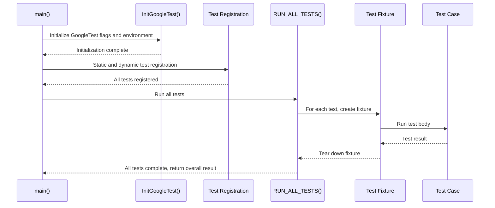

# Test Macros and Test Suites

GoogleTest provides a set of primary macros and classes that enable you to declare, organize, and run C++ test cases and test suites efficiently. This document guides you through the fundamental building blocks: how to write individual tests, group them logically, manage shared resources with fixtures, use event listeners, and register custom test cases. By mastering these components, you will structure your tests in a clear, maintainable way while leveraging GoogleTest’s powerful features.

---

## 1. Overview of Test Macros

GoogleTest defines several macros to declare and run tests. Each serves a distinct role depending on your testing needs.

### 1.1 `TEST()` Macro - Simple Tests

- **Purpose:** Define an independent test with no shared setup
- **Usage:**

  ```cpp
  TEST(TestSuiteName, TestName) {
    // test code and assertions
  }
  ```

- **Details:**
  - The first argument is the test suite name (formerly test case), grouping related tests.
  - The second is the individual test name within that suite.
  - Both names must be valid C++ identifiers and should avoid underscores for portability and consistency.
  - Each test runs independently, ensuring isolation.

**Example:**

```cpp
int Factorial(int n);  // Function under test

TEST(FactorialTest, HandlesZeroInput) {
  EXPECT_EQ(Factorial(0), 1);
}

TEST(FactorialTest, HandlesPositiveInput) {
  EXPECT_EQ(Factorial(3), 6);
  EXPECT_EQ(Factorial(8), 40320);
}
```

### 1.2 `TEST_F()` Macro - Tests with Fixtures

- **Purpose:** Define tests that share a common data configuration and setup.
- **Usage:**

  ```cpp
  class MyFixture : public testing::Test {
   protected:
    void SetUp() override { ... }
    void TearDown() override { ... }
    // shared data members
  };

  TEST_F(MyFixture, TestName) {
    // test code that accesses fixture members
  }
  ```

- **Details:**
  - The test fixture class must derive from `testing::Test`.
  - Use `TEST_F()` to access fixture members.
  - GoogleTest creates a fresh fixture instance for each test to ensure isolation.

**Example:**

```cpp
class QueueTest : public testing::Test {
 protected:
  QueueTest() {
    // setup queues
    q1_.Enqueue(1);
  }

  Queue<int> q0_;
  Queue<int> q1_;
};

TEST_F(QueueTest, IsEmptyInitially) {
  EXPECT_EQ(q0_.size(), 0);
}

TEST_F(QueueTest, DequeueWorks) {
  int* n = q1_.Dequeue();
  ASSERT_NE(n, nullptr);
  EXPECT_EQ(*n, 1);
  delete n;
}
```

### 1.3 `TEST_P()` Macro - Value-Parameterized Tests

- **Purpose:** Define tests to run repeatedly with different values, supporting data-driven tests.
- **Usage:**

  ```cpp
  class ParamTest : public testing::TestWithParam<T> { ... };

  TEST_P(ParamTest, TestName) {
    auto param = GetParam();
    // test code using param
  }
  
  INSTANTIATE_TEST_SUITE_P(InstanceName, ParamTest, Values(...));
  ```

- **Details:**
  - Allows reusing the same test logic over diverse inputs.
  - Instantiations create separate tests for each parameter value.

### 1.4 `INSTANTIATE_TEST_SUITE_P()` Macro

- **Purpose:** Instantiate a value-parameterized test suite with a list or generator of parameters.
- **Usage:**

  ```cpp
  INSTANTIATE_TEST_SUITE_P(
      PrefixName,
      TestSuiteName,
      testing::Values(value1, value2, ...));
  ```

- Supports generators like `Values()`, `Range()`, `Bool()`, and `Combine()`.

### 1.5 Other Macros

- `FRIEND_TEST()`: Grants a specific test access to private members of a class.
- `SCOPED_TRACE()`: Adds additional context to assertion failure messages within a scope.
- `GTEST_SKIP()`: Skips a test dynamically with an optional message.

---

## 2. Structuring Tests with Test Suites and Fixtures

GoogleTest encourages grouping logically related tests into test suites to improve organization and maintenance.

### 2.1 Test Suites

- A **Test Suite** is a collection of tests that share a conceptual link, usually designed around a class or functionality.
- Test suites provide summary results grouping and shared setup through fixtures.
- Naming:
  - Use descriptive and consistent test suite names without underscores.
  - Each test suite corresponds to one or more test files or classes.

### 2.2 Test Fixtures

- When tests share setup or teardown logic or common data, encapsulate these in a test fixture.
- Define fixture members and override `SetUp()` and `TearDown()`.
- Use `TEST_F()` to declare tests using fixtures.

### 2.3 Per-Test and Per-Test-Suite Lifecycle

- GoogleTest instantiates a *new fixture object* for each test to ensure independence.
- Use `SetUpTestSuite()` and `TearDownTestSuite()` static methods for resource-intensive initializations shared across all tests in a suite.

---

## 3. Writing and Running Tests

### 3.1 Creating a Test

1. Include GoogleTest headers: `#include <gtest/gtest.h>`.
2. Use `TEST()` or `TEST_F()` macros to define tests.
3. Within the test body, write assertions to verify behavior.

### 3.2 Assertions Determine Outcome

- If any assertion fails fatally or non-fatally, the test fails.
- If the test crashes, it fails.
- Otherwise, it succeeds.

### 3.3 Test Execution Entry Point

- Use `RUN_ALL_TESTS()` in your `main()` function to run all tests.
- Return its value from `main()` to indicate success/failure to the environment.

**Typical `main()` example:**

```cpp
int main(int argc, char **argv) {
  ::testing::InitGoogleTest(&argc, argv);
  return RUN_ALL_TESTS();
}
```

### 3.4 Using the Default `main()`

- GoogleTest provides a `gtest_main` library implementing a default `main()`.
- Linking against it avoids writing `main()` unless customization is required.

---

## 4. Using Event Listeners

GoogleTest supports event listeners to hook into test execution and enhance reporting.

### 4.1 Writing a Custom Event Listener

- Derive from `testing::TestEventListener` or `testing::EmptyTestEventListener`.
- Override event methods such as `OnTestStart()`, `OnTestEnd()`, `OnTestPartResult()`, etc.

**Example:**

```cpp
class MinimalistPrinter : public testing::EmptyTestEventListener {
  void OnTestStart(const testing::TestInfo& test_info) override {
    printf("*** Test %s.%s starting.\n", test_info.test_suite_name(), test_info.name());
  }

  void OnTestPartResult(const testing::TestPartResult& result) override {
    printf("%s in %s:%d\n%s\n",
           result.failed() ? "*** Failure" : "Success",
           result.file_name(), result.line_number(), result.summary());
  }

  void OnTestEnd(const testing::TestInfo& test_info) override {
    printf("*** Test %s.%s ending.\n", test_info.test_suite_name(), test_info.name());
  }
};
```

### 4.2 Registering a Listener

```cpp
int main(int argc, char** argv) {
  ::testing::InitGoogleTest(&argc, argv);
  testing::TestEventListeners& listeners = testing::UnitTest::GetInstance()->listeners();
  delete listeners.Release(listeners.default_result_printer());  // Optional: disable default
  listeners.Append(new MinimalistPrinter);
  return RUN_ALL_TESTS();
}
```

---

## 5. Registering Custom Tests Programmatically

In some scenarios, you want to register tests dynamically rather than via static macros.

### 5.1 `RegisterTest()` Function

- Allows runtime registration of arbitrary tests.
- Useful for generating tests programmatically based on data or configuration.

### 5.2 Usage Example

```cpp
class MyFixture : public testing::Test {
 public:
  static void SetUpTestSuite() { ... }
  static void TearDownTestSuite() { ... }
  void SetUp() override { ... }
  void TearDown() override { ... }
};

class MyTest : public MyFixture {
 public:
  explicit MyTest(int data) : data_(data) {}
  void TestBody() override { /* test logic using data_ */ }
 private:
  int data_;
};

void RegisterMyTests(const std::vector<int>& values) {
  for (int v : values) {
    testing::RegisterTest(
      "MyFixture", ("Test" + std::to_string(v)).c_str(), nullptr,
      std::to_string(v).c_str(), __FILE__, __LINE__,
      [=]() -> MyFixture* { return new MyTest(v); });
  }
}

int main(int argc, char** argv) {
  testing::InitGoogleTest(&argc, argv);
  std::vector<int> data = {1, 2, 3};
  RegisterMyTests(data);
  return RUN_ALL_TESTS();
}
```

### 5.3 Notes

- Must be called before `RUN_ALL_TESTS()`.
- All tests in the same test suite must return the same fixture type.

---

## 6. Best Practices and Recommendations

- **Test Independence:** Each test should be able to run independently. Avoid dependencies between tests.
- **Meaningful Grouping:** Organize tests into suites that map well to the code structure.
- **Consistent Naming:** Use clear, consistent, and descriptive test and suite names without underscores.
- **Resources in Fixtures:** Use test fixtures to share setup/teardown but remember that a new fixture instance is used per test.
- **Use Event Listeners:** Customize output or hook into test events by implementing listeners.
- **Programmatic Registration:** Use `RegisterTest()` sparingly and only when static macros are insufficient.
- **Avoid Underscores:** Underscores are not recommended in test or suite names to prevent portability or filtering issues.
- **Return RUN_ALL_TESTS():** Always return the value of `RUN_ALL_TESTS()` from your `main()` to signal test results correctly.

---

### Related Resources

- [GoogleTest Primer](primer.md): Concepts and basic usage
- [Assertions and Results](assertions-results.md): Using assertions inside tests
- [Parameterized and Typed Tests](parameterized-typed-tests.md): Advanced test macros
- [Advanced GoogleTest Topics](advanced.md): Deeper into fixtures, listeners, and advanced APIs

---

### Mermaid Diagram: Test Flow and Lifecycle



---

### Code Example: Simple Test and Fixture Usage

```cpp
#include <gtest/gtest.h>

// Simple test
TEST(MathTest, Addition) {
  EXPECT_EQ(1 + 1, 2);
}

// Fixture
class StringTest : public testing::Test {
 protected:
  void SetUp() override {
    str_ = "Hello, world!";
  }
  std::string str_;
};

TEST_F(StringTest, HasHello) {
  EXPECT_NE(str_.find("Hello"), std::string::npos);
}
```

---

### Troubleshooting Tips

- Compile errors using `TEST_F` usually mean the fixture class is undefined or misspelled.
- Failure to return `RUN_ALL_TESTS()` from `main()` results in incorrect exit codes.
- Use `--gtest_list_tests` flag to see all discovered tests.
- Naming conflicts caused by underscores in test/suite names can confuse test filters.
- Avoid calling `RUN_ALL_TESTS()` multiple times.

---

_For complete and detailed reference, see the [Testing Reference](../reference/testing.md)._
