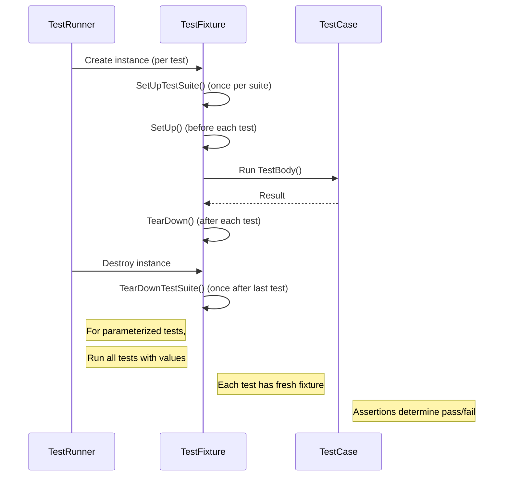

# Test Macros & Fixtures

This page provides a detailed overview of the core GoogleTest macros and fixtures used to define test cases and manage test environments. It explains how to structure your tests, utilize test fixtures to share setup and cleanup code across related tests, employ lifecycle hooks for global or suite-level management, and harness value-parameterized and typed tests for scalable and flexible test suites. Best practices and common patterns are included to help you create robust, maintainable testing code.

---

## 1. Introduction to Test Macros

GoogleTest provides a set of macros that are the primary means for defining tests. These macros create test cases, associate them with test fixtures, or parameterize them with data or types to efficiently cover various scenarios.

### 1.1 `TEST` Macro

Defines a simple test without shared data setup.

```cpp
TEST(TestSuiteName, TestName) {
  ... test statements ...
}
```

- **Purpose:** Defines an individual test named `TestName` within a test suite `TestSuiteName`.
- **Constraints:** Names must be valid C++ identifiers and not contain underscores.
- **Behavior:** Test body can include any code. Assertions inside determine test success or failure.

**Example:**

```cpp
TEST(FactorialTest, HandlesZeroInput) {
  EXPECT_EQ(Factorial(0), 1);
}
```

This macro is ideal for simple, stateless tests.

### 1.2 `TEST_F` Macro (Test Fixture)

Defines a test that uses a test fixture class to share common setup/cleanup.

```cpp
TEST_F(TestFixtureClassName, TestName) {
  ... test statements ...
}
```

- **Purpose:** Uses the named fixture class `TestFixtureClassName` as the test suite name and provides access to its members.
- **Requirements:** The fixture class must derive from `testing::Test` and be defined before its use.
- **Workflow:** For each test, GoogleTest creates a fresh fixture instance, runs `SetUp()`, executes the test body, calls `TearDown()`, then destroys the instance.

**Example Fixture and Tests:**

```cpp
class QueueTest : public testing::Test {
 protected:
  QueueTest() {
    q1_.Enqueue(1);
  }

  Queue<int> q0_;
  Queue<int> q1_;
};

TEST_F(QueueTest, IsEmptyInitially) {
  EXPECT_EQ(q0_.size(), 0);
}

TEST_F(QueueTest, DequeueWorks) {
  int* n = q1_.Dequeue();
  ASSERT_NE(n, nullptr);
  EXPECT_EQ(*n, 1);
  delete n;
}
```

Use `TEST_F` to group related tests sharing common setup.

### 1.3 `TEST_P` Macro (Value-Parameterized Test)

Defines a parameterized test using a fixture along with different input values.

```cpp
TEST_P(TestFixtureName, TestName) {
  ... test code accessing GetParam() ...
}
```

- **Purpose:** Enables writing one test logic that runs multiple times with different parameters.
- **Fixture:** Must be derived from both `testing::Test` and `testing::WithParamInterface<T>` (usually by inheriting from `TestWithParam<T>`).
- **Parameter Access:** Use `GetParam()` to retrieve the current parameter in each test run.

**Example:**

```cpp
TEST_P(MyTestSuite, DoesSomething) {
  EXPECT_TRUE(DoSomething(GetParam()));
}
```

### 1.4 `INSTANTIATE_TEST_SUITE_P` Macro

Defines how to generate parameter values for a `TEST_P` test suite.

```cpp
INSTANTIATE_TEST_SUITE_P(InstantiationName, TestSuiteName, param_generator, name_generator);
```

- **Purpose:** Instantiates the parameterized test suite with specified parameter values.
- **Parameter Generators:** Include `testing::Range()`, `testing::Values()`, `testing::ValuesIn()`, `testing::Bool()`, `testing::Combine()`, and `testing::ConvertGenerator()`.
- **Name Generation:** You can specify a function or lambda to generate readable suffixes for test names based on parameters.

**Example:**

```cpp
INSTANTIATE_TEST_SUITE_P(MeenyMinyMoe, FooTest, testing::Values("meeny", "miny", "moe"));
```

See section on *Value-Parameterized Tests* for details on valid generators.

### 1.5 Typed Tests (`TYPED_TEST_SUITE`, `TYPED_TEST`, etc.)

Used when the same test logic must be run for multiple types rather than multiple values.

- Define a fixture class template parameterized on type.
- Declare a list of types using `testing::Types<...>`.
- Register the fixture and type list with `TYPED_TEST_SUITE`.
- Define tests with `TYPED_TEST` using `TypeParam` for the current type.

**Example:**

```cpp
template <typename T>
class MyFixture : public testing::Test {
  // Fixture members using T
};

using MyTypes = ::testing::Types<char, int, unsigned int>;
TYPED_TEST_SUITE(MyFixture, MyTypes);

TYPED_TEST(MyFixture, DoesBlah) {
  TypeParam value = this->value_;
  ...
}
```

For more advanced use, *Type-Parameterized Tests* with macros ending in `_P` are available, supporting test registration and instantiation across translation units.

### 1.6 `FRIEND_TEST` Macro

Grants a test access to private members of a class.

```cpp
class Foo {
  FRIEND_TEST(FooTest, Bar);
  ...
};

TEST_F(FooTest, Bar) {
  ... access private members of Foo ...
}
```

Important when testing internal/private code by declaring the relevant tests as friends within the production class.

### 1.7 Test Lifecycle Hooks

GoogleTest provides lifecycle hooks to share setup/teardown logic beyond individual test cases.

- `SetUpTestSuite()` / `TearDownTestSuite()` static methods in fixtures: run once before the first / after the last test in the suite. Share expensive resources.
- `SetUp()` / `TearDown()` virtual methods: run before/after each individual test.
- Environment class: for global setup and teardown applicable to all tests.

Example:

```cpp
class MyFixture : public testing::Test {
 public:
  static void SetUpTestSuite() {
    // Shared setup
  }

  static void TearDownTestSuite() {
    // Shared cleanup
  }

  void SetUp() override {
    // Per-test setup
  }

  void TearDown() override {
    // Per-test cleanup
  }
};
```

### 1.8 `SCOPED_TRACE` Macro

Enhances diagnostic messages by attaching additional trace context to failures within a scope.

```cpp
SCOPED_TRACE("Extra context info");
EXPECT_EQ(foo, bar);
```

When an assertion fails inside the scope, the trace (‘file’, ‘line’, and message) is appended to the failure output to clarify which invocation or context caused the error.

---

## 2. Best Practices for Structuring Tests and Fixtures

- Use `TEST` for simple tests that do not require shared setup.
- Use `TEST_F` when tests share common data or need setup/cleanup.
- Implement `SetUpTestSuite` and `TearDownTestSuite` for expensive shared resources to optimize test runtime.
- Avoid sharing mutable state between tests unless carefully synchronized and reset.
- For parameterized tests, prefer `TEST_P` combined with appropriate parameter generators and `INSTANTIATE_TEST_SUITE_P` to cover multiple inputs efficiently.
- Use readable and consistent naming conventions for test suites and tests; avoid underscores as per style guidance.
- Employ `SCOPED_TRACE` to improve debugging when tests call shared helpers or loops.

---

## 3. Sample User Flow: Writing and Organizing Tests Using Fixtures and Parameterization

1. **Identify test cases and common setup:** Group related tests that use similar data or configuration.
2. **Define a fixture class:** Subclass `testing::Test` and add shared members.
3. **Implement setup/cleanup:** Override `SetUp()`, `TearDown()`, and optionally `SetUpTestSuite()`, `TearDownTestSuite()`.
4. **Write test functions:** Use `TEST_F` to write tests accessing fixture members.
5. **Add parameterization if needed:** For tests requiring coverage over different inputs, define a fixture derived from `TestWithParam<T>` and write `TEST_P` tests.
6. **Instantiate parameterized tests:** Use `INSTANTIATE_TEST_SUITE_P` with generators.
7. **Run and iterate:** Use `RUN_ALL_TESTS` in `main()` to execute all tests.

---

## 4. Troubleshooting & Common Pitfalls

- **Misuse of `TEST` vs `TEST_F`:** Using `TEST_F` with undefined fixtures or `TEST` with fixture methods leads to compile errors.
- **Underscores in names:** Both test suite and test names must not contain underscores; this can cause test discovery or failure issues.
- **Incorrect fixture setup:** Misspelling `SetUp()` as `Setup()` will silently prevent setup execution.
- **Parameterization without instantiation:** Defining `TEST_P` without `INSTANTIATE_TEST_SUITE_P` causes tests never to run (unless overridden).
- **Parameter name collisions:** When specifying custom name generators, ensure names are unique and valid.
- **Fatal assertions in non-void functions:** Fatal assertions (`ASSERT_*`) must only be used inside void-returning functions.
- **Shared mutable state between tests:** Always reset or avoid shared state to prevent flaky tests.
- **Using `GTEST_SKIP()`:** Properly use this to skip tests under conditions to avoid unwanted failures.

---

## 5. Comprehensive Example

```cpp
// Fixture with shared resource
class DatabaseTest : public testing::Test {
 protected:
  static void SetUpTestSuite() {
    // Initialize expensive database connection
    db_connection_ = ConnectToDatabase();
  }

  static void TearDownTestSuite() {
    DisconnectDatabase(db_connection_);
    db_connection_ = nullptr;
  }

  void SetUp() override {
    // Prepare database for each test
    ResetDatabase(db_connection_);
  }

  static DatabaseConnection* db_connection_;
};
DatabaseConnection* DatabaseTest::db_connection_ = nullptr;

TEST_F(DatabaseTest, InsertRecord) {
  bool success = InsertRecord(db_connection_, Record(1));
  EXPECT_TRUE(success);
}

TEST_F(DatabaseTest, DeleteRecord) {
  DeleteRecord(db_connection_, 1);
  EXPECT_FALSE(RecordExists(db_connection_, 1));
}

// Parameterized test for sorting algorithm with inputs and expected outputs
class SortTest : public testing::TestWithParam<std::vector<int>> {
};

TEST_P(SortTest, SortsCorrectly) {
  std::vector<int> input = GetParam();
  std::vector<int> expected = input;
  std::sort(expected.begin(), expected.end());

  Sort(input);
  EXPECT_EQ(input, expected);
}

INSTANTIATE_TEST_SUITE_P(SortTests,
                         SortTest,
                         testing::Values(
                             std::vector<int>{},
                             std::vector<int>{1},
                             std::vector<int>{3, 2, 1},
                             std::vector<int>{5, 1, 4, 2, 3}));
```

This example illustrates shared setup and teardown at both the test suite and individual test level, as well as parameterized tests with multiple input cases.

---

## 6. Additional Resources

- [GoogleTest Primer](../primer.md) — Foundational concepts and simple test structuring
- [Assertions Reference](../reference/assertions.md) — Detailed information on assertions used in tests
- [Parameterized and Typed Tests Guide](../guides/core-testing-workflows/advanced-test-structures.mdx) — Expanded coverage on value-parameterized and typed tests
- [Advanced GoogleTest Topics](../advanced.md) — In-depth topics such as test lifecycle, fixtures, skipping, and event listeners
- [Mocking Reference](../reference/mocking.md) — Useful when your tests involve mocks

---

## 7. Summary Diagram: Test Lifecycle with Fixtures and Parameterization



This illustrates how GoogleTest orchestrates test execution and fixture lifecycle.

---

For full reference on test macros, parameter generators, and classes involved, consult the [Testing Reference](../reference/testing.md) and the [GoogleTest Primer](../primer.md).
