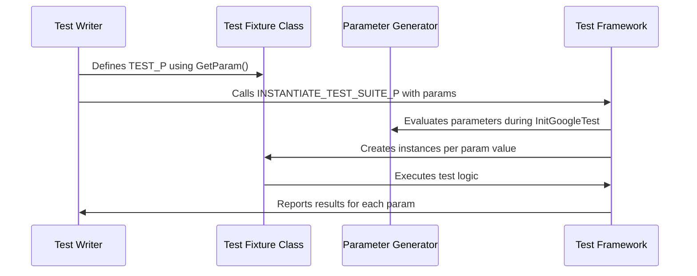

# Test Parameterization APIs

GoogleTest offers powerful APIs to enhance your test coverage through **parameterized testing**. By running the same tests across multiple data values or types, you can identify edge cases, verify interface compliance, and ensure exhaustive validation without duplicating test code.

This page explains the two main kinds of test parameterization: **value-parameterized tests** and **type-parameterized tests**. Both allow clear, maintainable, and scalable test suites that run automatically generated test instances for each parameter.

---

## 1. Value-Parameterized Tests

Value-parameterized tests enable running the same test logic repeatedly with different input values.

### Overview

You define a test fixture class derived from `::testing::TestWithParam<T>`, where `T` is the type of parameter values. Inside your test body, you access the parameter via `GetParam()`. You then instantiate your test suite with a generator of values.

### Defining a Value-Parameterized Test

```cpp
class FooTest : public ::testing::TestWithParam<int> {
  // Custom fixture members (if needed)
};

TEST_P(FooTest, IsEven) {
  int val = GetParam();
  EXPECT_EQ(val % 2, 0) << "Value " << val << " is not even";
}
```

### Instantiating Tests With Parameters

Use the `INSTANTIATE_TEST_SUITE_P` macro to define the parameter values. GoogleTest provides several generator functions for this:

- `Values(v1, v2, ..., vN)` - explicit list
- `ValuesIn(container)` - values from an array or STL container
- `Range(start, end[, step])` - range of values (excluding `end`)
- `Bool()` - boolean values {false, true}
- `Combine(g1, g2, ..., gN)` - Cartesian product of multiple generators
- `ConvertGenerator<T>(gen, optional_converter)` - converts generated values

Example:

```cpp
INSTANTIATE_TEST_SUITE_P(
  EvenNumbers,
  FooTest,
  ::testing::Values(2, 4, 6, 8));
```

### Using Combined Generators

You can combine multiple parameter generators to test all combinations of inputs:

```cpp
class MultiParamTest : public ::testing::TestWithParam<std::tuple<int, bool>> {};

TEST_P(MultiParamTest, CheckCombined) {
  int number = std::get<0>(GetParam());
  bool flag = std::get<1>(GetParam());
  // Test logic
}

INSTANTIATE_TEST_SUITE_P(
  NumberBoolCombos,
  MultiParamTest,
  ::testing::Combine(::testing::Values(1, 2), ::testing::Bool()));
```

### Customizing Generated Test Names

To help identify tests in output, use the optional *name_generator* argument to produce valid suffixes for each parameter instance. It accepts a callable:

```cpp
INSTANTIATE_TEST_SUITE_P(
  CustomNames,
  FooTest,
  ::testing::Values(10, 20, 30),
  [](const ::testing::TestParamInfo<FooTest::ParamType>& info) {
    return "Value_" + std::to_string(info.param);
  });
```

Note: Names must only contain ASCII alphanumeric characters or underscores.

### Best Practices

- Use `GetParam()` inside `TEST_P` to access current test parameters.
- Choose appropriate parameter generators for simplicity and clarity.
- When testing multiple parameters, prefer `Combine` for clarity and maintainability.
- Use `ConvertGenerator` when your test fixture's parameter type differs from the generator's value type.

---

## 2. Type-Parameterized Tests

Type-parameterized tests let you run the same test logic for multiple types, verifying interface compliance or behavior differences across type variations.

### Defining a Typed Test Suite

You declare a fixture class template derived from `::testing::Test`:

```cpp
template <typename T>
class BlobTest : public ::testing::Test {
 public:
  void SetUp() override { /* shared setup */ }

  T value_;
};
```

Associate a list of types with the test suite using `TYPED_TEST_SUITE`:

```cpp
using MyTypes = ::testing::Types<int, float, double>;
TYPED_TEST_SUITE(BlobTest, MyTypes);
```

### Writing Typed Tests

Use `TYPED_TEST` macros to define tests for each type in the suite:

```cpp
TYPED_TEST(BlobTest, IsZeroInitially) {
  EXPECT_EQ(this->value_, TypeParam{});
}

TYPED_TEST(BlobTest, CanAssignValue) {
  this->value_ = static_cast<TypeParam>(42);
  EXPECT_EQ(this->value_, static_cast<TypeParam>(42));
}
```

Within the test, use `TypeParam` to refer to the current type and `this->` to access fixture members.

### Registering and Instantiating Type-Parameterized Tests

Register your test names with `REGISTER_TYPED_TEST_SUITE_P`:

```cpp
REGISTER_TYPED_TEST_SUITE_P(BlobTest, IsZeroInitially, CanAssignValue);
```

Instantiate the test suite with types:

```cpp
INSTANTIATE_TYPED_TEST_SUITE_P(MyTypedTests, BlobTest, MyTypes);
```

### Custom Type Names

Provide a name generator class with a static, templated `GetName(int index)` method to create readable test type suffixes:

```cpp
class TypeNames {
 public:
  template <typename T>
  static std::string GetName(int) {
    if constexpr (std::is_same_v<T, int>) return "Int";
    if constexpr (std::is_same_v<T, float>) return "Float";
    if constexpr (std::is_same_v<T, double>) return "Double";
    return "Unknown";
  }
};

TYPED_TEST_SUITE(BlobTest, MyTypes, TypeNames);
```

---

## 3. Additional Utilities and Notes

### Allowing Uninstantiated Parameterized Test Suites

If you define parameterized tests but choose not to instantiate them immediately, suppress failures using:

```cpp
GTEST_ALLOW_UNINSTANTIATED_PARAMETERIZED_TEST(MyTestSuite);
```

### Parameter Type Requirements

- Parameter types must be **copyable**.
- For typed tests, the fixture template parameter must be a valid type.
- Parameter names must not contain underscores or special characters to avoid conflicts.

### Parameter Generator Evaluation Timing

Parameters are generated during `InitGoogleTest()`, which happens before `RUN_ALL_TESTS()`. This allows dynamic determination of test parameters before test execution.

### Thread Safety

Parameterized tests work seamlessly in multi-threaded environments supported by GoogleTest.

---

## 4. Summary Diagram: Value-Parameterized Test Lifecycle



---

## See Also

- [Writing Your First Test](../getting-started/first-steps-usage/writing-your-first-test)
- [Value- and Type-Parameterized Tests Guide](../guides/everyday-workflows/parameterized-and-typed-tests)
- [Test Suites and Test Case Macros](./test-case-and-test-macros)
- [Test Running Reference](../getting-started/first-steps-usage/running-tests)
- [GoogleMock for Mocking Support](../guides/mocking-and-advanced-techniques/mocking-basics)

---

## Practical Tips

- Start simple: Write a `TEST_P` test with `Values` or `Range` generators to get familiar.
- Use `Combine` for multi-dimensional test coverage.
- Prefer descriptive test and suite names to track parameters in test results.
- Use custom name generators to improve clarity in CI outputs.
- Always call `InitGoogleTest()` before instantiations and `RUN_ALL_TESTS()`.

---

Harnessing test parameterization in GoogleTest empowers you to write concise, reusable, and broad-coverage tests. Leverage the APIs described here to maximize confidence in your C++ code.
