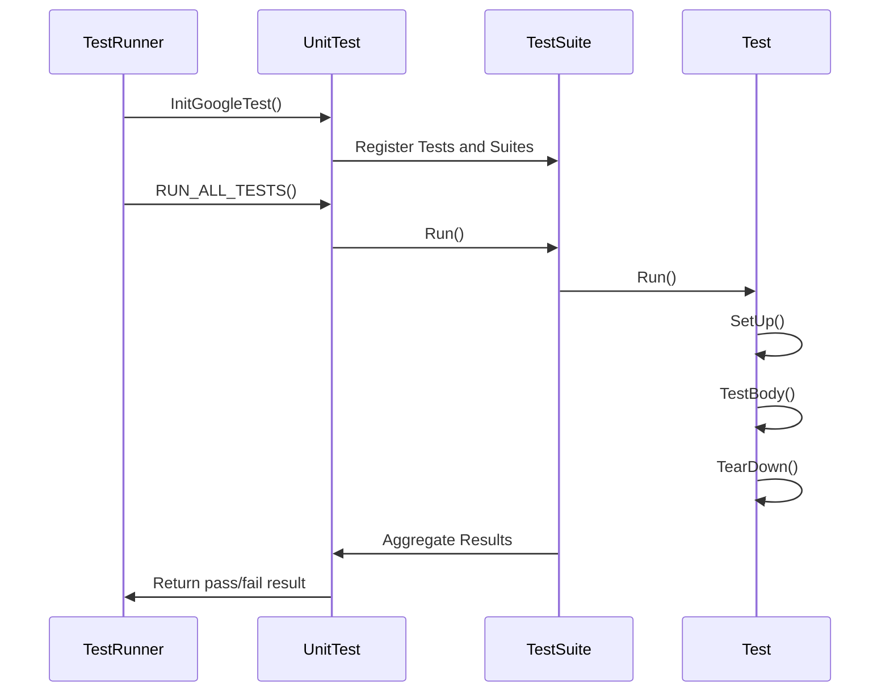

# Test Registration and Structure

This document explains how GoogleTest allows you to declare tests, organize them into test suites, and control their execution lifecycle. It covers using fixture classes for shared setup, managing global test environments, and programmatically registering tests. You will also find practical examples illustrating efficient test organization and advanced usage patterns.

---

## Test Basics and Suites

### Defining Tests with TEST

To define a simple test, use the `TEST` macro which creates a test function belonging to a test suite:

```cpp
TEST(TestSuiteName, TestName) {
  // test code here
}
```

- **TestSuiteName** groups related tests logically.
- **TestName** identifies the individual test.

Tests within the same suite share the suite name, but each test is independent.

### Using Test Fixtures with TEST_F

If multiple tests share common objects or setup/teardown code, define a test fixture class by deriving from `testing::Test`:

```cpp
class MyFixture : public testing::Test {
 protected:
  void SetUp() override { /* prepare before each test */ }
  void TearDown() override { /* clean up after each test */ }
  // Shared objects
};
```

Then declare tests that use the fixture with `TEST_F`:

```cpp
TEST_F(MyFixture, TestName) {
  // Access fixture members here
}
```

Each `TEST_F` creates a fresh fixture instance, calls `SetUp()`, runs the test, then calls `TearDown()` and deletes the fixture.

### Test Lifecycle Methods

- **SetUpTestSuite() / TearDownTestSuite() (Static)**

  These static methods in the fixture class run once before the first and after the last test in the suite, for expensive shared setup and teardown.

- **SetUp() / TearDown()**

  Instance methods invoked before and after each individual test.

### Skipping Tests

You can skip tests at runtime using `GTEST_SKIP()`. It aborts the current test immediately and reports it as skipped.

```cpp
TEST(MyTest, SkipExample) {
  GTEST_SKIP() << "Skipping this test";
  // The following code won't run
}
```

## Value-Parameterized Tests

Value-parameterized tests allow reusing the same test logic with different input data.

### Writing Value-Parameterized Tests

- Derive from `testing::TestWithParam<T>`, where `T` is your parameter type:

  ```cpp
  class ParamTest : public testing::TestWithParam<int> {};
  ```

- Write tests using the `TEST_P` macro:

  ```cpp
  TEST_P(ParamTest, DoesSomething) {
    int param = GetParam();
    // test with param
  }
  ```

- Instantiate tests with parameter generators using `INSTANTIATE_TEST_SUITE_P`:

  ```cpp
  INSTANTIATE_TEST_SUITE_P(Example, ParamTest, testing::Values(1, 2, 3));
  ```

Parameter generators include `Values()`, `Range()`, `ValuesIn()`, `Bool()`, `Combine()`, and `ConvertGenerator()`.

You can also provide custom test name suffixes using a generator function.

## Typed Tests

Typed tests run the same test code over multiple types.

### Writing Typed Tests

- Define a fixture template class:

  ```cpp
  template <typename T>
  class TypedTestFixture : public testing::Test {
    // ...
  };
  ```

- Define a list of types to run tests on:

  ```cpp
  using MyTypes = ::testing::Types<int, char, double>;
  TYPED_TEST_SUITE(TypedTestFixture, MyTypes);
  ```

- Write tests with the `TYPED_TEST` macro:

  ```cpp
  TYPED_TEST(TypedTestFixture, ExampleTest) {
    TypeParam value = ...;  // TypeParam is the current type
    // test code
  }
  ```

- Optionally, provide a custom name generator for test name suffixes.

## Type-Parameterized Tests

Type-parameterized tests allow defining abstract test suites without knowing the types ahead of time.

### Writing Type-Parameterized Tests

- Define a fixture template:

  ```cpp
  template <typename T>
  class MyTestSuite : public testing::Test {};
  ```

- Declare type-parameterized test suite with `TYPED_TEST_SUITE_P`.
- Define tests using `TYPED_TEST_P`.
- Register the test names with `REGISTER_TYPED_TEST_SUITE_P`.
- Instantiate the test suite with types using `INSTANTIATE_TYPED_TEST_SUITE_P`.

This pattern is suited for interface compliance testing or other scenarios where type lists are decided later.

## Programmatic Test Registration

You can dynamically register tests at runtime using `::testing::RegisterTest`: 

```cpp
::testing::RegisterTest(
    "MySuite", "TestName", nullptr, nullptr,
    __FILE__, __LINE__, []() -> MyFixture* { return new MyFixture(); });
```

This allows flexible test generation when macro-based declarations are insufficient.

## Test Environments

Global test environment objects define setup and teardown code for the entire test program.

- Derive your class from `testing::Environment`.
- Override `SetUp()` and `TearDown()`.
- Register it before `RUN_ALL_TESTS()` via `testing::AddGlobalTestEnvironment()`.

Example:

```cpp
class MyEnv : public testing::Environment {
 public:
  void SetUp() override { /* global setup */ }
  void TearDown() override { /* global teardown */ }
};

int main(int argc, char **argv) {
  testing::InitGoogleTest(&argc, argv);
  testing::AddGlobalTestEnvironment(new MyEnv);
  return RUN_ALL_TESTS();
}
```

## Inspecting Test State

### TestInfo

Each test has an associated `TestInfo` object storing:

- Test suite name
- Test name
- Fixture class
- Whether it should run
- Source file and line number
- Runtime result information

Access the current test info by:

```cpp
const testing::TestInfo* info = testing::UnitTest::GetInstance()->current_test_info();
if (info != nullptr) {
  std::cout << info->test_suite_name() << "." << info->name() << std::endl;
}
```

### TestSuite

`TestSuite` holds all tests in a suite with statistics like number passed, failed, or disabled.

### UnitTest

The `UnitTest` singleton contains all test suites and controls running all tests.

## Test Event Listeners

You can receive notifications about test events (e.g., test start, test end, assertion failure) by implementing `testing::TestEventListener` or subclassing `EmptyTestEventListener` and overriding needed methods.

Adding a listener:

```cpp
class MyListener : public testing::EmptyTestEventListener {
  void OnTestStart(const testing::TestInfo& test_info) override {
    //...
  }
};

int main(int argc, char** argv) {
  testing::InitGoogleTest(&argc, argv);
  testing::UnitTest::GetInstance()->listeners().Append(new MyListener);
  return RUN_ALL_TESTS();
}
```

To silence default console output, remove the default listener:

```cpp
auto& listeners = testing::UnitTest::GetInstance()->listeners();
delete listeners.Release(listeners.default_result_printer());
```

## Test Lifecycle Flow



## Practical Examples

### Simple Test

```cpp
TEST(MathTest, Addition) {
  EXPECT_EQ(1 + 1, 2);
}
```

### Test Fixture

```cpp
class QueueTest : public testing::Test {
 protected:
  Queue<int> q;
  void SetUp() override {
    q.Enqueue(1);
  }
};

TEST_F(QueueTest, SizeIsOne) {
  EXPECT_EQ(q.size(), 1);
}
```

### Value-Parameterized Test

```cpp
class MyParamTest : public testing::TestWithParam<int> {};

TEST_P(MyParamTest, IsPositive) {
  EXPECT_GT(GetParam(), 0);
}

INSTANTIATE_TEST_SUITE_P(PositiveInts, MyParamTest, testing::Values(1, 2, 3));
```

### Typed Test

```cpp
template <typename T>
class MyTypedTest : public testing::Test {
 protected:
  T value_;
};

using MyTypes = ::testing::Types<int, float>;
TYPED_TEST_SUITE(MyTypedTest, MyTypes);

TYPED_TEST(MyTypedTest, IsDefaultConstructible) {
  TypeParam local_value = this->value_;
  (void)local_value;
  SUCCEED();
}
```

### Type-Parameterized Test

```cpp
template <typename T>
class MyTypePattern : public testing::Test {};

TYPED_TEST_SUITE_P(MyTypePattern);
TYPED_TEST_P(MyTypePattern, Example) {
  // test code
}
REGISTER_TYPED_TEST_SUITE_P(MyTypePattern, Example);

using Types = ::testing::Types<int, double>;
INSTANTIATE_TYPED_TEST_SUITE_P(MyInst, MyTypePattern, Types);
```

## Best Practices

- **Use descriptive names** without underscores in test suite and test names.
- **Keep tests independent**—avoid shared state that can create hidden dependencies.
- **Use fixtures** to share setup among tests logically belonging together.
- **Use parameterized and typed tests** to reduce code duplication.
- **Verify test registration and instantiation** when using programmatic or parameterized tests to avoid silent missing tests.
- **Leverage test environments** to manage shared resources across the whole test program.
- **Inspect current test info when context-sensitive logic is needed.**

## Troubleshooting and Common Issues

- Ensure the fixture class has a public default constructor for GoogleTest to instantiate.
- Spell `SetUp()` and `TearDown()` correctly (case-sensitive).
- Be mindful that `ASSERT_*` macros abort only the current function, so use `HasFatalFailure()` or exceptions to propagate fatal failures across functions.
- Remember `RUN_ALL_TESTS()` must be called once and its return value used (typically as `main`'s return value).
- Disabled tests (prefixed with `DISABLED_`) are not run unless explicitly enabled with the `--gtest_also_run_disabled_tests` flag.

## Related APIs and Concepts

- [Assertions and Predicate APIs](api-reference/core-testing-apis/assertions-and-predicate-apis)
- [Value and Type Parameterized Testing](api-reference/core-testing-apis/value-and-type-parameterized-testing)
- [Test Event Listener API](reference/testing.md#TestEventListener)

---

### Source Link

<Source url="https://github.com/google/googletest" paths={[{"path": "googletest/include/gtest/gtest.h", "range": "1-988"},{"path": "googletest/include/gtest/gtest-typed-test.h", "range": "1-156"},{"path": "googletest/include/gtest/gtest-param-test.h", "range": "1-212"}]} />
