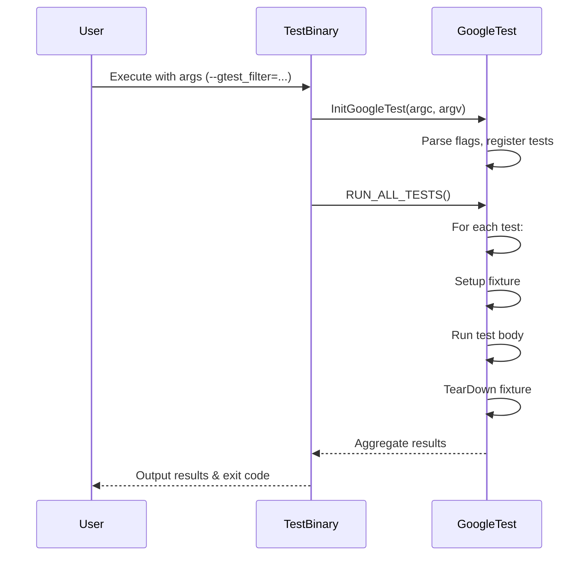

# Test Runner & Execution Control

GoogleTest empowers you with flexible control over how your tests are launched and executed, helping you efficiently isolate, filter, and collect results from your test runs. This guide unpacks everything you need to orchestrate your tests—from the linking conveniences of `gtest_main` and `gmock_main` libraries to command-line invocations, filtering suites and tests, and exporting detailed result reports.

---

## 1. Using the Default Main Entry Points

GoogleTest provides ready-made main functions bundled in libraries to get your test executions started without extra boilerplate.

### 1.1 `gtest_main` Library

- Contains a `main()` function that initializes GoogleTest and invokes all registered tests via `RUN_ALL_TESTS()`.
- Linking your test binary with `gtest_main` eliminates the need to write your own `main()`, enabling instant test running.
- Behind the scenes, it calls:

  ```cpp
  testing::InitGoogleTest(&argc, argv);
  return RUN_ALL_TESTS();
  ```

- This default `main()` works across supported platforms and respects command-line flags.

### 1.2 `gmock_main` Library

- Extends `gtest_main` by including GoogleMock initialization alongside GoogleTest initialization.
- Use `gmock_main` if your tests use mocking features.
- It internally calls:

  ```cpp
  testing::InitGoogleMock(&argc, argv);
  return RUN_ALL_TESTS();
  ```

- Same cross-platform support and behavior as `gtest_main`.

### 1.3 When to Write Your Own `main()`

Most users should rely on these libraries. Write a custom `main()` only when you need special pre-test setup or integration logic. Always ensure your `main()` calls `InitGoogleTest()` or `InitGoogleMock()` before running `RUN_ALL_TESTS()`, and returns its result.

---

## 2. Command-Line Interface Options

GoogleTest test executables accept a rich set of command-line flags to shape test execution behavior, output, and filtering. These are parsed by `InitGoogleTest()`.

### 2.1 Basic Execution Options

- `--gtest_list_tests`
  - Lists all registered tests without running them.

- `--gtest_filter=POSITIVE_PATTERNS[-NEGATIVE_PATTERNS]`
  - Filters which tests to run based on patterns.
  - Patterns use wildcards like `*`.
  - Example: `--gtest_filter=MathTest.*-MathTest.TooSlow`

- `--gtest_repeat=N`
  - Runs the tests `N` times consecutively.

- `--gtest_shuffle`
  - Runs tests in a random order.

- `--gtest_random_seed=SEED`
  - Sets the seed for shuffling.

- `--gtest_break_on_failure`
  - Breaks into the debugger on a test failure.

### 2.2 Controlling Output

- `--gtest_output=FORMAT[:PATH]`
  - Exports test results in specified formats.
  - Supported FORMATS include `xml` and `json`.
  - PATH directs output location. Use `--` to write to stdout.

- `--gtest_color=(yes|no|auto)`
  - Controls colored output.

- `--gtest_catch_exceptions=(yes|no)`
  - Enables or disables exception catching.

- `--gtest_death_test_style=(threadsafe|fast)`
  - Controls death test implementation mode.

### 2.3 Advanced Test Control Flags

- `--gtest_repeat=N`
  - Repeat entire tests suite `N` times; useful for flaky test detection.

- `--gtest_internal_run_death_test`
  - Used internally to run death tests.

- `--gtest_lists_tests`
  - Prints a list of all test cases and tests.

### Example Command

```bash
./my_test_binary --gtest_filter=MathTest.* --gtest_repeat=3 --gtest_output=xml:report.xml
```

Runs all tests in `MathTest` suite three times and exports results to `report.xml`.

---

## 3. Filtering Tests

Filtering lets you fine-tune exactly which tests run in a given execution, improving feedback speed and focusing diagnosis.

### 3.1 Filtering Syntax

- Filters consist of one or more positive patterns and optionally negative patterns separated by a minus (`-`).
  - Positive patterns specify tests to include.
  - Negative patterns specify tests to exclude.

- Patterns apply to the full test name: `<TestSuiteName>.<TestName>`.
- Wildcards (`*`) can be used.

### 3.2 Common Use Cases

- Run a specific test:

  ```bash
  --gtest_filter=MySuite.MySpecificTest
  ```

- Run all tests in a test suite:

  ```bash
  --gtest_filter=MySuite.*
  ```

- Run all except a specific test:

  ```bash
  --gtest_filter=-MySuite.UnstableTest
  ```

- Combine inclusion and exclusion:

  ```bash
  --gtest_filter=MySuite.*-MySuite.UnstableTest
  ```

### 3.3 Best Practices

- Use filters during development to quickly re-run tests of interest.
- Use exclusion filters to temporarily skip flaky tests without removing them.
- Combine filtering with shuffling to detect inter-test dependencies.

---

## 4. Test Execution Environment and Output

### 4.1 Running Tests Programmatically

- `RUN_ALL_TESTS()` is the standard macro to kick off all registered tests.
- It returns `0` on success (all tests passed) and `1` on failure.
- Always return the result of `RUN_ALL_TESTS()` from your `main()`.

### 4.2 Output Reporting

- GoogleTest naturally prints human-readable test results on stdout.
- The XML and JSON output formats are useful for CI integration and further processing.
- Use `--gtest_output=xml:filename` or `--gtest_output=json:filename` to enable these.

### 4.3 Result Interpretation

- Test results group by test suites; each test’s result is shown clearly.
- Failed tests display source file and line number with descriptive messages.
- Non-fatal failures allow tests to continue running, reporting multiple issues promptly.

---

## 5. Integration Touchpoints and Practical Tips

### 5.1 Link with `gtest_main` or `gmock_main`

- For rapid startup, link tests with these provided libraries.
- Avoid defining your own `main()` unless you need special setup or teardown logic.

### 5.2 Use Command-Line Flags for Flexible Test Runs

- Incorporate filtering in development workflows.
- Use repetitions and shuffling to uncover flaky behaviors.
- Export reports for CI dashboards.

### 5.3 Combining with Mocking

- When using GoogleMock, initialize and invoke tests via `gmock_main`.
- By default, GoogleMock extends GoogleTest initialization.

### 5.4 Handling Embedded and Special Platforms

- On embedded platforms like Arduino, entry points conform to `setup()` and `loop()` functions.
- GoogleTest and GoogleMock provide special initialization routines adapted to these environments.

---

## 6. Troubleshooting Common Issues

<Tip>
If `RUN_ALL_TESTS()` returns immediately without running tests, check that your tests are properly registered and that `testing::InitGoogleTest()` or `testing::InitGoogleMock()` was called.
</Tip>

<Warning>
Do not call `RUN_ALL_TESTS()` multiple times per execution; this can cause undefined behavior and interfere with test lifecycle management.
</Warning>

<Note>
Ensure command-line flags are passed correctly and that no conflicting flags interfere with test running. Use `--gtest_list_tests` to validate test registration.
</Note>

---

## 7. Quick Reference Code Examples

### 7.1 Basic `main()` with GoogleTest
```cpp
#include <gtest/gtest.h>

int main(int argc, char** argv) {
  testing::InitGoogleTest(&argc, argv);
  return RUN_ALL_TESTS();
}
```

### 7.2 Basic `main()` with GoogleMock
```cpp
#include <gmock/gmock.h>

int main(int argc, char** argv) {
  testing::InitGoogleMock(&argc, argv);
  return RUN_ALL_TESTS();
}
```

### 7.3 Running Tests with Filtering and Output

```bash
./my_tests --gtest_filter=MySuite.* --gtest_output=xml:results.xml
```

---

## 8. Diagram: Test Runner Execution Flow



---

## Additional Resources

- [Writing Your First Test](../getting-started/first-test-validation/writing-your-first-test) for building tests
- [Organizing and Running Tests](../guides/core-workflows/organizing-and-running-tests) for deeper test run control strategies
- [Mocking Reference](../api-reference/mocking-framework/setting-expectations) to combine mocks and run control
- [GoogleTest Primer](../docs/primer.md) for foundational concepts

---

This page covers launching and controlling tests with GoogleTest, including the convenience entry points, CLI filtering, output configuration, and integration points crucial for effective test execution workflows.