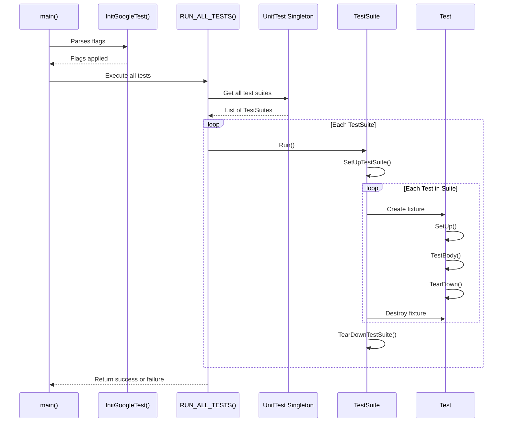

# Test Structure and Lifecycle

GoogleTest provides a robust API for defining, organizing, and running tests, orchestrating everything from test registration and execution to setup and teardown procedures. This reference focuses on the core classes, macros, and functions that form the backbone of test structure and lifecycle within GoogleTest.

---

## 1. Test Suites and Tests

Tests are organized into **test suites**, each representing a logical group of test cases. Each test case corresponds to a single, independently executable test defined in the code.

### Defining Tests

GoogleTest offers several macros that define tests with varying capabilities and complexity:

- `TEST(TestSuiteName, TestName)`: Defines a simple test. Test suites and test names must be valid C++ identifiers without underscores. Each test runs independently.

```cpp
TEST(FactorialTest, HandlesZeroInput) {
  EXPECT_EQ(Factorial(0), 1);
}
```

- `TEST_F(TestFixtureName, TestName)`: Defines a test that uses a test fixture. The fixture class inherits from `testing::Test`, providing reusable setup and teardown for tests.

- `TEST_P(TestFixtureName, TestName)`: Defines a *value-parameterized* test that runs multiple times with different parameters. The test class must inherit from `testing::TestWithParam<T>`.

```cpp
TEST_P(MyTestSuite, DoesSomething) {
  EXPECT_TRUE(DoSomething(GetParam()));
}
```

- `TYPED_TEST_SUITE` and `TYPED_TEST`: Used for *typed tests* where tests are instantiated over a list of types.

- `TYPED_TEST_SUITE_P` and `TYPED_TEST_P`: Define *type-parameterized* tests, allowing abstract test patterns to be instantiated later with different types.

### Test Registration

Tests declared via macros are registered automatically with the framework. For advanced use cases requiring dynamic registration, use:

```cpp
template <typename Factory>
TestInfo* RegisterTest(const char* test_suite_name, const char* test_name,
                      const char* type_param, const char* value_param,
                      const char* file, int line, Factory factory);
```

The `factory` must be callable to create instances of your test fixture.

---

## 2. Test Fixtures: Setup and Teardown

Test fixtures allow sharing common setup and teardown code among tests within the same suite.

- Derive your fixture class from `testing::Test`.
- Override `SetUp()` and `TearDown()` for per-test setup and teardown.
- Use `SetUpTestSuite()` and `TearDownTestSuite()` for per-suite setup and teardown.

```cpp
class FooTest : public testing::Test {
 protected:
  static void SetUpTestSuite() {
    shared_resource_ = new Resource;
  }

  static void TearDownTestSuite() {
    delete shared_resource_;
    shared_resource_ = nullptr;
  }

  void SetUp() override {
    // Prepare test-specific initialization
  }

  void TearDown() override {
    // Clean up after each test
  }

  static Resource* shared_resource_;
};

Resource* FooTest::shared_resource_ = nullptr;
```

Each test runs with a fresh fixture instance, ensuring test isolation.

---

## 3. Test Execution Lifecycle

The lifecycle of a test program begins with calling `InitGoogleTest()`.

```cpp
int main(int argc, char** argv) {
  testing::InitGoogleTest(&argc, argv);
  return RUN_ALL_TESTS();
}
```

### Initialization

- `InitGoogleTest` parses and applies GoogleTest-specific command-line flags.
- Must be called before `RUN_ALL_TESTS()`.

### Running Tests

- `RUN_ALL_TESTS()` runs all tests that match filters and other criteria.
- Returns `0` if all tests pass, `1` otherwise.

GoogleTest handles the full lifecycle for each test:

1. Construct test fixture
2. Call `SetUpTestSuite()` once per suite before first test
3. Call fixture constructor
4. Call `SetUp()` before each test
5. Run test body
6. Call `TearDown()` after each test
7. Call fixture destructor
8. Call `TearDownTestSuite()` once per suite after last test

### Skipping and Failure Handling

- Tests may be skipped via the `GTEST_SKIP()` macro in test bodies or setup methods.
- On failures, GoogleTest records failure types (`fatal` or `nonfatal`) and continues accordingly.

---

## 4. Test Discovery and Filtering

GoogleTest automatically discovers all registered tests and allows fine-grained control over execution via filters.

- Use `--gtest_filter=PositivePatterns[-NegativePatterns]` to selectively execute tests.
- Tests can be disabled by prefixing test or suite names with `DISABLED_` to exclude them from runs by default.

You can also run only disabled tests with `--gtest_also_run_disabled_tests`.

Sharding and test repeats are supported to run tests in parallel or multiple times.

---

## 5. Event Listeners and Hooks

GoogleTest provides an event listener API via the interface `testing::TestEventListener` to hook into the execution lifecycle:

- Events like `OnTestProgramStart`, `OnTestSuiteStart`, `OnTestStart`, `OnTestPartResult`, `OnTestEnd`, and others follow the flow of the test execution.
- The default listeners handle console and XML output.
- Users can add custom listeners or remove defaults to customize reporting and integration with tooling.

Example snippet to add a custom listener:

```cpp
class MyListener : public testing::EmptyTestEventListener {
 public:
  void OnTestStart(const testing::TestInfo& test_info) override {
    std::cout << "Starting test: " << test_info.name() << std::endl;
  }
};

int main(int argc, char** argv) {
  testing::InitGoogleTest(&argc, argv);
  auto& listeners = testing::UnitTest::GetInstance()->listeners();
  listeners.Append(new MyListener);
  return RUN_ALL_TESTS();
}
```

---

## 6. Key Classes and Their Methods

### `testing::Test`

The base class for all tests.

- `static void SetUpTestSuite()`: Override for per-suite setup
- `static void TearDownTestSuite()`: Override for per-suite teardown
- `virtual void SetUp()`: Override for per-test setup
- `virtual void TearDown()`: Override for per-test teardown
- `static bool HasFatalFailure()`: Check for fatal failures in current test
- `static bool HasNonfatalFailure()`: Check for non-fatal failures
- `static void RecordProperty(key, value)`: Adds a test property for reporting

### `testing::TestSuite`

Represents a test suite grouping multiple tests.

- `int total_test_count() const`: Number of tests in suite
- `int successful_test_count() const`: Passed tests count
- `int failed_test_count() const`: Failed tests count
- `int skipped_test_count() const`: Skipped tests count
- `bool Passed() const`: Indicates if suite is successful
- `void Run()`: Runs all tests in the suite with setup/teardown

### `testing::TestInfo`

Holds metadata about an individual test.

- `const char* name() const`: Test name
- `const char* test_suite_name() const`: Suite name
- `bool should_run() const`: Whether test will run
- `const TestResult* result() const`: Outcome and details of the test

### `testing::UnitTest`

Singleton representing the entire test program.

- `int total_test_suite_count() const`: Number of suites
- `int total_test_count() const`: Number of tests
- `int failed_test_count() const`: Number of failed tests
- `const TestSuite* GetTestSuite(int i) const`: Access suite by index
- `const TestInfo* current_test_info() const`: Info on the running test
- `TestEventListeners& listeners()`: Manage test event listeners
- `int Run()`: Runs all tests (called via `RUN_ALL_TESTS`)

---

## 7. Parameterized and Typed Tests

GoogleTest provides advanced APIs for writing tests that run repeatedly with different values or types:

- **Value-Parameterized Tests**: Use `TEST_P` and `INSTANTIATE_TEST_SUITE_P` with parameter generators like `Values()`, `Range()`, etc., allowing the same test logic over multiple inputs.

- **Typed Tests**: Use `TYPED_TEST_SUITE` and `TYPED_TEST` for running tests over predefined type lists.

- **Type-Parameterized Tests**: Use `TYPED_TEST_SUITE_P`, `TYPED_TEST_P`, `REGISTER_TYPED_TEST_SUITE_P`, and `INSTANTIATE_TYPED_TEST_SUITE_P` to define test templates and instantiate them with types later.

These features provide powerful mechanisms to cover broad code scenarios efficiently while maintaining clarity and reusability.

---

## 8. Advanced Workflow Tips and Best Practices

- Always name test suites and test names without underscores to avoid naming conflicts and undefined behavior.
- Use `SetUpTestSuite()`/`TearDownTestSuite()` for expensive shared setup/cleanup.
- When fatal assertions are used in helper functions, consider using `ASSERT_NO_FATAL_FAILURE` or exceptions with custom event listeners to propagate failures correctly.
- Use `GTEST_SKIP()` to conditionally skip tests during runtime setups.
- Utilize event listeners to customize reporting, integrate with tools, or augment output.
- Keep in mind test order is not guaranteed; do not write tests dependent on execution order.

---

## 9. Troubleshooting Common Test Lifecycle Issues

- Test fixture classes must have default constructors; if you define non-default constructors, also define a default one.
- Mixing `TEST` and `TEST_F` in the same test suite is disallowed and results in runtime errors.
- Uninstantiated parameterized or type-parameterized tests cause errors unless explicitly allowed via `GTEST_ALLOW_UNINSTANTIATED_PARAMETERIZED_TEST`.

---

## 10. Additional Functions and Macros

- `InitGoogleTest(int* argc, char** argv)`: Initializes GoogleTest, parsing known flags.
- `RUN_ALL_TESTS()`: Runs all registered tests.
- `SCOPED_TRACE(message)`: Adds context to failures within a block.
- `RecordProperty(key, value)`: Logs key-value properties for XML reporting.
- `FRIEND_TEST(TestSuiteName, TestName)`: Declares a test as friend of a class for accessing private members.

For detailed user-level reference and examples, refer to related guides such as [Writing and Organizing Tests](../guides/gtest-core-guides/writing-tests), [Running and Interpreting Tests](../guides/gtest-core-guides/running-tests), and [Parameterized and Typed Tests](../guides/advanced-testing-features/parameterized-tests).

---

## Mermaid Diagram: Test Structure and Lifecycle Flow



---

## References

- [TEST, TEST_F, and TEST_P Macros](reference/testing.md#TEST)
- [Test Fixtures and Test Suites](primer.md#same-data-multiple-tests)
- [Value-Parameterized Tests Guide](advanced.md#value-parameterized-tests)
- [Typed and Type-Parameterized Tests Guide](advanced.md#typed-tests)
- [Event Listeners API](reference/testing.md#TestEventListener)
- [Running Tests Guide](guides/gtest-core-guides/running-tests)

---

For a foundational understanding of test design and further API nuances, explore the [GoogleTest Primer](primer.md) and [Advanced Topics](advanced.md).

---

_Source: [GoogleTest main source repository](https://github.com/google/googletest)_

---

