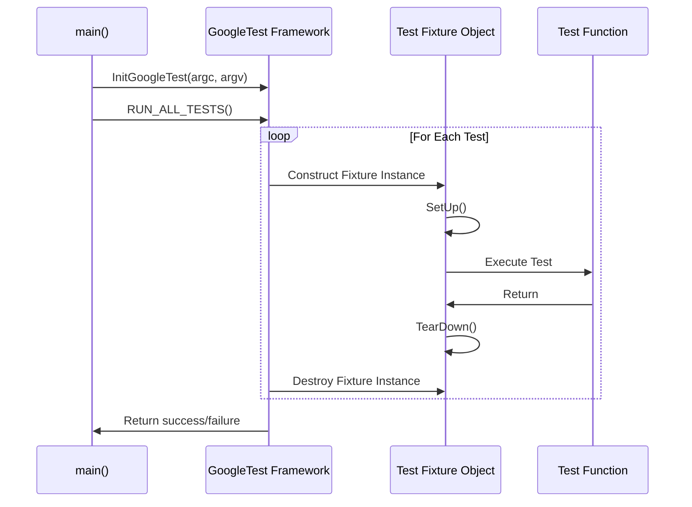

# Test Structure and Lifecycle

GoogleTest offers a structured, powerful, and flexible framework for defining and executing tests in C++. This page reveals how to organize tests into suites, write test cases and fixtures, understand how tests are discovered and executed, and how to customize the test environment. By mastering these concepts, you can write clear, maintainable, and efficient test programs that scale from simple checks to complex automated test workflows.

---

## Defining Test Suites and Test Cases

In GoogleTest, tests are grouped into *test suites*. Each test suite contains one or more *test cases* (also called test functions). This hierarchy helps organize your tests semantically, making it easier to run related tests and understand results.

### Creating Simple Tests with `TEST` Macro

To define an individual test (test case) within a test suite, use the `TEST(TestSuiteName, TestName)` macro. This macro defines a function where you write test logic and assertions.

- **TestSuiteName**: Logical grouping for related tests.
- **TestName**: Name of this specific test within the suite.

Example:

```cpp
TEST(MathOperations, Addition) {
  EXPECT_EQ(2 + 2, 4);
}

TEST(MathOperations, Subtraction) {
  EXPECT_EQ(5 - 3, 2);
}
```

*Note:* Both arguments must be valid C++ identifiers and avoid underscores to prevent name collisions.

### Using Test Fixtures with `TEST_F` Macro

When multiple tests share common setup, teardown, or supporting members, define a *test fixture* class derived from `testing::Test`.

1. Create a fixture class holding fixture data and setup/teardown routines.
2. Use the `TEST_F(TestFixtureName, TestName)` macro to write test cases that use the fixture.

Example:

```cpp
class QueueTest : public testing::Test {
 protected:
  void SetUp() override {
    queue_.Clear();
  }
  void TearDown() override {
    // Optional cleanup
  }

  Queue<int> queue_;
};

TEST_F(QueueTest, EnqueueWorks) {
  queue_.Enqueue(5);
  EXPECT_EQ(queue_.Size(), 1);
}

TEST_F(QueueTest, DequeueWorks) {
  queue_.Enqueue(10);
  int* value = queue_.Dequeue();
  ASSERT_NE(value, nullptr);
  EXPECT_EQ(*value, 10);
  delete value;
}
```

Each test using `TEST_F` gets a fresh fixture instance, guaranteeing isolation.

### Summary of Macros for Defining Tests

| Macro       | Description                                | Usage                        |
|-------------|--------------------------------------------|------------------------------|
| `TEST`      | Defines a simple test case                   | `TEST(TestSuite, TestName)`  |
| `TEST_F`    | Defines a test that uses a test fixture      | `TEST_F(FixtureName, TestName)`|
| `TEST_P`    | Defines a value-parameterized test case     | Used with parameterized fixtures (covered in other docs) |


## Test Discovery and Execution

GoogleTest automatically discovers all tests defined in your program via the `TEST`, `TEST_F`, and `TEST_P` macros. You do not need to manually enumerate or register your tests for execution.

### Running Tests

- Call `testing::InitGoogleTest(&argc, argv)` in your `main()` to initialize GoogleTest.
- Call `RUN_ALL_TESTS()` to execute all discovered tests.
- `RUN_ALL_TESTS()` will return `0` if all tests pass, or `1` otherwise.

Execution flow for each test:

1. Construct the test fixture object (if any).
2. Call `SetUp()` on the fixture.
3. Run the test body.
4. Call `TearDown()`.
5. Destroy the fixture object.

### Filtering Tests

You can run a subset of tests by specifying the `--gtest_filter` flag or `GTEST_FILTER` environment variable, using patterns to include/exclude tests.

Example to run only addition tests:

```bash
./my_test --gtest_filter=MathOperations.Addition
```

### Skipping and Disabling Tests

- Prefix a test or test suite name with `DISABLED_` to temporarily disable it.
- Use `GTEST_SKIP()` within a test or fixture to skip it at runtime with a message.


## Test Lifecycle and Environmental Setup

Understanding the lifecycle of tests helps in managing resources and ensuring reliable test execution.

### Test Fixture Lifecycle Methods

Within a test fixture class, the following methods customize setup and cleanup:

- `SetUpTestSuite()`: static method called once before the first test of the suite.
- `TearDownTestSuite()`: static method called once after the last test of the suite.
- `SetUp()`: called before each test.
- `TearDown()`: called after each test.

Example:

```cpp
class DatabaseTest : public testing::Test {
 public:
  static void SetUpTestSuite() {
    ConnectToDatabase();
  }

  static void TearDownTestSuite() {
    DisconnectDatabase();
  }

  void SetUp() override {
    transaction_.Begin();
  }

  void TearDown() override {
    transaction_.Rollback();
  }

  Transaction transaction_;
};
```

Each test will run inside a new transaction, ensuring isolation while the database connection is shared among tests.

### Global Setup and Teardown

For setup and teardown that span the entire test program (not just a suite), subclass `testing::Environment`:

```cpp
class MyEnvironment : public testing::Environment {
 public:
  void SetUp() override {
    InitializeGlobalResources();
  }

  void TearDown() override {
    CleanupGlobalResources();
  }
};
```

Register the environment before running tests:

```cpp
testing::AddGlobalTestEnvironment(new MyEnvironment);
```

GoogleTest will call these methods once per test process lifetime, before and after all tests.


## Extension Points: Programmatic Test Registration and Event Listeners

GoogleTest allows advanced customizations for registering tests and monitoring execution.

### Registering Tests Programmatically

Beyond macros, tests can be registered at runtime using `::testing::RegisterTest()`. This is useful when test data or scenarios are dynamically determined.

Example:

```cpp
class MyFixture : public testing::Test {
  ...
};

class MyDynamicTest : public MyFixture {
 public:
  explicit MyDynamicTest(int data) : data_(data) {}
  void TestBody() override {
    EXPECT_GT(data_, 0);
  }

 private:
  int data_;
};

void RegisterDynamicTests(const std::vector<int>& values) {
  for (int v : values) {
    testing::RegisterTest(
        "MyFixture",
        ("Test" + std::to_string(v)).c_str(),
        nullptr, std::to_string(v).c_str(),
        __FILE__, __LINE__,
        [=]() -> MyFixture* { return new MyDynamicTest(v); });
  }
}
```

Call `RegisterDynamicTests()` before running tests to add these dynamic cases.

### Handling Test Events with Event Listeners

You can create custom event listeners by subclassing `testing::TestEventListener` or `testing::EmptyTestEventListener`. Event listeners receive callbacks at various points:

- Before/after test program start/end
- Before/after test suite start/end
- Before/after test start/end
- After an assertion result

This is helpful to customize output, integrate with logs, or measure specialized metrics.

Example minimal listener:

```cpp
class MyListener : public testing::EmptyTestEventListener {
  void OnTestStart(const testing::TestInfo& test_info) override {
    std::cout << "Starting " << test_info.test_suite_name()
              << "." << test_info.name() << std::endl;
  }
  void OnTestEnd(const testing::TestInfo& test_info) override {
    std::cout << "Finished " << test_info.test_suite_name()
              << "." << test_info.name() << std::endl;
  }
};

// Usage
int main(int argc, char** argv) {
  testing::InitGoogleTest(&argc, argv);
  auto& listeners = testing::UnitTest::GetInstance()->listeners();
  delete listeners.Release(listeners.default_result_printer()); // Remove default
  listeners.Append(new MyListener());
  return RUN_ALL_TESTS();
}
```


## Additional Practical Tips

- Test suite and test names should avoid underscores to prevent naming conflicts.
- Each test within a suite must use the same fixture class.
- `SetUpTestSuite()` and `TearDownTestSuite()` can be called multiple times in subclassing scenarios — design accordingly.
- Use `GTEST_SKIP()` inside fixtures or tests to gracefully skip based on runtime conditions.
- Always check and respect the return value of `RUN_ALL_TESTS()` in `main()` for accurate test status reporting.

---

## References & Further Reading

- [GoogleTest Primer](../primer.md): Learn the basics of writing tests.
- [Advanced Usage](../advanced.md): Explore complex test fixtures and lifecycle details.
- [Parameterized and Typed Tests](../common-workflows/value-type-param-tests.md): Create reusable tests with parameters.
- [Event Listeners](../advanced.md#extending-google-test-by-handling-test-events): Customize test execution reporting.
- [Registering tests programmatically](../advanced.md#registering-tests-programmatically): Dynamic test registration.

---

## Mermaid Diagram: Test Execution Flow



---

By following these guidelines and utilizing the available extension points, you can robustly structure your GoogleTest test programs, enabling clear organization, effective resource management, and customized execution control.

---

<Source url="https://github.com/google/googletest" paths={[{"path": "docs/advanced.md", "range": "0-617"}, {"path": "docs/reference/testing.md", "range": "0-350"}]} branch="main" />
