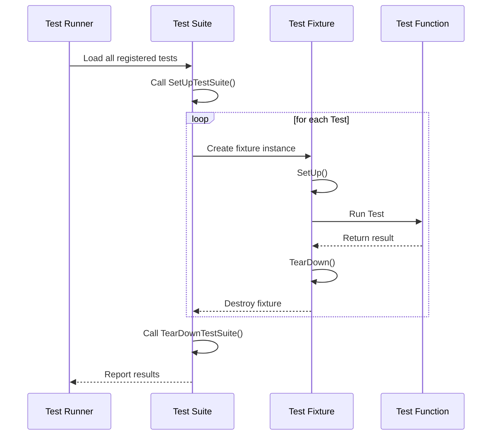

# Test Structure & Main Function

## Introduction

This guide explains how to structure your test code using GoogleTest's facilities, including defining test cases and test suites, setting up main entry points for running tests, and configuring the overall test environment. You will learn how to write tests in a consistent manner and how to initialize and run them efficiently across different platforms and build systems.

GoogleTest automates much of the test registration and execution process, helping you focus on writing meaningful tests without worrying about boilerplate code.

---

## 1. Defining Test Cases and Test Suites

GoogleTest organizes tests into *test suites* (formerly called *test cases*), each containing one or more *tests*. Tests and test suites structure your testing efforts logically and enable selective execution.

### 1.1 Writing Simple Tests with `TEST`

The simplest way to write a test is the `TEST` macro, which defines a test function named by two identifiers: the test suite and the test name.

```cpp
TEST(TestSuiteName, TestName) {
  // Test code goes here
  EXPECT_EQ(1 + 1, 2);
}
```

- The first argument (`TestSuiteName`) groups related tests together.
- The second argument (`TestName`) identifies the individual test within the suite.

All tests defined with `TEST()` are automatically registered and run by GoogleTest.

### 1.2 Writing Tests with Fixtures Using `TEST_F`

If multiple tests require shared setup/teardown or common objects, use test fixtures.

Steps to create a test fixture:

1. Define a class inheriting from `testing::Test`.
2. Add the shared data and, if needed, override `SetUp()` and `TearDown()` methods.
3. Use `TEST_F` macro to write tests using the fixture.

Example:

```cpp
class MyFixture : public testing::Test {
 protected:
  void SetUp() override {
    shared_resource = new Resource();
  }

  void TearDown() override {
    delete shared_resource;
  }

  Resource* shared_resource;
};

TEST_F(MyFixture, DoesSomething) {
  EXPECT_TRUE(shared_resource->IsReady());
}

TEST_F(MyFixture, DoesSomethingElse) {
  ASSERT_NE(shared_resource, nullptr);
  // Additional assertions...
}
```

Each test runs with its own fresh fixture instance so side effects do not leak between tests.

### 1.3 Parameterized and Typed Tests

GoogleTest supports parameterized tests (`TEST_P`) and typed tests (`TYPED_TEST`) as advanced mechanisms for running the same test logic over multiple data or types. Refer to the [Parameterized & Typed Tests](../api-reference/core-testing-apis/parameterized-testing.md) documentation for details.

---

## 2. Test Main Function and Running Tests

### 2.1 Default `main()` Implementation

GoogleTest provides a default implementation of the `main()` function in the `gtest_main` library. This function initializes testing and runs all registered tests, saving you from writing boilerplate:

```cpp
int main(int argc, char** argv) {
  testing::InitGoogleTest(&argc, argv);
  return RUN_ALL_TESTS();
}
```

Linking your test executable with `gtest_main` is sufficient in many cases.

### 2.2 Custom `main()` Function

If you need to perform initialization or configure GoogleTest behavior before tests run, implement your own `main()`:

```cpp
#include <gtest/gtest.h>

int main(int argc, char** argv) {
  testing::InitGoogleTest(&argc, argv);

  // Custom initialization here

  return RUN_ALL_TESTS();
}
```

Remember to call `InitGoogleTest()` before `RUN_ALL_TESTS()`. This function parses command-line flags related to GoogleTest and removes them from `argv`.

### 2.3 Platform-Specific Considerations

- On Windows compiled with Unicode, use `InitGoogleTest(int* argc, wchar_t** argv)` overload.
- Embedded platforms without standard arguments can call `InitGoogleTest()` with no parameters.

---

## 3. Test Execution Flow

When you run your test binary, GoogleTest performs the following steps:

1. Parses command-line arguments to configure test filtering, output format, verbosity, etc.
2. Registers all defined tests (from `TEST` and `TEST_F` macros).
3. Invokes `SetUpTestSuite()` static function for each test suite if defined.
4. For each enabled test:
   - Creates the test fixture object.
   - Calls the fixture's `SetUp()` method.
   - Runs the test body.
   - Calls `TearDown()` method.
   - Deletes the fixture object.
5. Invokes `TearDownTestSuite()` static functions after all tests.
6. Reports summary and returns the overall test result.

You do not need to manage any of these steps manually.

---

## 4. Configuring the Test Environment

GoogleTest allows configuring global test setup by subclassing `testing::Environment` and registering it before tests run.

```cpp
class MyEnvironment : public testing::Environment {
 public:
  void SetUp() override {
    // Code to set up before all tests
  }
  void TearDown() override {
    // Code to clean up after all tests
  }
};

testing::Environment* const env = testing::AddGlobalTestEnvironment(
    new MyEnvironment);
```

This is useful for expensive operations needed across tests such as initializing databases, hardware, or logging.

---

## 5. Integration with Build Systems

- GoogleTest integrates smoothly with **CMake**, **Bazel**, and other build tools.
- Use `gtest_main` to reduce boilerplate main function code unless customization is needed.
- Tests can be individually built and run with `ctest` or test runners supported by your environment.

Refer to [Project Setup & Integration](../guides/getting-started/project-setup.md) for step-by-step instructions.

---

## 6. Practical Tips & Best Practices

- Always define virtual destructors in classes used as test fixtures or base classes.
- Group related tests logically using test suites for easier maintenance.
- Use fixtures (`TEST_F`) when tests share setup, otherwise prefer simple `TEST` macros.
- Avoid writing dependencies between tests; ensure tests are independent and repeatable.
- Use command-line flags to filter tests for faster iteration, e.g., `--gtest_filter=SuiteName.TestName`.
- Use `SCOPED_TRACE()` to add context to failure messages inside helper functions.

---

## 7. Troubleshooting Common Issues

- **Tests not running?** Ensure tests are linked properly, and `RUN_ALL_TESTS()` is called.
- **Tests crash or leak?** Check if fixtures have virtual destructors and manage resources carefully.
- **Tests missing from reports?** Check your filtering flags and test registration.
- **Unexpected test failures?** Use the `--gtest_verbose=info` flag to get detailed test execution logs.

Refer also to the [GoogleTest Primer](../docs/primer.md) and [Troubleshooting Guide](../getting-started/troubleshooting-learn/common-setup-issues.md).

---

## 8. Additional Resources

- [GoogleTest Primer](../docs/primer.md) - Beginner’s guide to writing tests.
- [GoogleMock for Dummies](../docs/gmock_for_dummies.md) - Comprehensive guide for creating and using mocks.
- [Test Discovery & Execution Workflows](../guides/essential-testing-patterns/test-discovery-execution.md) - Managing test runs efficiently.
- [Project Setup & Integration](../guides/getting-started/project-setup.md) - Build system integration tips.

---

## Summary Diagram: Test Lifecycle



This diagram shows the flow from test suite setup, creating fixtures, running individual tests, and teardown.


---