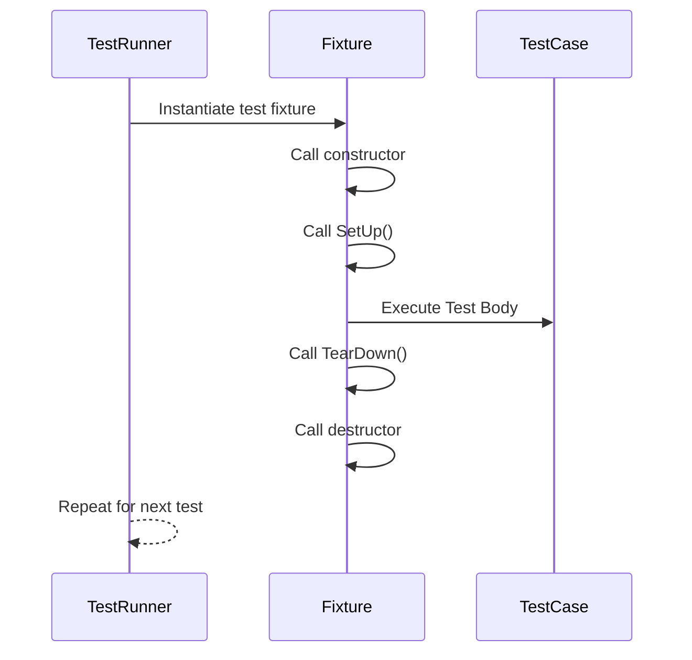

# Test Structure & Lifecycle

GoogleTest provides a rich yet straightforward set of macros and functions to define test cases, group them into test suites, and manage the lifecycle of test execution. This page introduces these core constructs and best practices, focusing on how you can organize tests effectively, handle setup and teardown efficiently, and reuse testing patterns to achieve robust, maintainable test suites.

---

## 1. Test Case and Test Suite Fundamentals

GoogleTest organizes tests into two main concepts:

- **Test Case/Test Suite**: A collection of related tests; GoogleTest uses the term *Test Suite* in the API.
- **Test**: An individual test inside a test suite, representing a single logical verification.

You define tests primarily using the `TEST` macro, specifying the test suite (case) and test name.

### Defining a Test with `TEST`

```cpp
TEST(TestSuiteName, TestName) {
  // Test logic and assertions here
}
```

- Each invocation defines a single, isolated test function.
- `TestSuiteName` groups related tests logically, facilitating test organization.

### Example

```cpp
TEST(FactorialTest, HandlesZeroInput) {
  EXPECT_EQ(Factorial(0), 1);
}

TEST(FactorialTest, HandlesPositiveInput) {
  EXPECT_EQ(Factorial(3), 6);
  EXPECT_EQ(Factorial(5), 120);
}
```

In this example, `FactorialTest` is the test suite grouping two tests.

<Check>
Always use descriptive, concise test suite and test names to clearly indicate test intent.
</Check>

## 2. Test Fixtures (`TEST_F`) and Reusability

When multiple tests in the same suite share common setup or resources, use **test fixtures**. A test fixture is a subclass of `testing::Test` that encapsulates shared objects and setup/teardown logic.

### Creating a Test Fixture

1. Define a fixture class deriving from `testing::Test`.
2. Put shared data members in it.
3. Override `SetUp()` and `TearDown()` to prepare and clean up before and after each test.

```cpp
class QueueTest : public testing::Test {
 protected:
  void SetUp() override {
    // Prepare test objects
    q_.Enqueue(10);
  }

  void TearDown() override {
    // Cleanup if needed
  }

  Queue<int> q_;
};
```

### Using the Fixture with `TEST_F`

```cpp
TEST_F(QueueTest, IsNotEmptyAfterEnqueue) {
  EXPECT_NE(q_.size(), 0);
}

TEST_F(QueueTest, DequeueReturnsEnqueuedElement) {
  int* val = q_.Dequeue();
  ASSERT_NE(val, nullptr);
  EXPECT_EQ(*val, 10);
  delete val;
}
```

- Each test using `TEST_F` will get a fresh fixture object.
- GoogleTest calls `SetUp()` before and `TearDown()` after each test.

### Best Practice

- Use fixtures to avoid duplication of setup code.
- Avoid shared mutable state that may impact test isolation.

## 3. Parameterized Tests

If you want to run the same test logic with different input values, use parameterized tests (`TEST_P`) with associated instantiations (`INSTANTIATE_TEST_SUITE_P`).

```cpp
class FactorialTest : public testing::TestWithParam<int> {};

TEST_P(FactorialTest, ReturnsNonNegative) {
  int n = GetParam();
  EXPECT_GE(Factorial(n), 0);
}

INSTANTIATE_TEST_SUITE_P(PositiveIntegers, FactorialTest, testing::Values(1, 2, 3, 4));
```

- `GetParam()` accesses the current test parameter.
- Different inputs generate multiple tests with the same name.

## 4. Test Lifecycle Functions

GoogleTest allows you to manage lifecycle events beyond individual tests.

### Suite-level Setup and Teardown

- `SetUpTestSuite()`: Called once before the first test in a suite runs.
- `TearDownTestSuite()`: Called once after the last test in the suite runs.

Implement static methods in your fixture class:

```cpp
class MyTest : public testing::Test {
 public:
  static void SetUpTestSuite() {
    // Expensive setup common to all tests
  }
  static void TearDownTestSuite() {
    // Cleanup
  }
};
```

### Per-test Setup and Teardown

- Override the fixture's `SetUp()` (non-static) called before each test.
- Override the fixture's `TearDown()` called after each test.

```cpp
void SetUp() override {
  // Prepare for each test
}
void TearDown() override {
  // Cleanup after each test
}
```

### Constructor / Destructor vs SetUp / TearDown

- Constructors and destructors run before and after `SetUp`/`TearDown`.
- Use constructors for trivial or RAII initialization.
- Use `SetUp`/`TearDown` for test-related setup, especially if it might fail.

<Tip>
Avoid putting complex setup code in constructors; `SetUp()` allows for assertions and controlled failure handling.
</Tip>

## 5. Reusable Test Patterns

To write clear, maintainable test suites:

- Use **test fixtures** for shared setup.
- Prefer **parameterized tests** to cover multiple inputs.
- Group related tests logically and use consistent naming.
- Manage expectations and states explicitly in setup/teardown.

### Sample Test Fixture with Setup and TearDown

```cpp
class DatabaseTest : public testing::Test {
 protected:
  void SetUp() override {
    db_.Connect("test_db");
    db_.InitializeSchema();
  }

  void TearDown() override {
    db_.Disconnect();
  }

  TestDatabase db_;
};

TEST_F(DatabaseTest, QueryReturnsExpectedResult) {
  QueryResult result = db_.Query("SELECT * FROM table");
  EXPECT_TRUE(result.HasRows());
}
```

## 6. Managing Test Execution Flow

- GoogleTest runs tests independently, creating and destroying fixtures per test.
- Use `RUN_ALL_TESTS()` in `main()` to execute all defined tests.
- Flag-based control (e.g., filtering tests, running disabled tests) is supported.

### Example main function

```cpp
int main(int argc, char** argv) {
  testing::InitGoogleTest(&argc, argv);
  return RUN_ALL_TESTS();
}
```

## 7. Best Practices and Common Pitfalls

### Setup/TearDown

- Ensure resource cleanup in `TearDown` to prevent leaks.
- Use `ASSERT_*` in `SetUp` if failure should prevent test execution.

### Test Isolation

- Avoid shared global state between tests.
- Each test should be independent and repeatable.

### Naming

- Use descriptive and unique test suite and test names.
- Avoid underscores to comply with API restrictions.

### Debugging

- Use `SCOPED_TRACE` or logging within fixtures to aid identifying failures in complex setups.

### Parameterized Tests

- Choose parameterization when multiple cases share a behavior.
- Combine parameterized tests with fixtures for maximum reuse.

<Warning>
Do not alter test fixture state in ways that can affect other tests; each test runs with a fresh fixture instance.
</Warning>

## 8. Troubleshooting Common Issues

- **Test Not Running:** Verify that the test uses `TEST` or `TEST_F` macros and is linked correctly.
- **Setup Failures Silently Skipped:** Use `ASSERT_*` macros in `SetUp()` to fail tests explicitly.
- **Memory Leaks in Tests:** Make sure resources initialized in `SetUp()` are properly freed in `TearDown()`.
- **Tests Affect Each Other:** Ensure no shared static or global state is mutated without isolation.

## 9. Related Topics

- [Assertions & Expectations](assertions.md) - Verifying test outcomes within test bodies.
- [Mocking Basics](mocking-basics.md) - Creating mocks and setting expectations on dependencies.
- [Parameterized Tests](advanced.md#value-parameterized-tests) - Writing flexible tests with varying inputs.
- [Test Execution & Configuration](test-execution.md) - Running tests and controlling execution behavior.

---

For detailed coding examples and best practice patterns, see the [GoogleTest Primer](../primer.md) and the [Guides on Structuring Tests](../guides/core-workflows/structuring-tests.md).


---

### Diagram: Test Execution Lifecycle



This captures the lifecycle steps executed by GoogleTest for each test.

---