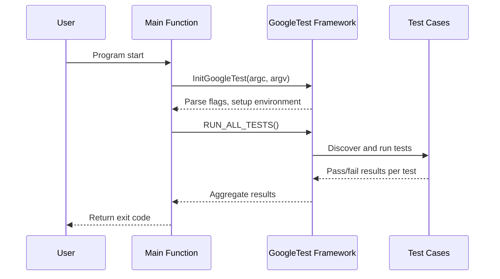

# Writing and Running Tests

This documentation explains how to define and run test cases using GoogleTest, the popular C++ testing framework. It covers the essential workflows and APIs for creating tests, organizing test suites, running tests reliably across platforms, and integrating proper initialization and environment setup in your test programs.

---

## 1. Defining Tests

GoogleTest provides macros to define individual tests and test fixtures to enable structured and maintainable test programs.

### 1.1. Simple Tests — `TEST`

Use the `TEST(TestSuiteName, TestName)` macro to define a test case that consists of statements to verify your code:

```cpp
TEST(FactorialTest, HandlesZeroInput) {
  EXPECT_EQ(Factorial(0), 1);
}
```

- The first argument (`FactorialTest`) specifies the test suite.
- The second argument (`HandlesZeroInput`) is the test name.
- Names must be valid C++ identifiers without underscores.
- Tests with the same suite form a logical group.

### 1.2. Test Fixtures — `TEST_F`

Create a test fixture class by deriving from `testing::Test` to share common setup and objects among multiple tests.

```cpp
class QueueTest : public testing::Test {
 protected:
  QueueTest() {
    q1_.Enqueue(1);
    q2_.Enqueue(2);
    q2_.Enqueue(3);
  }

  Queue<int> q0_;
  Queue<int> q1_;
  Queue<int> q2_;
};

TEST_F(QueueTest, IsEmptyInitially) {
  EXPECT_EQ(q0_.size(), 0);
}
```

- Use `TEST_F(QueueTest, TestName)` macros to associate tests with fixtures.
- Each test gets a fresh fixture instance created before running.

### 1.3. Parameterized & Typed Tests

GoogleTest also supports [value-parameterized](#TEST_P) and [typed tests](#TYPED_TEST) for covering test scenarios with different inputs or types. For more details, see the [Parameterized and Typed Tests Reference](https://google.github.io/googletest/reference/gtest/advanced.html#value-parameterized-and-typed-tests).

---

## 2. Running Tests

Executing your tests correctly is crucial to reliable validation.

### 2.1. Initialization — `InitGoogleTest`

Before running tests, call `testing::InitGoogleTest(&argc, argv)` in your `main()` function to parse command-line flags and prepare the framework.

```cpp
int main(int argc, char **argv) {
  testing::InitGoogleTest(&argc, argv);
  return RUN_ALL_TESTS();
}
```

- This parses GoogleTest-specific flags and removes recognized flags from `argv`.
- Must be invoked before `RUN_ALL_TESTS()`.

### 2.2. Running All Tests — `RUN_ALL_TESTS`

Call `RUN_ALL_TESTS()` after initialization to execute all registered tests across test suites.

- Returns `0` if all tests pass, or non-zero otherwise.
- Runs tests sequentially unless configured otherwise.
- It is designed to be called once per test program.

### 2.3. Main Function

Many users can link against `gtest_main` or `gmock_main` which provide a default `main` function that calls `InitGoogleTest()` and `RUN_ALL_TESTS()`. Only write a custom main if you need special setup or teardown logic.

---

## 3. Test Discovery

GoogleTest automatically registers all tests written using `TEST()`, `TEST_F()`, `TEST_P()`, and related macros at program startup.

- No manual test enumeration is needed.
- Tests are grouped by test suite name.
- Naming conventions must be followed for automatic discovery.

---

## 4. Environment Setup and Global Fixtures

GoogleTest supports global environments which can initialize and tear down shared test resources used across multiple test suites.

- Use `testing::Environment` derived classes for global setup.
- Attach environments before running tests using `AddGlobalTestEnvironment`.
- `SetUpTestSuite()` and `TearDownTestSuite()` static methods in fixtures manage suite-scoped resources.

Example:

```cpp
class MyEnvironment : public testing::Environment {
 public:
  void SetUp() override { /* global setup */ }
  void TearDown() override { /* global teardown */ }
};

testing::AddGlobalTestEnvironment(new MyEnvironment);
```

---

## 5. Command-Line Options

`InitGoogleTest()` supports many command-line flags to control test selection, output format, repeat count, and more.

Common flags include:

- `--gtest_filter`: Filter which tests to run (by suite or test name)
- `--gtest_repeat`: Repeat tests multiple times
- `--gtest_output`: Configure test result output (e.g., XML format)
- `--gtest_break_on_failure`: Break into debugger on failure

For comprehensive coverage, see the [GoogleTest Advanced Guide - Running a Subset of the Tests](https://github.com/google/googletest/blob/main/docs/advanced.md#running-a-subset-of-the-tests).

---

## 6. Debugging and Troubleshooting

- Ensure tests use assertions (`EXPECT_*` and `ASSERT_*`) properly.
- Use `SCOPED_TRACE()` to add trace messages to failures.
- Check return value of `RUN_ALL_TESTS()` to detect failures programmatically.
- Avoid ignoring the return value of `RUN_ALL_TESTS()` as it controls test program exit status.

---

## 7. Example: Full Minimal Test Program

```cpp
#include <gtest/gtest.h>

// A simple function to test.
int Add(int a, int b) {
  return a + b;
}

TEST(MathTest, AddPositive) {
  EXPECT_EQ(Add(1, 2), 3);
}

int main(int argc, char** argv) {
  testing::InitGoogleTest(&argc, argv);
  return RUN_ALL_TESTS();
}
```

Compiling and running this program will detect and execute the `MathTest.AddPositive` test.

---

## 8. Platform-Specific Notes

- On Arduino/embedded platforms, the test entry points are `setup()` and `loop()` instead of `main()`. GoogleTest initialization and running are adapted accordingly.
- On Windows and other platforms, `InitGoogleTest()` accepts wide (`wchar_t`) or narrow (`char`) arguments.

---

## 9. Additional Resources

- [GoogleTest Primer](https://google.github.io/googletest/primer.html) — Getting started guide
- [Core Concepts & Terminology](https://google.github.io/googletest/reference/core-concepts-terminology.html)
- [Writing and Running Your First Test](https://google.github.io/googletest/guides/getting-started.html)
- [Mocking Reference](https://google.github.io/googletest/reference/mocking.html)

---

## Diagram: Basic Test Execution Flow


