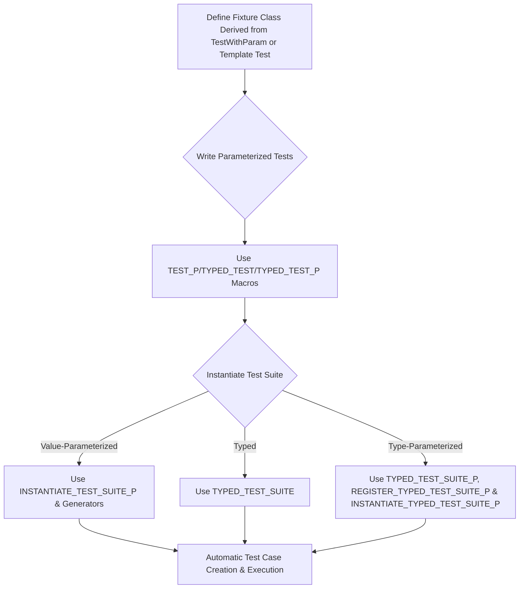

# Parameterized and Typed Tests

GoogleTest enhances your testing capabilities by allowing tests to run over multiple inputs or types without duplicating code. Parameterized and typed tests are foundational for robust, scalable, and data-driven C++ testing.

---

## Overview

This documentation guides you through creating tests that run with diverse *values* or *types*. You will learn how to write parameter generators, register and instantiate tests, and design advanced test fixtures suitable for complex data-driven testing scenarios.


## Value-Parameterized Tests

### Purpose

Value-parameterized tests enable you to reuse the same test logic with different parameters — a great pattern for testing multiple behaviors or algorithms against a range of inputs, flag combinations, or implementation variants.

### How They Work

- Define a **test fixture** class derived from `::testing::TestWithParam<T>`, where `T` is the parameter type.
- Use the macro `TEST_P` to define your parameterized test cases, accessing the parameter via `GetParam()`.
- Instantiate the test suite with parameter values using `INSTANTIATE_TEST_SUITE_P`.

### Example

```cpp
class FooTest : public testing::TestWithParam<int> {
  // You can add fixture members here...
};

TEST_P(FooTest, HandlesVariousInputs) {
  int param = GetParam();
  EXPECT_TRUE(param >= 0);  // Sample assertion
}

// Instantiate tests with a set of parameters
INSTANTIATE_TEST_SUITE_P(
    PositiveIntegers,
    FooTest,
    testing::Values(1, 2, 3, 10));
```

This generates distinct tests named `PositiveIntegers/FooTest.HandlesVariousInputs/N` where `N` corresponds to the parameter index.

### Parameter Generators

GoogleTest offers several built-in generators in the `testing` namespace:

| Generator      | Description                                         |
|----------------|-----------------------------------------------------|
| `Range(start, end [, step])` | Generates a sequence from `start` up to but not including `end` with optional step. |
| `Values(v1, v2, ..., vN)`    | Uses specified discrete values.                   |
| `ValuesIn(container)`         | Uses values from an STL container, C array, or iterator range.|
| `Bool()`                     | Generates `false` and `true` for boolean parameters. |
| `Combine(g1, g2, ..., gN)`   | Generates Cartesian product (all combinations) from multiple generators. |

#### Combining Parameters for Multi-dimensional Testing

You can create tests varying multiple parameters simultaneously with `Combine`:

```cpp
class MultiParamTest : public testing::TestWithParam<std::tuple<int, bool>> {};

TEST_P(MultiParamTest, ComplexCases) {
  int number = std::get<0>(GetParam());
  bool flag = std::get<1>(GetParam());
  // Test logic based on number and flag
}

INSTANTIATE_TEST_SUITE_P(VariousCombinations, MultiParamTest,
    testing::Combine(testing::Values(1, 2), testing::Bool()));
```

### Naming Instantiations

The first argument to `INSTANTIATE_TEST_SUITE_P` is a unique prefix for instantiations. You can also provide a custom function/lambda for generating readable names for parameters, useful when dealing with complex or string parameters.

```cpp
INSTANTIATE_TEST_SUITE_P(
    MyInstantiation, FooTest, testing::Values(0,1,2),
    [](const testing::TestParamInfo<FooTest::ParamType>& info) {
      return "Param" + std::to_string(info.param);
    });
```

### Abstract Tests Pattern

You can hide parameterized test definitions in a header and source file pair, then instantiate them in separate source files. This allows reusing generic tests across multiple implementations or libraries.

---

## Typed Tests

### Purpose

Typed tests enable running the same test logic across different *types*, especially when ensuring multiple implementations of an interface or concept satisfy the same requirements.

### How They Work

- Define a **class template** test fixture derived from `::testing::Test`.
- Define tests with the `TYPED_TEST` macro.
- Associate the fixture template with a list of types using `TYPED_TEST_SUITE`.

### Example

```cpp
template<typename T>
class ContainerTest : public testing::Test {
 public:
  T value_{};
};

using MyTypes = testing::Types<std::vector<int>, std::list<int>>;
TYPED_TEST_SUITE(ContainerTest, MyTypes);

TYPED_TEST(ContainerTest, IsEmptyInitially) {
  EXPECT_TRUE(this->value_.empty());
}
```

Tests are executed once for each type in the list.

### Custom Type Names

Optionally, you can provide a custom name generator class for better identification in test reports:

```cpp
class MyTypeNames {
 public:
  template<typename T>
  static std::string GetName(int) {
    if (std::is_same<T, std::vector<int>>::value) return "VectorInt";
    if (std::is_same<T, std::list<int>>::value) return "ListInt";
    return "Unknown";
  }
};

TYPED_TEST_SUITE(ContainerTest, MyTypes, MyTypeNames);
```

---

## Type-Parameterized Tests

### Purpose

Type-parameterized tests are like typed tests but support defining test patterns without specifying types upfront. This enables defining abstract test patterns that can be instantiated multiple times, even from different translation units.

### How They Work

- Define a **class template** fixture derived from `::testing::Test`.
- Declare the test suite with `TYPED_TEST_SUITE_P`.
- Define tests using `TYPED_TEST_P`.
- Register tests with `REGISTER_TYPED_TEST_SUITE_P`.
- Instantiate with `INSTANTIATE_TYPED_TEST_SUITE_P` providing the types and an instantiation name.

### Example

```cpp
// Define fixture and tests
template <typename T>
class MyTypedTest : public testing::Test {};

TYPED_TEST_SUITE_P(MyTypedTest);

TYPED_TEST_P(MyTypedTest, DoesSomething) {
  TypeParam value{};
  EXPECT_EQ(value, value);
}

REGISTER_TYPED_TEST_SUITE_P(MyTypedTest, DoesSomething);

using TypesToTest = testing::Types<int, double>;
INSTANTIATE_TYPED_TEST_SUITE_P(MyInst, MyTypedTest, TypesToTest);
```

### Multiple Instantiations

You can instantiate the same abstract test suite with different type lists multiple times with unique prefixes.

---

## Best Practices

- **Unique Naming**: Avoid underscores in test suite and test names to prevent macro naming conflicts.
- **Public `SetUpTestSuite()` and `TearDownTestSuite()`**: When using parameterized tests with suite-level setup, declare these as `public` to avoid linkage errors.
- **Clean Parameter Names**: Provide meaningful, concise parameter-naming functors to generate readable test case names.
- **Factory Functions for Complex Parameters**: Use `ConvertGenerator` to convert or map generator outputs to your parameter types, especially if behaving like a factory or adapter.
- **Consistent Test Registration**: Register all type-parameterized tests together with `REGISTER_TYPED_TEST_SUITE_P`.

---

## Troubleshooting

- **Failing to Instantiate Tests**: If `TEST_P` tests are not instantiated with `INSTANTIATE_TEST_SUITE_P`, tests will be reported as failing in the `GoogleTestVerification` suite. Use `GTEST_ALLOW_UNINSTANTIATED_PARAMETERIZED_TEST` to suppress if intentional.
- **Linker Errors on `SetUpTestSuite()`/`TearDownTestSuite()`**: Ensure these methods are `public` when using parameterized tests.
- **Naming Collisions**: Refrain from using underscores or ambiguous names in parameter or instantiation prefixes.

---

## Additional Tips

- Use `SCOPED_TRACE` to include context in failures when used inside parameterized tests to improve debugging.
- Write custom assertion or output streaming for complex parameter types so that parameters are clearly printed in failure messages.
- Remember that value-parameterized tests generate one test instance per parameter value, increasing test coverage.

---

## References

- [GoogleTest Primer](https://github.com/google/googletest/blob/main/docs/primer.md)
- [Value-Parameterized Tests](https://github.com/google/googletest/blob/main/docs/advanced.md#value-parameterized-tests)
- [Typed Tests](https://github.com/google/googletest/blob/main/docs/advanced.md#typed-tests)
- [Type-Parameterized Tests](https://github.com/google/googletest/blob/main/docs/advanced.md#type-parameterized-tests)
- [Testing Reference: TEST_P and Typed Tests](https://github.com/google/googletest/blob/main/docs/reference/testing.md#TEST_P)

---

## Summary Diagram of Parameterized Testing Flow



---

This guide empowers you to write extensible, maintainable, and high-coverage test suites that adapt easily to multiple values and types, boosting your testing productivity and software robustness.
