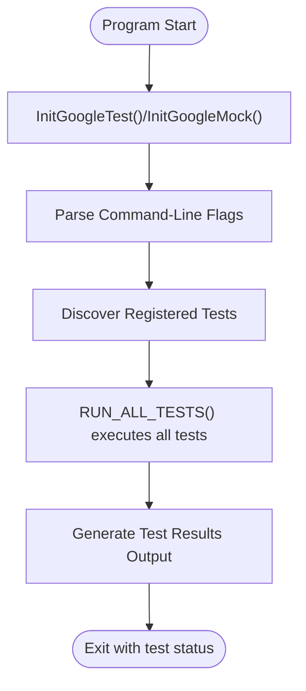

# Core API and Entry Points

An essential foundation for using GoogleTest and GoogleMock effectively lies in understanding their primary user-facing headers, initialization functions, macros, and the typical workflow for writing and running tests. This guide introduces you to the core API components, explains how to include the framework correctly, configure test execution, and outlines the key flags and startup/shutdown routines you'll use to build your test programs.

---

## 1. Including GoogleTest and GoogleMock in Your Tests

To use GoogleTest and GoogleMock, the starting point is to include the main header files in your test source code.

- For **GoogleTest** alone, include:

  ```cpp
  #include <gtest/gtest.h>
  ```

- For **GoogleMock**, which extends GoogleTest with mock object capabilities, include:

  ```cpp
  #include <gmock/gmock.h>
  ```

  This header pulls in GoogleTest headers as well, so you only need to include this in mock-enabled tests.


### Linking with the Appropriate Libraries

When you build your test executable, you should link against the appropriate library targets:

- **`gtest`**: basic GoogleTest framework (without main function).
- **`gtest_main`**: GoogleTest framework with a predefined `main()` function.
- **`gmock`**: GoogleMock framework (requires GoogleTest).
- **`gmock_main`**: GoogleMock with a predefined `main()` function.

Using `gtest_main` or `gmock_main` means you don't have to write your own `main()` function unless you want to customize test initialization.

### Practical Tip

> If you want to focus on writing tests without boilerplate, link with `gtest_main` or `gmock_main` respectively. Only write your own `main()` if you need advanced setup or custom command-line flag processing.


## 2. Initialization and Main Function

Before running tests, you must initialize the framework. This involves parsing command-line flags and setting up internal structures.

### The Main Initialization Function: `InitGoogleTest` and `InitGoogleMock`

- **GoogleTest** uses:
  
  ```cpp
  testing::InitGoogleTest(&argc, argv);
  ```

- **GoogleMock** extends this with:

  ```cpp
  testing::InitGoogleMock(&argc, argv);
  ```

  `InitGoogleMock()` automatically calls `InitGoogleTest()` internally, so you don't need to call both.

### Writing Your Own `main()`

If you do not use the provided `gtest_main` or `gmock_main` libraries, you must write a `main()` function similar to this:

```cpp
#include <gtest/gtest.h>    // or <gmock/gmock.h> for mocking

int main(int argc, char **argv) {
  testing::InitGoogleTest(&argc, argv);   // or InitGoogleMock(&argc, argv) for gMock
  return RUN_ALL_TESTS();
}
```

This function:

- Initializes the framework.
- Parses GoogleTest/GoogleMock command-line flags.
- Runs all the tests discovered in your binary.
- Returns `0` if all tests succeed, otherwise `1`.

### Important Implementation Notes

- Calling `RUN_ALL_TESTS()` more than once is unsupported and may break advanced features.
- The initialization function removes recognized flags from `argv` so other code can inspect remaining arguments.

## 3. The Test Execution Workflow

The basic lifecycle when running tests using GoogleTest or GoogleMock is:

1. **Define Tests or Fixtures:** Using `TEST()`, `TEST_F()`, or mock classes.
2. **Initialize the Testing Framework:** Call `InitGoogleTest()` or `InitGoogleMock()`.
3. **Run Tests:** Call `RUN_ALL_TESTS()`, which runs all the registered tests.
4. **Result Reporting:** Output results to console or specified formats.


### Execution Flags and Configuration

GoogleTest supports a variety of command-line flags that control test behavior. A few core flags include:

- `--gtest_filter=`: Run only tests matching the filter.
- `--gtest_output=`: Save results in XML or JSON format.
- `--gtest_repeat=`: Repeat tests multiple times.
- `--gtest_break_on_failure`: Break on the first failure.

GoogleMock inherits these flags and adds its own as necessary.

Learn more about flags in [Advanced Guide](advanced.md).

## 4. Core Macros and APIs

### Test Defining Macros

- `TEST(TestSuiteName, TestName)`: Defines a simple test.
- `TEST_F(FixtureClassName, TestName)`: Defines a test using a test fixture (shared setup/teardown).

### Running all Tests

- `RUN_ALL_TESTS()`: Runs all registered tests; returns 0 if all succeed.

### GoogleMock Initialization

GoogleMock adds the convenience function:

```cpp
void InitGoogleMock(int* argc, char** argv);
```

which calls both GoogleTest initialization and sets up GoogleMock internals.

This is the recommended function to call instead of `InitGoogleTest()` if you use mocking in your tests.

## 5. Entry Point Source Insights

The [gmock_main.cc](https://github.com/google/googletest/blob/main/googlemock/src/gmock_main.cc) file provides a ready-to-use main entry point:

- It prints a startup message: "Running main() from gmock_main.cc"
- Calls `testing::InitGoogleMock(&argc, argv);`
- Executes all tests via `RUN_ALL_TESTS();`

For platforms like Arduino or ESP, it adapts by using `setup()` and `loop()` functions instead of `main()`.

Similarly, for plain GoogleTest, [`gtest_main.cc`](https://github.com/google/googletest/blob/main/googletest/src/gtest_main.cc) implements analogous logic.

## 6. Common User Flows

### Using GoogleMock with Predefined Main

1. Add `#include <gmock/gmock.h>` to your test file.
2. Link your test executable with the `gmock_main` library.
3. Write tests and mocks using GoogleMock APIs.
4. Run the test executable without writing any `main()`.

### Writing a Custom Main for Special Initialization

1. Add includes for GoogleTest and/or GoogleMock.
2. Parse or handle any custom application logic or environment setup before tests.
3. Call `testing::InitGoogleMock(&argc, argv);` (for mocking) or `testing::InitGoogleTest(&argc, argv);`.
4. Run tests: `return RUN_ALL_TESTS();`.


## 7. Best Practices and Tips

- **Prefer the Provided `gtest_main` or `gmock_main` Libraries:** Avoid reinventing `main()` unless you need custom setup.
- **Always Pass argc and argv Pointers:** This enables proper flag parsing.
- **Use `RUN_ALL_TESTS()` Only Once:** To prevent conflicts with framework internals.
- **Use Command-Line Flags to Control Test Execution:** For filtering, repeat runs, output formats, etc.

## 8. Troubleshooting

### Common Issues

- **Multiple Definition of main():** Happens when linking both your own `main()` and `gtest_main` or `gmock_main`. Solution: use only one.
- **Tests Not Running or Discovered:** Ensure `InitGoogleTest()` or `InitGoogleMock()` is called before `RUN_ALL_TESTS()`.
- **Unrecognized Command-Line Flags:** Make sure initialization is done early and fully.

### Platform Specific Notes

- Arduino-like environments require the framework to be initialized inside `setup()`, with test runs called inside `loop()`.
- Windows Mobile platforms have specific entry point considerations handled internally.

---

## Example: Minimal GoogleMock Test with Predefined Main

```cpp
#include <gmock/gmock.h>

// A simple mock class.
class MockFoo {
 public:
  MOCK_METHOD(int, Bar, (int), ());
};

TEST(FooTest, BarReturnsDefault) {
  MockFoo mock;
  EXPECT_CALL(mock, Bar(testing::_)).WillOnce(testing::Return(42));

  EXPECT_EQ(mock.Bar(123), 42);
}

int main(int argc, char** argv) {
  testing::InitGoogleMock(&argc, argv);
  return RUN_ALL_TESTS();
}
```

Or, simply link with `gmock_main` and omit defining `main()` entirely.

---

## Summary Diagram: Test Execution Flow



---

## Related Documentation

- [Writing Your First Test](../../getting-started/first-run-validation/writing-first-test)
- [Running Tests](../../getting-started/first-run-validation/running-tests)
- [gMock Cookbook](../../guides/mocking-and-advanced-techniques/creating-and-using-mocks)
- [Core Testing Interfaces](./test-discovery-and-structure)
- [Advanced Guide: Flags and Configuration](../../guides/core-testing-workflows/rich-assertions)

For platform-specific and build integration details, consult the [Supported Platforms & Dependencies](../../overview/integration-and-ecosystem/platforms-dependencies) page and the [CMake Build Instructions](../../getting-started/setup-requirements-installation/installing-googletest).

---

This page serves as the foundation for understanding GoogleTest and GoogleMock entry points and initialization, enabling you to confidently set up and run your test suites reliably across supported environments.


