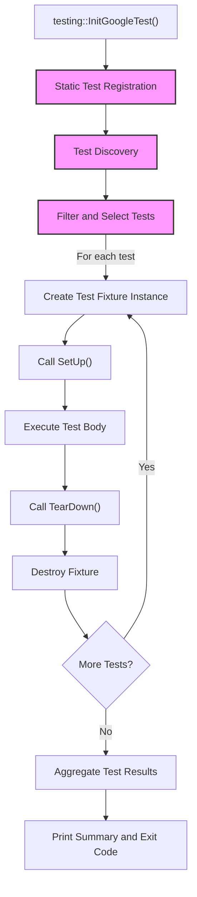

# Test Discovery and Structure

GoogleTest offers a robust system to automatically discover, organize, and execute tests in C++ projects. This page details the core mechanisms and structures GoogleTest provides to define tests, group them logically, and register them for consistent execution, enabling scalable and maintainable test suites.

---

## Overview

At its core, GoogleTest defines tests through a family of macros and classes that enable the declaration of individual tests, fixtures for shared test setup, and parameterized or typed tests for reusable test logic. This structure facilitates automatic test discovery without manual registration, aligning with best practices for independent, repeatable testing.

Key concepts include:

- **Test Suites and Tests:** Logical grouping of tests.
- **Test Fixtures:** Classes to share data and setup across multiple tests.
- **Parameterized Tests:** Running the same test logic over various input values.
- **Typed and Type-Parameterized Tests:** Running tests across multiple types.
- **Test Registration:** Compile-time infrastructure that registers tests without requiring manual enumeration.

This page guides you through these features, focusing on how you define and organize tests to realize scalable, automated test execution.

---

## 1. Declaring Tests

GoogleTest supports several macros to define tests depending on your use case:

### 1.1. Basic Tests — `TEST`

Use the `TEST(TestSuiteName, TestName)` macro to define the simplest form of a test.

```cpp
TEST(MathTest, FactorialZero) {
  EXPECT_EQ(Factorial(0), 1);
}
```

- Defines a test named `FactorialZero` within the test suite `MathTest`.
- Each test runs independently with no shared state.
- Test suite and test names must be valid C++ identifiers and should avoid underscores.

### 1.2. Tests with Fixtures — `TEST_F`

For tests requiring setup, teardown, or shared objects, define a test fixture class deriving from `testing::Test`. Use `TEST_F(FixtureName, TestName)` to define tests using that fixture.

```cpp
class QueueTest : public testing::Test {
 protected:
  Queue<int> q_;

  void SetUp() override {
    q_.Enqueue(10);
  }
};

TEST_F(QueueTest, IsNotEmptyAfterEnqueue) {
  EXPECT_FALSE(q_.Empty());
}
```

- GoogleTest creates a fresh fixture instance and runs `SetUp()` before each test.
- Enables reuse of complex setup and common data across tests.

### 1.3. Value-Parameterized Tests — `TEST_P` and `INSTANTIATE_TEST_SUITE_P`

To run the same test logic over multiple input values, derive a fixture from `testing::TestWithParam<T>`, define tests with `TEST_P`, and instantiate them with parameter sequences.

```cpp
class IsEvenTest : public testing::TestWithParam<int> {};

TEST_P(IsEvenTest, CheckEvenness) {
  EXPECT_EQ(GetParam() % 2, 0);
}

INSTANTIATE_TEST_SUITE_P(EvenNumbers, IsEvenTest, testing::Values(2, 4, 6));
```

This runs the `CheckEvenness` test three times with parameters `2`, `4`, and `6`.

### 1.4. Typed Tests — `TYPED_TEST_SUITE` and `TYPED_TEST`

Typed tests run the same logic over multiple types, useful for template-based code.

```cpp
template <typename T>
class ContainerTest : public testing::Test {
 public:
  T container_;
};

using ContainerTypes = testing::Types<std::vector<int>, std::list<int>>;
TYPED_TEST_SUITE(ContainerTest, ContainerTypes);

TYPED_TEST(ContainerTest, IsEmptyInitially) {
  EXPECT_TRUE(this->container_.empty());
}
```

This runs the test with both `std::vector<int>` and `std::list<int>`.

### 1.5. Type-Parameterized Tests — `TYPED_TEST_SUITE_P`, `TYPED_TEST_P`, and `REGISTER_TYPED_TEST_SUITE_P`

Allows defining typed tests separate from their instantiation, enabling reuse of test logic in libraries.

```cpp
template <typename T>
class MyTest : public testing::Test {};

TYPED_TEST_SUITE_P(MyTest);

TYPED_TEST_P(MyTest, DoesSomething) {
  TypeParam x = 0;
  EXPECT_EQ(x, 0);
}

REGISTER_TYPED_TEST_SUITE_P(MyTest, DoesSomething);
```

Later instantiated by

```cpp
using MyTypes = testing::Types<int, double>;
INSTANTIATE_TYPED_TEST_SUITE_P(MyInst, MyTest, MyTypes);
```

---

## 2. Test Registration and Discovery

GoogleTest automatically registers all tests and fixtures declared using the above macros at compile time. This automatic registration enables the test runner to discover all test suites and tests without explicit enumeration.

Key aspects:

- Each macro expands to code that statically registers the test and its fixture with GoogleTest’s internal registry.
- Tests are discoverable by name and can be filtered at runtime.
- Fixtures organize tests logically for shared setup.

Example from the repository's internal test files demonstrates various forms of tests defined and registered (see files such as `googletest-list-tests-unittest_.cc` and `googletest-filter-unittest_.cc`).

---

## 3. Organizing Tests for Maintainability

### 3.1 Naming Conventions

- Avoid underscores in `TestSuite` and test names; use CamelCase or PascalCase.
- Name test suites to reflect the class or module under test.
- Name tests to clearly describe expected behavior.

### 3.2 Grouping Related Tests

- Use test fixtures (`TEST_F`) to share expensive setup, such as database connections or large data structures.
- Use value-parameterized tests for input-driven testing.
- Use typed tests for testing template classes or interfaces across types.

### 3.3 Disabled Tests

Prefix test or test suite names with `DISABLED_` to temporarily disable them without removal.

```cpp
TEST(FooTest, DISABLED_SkipThisTest) {
  // Not run but compiled.
}
```

Disabled tests are excluded by default but still compiled.

---

## 4. Example Test Grouping and Declaration

Here's a combined example illustrating several key declarations in a typical project.

```cpp
// Basic Test
TEST(MathTest, Factorial) {
  EXPECT_EQ(Factorial(5), 120);
}

// Test Fixture
class StringUtilTest : public testing::Test {
 protected:
  std::string input_;
  void SetUp() override { input_ = "hello"; }
};

TEST_F(StringUtilTest, Reverse) {
  EXPECT_EQ(Reverse(input_), "olleh");
}

// Value Parameterized Test
class IsPrimeTest : public testing::TestWithParam<int> {};

TEST_P(IsPrimeTest, Check) {
  EXPECT_TRUE(IsPrime(GetParam()));
}

INSTANTIATE_TEST_SUITE_P(PrimeNumbers, IsPrimeTest, testing::Values(2, 3, 5, 7));

// Typed Test
template <typename T>
class NumericTest : public testing::Test {};

using NumericTypes = testing::Types<int, float, double>;
TYPED_TEST_SUITE(NumericTest, NumericTypes);

TYPED_TEST(NumericTest, ZeroIsFalse) {
  EXPECT_FALSE(static_cast<TypeParam>(0));
}
```

---

## 5. Key Macros and Their Roles

| Macro                           | Purpose                                               |
|--------------------------------|-------------------------------------------------------|
| `TEST`                         | Define a basic, standalone test.                       |
| `TEST_F`                       | Define a test using a test fixture class.              |
| `TEST_P`                       | Define a value-parameterized test.                      |
| `INSTANTIATE_TEST_SUITE_P`     | Instantiate value-parameterized tests with parameters. |
| `TYPED_TEST_SUITE`             | Declare a typed test suite.                             |
| `TYPED_TEST`                   | Define typed tests within a typed test suite.          |
| `TYPED_TEST_SUITE_P`           | Declare a type-parameterized test suite.               |
| `TYPED_TEST_P`                 | Define type-parameterized tests.                        |
| `REGISTER_TYPED_TEST_SUITE_P` | Register type-parameterized tests.                      |
| `INSTANTIATE_TYPED_TEST_SUITE_P` | Instantiate type-parameterized tests.                  |
| `DISABLED_<TestName>`          | Temporarily disable a test.                             |

---

## 6. Test Execution Flow

1. Define tests with the macros above.
2. GoogleTest registers these tests at static initialization.
3. Test runner discovers all tests and their fixtures.
4. User runs tests via `RUN_ALL_TESTS()` or from the command line.
5. Filtering, sharding, and test suite ordering happen based on flags.
6. Each test runs in isolation, constructed via its fixture class.
7. Results are aggregated and displayed.

---

## 7. Practical Tips and Best Practices

- Prefer `TEST_F` over creating shared global state to ensure test isolation.
- Use parameterized tests to avoid duplicated test code for multiple inputs.
- Disable flaky or failing tests with `DISABLED_` prefix but track them to fix later.
- Choose descriptive test suite and test names to improve readability and filtering.
- Take advantage of parameterized and typed tests to cover broad cases with minimal code.

---

## 8. Troubleshooting Test Discovery

If GoogleTest does not discover your tests:

- Check that tests use the correct macros (`TEST`, `TEST_F`, etc.).
- Confirm that test names and suite names are valid and avoid underscores.
- Ensure your test object files are linked properly.
- Verify `RUN_ALL_TESTS()` is called in `main()` after `InitGoogleTest()`.
- Look for compiler errors hidden in the build logs preventing test registration.

---

## 9. References and Related Documentation

- [GoogleTest Primer](https://github.com/google/googletest/blob/main/docs/primer.md): Introduction to GoogleTest concepts and basic test writing.
- [Testing Reference](https://github.com/google/googletest/blob/main/docs/reference/testing.md): Complete API and macro reference for defining tests.
- [Advanced GoogleTest Topics](https://github.com/google/googletest/blob/main/docs/advanced.md): Covers parameterized tests, typed tests, and advanced usage.
- [Sample Tests](https://github.com/google/googletest/tree/main/googletest/samples): Real examples showcasing different test styles and setups.
- [CMakeLists.txt](https://github.com/google/googletest/blob/main/googletest/CMakeLists.txt): Build system integration for GoogleTest.

---

## 10. Visual Diagram: Test Discovery and Execution Flow



---

This completes the overview and reference of test discovery, structure, and registration in GoogleTest.

---