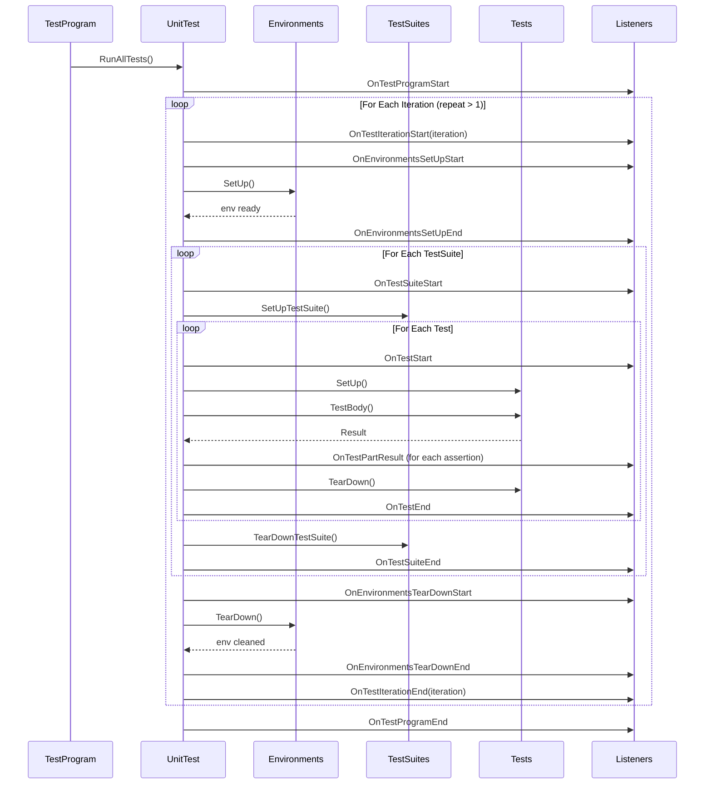

# Test Environment and Event Listeners

This documentation page describes the GoogleTest APIs for configuring and managing global and per-test environments, as well as integrating with test execution via event listeners. These powerful tools enable you to implement custom global setup and teardown logic, monitor detailed test lifecycle events, and create extensions such as custom reporting, resource management, or diagnostic listeners.

---

## 1. Global Test Environments

Global test environments allow you to define setup and teardown logic that runs once per test program (or once per repeat iteration if repeating tests). This is useful for managing shared resources or global state needed by tests.

### Defining an Environment

To create a global environment, subclass `testing::Environment` and override:

- `SetUp()` : Code run before any tests execute.
- `TearDown()` : Code run after all tests finish.

```cpp
class MyEnvironment : public testing::Environment {
 public:
  void SetUp() override {
    // Global initialization code.
  }

  void TearDown() override {
    // Global cleanup code.
  }
};
```

### Registering Global Environments

Register environment instances before running tests using:

```cpp
testing::AddGlobalTestEnvironment(new MyEnvironment);
```

GoogleTest owns the object and calls `SetUp()` and `TearDown()` at appropriate times. Typically, call this in your `main()` before `RUN_ALL_TESTS()`.

<Tip>
Avoid global variable initialization to register environments because it can cause unpredictable ordering and hidden dependencies between environments. Use explicit registration in `main()` instead.
</Tip>

### Execution Order

If you register multiple environments, GoogleTest calls `SetUp()` in registration order, and `TearDown()` in reverse order.

### SetUp and TearDown Calls with Test Repeats

If you run the tests multiple times using the `--gtest_repeat` flag, by default the global environments are set up once before the first run and torn down after the last. You can override this behaviour by setting the `--gtest_recreate_environments_when_repeating` flag to `true`, which causes environments to be recreated for each run.

### Example

```cpp
int main(int argc, char** argv) {
  testing::InitGoogleTest(&argc, argv);
  testing::AddGlobalTestEnvironment(new MyEnvironment());
  return RUN_ALL_TESTS();
}
```

---

## 2. Per-Test Setup and Teardown

For setup and teardown logic scoped to individual tests or test suites, override methods in your test fixtures:

- `SetUp()` : called before each test
- `TearDown()` : called after each test
- `static SetUpTestSuite()` : called once before first test in test suite
- `static TearDownTestSuite()` : called once after last test in test suite

### Usage Example

```cpp
class FooTest : public testing::Test {
 protected:
  static void SetUpTestSuite() {
    // Shared setup for all FooTest tests
  }

  static void TearDownTestSuite() {
    // Shared cleanup for all FooTest tests
  }

  void SetUp() override {
    // Setup before each FooTest test
  }

  void TearDown() override {
    // Cleanup after each FooTest test
  }
};

TEST_F(FooTest, Test1) { ... }
TEST_F(FooTest, Test2) { ... }
```

---

## 3. Test Event Listeners

GoogleTest provides a powerful event listener API that enables you to track and respond to various stages in test execution, from program start to iteration, suite start, individual test results, environment setup/teardown, and program end.

### Interface: `testing::TestEventListener`

You can create custom listeners by subclassing either the interface `testing::TestEventListener` or the convenience class `testing::EmptyTestEventListener` (which provides empty default implementations).

### Event Methods

The listener interface provides callbacks in the order they are fired:

| Event                             | Method Signature                                                 | When Fired
|----------------------------------|-----------------------------------------------------------------|--------------
| Test program start               | `OnTestProgramStart(const UnitTest& unit_test)`                | Before any tests
| Test iteration start             | `OnTestIterationStart(const UnitTest& unit_test, int iteration)` | Before each run iteration
| Environment setup start          | `OnEnvironmentsSetUpStart(const UnitTest& unit_test)`           | Before environment setup
| Environment setup end            | `OnEnvironmentsSetUpEnd(const UnitTest& unit_test)`             | After environment setup
| Test suite start                | `OnTestSuiteStart(const TestSuite& test_suite)`                  | Before test suite runs
| Test start                      | `OnTestStart(const TestInfo& test_info)`                         | Before individual test start
| Test disabled                   | `OnTestDisabled(const TestInfo& test_info)`                      | If a test is disabled
| Test part result                | `OnTestPartResult(const TestPartResult& test_part_result)`      | After each assertion
| Test end                       | `OnTestEnd(const TestInfo& test_info)`                           | After individual test ends
| Test suite end                 | `OnTestSuiteEnd(const TestSuite& test_suite)`                    | After test suite ends
| Environment teardown start     | `OnEnvironmentsTearDownStart(const UnitTest& unit_test)`        | Before environment teardown
| Environment teardown end       | `OnEnvironmentsTearDownEnd(const UnitTest& unit_test)`          | After environment teardown
| Test iteration end             | `OnTestIterationEnd(const UnitTest& unit_test, int iteration)`  | After each run iteration ends
| Test program end               | `OnTestProgramEnd(const UnitTest& unit_test)`                    | After all tests

### Adding Event Listeners

You typically add an event listener in your `main()` before calling `RUN_ALL_TESTS()`. GoogleTest assumes ownership of the listener.

```cpp
int main(int argc, char** argv) {
  testing::InitGoogleTest(&argc, argv);
  testing::UnitTest::GetInstance()->listeners().Append(new MyListener());
  return RUN_ALL_TESTS();
}
```

### Removing or Replacing Default Listeners

GoogleTest installs default listeners that print to console and generate XML output. You can remove these:

```cpp
auto& listeners = testing::UnitTest::GetInstance()->listeners();
// Remove default console output
delete listeners.Release(listeners.default_result_printer());
// Add custom listener
listeners.Append(new MyCustomListener());
```

### Important Usage Notes

- Event listeners receive `On*Start()` and `OnTestPartResult()` events in the order they were appended.
- They receive `On*End()` events in reverse order.
- Do not generate failures inside `OnTestPartResult()` to avoid recursive calls.
- For listeners that generate failures, append them after listeners that only observe results.

### Example Listener

```cpp
class MinimalistPrinter : public testing::EmptyTestEventListener {
  void OnTestStart(const testing::TestInfo& test_info) override {
    printf("*** Test %s.%s starting.\n", test_info.test_suite_name(), test_info.name());
  }
  void OnTestPartResult(const testing::TestPartResult& result) override {
    printf("%s in %s:%d\n%s\n",
           result.failed() ? "*** Failure" : "Success",
           result.file_name(), result.line_number(), result.summary());
  }
  void OnTestEnd(const testing::TestInfo& test_info) override {
    printf("*** Test %s.%s ending.\n", test_info.test_suite_name(), test_info.name());
  }
};
```

---

## 4. Practical Tips and Best Practices

- Register global environments explicitly, not as static globals.
- Override only the event listener methods you need by subclassing `EmptyTestEventListener`.
- Remove the default console printer if you want full control over test output.
- Add custom listeners after existing ones to respect order and failures attribution.
- Handle failures cautiously in listeners; only generate failures outside `OnTestPartResult`.
- Use event listeners to implement advanced features like coverage recording, resource leak checks, or custom reporting.

---

## 5. Troubleshooting Common Issues with Environments and Event Listeners

### Environment SetUp Failures

If `SetUp()` of an environment fails via an assertion, it causes all tests to be skipped. The failure is reported before any tests run.

### Event Listener Ordering

If you see unexpected ordering of events or missing events, verify listener addition order. Listeners added first receive start events first and end events last.

### Subscription Ownership

GoogleTest assumes ownership of listeners. Unless you explicitly `Release` a listener from the event list, do not delete it yourself.

### Repeated Initialization

Be aware that `SetUpTestSuite()` and `TearDownTestSuite()` can be called multiple times if base classes have derived classes with their own tests.

---

## See Also

- [GoogleTest Primer](../primer.md) — For understanding test basics, fixtures, and assertions.
- [Advanced GoogleTest Topics](../advanced.md#global-set-up-and-tear-down) — In-depth resource on global environments and event listeners.
- [Test Macros and Assertions Reference](reference/testing.md) — For the recommended usage of assertion macros.
- [Sample9_unittest.cc](https://github.com/google/googletest/blob/main/googletest/samples/sample9_unittest.cc) — Example of listener usage.
- [Global SetUp and TearDown](../advanced.md#global-set-up-and-tear-down) — Additional insights on environment lifecycle.

---

## Diagram: Test Environment and Event Listener Event Flow


